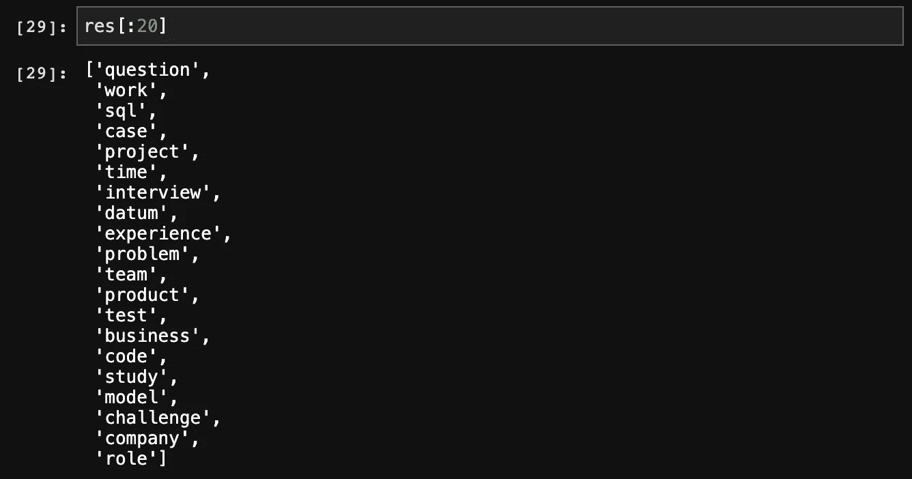
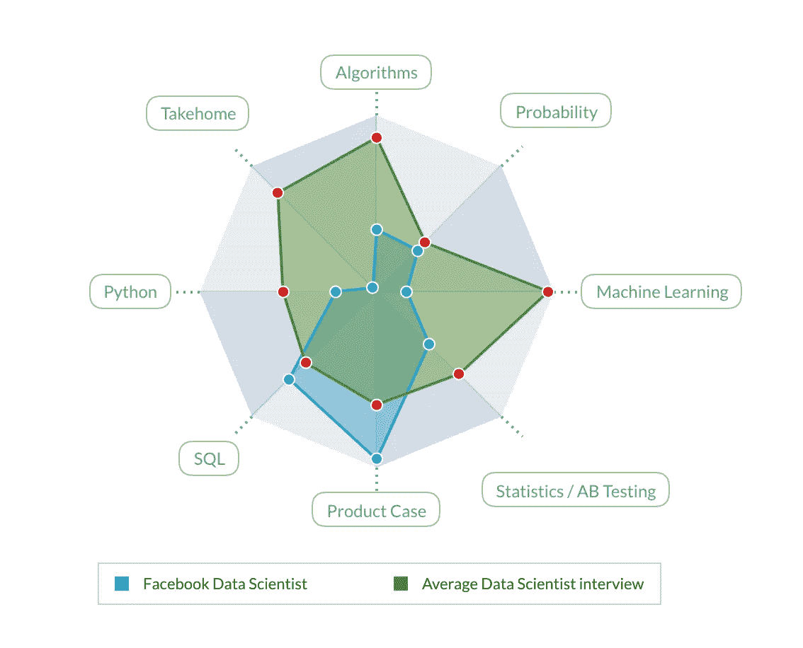

# 自然语言处理中使用关键词抽取进行无监督文本分类

> 原文：<https://towardsdatascience.com/using-keyword-extraction-for-unsupervised-text-classification-in-nlp-10433a1c0cf9?source=collection_archive---------4----------------------->

## 自然语言处理的应用

## 无监督分类任务的混合方法


马库斯·斯皮斯克在 [Unsplash](https://unsplash.com?utm_source=medium&utm_medium=referral) 上的照片

文本分类是自然语言处理中的一项常见任务。主要的方法倾向于以一种有意义的方式表示文本——无论是通过 TF-IDF、Word2Vec，还是像 BERT 这样更高级的模型——并将表示上的训练模型作为标记输入。然而，有时要么标记数据是不切实际的，要么没有足够的标记数据来建立有效的多分类模型。相反，我们被迫利用无监督的学习方法来完成分类任务。

在本文中，我将概述我为数据科学面试/职业准备网站 Interview Query 的面试问题数据集构建无监督文本分类器的过程。出于几个原因，这将对他们非常有益。面试查询希望能够为用户提供更多关于他们申请的公司的有见地的信息，以及练习*特定问题类型的功能。最重要的是，这将使他们能够通过他们提出的问题类型来“描述”不同的公司。*

我们的任务是将一个给定的面试问题归类为与机器学习、统计学、概率、Python、产品管理、SQL、A/B 测试、算法或带回家有关的问题。我认为最实用的方法是首先从语料库中提取尽可能多的相关关键词，然后手动将得到的关键词分配到与我们想要的分类相对应的“箱”中。最后，我将遍历数据集中的每个面试问题，并比较每个箱中关键字的总数，以便对它们进行分类。还考虑了使用潜在狄利克雷分配的可能性，以便生成主题模型和检索与每个主题相关的关键词，而不必手动分配它们，以及 K-均值聚类。鉴于我们的分类范围广泛且不同，这些被证明是困难的，并且不如简单地统计关键词有效。

首先，数据必须被清理和预处理。我使用 SpaCy 对文本进行标记化、词汇化、小写化和删除停用词。

```
import pandas as pd
import nltk
import spacy
from tqdm import tqdnlp = spacy.load("en_core_web_sm")def create_tokens(dataframe):
    tokens = []
    for doc in tqdm(nlp.pipe(dataframe.astype('unicode').values),                  total=dataframe.size):
        if doc.is_parsed:
            tokens.append([n.lemma_.lower() for n in doc if (not n.is_punct and not n.is_space and not n.is_stop)])
        else:
            tokens.append("")
    return tokensraw = pd.read_csv("topics_raw.csv")
tokens = create_tokens(raw)
```

接下来的问题是选择一种从文本语料库中提取关键词的方法。因为我的语料库由大量小“文档”组成，每个文档都是不同的面试问题，所以我决定从每个文档中单独提取关键词，而不是组合任何数据，并根据频率从结果列表中排序唯一的关键词。

然后，测试开始了。考虑了各种方法，如 TF-IDF、RAKE，以及一些最近的最新方法，如 [SGRank](https://www.aclweb.org/anthology/S15-1013.pdf) 、 [YAKE](https://github.com/LIAAD/yake) 和 [TextRank](https://web.eecs.umich.edu/~mihalcea/papers/mihalcea.emnlp04.pdf) 。我也很好奇，尝试了 Amazon understand，一个自动 ML 解决方案，看看它有多强。不幸的是，结果并不令人满意，因为高层次抽象与 NLP 任务粒度的结合仍然被证明是不切实际的。最后，在比较了每种方法产生的关键词后，我发现 SGRank 产生的结果最好(相关关键词数量最高)。

```
import textacy
import textacy.ke text = " ".join(raw.tolist())
nlp = spacy.load('en_core_web_sm')
nlp.max_length = len(text)keywords = []
for tokenlist in tqdm(question_tokens):
    doc = nlp(" ".join(tokenlist))
    extract = textacy.ke.sgrank(doc, ngrams=(1), window_size=2, normalize=None, topn = 2, include_pos=['NOUN', 'PROPN'])
    for a, b in extract:
        keywords.append(a)
```

最后，我按照频率对唯一的关键词进行了排序，以获得最显著的关键词。

```
res = sorted(set(keywords), key = lambda x: keywords.count(x), reverse=True)
```

结果是大约 1900 个单词，然后我手动检查并把最相关的 200 个单词分配到我们的垃圾箱。



最后，有了最终的分类关键词列表，就可以通过统计关键词在每个问题中的出现次数，将每个面试问题分类为 8 种不同类型中的一种。此外，我们可以为不同的公司生成“个性”档案，并在网站上显示。



[https://www . interview query . com/interview-experiences/Facebook/data-scientist](https://www.interviewquery.com/interview-experiences/facebook/data-scientist)

总之，我发现对于这个特定的问题，最好是简单地选择一种混合方法来完成无监督分类任务，这种方法既涉及机器学习，也涉及人工工作。

一般来说，在自然语言处理中无监督的上下文中工作，在数据分析和结果的实际应用之间留下了相当大的距离，这迫使人们采用本文中看到的替代方法。在我看来，这是 NLP 的一个明显的缺陷，比其他领域如计算机视觉或生成模型更严重。当然，我预计未来更有洞察力的模型和其他研究的进步将在这方面取得显著的进步。

无论如何，感谢你阅读这篇文章！我希望你学到了一些东西。