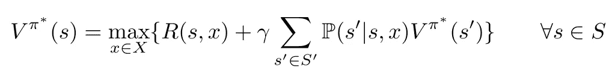
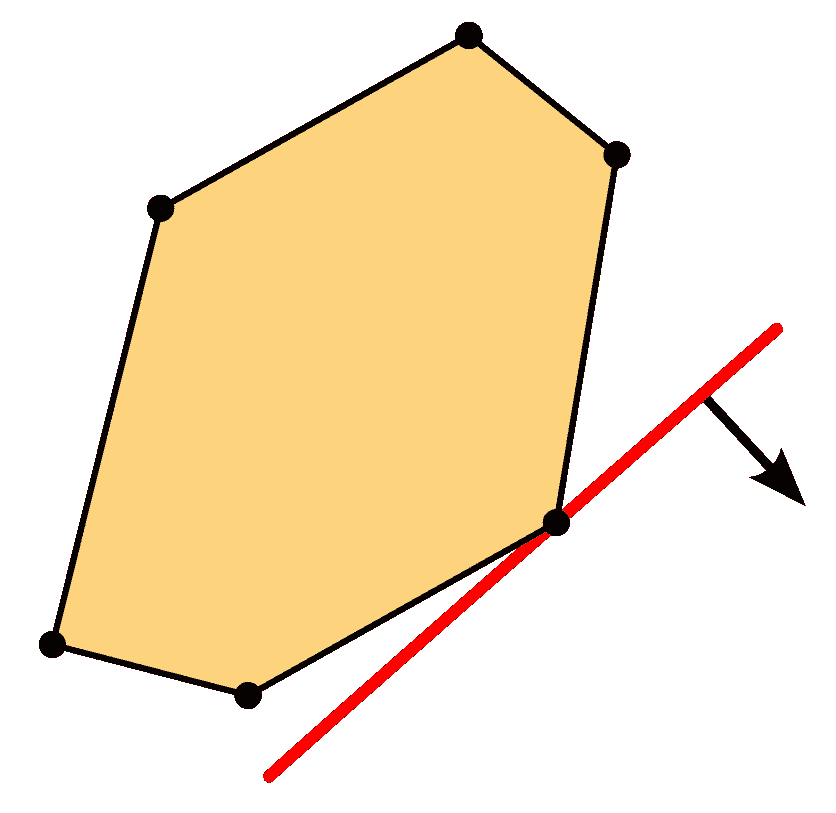

# 使用线性规划来提高你的强化学习算法

> 原文：<https://towardsdatascience.com/using-linear-programming-to-boost-your-reinforcement-learning-algorithms-994977665902?source=collection_archive---------22----------------------->

## *大而高维的动作空间往往是强化学习的计算瓶颈。将你的决策问题公式化为一个线性规划可以极大地增加你的算法可以处理的问题的范围。*

照片由[穆罕默德·图尔古特·柯克戈兹](https://www.pexels.com/@tkirkgoz)通过[派克斯](https://www.pexels.com/photo/exterior-of-glass-roof-of-house-in-city-5686928/)拍摄

请运筹学研究者解决任何问题——无论是优化你的股票投资组合、安排你的送货路线，还是解决你的婚姻问题——他们很可能会脱口而出“线性规划”作为他们的首选解决方案。线性规划是二战后作为美国陆军航空兵自动化规划程序的一种手段而构想的一种数学方法，此后已发展成为一个成熟的领域，广泛应用于运输、制造、金融、医疗保健和许多其他领域。典型的实现处理具有成千上万个决策变量、无数个约束以及大量成本和回报成分的问题。这些问题不仅仅是学术上的想象；真实世界的实际问题就是这样建模和解决的。事实上，线性编程在如此多的环境中工作得如此之好，有时看到它在强化学习社区中受到的关注如此之少令人惊讶。

## 线性编程导论

对于那些不熟悉这种方法的人来说，一个非常简短的入门可能是合适的。线性规划本质上是遵循固定结构的方程组，包含(I)必须最小化或最大化的目标函数，(ii)决策空间上的一组约束，以及(iii)具有相应域约束的决策变量的定义。顾名思义，整个系统应该是线性的——这个强大的特性允许利用问题结构的凸性，并显著提高求解方法的速度。求解该系统给出最优解。典型的线性规划方法如下所示:

为什么要用这样的公式呢？嗯，没有人比国父乔治·丹齐格本人更能说明线性编程的潜力了[1]:

> “考虑一下给 70 个人分配 70 份工作的问题。“活动”包括将第 I 个人分配到第 j 个作业。[……]因此有 2 * 70 或 140 个限制和 70 * 70 或 4900 个活动，有 4900 个相应的 0-1 决策变量。不幸的是，还有 70 种阶乘排列，或者说分配方式。[…]
> 
> 在这个例子中，70 阶乘是一个非常大的数字。为了了解它有多大，假设我们在 1500 万年前的大爆炸时有一台 IBM 主机。从那时到现在，它能够检查所有可能的解决方案吗？不要！[……]即使地球上到处都是纳秒速度的计算机，它们都并行工作，答案仍然是否定的。[……]令人惊奇的是，单纯形法在现代计算机的帮助下可以在瞬间解决这个问题。"

至少可以说，令人印象深刻。这种单纯形法发展于 20 世纪 40 年代末，已经成为许多高级解算器的基础，例如现在使用的 CPLEX 和 Gurobi。结合硬件的不断进步，该领域的进展令人震惊，解决的问题越来越多。请记住，线性规划是一种*精确*的解决方法:它不会简单地返回一个可行的或“好”的解决方案，而是所有这些数百万、数十亿或数万亿个解决方案中的最佳可能解决方案，很少会在几秒钟内返回！

## 强化学习中的应用

目前关于线性编程已经说得够多了——我不想给人留下我在推销或试图抬高我的 IBM 股票的印象。现在让我们把注意力转向强化学习。为了方便起见，假设我们试图(近似)求解一个[马尔可夫决策模型](/the-five-building-blocks-of-markov-decision-processes-997dc1ab48a7)。当试图这样做时，我们经常遇到所谓的三个维度的诅咒，指的是当问题的规模增长时，状态空间、结果空间和行动空间都爆炸[2]。在著名的贝尔曼方程中，这些计算问题是显而易见的:

结果空间*S’*指的是从所选择的状态-动作对可以达到的未来状态的集合。由于每个状态都有自己的价值，因此为每个可行的决策遍历所有这些状态是一项繁琐的任务。我们不是评估所有可能的结果，而是选择一个样本，然后继续前进。通过经常这样做，大数定律预测我们应该收敛到潜在随机变量的真实值。对于[状态空间](/a-deep-dive-into-problem-states-498ad0746c98) *S* ，我们通常定义特征(基本上只是解释变量)来提取预测其值的最显著的属性，而不是显式地观察每个状态。因此，我们不需要观察每个州来评估它有多吸引人；我们可以根据特征做出合理的猜测。这些解决方案被广泛嵌入到许多强化学习算法中。

动作空间 *X* 的维度受到的关注相对较少。部分地，这可以用这样一个事实来解释，即对于许多问题，完全枚举是可能的。一旦我们生成一个动作，我们只需要计算状态-动作对的值来衡量动作的吸引力，因此对于适度的动作空间枚举工作得非常好。在迷宫中你只能向四个方向移动，即使是超级马里奥也没有*那*那么多锦囊妙计。在棋盘上或在围棋比赛中，事情变得更加复杂，但没有什么是现代计算机不能处理的。除了列举之外，我们当然还有政策梯度定理，它经常被部署在行动者-批评家方法的保护伞下[3]。我们不必列举所有可行的行动，而是可以巧妙地对它们进行采样，并在此过程中调整我们的采样策略。由于没有明确地评估每个动作，我们自然会丢失一些信息，但是只要我们平稳地收敛到好的动作区域，我们通常会认为这是理所当然的。

不幸的是，枚举法和演员批评法并不总是能拯救我们。我们挑一个简单的例子来说明。考虑一个多式联运中心，集装箱可以从这里通过卡车、驳船或火车运输。假设集装箱有 25 个潜在目的地，10 个不同的重量等级，到期日在 1 到 5 之间。然后，我们有 25*10*5=1250 个不同的容器类型，转换成具有 1250 个维度的状态向量，指示当前在中心的每种类型的容器的数量。即使没有正式的证明，也很容易看出可能的排列数量是绝对巨大的——正面处理这些状态和结果空间是不可能的。然而，我们现在感兴趣的是行动空间。每个集装箱可以通过卡车、驳船或火车运输，或者留在中心。如果我们在中心有 n 个集装箱，每个集装箱的这 4 个选项给了我们 4^n 可行的行动；这正是我们不愿意处理的指数行为空间。举例来说:仅仅用 10 个容器，我们就已经面临超过一百万个可行的行动。

这里可以很快排除枚举。我们不想为每一集列举一百万个动作，上帝禁止我们在糟糕的一天遇到 20 个容器。那么是演员兼评论家？我们可以概念化演员网络的各种架构，但它们都面临着同样的挑战。状态向量和动作向量可能很大，但也很稀疏。到目前为止，大多数容器类型在某一天的值都是 0。不幸的是，一个神经网络通过传递一串零是不会学到很多东西的。在高维空间中采样是一项具有挑战性的任务；在这种情况下，大多数演员会在森林里迷路。

## 集成线性规划和强化学习

尽管面临一个相当干净和直接的问题，但我们无法列举，也无法有效地应用演员-评论家方法。不出所料，这就是线性编程重新登上舞台的地方。还记得这种方法是如何方便地处理大型高维动作问题的吗？真巧。

首先，我们需要将我们的决策问题转换成前面介绍的通用格式。在这种情况下，我们希望以最小化运输成本的方式分配集装箱。知道了我们的模态的成本函数，我们可以全面地将它包装在一个目标函数中。最有可能的是，并不是所有的分配都是允许的:有固定数量的卡车，驳船只能处理一定的重量，显然我们不能分配比我们更多的集装箱…我们的一套约束条件已经成型。决策变量？一组二进制文件似乎可以做到这一点。完成了。自然，并不是每个问题都允许自己如此容易地被这种僵硬的格式所捕获。然而，也不应轻易排除这种可能性。来自许多学科的学者和实践者已经成功地将高度复杂的问题融入到这种格式中。随着整个航空公司的运营被线性程序所控制，你的 RL 问题也有可能被塑造成同样的形状。

二维多面体的线性优化，Ylloh 通过 [WikiMedia](https://commons.wikimedia.org/wiki/File:Linear_optimization_in_a_2-dimensional_polytope.svg)

好了，我们已经为今天的决策问题建模了，但是明天呢？毕竟，向前看是强化学习如此有趣的原因。为此，我们需要添加一些人为变量。这些变量表示捕获处于给定状态的下游值的特征。在这种情况下，我们通常会手动设计这些功能，使用基于状态和动作的线性表达式来计算它们。

假设——作为我们的功能之一——我们跟踪到期日为 5 的集装箱数量。我们现在有六个，我们考虑运输四个:我们剩下两个(即ϕ_f(s,a)=ϕ_f(6,4)=6–4=2).其他的例子可以是卡车的下一个位置、延期后的剩余现金预算等。所有这些特征都是从状态-动作对计算出来的；学习相应的权重θ_f 以将值赋予特征。

要更深入地了解这种情况下的功能设计，以下关于决策后状态的文章可能会有帮助:

 [## 什么是后决策状态？他们想从我们这里得到什么？

towardsdatascience.com](/what-are-post-decision-states-and-what-do-they-want-from-us-9e02105b7f40)  [## 关于后决策状态

### 论强化学习中状态-动作对和决策后状态的(不那么)细微差别。

towardsdatascience.com](/about-post-decision-states-again-5725e5c15d90) 

上述等式很容易添加到现有的约束集合中。将人工变量ϕ嵌入到目标函数中，我们只需要将它乘以我们学习到的权重θ，就可以评估我们行动的下游价值[2]。

总而言之，线性规划值得任何处理大量决策的人考虑。当然，还有本文没有讨论的缺点、限制和挑战，但是有了 70 年的历史记录，这种优化方法还远远算不上时尚。与枚举相比，它提供了令人难以置信的升级，同时保持了评估动作的最优性。当你的笔记本电脑的内存不断被无止境的枚举动作数组填满，当你的演员一直带你无处可去，线性编程可能只是你的 RL 算法需要的推动力，以恢复这些巨大的动作空间的秩序。毕竟，正如乔治·丹齐格几十年前发现的那样:线性程序可以管理军队。

## 参考

[1]与 George B. Dantzig 的访谈:线性规划之父—大学数学杂志(1986)。[http://www.phpsimplex.com/en/Dantzig_interview.htm](http://www.phpsimplex.com/en/Dantzig_interview.htm)

[2]鲍威尔(2011 年)。*近似动态规划*，约翰·威利父子公司，第二版。

[3]萨顿和巴尔托(2018 年)。*强化学习:导论*，麻省理工学院出版社，第二版。