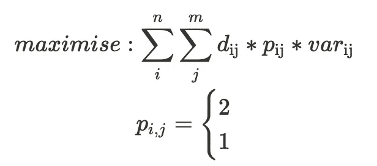
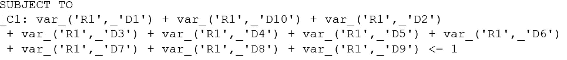
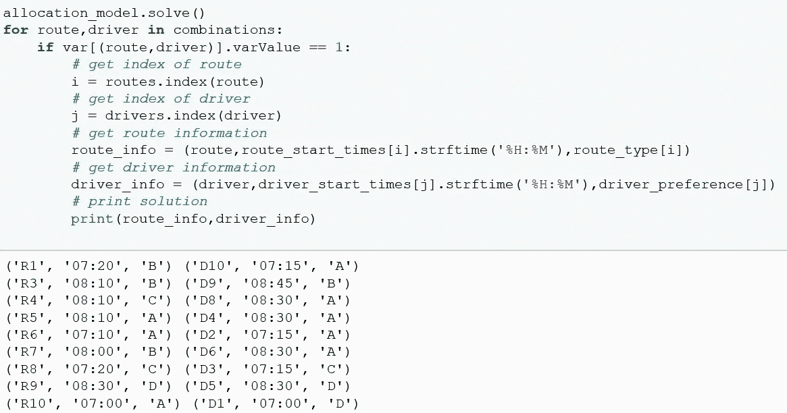

# 用线性规划调度司机。

> 原文：<https://towardsdatascience.com/using-linear-programming-to-schedule-drivers-79f02959443c?source=collection_archive---------26----------------------->

## 使用 Python 中的线性编程库 PuLP 优化工作分配。

埃里克·罗瑟梅尔在 [Unsplash](https://unsplash.com?utm_source=medium&utm_medium=referral) 上的照片

## 介绍

对于大型操作，工作分配可能是一项相当大的日常任务。在这篇文章中，我将重点介绍如何使用 PuLP 来创建一个分配工作的模型。可以使用 Excel 中的 VBA 自动完成这一过程，但是，这是一种“贪婪”的方法，为每个单独的驾驶员而不是为整个分配寻找最佳路径，因此效率不高。

Excel 确实有一个可以解决线性和非线性问题的规划求解器，但它仅限于 200 个决策变量，对于大型运算，这种解决方案是可行的。

## 什么是纸浆？

PuLP 是 Python 中的一个开源库，可以用来解决这类优化问题。

为了使用纸浆解决这个问题，你需要建立一个线性目标函数，然后模型将尝试最大化或最小化这个总价值。典型地，在运输操作中，你会有路线和司机在一天中间隔地开始，所以我希望该模型尝试最小化开始时间的整体偏差。然而，我还想考虑司机的偏好——使其在路线类型上更有利于匹配他们的偏好。

目标函数

包含路线和驾驶员每种组合的开始时间差异的矩阵。

为了解决这个问题，我们需要为路线和驾驶员的每一个组合创建一个决策变量。

建立纸浆问题并创建二元决策变量。

这将决策变量设置为仅取值 0 或 1 的二进制变量。本质上，如果模型为一个组合返回值 1，这意味着它在最终的解决方案中。

为了避免启动时间差异大于 60 分钟的模型计划驱动程序，我决定使用启发式算法，并最大化以下函数。

根据开始时间的差异，为每个组合设置包含 0 到 1 之间的值的矩阵。

设置目标函数。

我已经为任何开始时间差异大于 60 分钟的组合指定了一个负值(-100)。当我最大化目标函数时，这实质上是一个惩罚，这意味着如果没有可行的路线，模型宁愿让驾驶员不被分配。

为了尝试考虑驾驶员偏好，如果路线类型和驾驶员偏好匹配，则从开始时间的差异返回的分数乘以 2，如果不匹配，则乘以 0.5。这使得具有匹配偏好的路线、驾驶员组合更加有利约 30 分钟，但是，如果模型不能匹配偏好，它仍然会将驾驶员分配到路线，因为该值仍然大于 0。

现在我们需要设置一些约束。

*   **一条路线不能在解决方案中出现多次。**
*   **一个驱动程序不能在解决方案中出现多次。**

您可以用与设置目标函数相似的方式创建约束，并将一个不等式分配给模型对象。

在纸浆中设置约束

纸浆中的约束示例。R1 在最终解决方案中只能出现一次。

现在来解决问题。我已经建立了一个有 10 个司机和 10 条路线的基本例子。

解决问题并找到解决方案。

在这个例子中，PuLP 成功地为 9 个司机分配了工作，其中 5 个司机被分配了与他们的偏好相匹配的工作。

司机和剩余路线。

纸浆公司无法为驾驶员 D9 分配工作，因为 R2 剩下的唯一一条路线的开始时间相差超过 60 分钟。

使用线性规划可以自动化分配工作的过程，同时找到最有效的方式来规划您的劳动力并考虑员工的偏好。