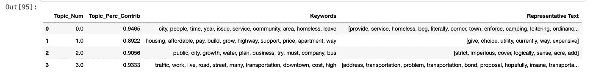
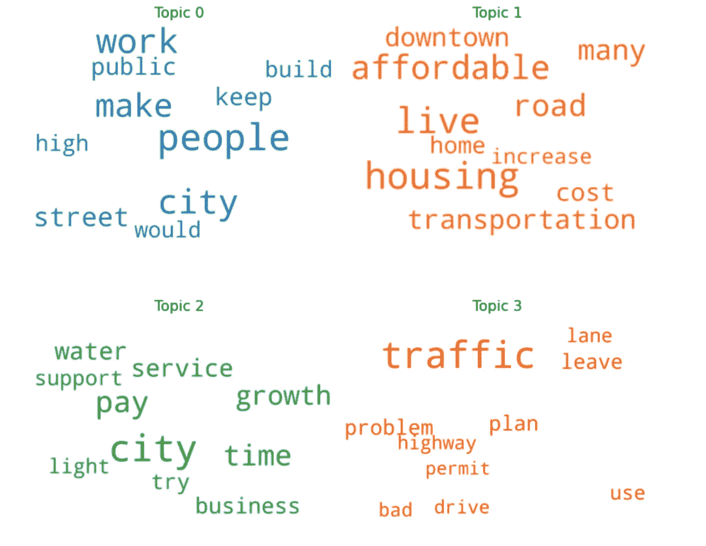
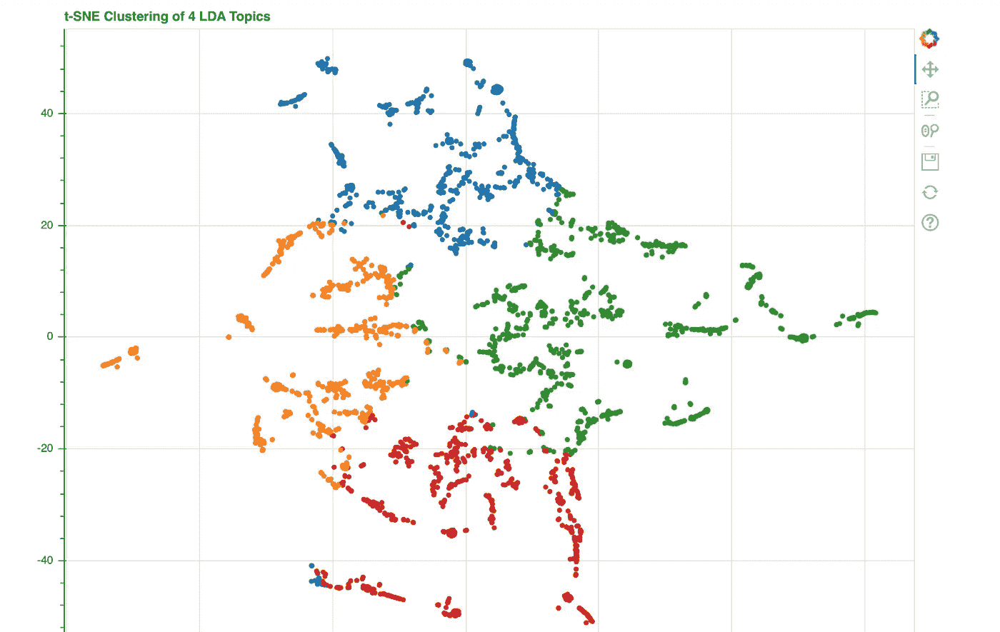
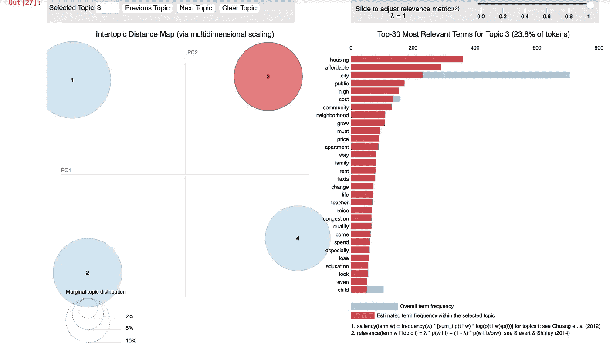
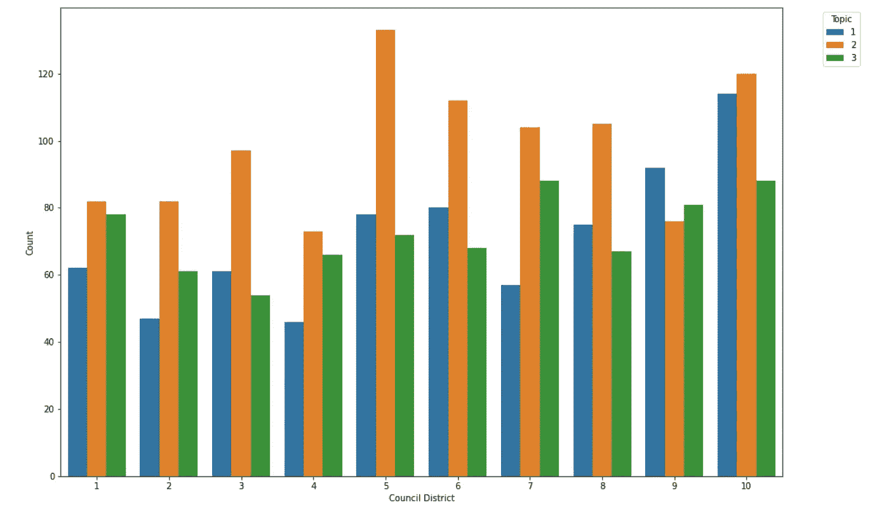
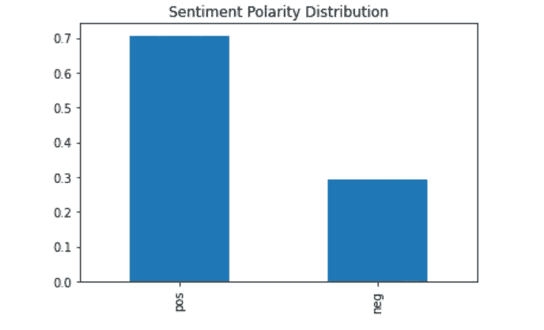
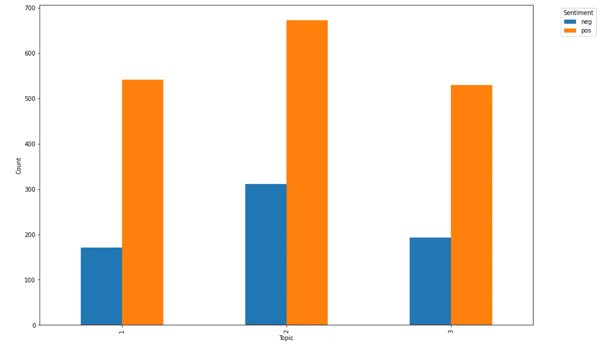

# 利用潜在狄利克雷分布分析定性调查数据

> 原文：<https://towardsdatascience.com/using-machine-learning-to-analyse-qualitative-survey-data-1794416e5474?source=collection_archive---------14----------------------->

## 结合自然语言处理、情感分析、神经网络和主题建模，对开放式数据进行即时分析和可视化


照片由[像素](https://www.pexels.com/photo/abstract-black-and-white-blur-book-261763/?utm_content=attributionCopyText&utm_medium=referral&utm_source=pexels)的[皮克斯拜](https://www.pexels.com/@pixabay?utm_content=attributionCopyText&utm_medium=referral&utm_source=pexels)拍摄

调查是市场研究和数据收集中最常用的方法之一。虽然主要产出往往是定量数据，但经常会提出开放式问题，以获得广泛的回应。这些一字不差的回答往往有助于回答数字背后的“为什么”。

然而，分析开放式调查数据是一项艰巨的工作。在一个大的调查数据集中，逐字逐句的回答可能需要几个小时甚至几天的时间。不仅如此，它几乎完全是通过人类编码来完成的。因此，定性的回答经常被忽略，或者只是通过抽出一些逐字的引用来补充叙述。

这让我想到了一个问题——**有没有更好的方法来揭示定性调查数据中的洞见？**

我混合使用自然语言处理、神经网络、情感分析和主题建模，创建了一个可以接受数据集的模型，并自动返回数据中的关键主题。这只花了我 10 个小时的时间。

# ***TL；DR:在十个小时内，我创建了一个模型，它可以在任何大小的数据集中自动提供关键主题。在我的测试数据集上，有*‘just’*3000 个响应，下面的整个模型(包括可视化)可以在不到 30 秒的时间内生成。***

如果你想和我一起出去玩，请继续读下去——我保证这是值得的。

我使用了一个包含 3000 份回复的[公开数据集](https://data.world/cityofaustin/mf9f-kvkk)——来自德克萨斯州奥斯汀的一个社区调查。在调查结束时，受访者可以选择提供书面评论来回答以下问题:“如果您能与市长分享一件关于奥斯汀市的事情(任何评论、建议等)。)，那会是什么呢？”

我认为这将是一个有趣的数据科学挑战，因为可能会有各种各样的答案。

这是我的机器学习管道-

# 第一步。潜在狄利克雷分配

潜在狄利克雷分配(LDA)是一种流行的自然语言处理(NLP)工具，可以从语料库中自动识别主题。LDA 假设每个主题由一包具有一定概率的单词组成，每个文档由一包具有一定概率的主题组成。LDA 的目标是学习语料库中的单词和主题分布。Gensim 是一个 NLP 包，特别适合 LDA 和其他单词嵌入机器学习算法，所以我用它来实现我的项目。

```
# Create Dictionary
id2word = corpora.Dictionary(processed_data)# Create Corpus: Term Document Frequency
corpus = [id2word.doc2bow(text) for text in processed_data]# Build LDA model
lda_model = gensim.models.ldamodel.LdaModel(corpus=corpus,
                                           id2word=id2word,
                                           num_topics=4, 
                                           random_state=42,
                                           update_every=1,
                                           chunksize=10,
                                           per_word_topics=True)
```

在对数据进行一些预处理以删除常用词之后，我能够从回答者的反馈中获得主题，主要围绕-

## 1)生活费用

## 2)公用事业

## 3)交通

## 4)其他问题(归类为专题 0)

从“引擎盖下”看，我们可以看到模型识别的每个主题的最具代表性的句子。



自然，没有一个词云的定性分析是不完整的:)这里我们可以看到每个主题最有代表性的词。



现在变得有点古怪了——我还训练了一个 word2vec 神经网络，并将 LDA 获得的一般主题中的热门单词投影到 word2vec 空间。我们可以使用 t-SNE(t-分布式随机邻居嵌入)算法来可视化 2D 空间中的主题聚类。这让我们可以看到模型是如何将 4 个主题分开的——公用事业问题似乎是最少被提及的。此外，生活费用和公共设施问题之间有一些重叠。

```
# Getting topic weights
topic_weights = []
for i, row_list in enumerate(lda_model[corpus]):
    topic_weights.append([w for i, w in row_list[0]])# Generating an array of optic weights    
arr = pd.DataFrame(topic_weights).fillna(0).values# Dominant topic in each document
topic_num = np.argmax(arr, axis=1)# tSNE Dimension Reduction
tsne_model = TSNE(n_components=2, verbose=1, random_state=0, angle=.99, init='pca')
tsne_lda = tsne_model.fit_transform(arr)# Plotting the Topic Clusters with Bokeh
output_notebook()
n_topics = 4
mycolors = np.array([color for name, color in mcolors.TABLEAU_COLORS.items()])
plot = figure(title="t-SNE Clustering of {} LDA Topics".format(n_topics), 
              plot_width=900, plot_height=700)
plot.scatter(x=tsne_lda[:,0], y=tsne_lda[:,1], color=mycolors[topic_num])
show(plot)
```



最后，我用 pyLDAVis 创建了这个主题模型的交互式可视化。这可以用来绘制每个主题最突出的单词，以及查看主题的分离程度。

```
pyLDAvis.enable_notebook()
vis = pyLDAvis.gensim.prepare(lda_model, corpus, dictionary=lda_model.id2word)
vis
```



虽然这个数据集在分割数据方面稍有欠缺，但我们可以看到，不同的议会选区对主题进行了平均分割。在放弃主题 0(杂项)后，有证据表明生活成本、交通和公用事业之间存在显著的等级关系。在 9/10 地区，公共设施是人们谈论最多的改进问题。如果有人口统计数据来观察公民在突出话题上的差异，那将会很有意思。



每个议会区的不同主题

# 第二步。情感分析

我还对分析调查开放式评论的观点感兴趣，并将其与我的主题模型相结合。我使用 [VADER](https://github.com/cjhutto/vaderSentiment) 库来分配情感分数，并将一个主题的百分比评级定义为当受访者提到该主题时给出积极评论的百分比。该指标用于为主题分配情感分数。

我使用我的 LDA 模型来确定回复中每个句子的主题构成。如果一个句子有 60%或更多是由一个主题主导的，我认为这个句子属于那个特定的主题。然后，我计算了句子的情绪，或正面或负面，最后统计了每个题目中正面句子的总百分比。

这里快速浏览一下整个数据集中的情绪分布。有了这样一个开放式的问题，受访者很容易抱怨。但是考虑到 70%的回复都是正面的，我们可以推断样本倾向于对他们的家乡城市给予建设性的批评。



在这个特定的数据集中，主题之间没有太多的情感差异(如下图所示)。然而，将它应用于商业市场研究环境来观察情绪的差异将会很有趣。



## 总之，我相信这是逐字分析调查有效和可扩展的方法。

一些警告——由于这是一种“快速而肮脏”的方法，不能指望它完全取代人工分析。此外，LDA 还要求我们选择可以限制的主题数量。根据主题，通过更加定制的 NLP，以及 LDA 模型中更好的超参数调整，还有进一步改进的空间。然而，好处是显而易见的-

## 机器学习有助于减少人为偏见，节省数小时的分析时间，以便从数据中获取主要主题。这种特殊的方法可以轻松处理大型数据集，并在几秒钟内返回可操作的结果。

如果您想了解更多信息，或者有任何改进建议，请联系我们。整个项目都在我的 [GitHub 库](https://github.com/chawlasahaj/dsiprojects)上(当你在那里的时候，请随意查看我的其他项目！)