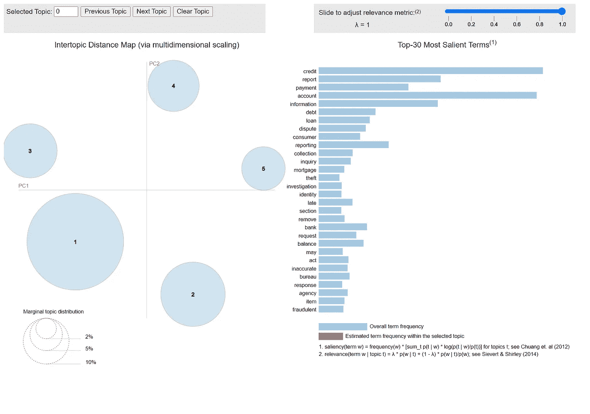
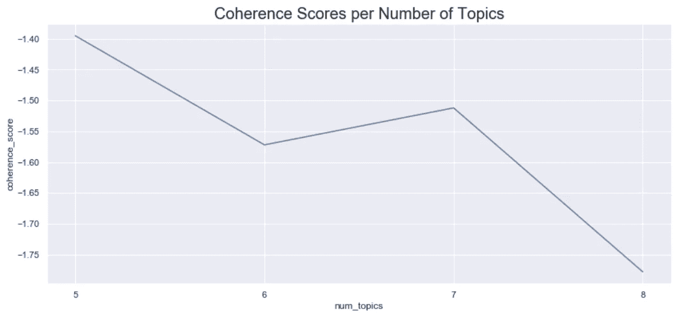
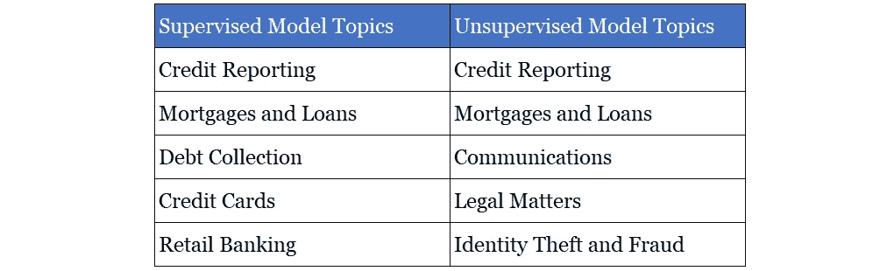

# 使用机器学习将文本分类成主题

> 原文：<https://towardsdatascience.com/using-machine-learning-to-categorize-texts-into-topics-3650f64f663f?source=collection_archive---------25----------------------->

## 开发一种无监督学习算法来发现主题共性

图片来自 [Pixabay](https://pixabay.com/users/mohamed_hassan-5229782/?utm_source=link-attribution&utm_medium=referral&utm_campaign=image&utm_content=4304163)

读完一篇新闻文章后——无论主题是美国政治、电影评论还是提高生产率的技巧——你可以转向其他人，让他们大致了解文章的内容，对吗？或者，如果你读一本小说，你可以把它分为科幻小说、文学小说或爱情小说。

人类往往很擅长对文本进行分类。现在，电脑也能做到这一点。

在最近的一个机器学习项目中，我从消费者金融保护局(Consumer Financial Protection Bureau)下载了消费者投诉，并开发了模型，将投诉分为五个产品类别之一。我的表现最好的模型在 86%的情况下都是正确的。(你可以在这个[媒体博客](https://halpert3.medium.com/classifying-complaints-with-natural-language-processing-e3b2765d525f)中读到这个项目。)

我使用了一种监督学习技术，其中模型使用标记的类别，然后预测未标记的类别。在用于训练我的模型的数据集中，产品类别是由消费者自己选择的，考虑到大多数消费者不是金融专家，他们可能不会 100%完美地完成工作，错误会影响模型的性能。

或者考虑一个不同的数据集，其中的文本没有预先标记。为了训练有监督的自然语言处理(NLP)模型，人类这样做将是乏味的。这些缺点是监督模型所固有的。

作为该项目的后续工作，我想开发一个无监督学习 NLP 模型，看看会出现什么类别。这个模型会忽略预先标记的类别，而是辨别共性，以便将文本分组到自己设计的主题中。

我还想到了一个商业案例。无人监管的模型可能对消费者金融保护局有用，因为它不必依赖消费者对其提交的信息进行分类，而且它可能会将收到的信息处理为新的、不可预见的类别。本质上，无监督的 LDA 模型可以为任何从消费者或客户那里接收信息并帮助分类文本的机构工作。

# 创建新主题

我已经处理了对监督学习模型的投诉，对文本进行了记号化，删除了停用词，并对单词进行了词条化。(更多细节见前述博客)。对于非监督建模过程，我使用了 Gensim 的潜在狄利克雷分配(LDA)模块。

我让它将 160，000 个投诉分成五个主题，然后使用 pyLDAvis 模块创建一个可视化:

**点击** [**这里**](https://halpert3.github.io/halpert3.github.io-lda-topics/topics_five.html) **可以看到这些主题可视化的互动页面。**

可视化用图表显示了五个主题中最常见的单词:

## 主题 1

本主题包括一般的金融词汇，如*账户*、*银行*、*卡*、*钱*、*信用*，还包括*打*、*电子邮件*、*电话*、*信件*和*收到*等词汇。这个话题的一个共同点是与沟通有关。

## 话题 2

有了*征信*、*举报*、*举报*、*查询*、*局*这样的热门词汇，这个话题就是关于**征信**。

## 主题 3

*付款*、*贷款*、*抵押*、*到期*、*利息*、*余额*告诉我这个题目关注的是**抵押和贷款**的相关问题。

## 主题 4

本话题热门词汇有*债务*、*催收*、*法律*、*违规*、*举证*、*法律*。这个话题似乎与法律事务有关。

## 主题 5

在这里，一些关键词是*信息*、*消费者*、*身份*、*盗窃*、*侦查*、*诈骗*、*公正*、*受害者*。我想说这个话题是关于**身份盗窃**或者对**欺诈活动**的调查。

在我进一步讨论这些分组之前，我想指出我可以选择多于或少于五个主题。事实上，Genism 也有衡量模型主题“连贯性”的模块。我用不同数量的主题制作了模型，并将它们与 u-mass 一致性度量进行了比较。这个度量产生一个负数，这个数越接近零，它就越连贯。

正如你所看到的，有五个主题的模型有最高的一致性分数。与此同时，在我将 coherence 作为给我的模型评分的一种方法之后，似乎许多专注于 NLP 的数据科学家并没有在它上面投入太多的精力。LDA 毕竟是一种无人监管的技术，因此有限的测量不一定能取代人类对结果的细微解释。

# 无监督模型有多大用处？

让我们比较一下监督学习模型的五个产品类别和我的非监督学习模型的五个主题类别。

两对主题重叠，但六个主题不同。这些发现如何具有洞察力或有用性？

我可以想象在消费者金融保护局有一个区域处理通信和消费者服务问题，一个处理法律事务，另一个处理身份盗窃和欺诈。如果是这样，LDA 模型发现属于这些相应主题之一的投诉可以被路由到适当的区域。

总之，一个无人监管的模型确实能够将收到的信息归类到新的、不可预见的类别中。这五个类别是基于我对热门关键词的直觉解读，当然还需要更深入的分析和解释。然而，更重要的一点是，有监督和无监督的 NLP 模型对于任何希望处理大量日常传入邮件的组织都是有用的。