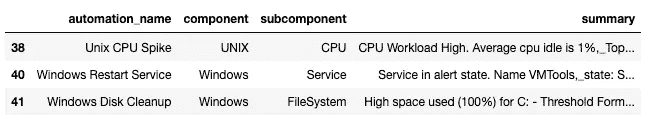
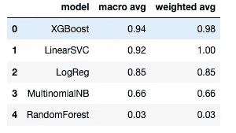

# 使用机器学习对服务器事件进行分类

> 原文：<https://towardsdatascience.com/using-machine-learning-to-classify-server-incidents-36f837c107a?source=collection_archive---------37----------------------->

## 如何使用机器学习对服务器事件进行分类的分步介绍

# 介绍

当我们谈到事件管理时，自动化事件解决是每个公司的必备条件，但要让自动化在正确的事件中发挥作用并提供正确的信息，有必要自动从服务器事件中检索信息，其中大部分内容都基于文本，即事件描述，然后分类(我们称之为“匹配”)哪些已经可用的自动化可能会解决事件。

从不需要深入编程技能的事件中检索信息的常用方法是使用正则表达式，但是如果您已经使用过它，您就会知道它有多糟糕，对事件内容的最小修改就可能导致正则表达式失败。

在这篇文章中，我们描述了我们如何使用机器学习技术来改善这种匹配。


克里斯蒂娜@ wocintechchat.com 在 [Unsplash](https://unsplash.com?utm_source=medium&utm_medium=referral) 上的照片

# 数据准备

用于训练模型的数据基于在过去六个月中由可用自动化之一解决的事件，即来自 9 个不同国家/地区的 180 多个客户的大约 10 万起事件。我们将数据限制为仅 6 个月，因为我们不断部署新的自动化并修复一些正则表达式问题，所以为了防止使用错误/旧的数据，更小的间隔应该足够了。

我们从数据湖中检索的原始数据集有 14 列，但是我们将只关注创建模型所必需的列。

*   **自动化 _ 名称:**在此事件中执行的自动化的名称(我们分类的目标)
*   **组件:**事件中受问题影响的组件的高级名称
*   **子组件:**事件中受问题影响的组件的特定名称
*   **摘要:**事件的快速描述



数据集中包含的数据示例

在这种特殊情况下，由于*组件*和*子组件*是对*摘要*信息的补充，我们决定连接这三个字段，创建一个“*特征*字段，这一过程将使接下来的步骤更容易，除此之外，我们将所有内容设置为小写。

在一些国家，我们有不止一种语言的事件，例如英语和西班牙语，为了解决这个问题，我们使用了两个 *libs* 、 *langdetect* 来检查事件的语言，我们采用英语作为我们的主要语言，并在必要时使用 *googletrans* 将事件翻译成英语。这一过程可能需要几个小时，取决于您的数据集大小，我们试图只过滤必要的文本翻译成英语。

为了完成这一步，我们将数据分为*特征*和*类*，其中*自动化名称*是我们想要预测的*类*，而*特征*是我们上面处理的结果。

# 建模

准备好这两个字段后，我们终于可以开始机器学习阶段了。为了使运行我们的模型变得简单，我们创建了一个管道，这个管道有三个主要组件:

```
from sklearn.pipeline import Pipelinepipeline = Pipeline(steps=[
     ('bow', CountVectorizer(analyzer=proc_text)),
     ('tfidf', TfidfTransformer()),
     ('classifier', model)
])
```

*   **CountVectorizer:** 这个函数将标记我们的数据，结果将是每个单词计数的稀疏表示

> 这一阶段的一个重要步骤是删除停用词和标点符号，这两个组件可能会造成我们的情况不必要的复杂性，所以使用 *nltk* 库和下面附加到 CountVectorizer 的函数，我们把它们去掉。

```
import string
import nltk
# Necessary to install stopwords, only in the first time
#nltk.download()
from nltk.corpus import stopwords
sw = set(stopwords.words('english'))def proc_text(text):
 string_w_no_punc = [char for char in text if char not in string.punctuation]

 string_w_no_punc = ‘’.join(string_w_no_punc)

 return [word for word in string_w_no_punc.split() if word.lower() not in sw]
```

*   **TfidfTransformer:** 从 *CountVectorizer* 返回的稀疏矩阵中，该函数将对其应用 TF-IDF(词频-逆文档频率)表示。TF-IDF 的目标是衡量一个单词在一个文档(TF)和所有文档(IDF)中的影响。
*   **模型**:流水线的最后一个组件是应用分类器。

管道完成后，一切如常，我们将数据分为训练和测试，并将评估每个分类器的结果。

# 估价

在这种特殊的情况下，我们需要一个精确和召回的平衡指标，因为在这一点上，它们都不会比另一个带来更多的麻烦。考虑到这一点，我们选择评估 F1 分数和宏观平均值，我们尝试了一些分类器，您可以查看以下结果:



测试分类器的结果

最适合我们的数据的模型是 XGBoost，但是您可以做更多的事情来改善这些数字，例如**超参数优化**、**对少数类进行上采样、**以及其他一些方法，但是我会让您自己尝试这些方法。:)

为了在生产中使用它，我们需要有一些保证，即分类器预测自动化的概率高于某个阈值，为此我们使用了来自 *sklearn* lib 的 *predict_proba* ，这个函数返回分类器为每个类返回的概率，有了这个和阈值(我们设置为 97%)，我们就能够在生产中无忧无虑地实现和监控分类器。这是我们使用的片段:

```
pred_proba = pipeline.predict_proba(X)
pred = pipeline.predict(X)confidence = []
for item in pred_proba:
    confidence.append(item.max())df["predicted_automation"] = pred
df["confidence"] = confidence
df["applicable"] = df_test["confidence"].apply(lambda x: "OK" if x > 0.97 else "NOK")
```

希望这篇文章能帮助你理解如何使用机器学习来处理文本数据，以及我们如何找到机会并在日常工作中应用它来提高我们客户的满意度。