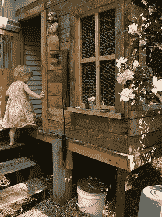
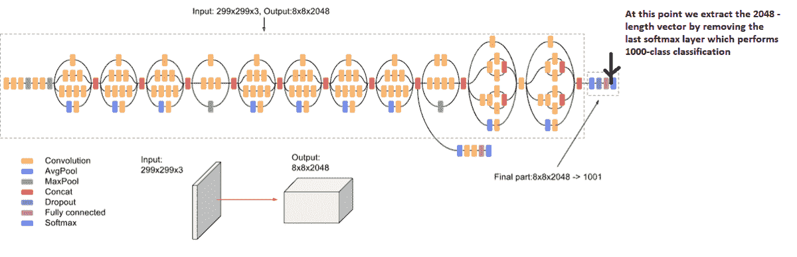
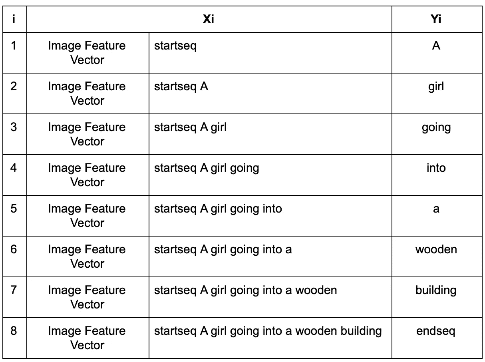
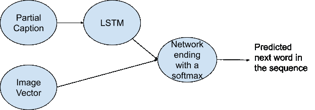
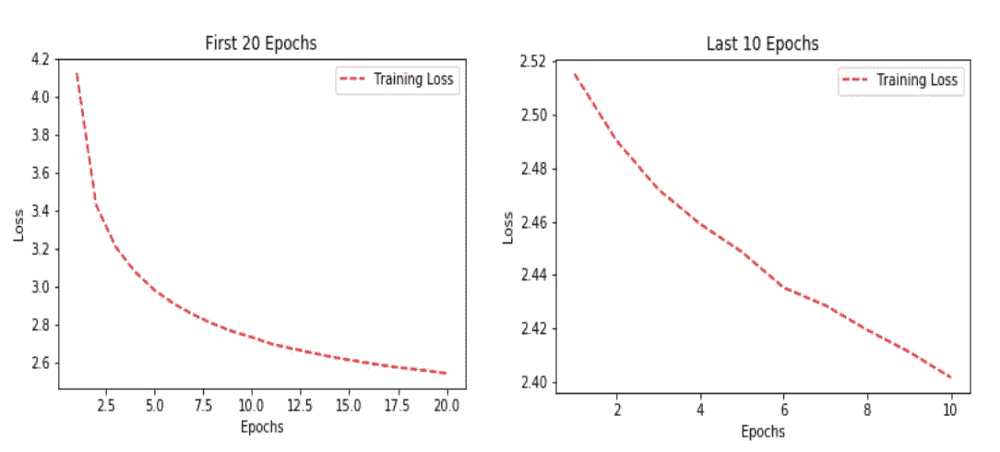

# 使用机器学习生成图像字幕

> 原文：<https://towardsdatascience.com/using-machine-learning-to-generate-captions-for-images-f9a5797f31d6?source=collection_archive---------6----------------------->

## 在本文中，我们将通过 Python 使用机器学习来为各种图像生成标题

图像字幕是给图像加上适当标题的过程。作为一个人，这似乎是一个简单的任务，甚至一个五岁的孩子都可以轻松完成，但我们如何编写一个计算机程序，将输入作为图像，并生成标题作为输出？

照片来自 [Unsplash](https://unsplash.com/photos/0E_vhMVqL9g)

在深度神经网络最近发展之前，这个问题对于业内最聪明的人来说是不可思议的，但在深度神经网络出现之后，如果我们有所需的数据集，这是完全可能的。

例如，网络可以生成与下面的图片 I 相关的以下任何标题，即“*”草地上的白狗“ ***带褐色斑点的白狗*** ”或者甚至“ ***草地上的狗和一些粉红色的花*** ”。*

**

*来自开源 Flikr8k 数据集的图像*

# ***数据集***

*我们选择的数据集是' ***Flickr 8k '。我们选择了这个数据，因为它很容易访问，并且具有完美的大小，可以在普通的 PC 上训练，也足以公平地训练网络来生成适当的字幕。数据分为三组，主要是包含 6k 图像的训练组、包含 1k 图像的 dev 组和包含 1k 图像的测试组。每个图像包含 5 个标题。其中一个例子如下:****

**

*来自开源 Flikr8k 数据集的图像*

1.  *一个穿着粉色连衣裙的孩子正在入口通道爬上一组楼梯。*
2.  *一个女孩走进一栋木制建筑。*
3.  *一个小女孩爬进木制玩具屋。*
4.  *一个小女孩爬楼梯去她的玩具屋。*
5.  *一个穿着粉色连衣裙的小女孩走进了一个小木屋。*

# *数据清理:*

*任何机器学习程序的第一步也是最重要的一步是清理数据，去掉任何不需要的数据。当我们处理字幕中的文本数据时，我们将执行基本的清理步骤，如将所有字母转换为小写字母，因为对于计算机来说，*‘嘿’*和*‘嘿’*是两个完全不同的单词，删除特殊符号和标点符号，如*、(、$、%，并删除任何包含数字的单词。*

*我们首先为我们的数据集中的所有唯一图片创建一个词汇表，即 8000(图片数量)* 5(每张图片的标题)= 40000 个标题。我们发现它等于 8763。但是这些单词中的大多数只出现一两次，我们不希望它们出现在我们的模型中，因为它不会使我们的模型对异常值具有鲁棒性。因此，我们设置了一个阈值，即一个单词在我们的词汇表中最少出现 10 次，这相当于 1652 个独特的单词。*

*我们做的另一件事是给每个描述添加两个标记，以指示标题的开始和结束。这两个标记是*‘start seq’*和*‘end seq’*，分别代表字幕的开始和结束。*

*让我们从导入所有需要的库开始:*

*让我们定义一些助手函数:*

*让我们逐一解释:*

*   *`load_doc`:获取文件的路径并返回该文件中的内容*
*   *`load_descriptions`:获取包含描述的文件内容，并生成一个字典，以图像 id 作为关键字，以描述作为值列表*
*   *`clean_descriptions`:通过使所有字母小写，忽略数字和标点符号字符，以及只有一个字符的单词来清除描述*
*   *`save_descriptions`:将描述词典作为文本文件保存到内存中*
*   *`loads_set`:从文本文件中加载图像的所有唯一标识符*
*   *`load_clean_descriptions`:使用上面提取的唯一标识符加载所有清理后的描述*

# *数据预处理:*

*接下来，我们对图像和字幕进行一些数据预处理。图像基本上是我们的特征向量，即我们对网络的输入。这就是为什么我们需要在将它们传递到神经网络之前，将它们转换为固定大小的向量。为此，我们使用由 Google Research[【3】](https://www.cv-foundation.org/openaccess/content_cvpr_2016/papers/Szegedy_Rethinking_the_Inception_CVPR_2016_paper.pdf)创建的 Inception V3 模型(卷积神经网络)的迁移学习。该模型在' *ImageNet'* 数据集[【4】](http://www.image-net.org/)上进行训练，以对 1000 幅图像执行图像分类，但我们的目标不是执行分类，因此我们移除了最后一个 softmax 层，并为每幅图像提取了 2048 固定矢量，如下图所示:*

**

*概念网的体系结构*

*字幕是我们模型的输出，也就是我们必须预测的东西。但是这种预测不会一下子发生，我们会一个字一个字地预测我们的字幕。为此，我们需要将每个单词编码成一个固定大小的向量(这将在下一节中完成)。为此，我们首先需要创建两个字典，即'*单词到索引'*，它将每个单词映射到一个索引，在我们的例子中是从 1 到 1652，以及'*单词索引'*，它将每个索引映射到它对应的单词。我们要做的最后一件事是计算数据集中具有最大长度的描述的长度，以便我们可以填充所有其他描述，从而保持固定的长度。在我们的例子中，这个长度等于 34。*

# *单词嵌入:*

*如前所述，我们将把每个单词映射到一个固定大小的向量(即 200)，我们将使用一个预先训练的手套模型。最后，我们为词汇表中的所有 1652 个单词创建一个嵌入矩阵，其中包含词汇表中每个单词的固定大小的向量。*

*让我们仔细分析这段代码:*

*   *第 1–5 行:将所有训练图像的所有描述提取到一个列表中*
*   *第 9-18 行:只选择那些在词汇表中出现超过 10 次的单词*
*   *第 21–30 行:创建一个单词索引和一个单词字典索引。*
*   *第 33–42 行:将手套嵌入加载到字典中，以单词作为关键字，嵌入向量作为值*
*   *第 44–52 行:使用上面加载的嵌入为我们的词汇表中的单词创建一个嵌入矩阵*

# *数据准备:*

*这是这个项目最重要的方面之一。对于图像，我们需要使用前面描述的 Inception V3 模型将它们转换成一个固定大小的向量。*

*   *第 1–22 行:将训练和测试图像的路径加载到单独的列表中*
*   *第 25–53 行:遍历训练集和测试集中的每个图像，将它们加载到固定大小，对它们进行预处理，使用 InceptionV3 模型提取特征，最后对它们进行整形。*
*   *第 56–63 行:将提取的特征保存到磁盘*

*现在我们不会一下子预测我们的标题，也就是说，我们不会只是给计算机图像，然后让它为图像生成标题。我们要做的是给它图像的特征向量和标题的第一个单词，让它预测第二个单词。然后我们给它前两个字，让它预测第三个字。让我们考虑数据集部分中给出的图像和标题*‘一个女孩走进一座木制建筑’*。在这种情况下，在添加标记' *startseq'* 和 *'endseq '之后，下面将是我们在每种情况下的输入(Xi)和输出(Yi)。**

**

*在这之后，我们将使用我们创建的字典' *word to index '来改变输入和输出中的每个单词以映射索引。*因为我们要进行批处理，所以我们希望所有的序列长度相等，这就是为什么我们要在每个序列后面加上 0，直到它们达到最大长度(如上计算的 34)。可以看到，这是一个巨大的数据量，一次性将其加载到内存中根本不可行，为此，我们将使用一个数据生成器，将其加载到小块中，即只加载需要的数据，而不消耗所有内存。*

*上面的代码遍历所有的图像和描述，并生成类似于表中的数据项。将让函数从同一行再次运行，因此，让我们批量加载数据*

# *模型架构和培训:*

*如前所述，我们的模型在每个点都有两个输入，一个是特征图像向量，另一个是部分字幕。我们首先对图像向量应用 0.5 的下降，然后将其与 256 个神经元的层连接。对于部分字幕，我们首先用如上所述预训练的手套中的嵌入矩阵的权重将其连接到嵌入层。然后，我们应用 0.5 的辍学和 LSTM(长短期记忆)。最后，我们将这两者结合起来，并将它们连接到一个由 256 个神经元组成的层，最后连接到一个 softmax 层，该层预测我们词汇表中每个单词的概率。可以使用下图总结高级架构:*

**

*问题的定制架构*

*以下是在训练期间选择的超参数:损失被选择为'*分类损失熵'，*优化器是' *Adam '。模型*总共训练了 30 个时期，但前 20 个时期的批量和学习率分别为 0.001 和 3，而后 10 个时期的批量和学习率分别为 0.0001 和 6。*

*让我们稍微解释一下代码:*

*   *第 1- 11 行:定义模型架构*
*   *第 13–14 行:将嵌入层的权重设置为上面创建的嵌入矩阵，并设置`trainable=False`,这样，该层不再被进一步训练*
*   *第 16–33 行:用上面提到的超参数在两个不同的区间训练模型*

# *推论:*

*前 20 个时期和接下来的 10 个时期的训练损失如下所示:*

**

*培训损失*

*为了进行推理，我们编写了一个函数，根据我们的模型预测下一个单词是具有最大概率的单词(即，greedy)*

**

*来自开源 Flikr8k 数据集的图像*

# ***你能做什么:***

*因此，总之，我们的模型在没有任何广泛的超参数调整的情况下，在为测试数据集中的图像生成标题方面表现得相当好。我们能想到的一些改进可以被使用*

*   *更大的数据集*
*   *进行更多的超参数调整*
*   *改变模型架构。*

*如果你尝试了这些方法并得到了更好的结果，请告诉我。该项目的代码可以在这里找到[。](https://github.com/Noumanmufc1/Image-Captioning)*

*如果您觉得以上内容对您有用，请分享并随时支持我-->*

*   *https://www.buymeacoffee.com/nouman10*