# 使用机器学习来生成实际可行的食谱

> 原文：<https://towardsdatascience.com/using-machine-learning-to-generate-recipes-that-actually-works-b2331c85ab72?source=collection_archive---------2----------------------->

## 用数据科学烹饪

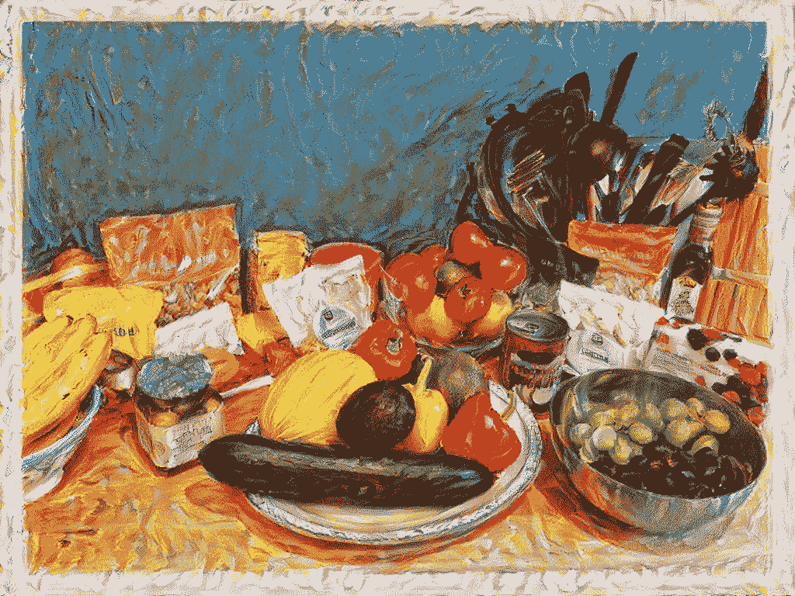

当我尝试了一个星期的水果减肥法时，我吃的食物的照片。使用艺术家 Yury Malkov 的风格，通过神经风格转换生成。作者图片

近年来，生成模型领域在面部生成方面取得了巨大的成功，或者说从图画中创造出有趣的风景。

然而，为一道人类真正喜欢吃的菜制作食谱似乎超出了我们目前的能力。结果往往非常糟糕，实际尝试一下会很有意思，例如:

*   [https://www.youtube.com/watch?v=LXSjtiahNtY](https://www.youtube.com/watch?v=LXSjtiahNtY)
*   [https://www . popular mechanics . com/technology/apps/a 19304/computer-generated-recipes-is-gut-bustly-bad/](https://www.popularmechanics.com/technology/apps/a19304/computer-generated-recipes-are-gut-bustlingly-bad/)

我开始尝试一些不同的食谱制作方法，烹饪它们，找出它们的缺点，也许还能加以改进。

# 资料组

对于数据集，我将使用来自 https://www.koket.se/和 https://www.tasteline.com/的食谱。其原因是:

*   我已经使用它们很多年了，我知道这些食谱质量很高，通常能做出美味的食物。
*   食谱有点“国际化”。尽管这些网站是瑞典的，但大多数食谱反映了现代瑞典观众对其他文化食物的渴望。因此，尽管你会发现传统食物，如*肉丸*，你也会发现*汤姆凯盖*、*肉馅卷饼、scaloppine al limone di vitello、*和超过 100 种配方的*鹰嘴豆沙*。一些更“奇特”的食谱已经被篡改，例如，高良姜有时代替生姜，但并不总是如此。

# TextGenRNN

[TextGenRNN](https://github.com/minimaxir/textgenrnn) 是一个使用递归神经网络(RNN)的文本生成 python 库。RNN 是处理顺序数据问题的一种解决方案。由于文本数据是可变长度的(不同数量的单词或字母)，我们不能使用普通类型的神经网络，例如，每个字母进入输入层中的一个感知器，因此，我们将一个接一个地输入字母作为序列。我们希望我们的神经网络能够记住输入的所有内容，而不仅仅是序列中最新的元素。为了实现这一点，我们要将每个字母的隐藏状态反馈到感知器中。隐藏状态是 RNN 的内部记忆。


来自维基百科

普通 RNNs 的一个问题是，对于每一步，更远的一步的影响变得越来越小，因为它已经通过神经元馈送了很多次。因此，一个 RNN 人可能在保持一个长句的上下文方面有问题，有时会忘记它是在谈论一个人、一个比萨饼还是天气。减轻这种情况的一种方法是使用一种特殊类型的感知机，称为 LSTM 或 GRU，结果会更好，但不是恒星。

无论如何，这是我得到的:

*   与橄榄油、sambal oelek 混合在一起，放在盘子上
*   黄瓜切丁，切成楔形
*   根据包装上的说明煮意大利面
*   加入洋葱、大蒜、油和熏制三文鱼片的两面，放入烤箱烤 10 分钟左右，或者烤至金黄色
*   将西红柿洗净并切成两半

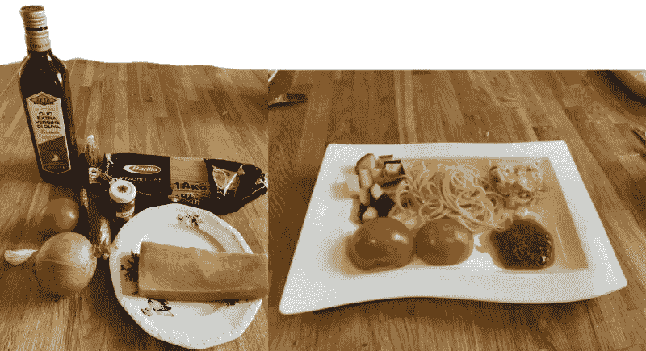

作者图片

**评价:**这顿饭还可以。用 sambal oelek 和橄榄油制作简单的调味酱是个不错的主意。我不得不反复阅读许多食谱，然后才能找到我可以真正烹饪的东西。大多数食谱语无伦次，难以理解。

# TableGAN

一些最著名的生成模型是生成对抗网络(GANs)。他们通过让两个神经网络竞争来工作。生成器试图生成类似于训练集的数据，鉴别器试图找出哪个是假的，哪个来自训练集。通过这次比赛，他们都变得更好。

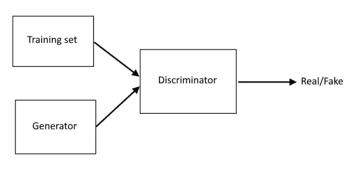

作者图片

虽然大多数 GAN 专门用于图像生成， [TableGAN](https://github.com/mahmoodm2/tableGAN) 是一个 python 库，它使用 GAN 技术来生成表格数据。在这个例子中，输入数据是期望值为 200、标准差为 100 的随机数。TableGAN 生成了以下代码，我认为看起来相当不错。


作者图片

这似乎是一个很好的配料表。我使用 scikit-learn 的 CountVectorizer 将菜谱转换成向量。结果是:

['茄子'，'小菠菜'，'培根'，'叶菠菜'，' bulgur '，'蘑菇'，'辣椒片'，'辣椒酱'，'柠檬汁'，'科涅克'，'龙'，'固体土豆'，'鱼酱'，'液体人造黄油'，'新鲜百里香'，'新鲜香草'，'希腊酸奶'，'青椒'，'黄瓜'，'日本酱油'，'日本大米'，'刺山柑'，'椰奶'，'浓缩小牛肉原汤'，'肉末'，'酸橙'，'淡啤酒'，'牛排'，'玉米淀粉'，'油'，'奶酪'，'牡蛎片'，'胡椒(调味'，'松子'，'韭菜'，'迷迭香 '黄油(用来油炸) '，'大豆'，'标准牛奶'，'黑胡椒'，'甜辣椒酱'，'红薯'，'百里香干'，'鳕鱼背'，'核桃'，'酸奶'，'西葫芦'，'鸡蛋'，'苹果醋']

**定论:**这款简直成分太多，我就不试了。

# GPT-2

创成式预训练变形金刚 2 (GPT-2)就是所谓的变形金刚。他们从训练数据中学习一个单词出现的可能性，这取决于全文中的其他单词，但不同的单词被赋予不同的权重，这一过程被称为*注意力*。这样，它就可以无限期地保持理论上的语境。使用 GPT-2 的方法是写几个词作为开始，让转换器填写哪个词最有可能跟随，然后查看新字符串，并重复这个过程。GPT-2 在互联网的大部分区域接受训练，见过许多食谱。

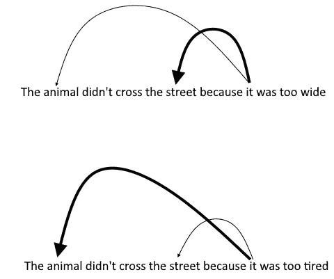

作者图片

我用过 https://app.inferkit.com/demo 的，这是一个可以免费试用 GPT 2 的网站。

开头的句子是粗体的。

**切洋葱**。磨碎孜然和肉豆蔻。炒洋葱。从煎锅中取出洋葱、孜然芹、肉豆蔻、盐和胡椒，在另一个容器中磨碎洋葱。重新加热。加入鹰嘴豆、大蒜、生姜、香茅、鸡汤、酸橙汁、酱油和葡萄酒。把液体煨一下，然后关小火，盖上锅盖。煮大约 30 分钟，偶尔搅拌。一旦液体完全沸腾，加入浓奶油搅拌。再次降低温度，盖上盖子，然后

结论:这似乎是一道美味的炖鹰嘴豆。我最终没有做它。

**在一个大碗中混合西红柿、芫荽叶**、番茄酱、酸奶油、酸橙汁、盐、黑胡椒、孜然、辣椒粉和辣椒粉。腌制 30 分钟。用中火加热一个 12 英寸的不粘锅。加入熏肉、洋葱和胡椒片。烹饪并搅拌 3 分钟或直到培根变脆。搅拌酸奶油混合物。加入绞碎的牛肉，烹饪，用木勺打碎牛肉，大约 3 到 4 分钟，或者直到牛肉不再呈粉红色。将切碎的生菜、洋葱和西红柿混合；投掷

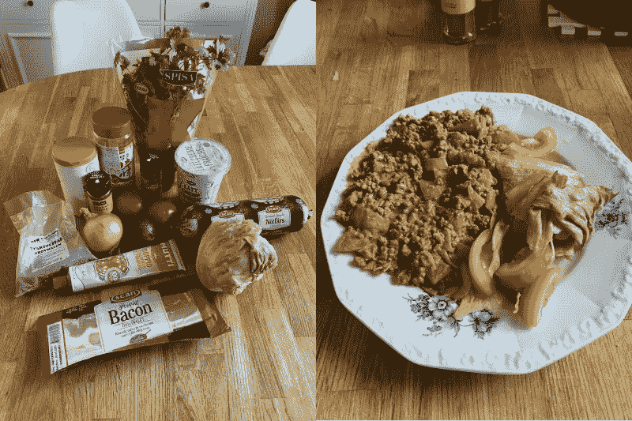

作者图片

结论:这味道真好。只是可能有点太普通了。

**勒苟拉斯切碎洋葱，并把它们与面包屑、一些橄榄油和鸡汤混合在一起。当他们搅拌的时候，阿拉贡把千层面的面团擀开，切成八等份。“我不知道这是不是有史以来最好吃的千层面，”他说，“但至少比昨天好吃。”“你还没吃呢。”阿拉贡站起来，开始把所有东西放在一起。“在这一点上你必须相信我。”“很好。”“不如我的好。不过话说回来，我的就是我的专长。”他们做好了饭**

**结论:**GPT 2 号的一个有趣之处在于，你可以给它喂任何你喜欢的东西，它会连贯地完成任务。我特别喜欢 GPT 知道阿拉贡在品尝食物之前就评论它有多好吃，并且写了勒苟拉斯是如何召唤他的。

我没有做这种难吃的饭。

# 分析数据集

上面的食谱已经足够好了，但是我不得不重复了好几次才得到它们。不过，我觉得最大的问题是他们的**缘分很低。** Serendipity 是推荐系统中常用的一个指标，高分意味着用户感到惊喜。所以，例如，如果我推荐食物，我可以通过推荐牛奶或香蕉来获得高准确率，因为这是人们经常购买的东西。但是这样的推荐并不是很好，因为顾客无论如何都会买的。相反，我们会向客户推荐他们会喜欢的东西，但他们自己可能不会想到。这是很高的意外收获。它可以被视为人工智能生成的食谱的最重要的衡量标准。我们已经有人类在制作食谱，我们希望从人工智能那里得到的是一个令人震惊的不同但仍然美味的食谱，摆脱人类先入为主的什么一起吃味道好的观念。

需要注意的一点是，当一个人制作一份食谱时，他会从不同的配料的味道、气味和外观中汲取经验。所有这些信息对算法来说都是不可用的，算法只能看到不同的成分是如何一起使用的。这是机器学习中的一个常见问题，顺便说一下，模型继承了训练数据的偏差。这排除了一些由于地理意外而不常见的可行成分组合。例如，生姜和奶油放在一起是不常见的，因为生姜生长在世界上有很大一部分人对乳糖不耐受的地方。然而，我看不出他们为什么不能一起工作，因为生姜和椰子汁是常见的。

我决定在配料中添加一些特性并进行调查。我使用的功能有:

*   淀粉 _1
*   淀粉 _2
*   蛋白质 _1
*   蛋白质 _2
*   Fat_1
*   脂肪 _2
*   甜甜 _1
*   甜甜 _2
*   酸味 _1
*   酸味 _2
*   鲜味 _1
*   鲜味 _2
*   苦的
*   柔软的
*   中等
*   易碎的
*   红色
*   黄色
*   格林（姓氏）；绿色的
*   褐色的
*   怀特（姓氏）
*   香料

1 表示“一些”，2 表示“大部分”。例如，牛奶有 sweet_1，而蜂蜜有 sweet_2。柔软、适中、松脆是指质地。

现在，这有点主观，也容易出错，因为某些成分有不同的特点，取决于它们是如何准备的。这可以通过例如将“土豆”和“土豆泥”作为不同的配料来稍微缓解。

计算频率揭示了一些有趣的事情。


作者图片

计数是这样完成的:每当一个食谱至少有 1 个特征，我们就增加那个特征。我们对所有的食谱都这样做，然后除以食谱的总量。每当一个食谱包含一种我在我的配料清单中没有的配料时,“未命名”标记。这意味着如果我有时间和精力记录更多的成分，这个数字可能会更高。

这似乎表明:

*   除了苦味，大多数菜肴至少有一些所有的味道。
*   许多食谱由许多不同的质地和颜色组成。
*   几乎所有的菜都有某种香料。

我还是不确定关于苦能得出什么结论。它在那里是因为我们喜欢它，还是仅仅因为一种苦味的成分有一些其他令人满意的品质，例如，罗马沙拉，它是苦的，但也非常脆。我最大的猜测是，有时它是偶然出现的，而其他时候它是有意识地添加进来，让菜肴变得更有趣，就像使用香料一样。它在功能上似乎不同于其他四种味道，甜、盐、鲜味和酸味。

我发现将这些与我得到的甜点进行对比很有趣:

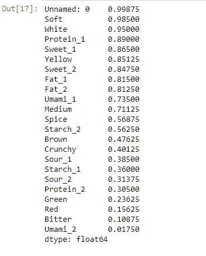

作者图片

多点甜少点鲜味，果然不出所料。我怀疑鲜味 1 的流行主要是由于各种各样的鸡蛋和坚果。在本文中，我将重点介绍非甜点食谱。

看看非甜点食谱中最常见的成分:

*   洋葱(黄色、红色、葱等):0.90
*   奶酪:0.55
*   番茄:0.45
*   大蒜:0.31
*   柠檬:0.30

不知道为什么会这样。可能很早就在许多地方种植了洋葱(5500 年前的埃及、5000 年前的印度和中国、4500 年前的苏美尔)。此外，洋葱富含硫，油炸时产生的一些化学化合物有点像肉。奶酪的流行很可能是因为食谱来自西方烹饪网站。

# 根据特征生成配方

既然我们已经有了根据它们的特点而不是成分来描述的食谱，也许我们可以用它作为训练数据？但是，我们希望生成一个由配料而不是功能描述的食谱。为实现这一目标，我们将:

*   训练一个**一级 SVM** 根据其特征识别什么是有效的食谱。
*   生成成分的随机组合，计算特征，并让 SVM 确定它是否是一个有效的食谱，如果不是重复的。这意味着在我们找到可以使用的东西之前，我们将不得不经历几百种随机组合。尽管这种生成东西的方法有点间接，但已经足够快了。

```
no_of_tries = 1000
generated_recipe = ''for x in range(no_of_tries):
    sample = df_ingredients.sample(12)
    sample_sum = sample.sum()[feature_names]
    pred = clf.predict([sample_sum.values])
    if pred[0] == 1:
        print(sample_sum[feature_names].values)
        generated_recipe = sample.sort_values(['Starch_2', 'Protein_2'], ascending=False)
        break

generated_recipe['Nudles', 'Chickpeas', 'Shrimps', 'Melon', 'Asparagus',
       'Thai Basil', 'Cabbage', 'Sesame seeds', 'Orange','Tamarind',
       'Butter', 'Cinnamon']
```

另一种方法可能是查看上述特性的频率，并得出结论，我们希望每种特性都有一个。因此，代替我们的 SVM，我们硬编码这个规则，像这样:

```
no_of_tries = 10000
generated_recipe = ''for x in range(no_of_tries):
    sample = df_ingredients.sample(16)
    sample_sum = sample.sum()[feature_names]

    if sample_sum['Starch_2'] == 1 and sample_sum['Protein_2'] == 1 and all([x > 0 for x in sample_sum]):
        generated_recipe = sample.sort_values(['Starch_2', 'Protein_2'], ascending=False)
        break['Polenta', 'Chicken', 'Pear', 'Star Anise', 'Lime juice', 'Radish', 'Mayonnaise', 'Tomato', 'Mushrooms', 'Artichoke', 'Vanilla', 'Eggs', 'Orange Zest', 'Oyster sauce', 'Sugar', 'Fennel']
```

由于我们只有配料，我不得不自己决定如何处理它们。这是我想到的:

*   盐水鸡。
*   用茴香和蚝油做玉米粥。
*   烤鸡和玉米粥。
*   煎烤蘑菇和西红柿。
*   用梨、萝卜、朝鲜蓟和酸橙汁做沙拉。
*   用蚝油、糖、酸橙汁、水、橙皮、香草、八角、茴香和蛋黄酱做调味汁。

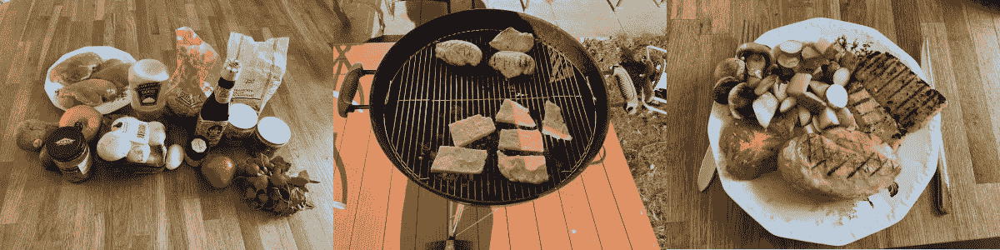

作者图片

**评价**:味道不错，更重要的是，有点不寻常(很高的意外收获)。糖、香草、八角和茴香使调味汁尝起来有点像甘草糖，但蚝油使它美味可口，从而避免了它尝起来像甜点。

## 填充配料

我突然想到，如果一开始就给它一些成分，这个发生器将有助于填补缺失的成分。由于鹰嘴豆泥有数百种配方，我决定看看该算法是否能产生一种新的配方。所以我从**面包**和**鹰嘴豆**开始，食谱变成了:

```
['Bread', 'Chickpeas', 'Stock', 'Dried tomatoes', 'Sunflower oil', 'Coca cola', 'Almonds', 'Dill', 'Pickles', 'Smoked paprika', 'Lemon juice', 'Beer']
```

我决定用切碎的杏仁作为配菜，泡菜作为配菜。然后我必须决定可口可乐和啤酒中的哪一种应该加入鹰嘴豆泥中，哪一种我应该喝。我决定往鹰嘴豆泥里倒几汤匙可口可乐。

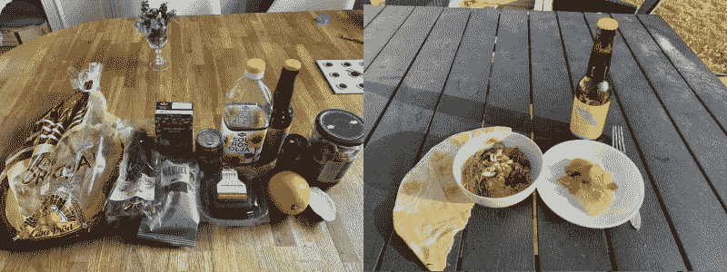

作者图片

结论:味道不错，和通常的鹰嘴豆泥食谱有点不同。

# 熟读烹饪知识

此时，我认为自己没有足够的背景知识来继续学习，所以我订购了几本书:

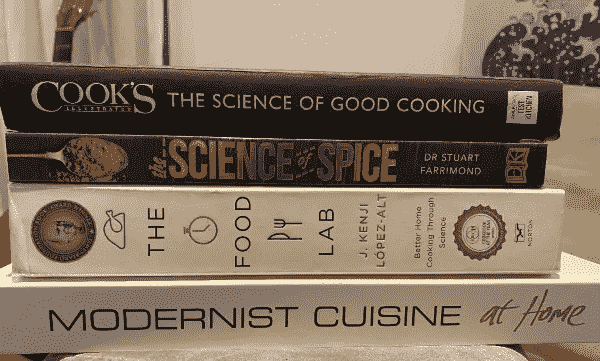

作者图片

我还在 YouTube 上找到了一个不错的系列讲座:

读完和听完之后，我准备对这一切意味着什么做出一些有根据的猜测。

# 洞察力

以下是我自己的想法。我已经尝试过了，但样本量太小，无法得出任何一般性的结论。尽管如此，我还是会把它们呈现在这里，但要有所保留。

## 美食的要素

*   **平衡**。只有盐味的东西不好吃。对甜味或其他任何味道也是一样。做一顿好饭需要的是甜、盐、鲜味和酸味之间的平衡。
*   **变异**。一顿饭需要变化多样，刺激许多不同的感官，因此最好是包含不同的颜色、质地、香味和温度。
*   **新奇**。反复吃同样的东西会令人厌烦。我们喜欢体验新的感觉组合。我认为这是许多现代餐厅的主要特征之一，这些餐厅提供味道、质地、颜色等不同寻常的食物组合。
*   **熟悉度**。作为孩子，我们从我们的文化中学习什么是可食用的，什么是不可食用的。这对于我们的生存至关重要，这样每一代人就不必通过尝试来找出哪些浆果是有毒的。这也导致在烹饪时，我们不能偏离前人设定的界限太远。至少不是一蹴而就的，通过循序渐进，有可能学会欣赏与你习惯的食物非常不同的新型食物。

我觉得有趣的是，人类的饮食习惯似乎有一个特定的人类元素。做一顿好饭的主要挑战之一当然是做出一些大脑认为有营养的食物，而不是像草或泥土这样的随机植物。但是，这还不够。它也需要刺激和惊喜我们。它的工作方式似乎与许多其他人类休闲活动的工作方式惊人地相似。例如，有人可能会说上面的列表也可以作为如何制作音乐的指南。

## 为什么我们喜欢自己喜欢的东西？

**纹理:**说到人类，我有一个猜测，为什么我们会如此痴迷于纹理。在许多烹饪书中，有整整一章，有时几章，致力于获得正确的肉的质地(我更喜欢用 sous vide 或 reverse sear 处理嫩切肉，用高压锅处理切肉，将胶原蛋白转化为明胶。提前几个小时在盐或盐水中摩擦)。同时，大多数动物乐意吃所有的肉，不管有多硬。我的猜测是，这与我们有一个非常高的喉头(因为讲话)和小下巴肌肉(为我们的大大脑腾出空间)有关。这使得人类特别容易因窒息而死，所以鲜肉不仅仅是味道的问题，也是生存的问题。较软的肉也可能是肉已经被煮熟的标志，因为这使我们更容易吸收营养，所以我们更喜欢这样的肉是有道理的。

味道:我们喜欢甜食，这一点应该不会让任何人感到惊讶，因为糖是高能量的，因此我们的祖先会给它定价。鲜味有点复杂，因为它不是一般的蛋白质，而是一种特殊的氨基酸。我猜谷氨酸盐通常与其他蛋白质一起被发现，我们用它来代表高蛋白食物。酸味更加棘手。这可能表明维生素 C 的含量，也可能是它让我们的祖先更喜欢未成熟的水果，因此让他们在比赛前吃它。盐对于正常的生理机能是必不可少的。

辣椒:现在，这有点神秘，因为吃辣椒会触发痛觉感受器。关于这一点似乎没有共识，但一个很好的理论是，它模拟了一种我们可以控制的危险情况，并且知道它是不危险的，类似于过山车。

## 香料的作用

在我看来，香料主要是为了让食物变得更有趣，没有哪种香料能和某种配料搭配得更好。配对似乎主要是文化上的。

你应该从建立你的食谱开始，让它包含适量的甜、酸、盐和鲜味。这样你的大脑会把它识别为食物。之后，你可以添加任何你觉得愉快的气味。

如果你喜欢香料的味道，你可以用它搭配任何东西。

*   喜欢肉桂的味道？它不仅仅是甜点，还可以用在炖鸡里，这是印度人的做法。
*   比如松木的味道？在你的冰淇淋里放一些磨碎的杜松子。
*   你觉得川菜的刺痒感有趣吗？在你炖的奶油蘑菇里放一些四川胡椒。

此外，香料大多与气味有关(除了少数像辣椒、黑胡椒、花椒)，大脑处理气味的部分和处理记忆的假设之间可能有密切的联系。这意味着香料可以用来唤起某些记忆。普鲁斯特在《寻找逝去的时光》中的一个著名场景中对此进行了精彩的描述，主角吃了一个玛德琳蛋糕，喝了一些莱姆花茶，香味引发了生动的不由自主的记忆。

## 音响工程师类比

将食物的所有复杂性简化为几个特征，如甜、酸或脆，这似乎很荒谬。某些成分搭配在一起比其他成分更好，以及某些食物如何相互补充和增强，这种想法怎么了？

我认为用声音工程来类比是恰当的。因此，在声音工程的早期，捕捉正确的声音似乎是一项不可完成的任务。声学是一个非常复杂的领域，移动一根柱子或缩小一堵墙，或者改变材料，声波传播和相互干扰的方式就会完全改变。

> 然而，人们很快认识到，这个问题可以通过理解这样一个事实来简化，即在如此复杂的情况下，人类仍然只有两只耳朵。

同理，人类舌头上只有 5 种味蕾，大约 400 个嗅觉感受器。我们并不像人们常说的那样，在调味汁中加入柠檬来“提亮它”。我们这样做是因为大多数人喜欢特定的 pH 值以及柠檬醛和柠檬烯的气味。也增加了几分甜味。我们可以自由地用任何满足酸、甜和气味标准的东西来代替它。考虑到你喜欢酒石酸、琥珀酸、苹果酸和葡萄酯的味道，香醋可能是一个不错的选择。葡萄酒也是很好的替代品。

说到葡萄，它们和蓝纹奶酪很配，因为它们含有甜味和酸味，但含盐量低，蓝纹奶酪中富含鲜味。牛肉干也含有这些部分，不出所料，和葡萄一起吃味道很好，前提是你喜欢烟熏味。

音乐世界的另一个有趣的类比是对声音进行分类。在过去，人们通常会根据乐器的演奏方式、外观或使用的材料来分类。随着合成器的出现，我们现在可以制造任何声音，而无需参考现实世界中的材料，如木材或黄铜。这不得不导致许多虚拟仪器技术转而根据其*功能*对仪器进行分类。因此，我们有*垫*创造背景，*领导*的旋律，和*低音*的，嗯，低音。同样的，我倾向于考虑成分，而不是它们是叶、根还是果实，而是它们是松脆的、咸的、红色的，还是含有芳樟醇。

老方法也用于将酱料分类为*法国母酱料*:贝沙梅尔酱、西班牙酱、番茄酱、维露特酱和荷兰酱。它们是根据烹饪时使用的配料和技术来分类的，而不是根据它们的味道和它们在食物中的作用。

## 了解富含鲜味成分的作用

我曾经对某些配料的味道感到惊讶，如鱼露、伍斯特郡酱、蚝油等。当我用勺子品尝它们时，我不喜欢它们，那么我为什么要在食物中使用它们呢？甚至像帕尔玛意大利干酪这样的东西也有点神秘，它放在三明治上味道很好，但伯爵酒味道更好，所以为什么不用它来代替呢？

现在我明白了，很多这些味道更“古怪”的配料实际上是古代寻找鲜味的一部分。古罗马人已经有了他们的 garum，据说味道很差，塞内卡写道:

*你难道没有意识到，腐败的鱼，那昂贵的血淋淋的块，用它的咸腐来消耗胃吗？*

但是，鲜味在自然界中供应不足，我们渴望它，并准备在任何可能的地方获得它。现在，每当我做饭时，我通常会在旁边放一瓶鱼露，鱼腥味在完成的菜肴中并不明显，许多食物用一些鱼露会变得更好。不仅仅是亚洲食物，注意，在肉酱面里放一些会更好吃。

此外，显然有两种类型的化学物质触发鲜味受体，*谷氨酸盐*和*肌苷酸二钠*并且两者一起似乎产生强烈的反应，因此串联使用不同类型的鲜味 _2 型成分可能是有益的。

## 品味与特色

当我开始做这类实验时，有一件事让我感到惊讶，那就是大脑并没有真正把不同的特征看成是独立的，而是根据一些不同的感觉拼凑成一幅统一的画面。因此，举例来说，对一些人来说，在美味的菜肴中加入甜味，就像在棕色酱汁中加入糖一样，听起来可能令人反感。是的，如果你加的太多，你会尝到你不想要的甜味。但是，如果酱汁完全没有甜味，尝起来就好像缺少了什么。向菜肴中添加一些糖不会使它变甜，而是大脑会将其记录为“味道不错”(如果你不想直接添加糖，可以在制作调味汁时使用胡萝卜甚至洋葱)。质地也是如此，有时我根本没有注意到它的质地，只是觉得它很好吃。

## 比例和酸味

算法并没有给出确切的比例，所以我通常用我内置的化学分析仪来做。也就是说，我品尝它，并根据需要添加配料，通常是一些缺少的特征高度集中的东西。所以如果没有酸味，我会拿一个酸橙，如果没有鲜味，我会用鱼露等。

我想有可能采取更科学的方法，我通过测量我做的酱的 pH 值来尝试酸味。

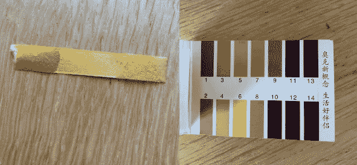

作者图片

酱汁似乎是 6，相比之下，另一端与水是 7。

## 将菜肴分类

虽然有许多许多不同类型的菜肴和烹饪方法，但在我看来，其中一些在世界各地都极为常见。

*   **汤**:将所有材料放入水中，加热至沸腾。让它煨到合适的质地和味道。
    Ex:土豆韭菜汤，Tom Kha Gai，Sopa Azteca，Bouillabaisse，蛤蜊杂烩，拉面汤，Pho，酸辣汤，Mulligatawny 汤。
*   **炖**:作为汤，但去除淀粉成分，单独烹制。
    例如:Chili con carne、Dal、Massaman curry、Gumbo、Sega wat、Domoda、麻婆豆腐。
*   **自行**:自行准备淀粉、蛋白质、蔬菜，配以酱汁食用。肉和土豆，香肠和土豆泥，西班牙小吃，北京烤鸭，黛安牛排。
*   **自行混合**:自行准备淀粉、蛋白质、蔬菜和酱料，并在上菜前混合。
    例如:肉酱面、泰伯香浓、意大利面沙拉、泰伯勒、普克碗。
*   **三明治**:准备好蛋白质和蔬菜，放在面包上食用。
    例如:汉堡、热狗、朗格士、法式长棍面包、烤肉串、玉米煎饼、牛排三明治、Skagen 吐司、smrrebrd。
*   馅饼:在面团上或里面烘焙蛋白质和蔬菜。
    例如:肉饼、Pierogi、披萨、饺子、Bö rek、Kiymali pide、Empanadas、Bobotie。

## 化学反应

烹饪不仅仅是找到合适的原料并把它们组合在一起，它也是一种化学反应。例如:

*   **美拉德反应**。从 19 世纪开始，就有一个有弹性的神话，说我们把肉烤焦来密封肉汁。这已被证明是错误的，但仍有理由烤焦。原因是美拉德反应，这是氨基酸和还原糖之间的化学反应，产生褐色，酥脆的质地和美好的香味。
*   **烫漂**。当我们切蔬菜时，我们切断了细胞壁，使不同的化学物质混合在一起。这有时会导致不希望的化学反应。例如，当切罗勒做香蒜酱时，一种化学反应开始了，使鲜绿色变成褐色。阻止这种反应发生的一种方法是通过加热来破坏引起这种反应的化学物质。这可以通过预先热烫罗勒来实现。另一个例子是洋葱，洋葱在切开之前没有太多气味，随后化学物质的混合产生了一些非常强烈的富含硫的化学物质，当它们与水接触时会变成硫酸，使我们的眼睛灼伤。这些反应可以通过在煎锅里加热洋葱来停止。
*   **炭化**。谁会想到部分燃烧一些植物会让它们味道更好？但这是真的，尤其是对非常有用的甘蓝类蔬菜来说。它是那些被培育了很长时间的物种之一，并被选择采取许多不同的有用的形式。例如:
    顶芽选择:甘蓝
    侧芽选择:抱子甘蓝
    茎选择:大头菜
    叶选择:羽衣甘蓝
    茎花选择:西兰花
    花束选择:花椰菜
    Btw，它所属的属还包含芥菜和油菜。

## 越南牛肉沙拉

我喜欢这道菜，因为很明显所有的配料是如何搭配在一起的。调料是:

*   酸橙
*   棕榈糖(甜)
*   鱼露(鲜味，盐)
*   大蒜、辣椒、生姜(香料)
*   芝麻油(脂肪、香料)

现在所有的口味都考虑到了，真正的沙拉主要是增加质地、颜色和营养。

*   米粉(淀粉，白色，柔软)
*   胡萝卜(淀粉、橙、脆)
*   黄瓜(淀粉，绿色，酥脆)
*   莴苣(苦的、绿色的、脆的)
*   牛肉(蛋白质，中等质地)

当然，其中一些成分还有一些其他的特点，例如，胡萝卜是甜的，有点像香料(事实上，这是波斯人驯化它的原因，用种子和叶子作为香料)，肉有鲜味。但是调料里有更多。

为了让这道菜更加有趣，可以加入新鲜的香草:

*   铸造
*   芫荽叶
*   泰国罗勒

## 意大利面条

这是我做了一辈子的菜，从来没想过改进，直到现在。用我的新知识武装起来，我注意到*酸和甜*不见了，所以有一天我加了少量的香醋，它确实改善了这道菜。现在，我确信传统上人们会吃酸的配菜来平衡它，但我仍然认为我的加入是一种改进。

## 集束香料和香草

有许多香料，很难知道用哪一种。为了获得一个概观，我决定将他们分组。我在谷歌上搜索了常见的替代品，并通过绘制 spice 与其替代品之间的关系图对其进行了建模。这是在图形工具 Gephi 中完成的:

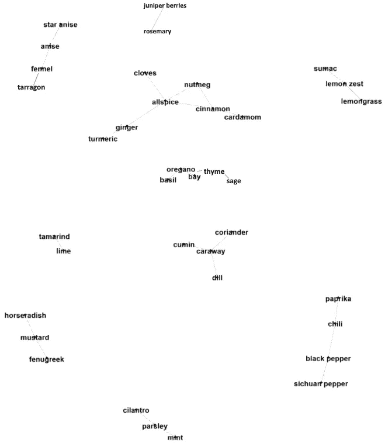

作者图片

似乎有几个集群:

*   **圣诞串**(丁香、肉豆蔻、多香果、肉桂、小豆蔻、姜粉、姜黄)。对我来说，这是姜饼和圣诞节的味道。我猜美国人会把它与感恩节和南瓜派联系在一起。此外，这种味道在印度和印度尼西亚菜肴以及牙买加小吃中也很常见。这个簇的一个特征化学物质是*丁香酚*。
*   **甘草串**(八角、八角、茴香、龙蒿)。对我来说，这是甘草、面包、盐和地中海的味道。这一串的特征味道是由于*茴香脑*或其异构体*蒿脑*的缘故。
*   **麻辣串**(辣椒、黑胡椒、花椒、辣椒粉)。这些香料不同于其他香料，因为它们主要是关于口腔中的感觉(辛辣、火辣、刺痒),而不是香味。
*   **鲜串**(香茅、柠檬皮、漆树)。这些气味如*柠檬醛、芳樟醇和柠檬烯*，通常与清新联系在一起，这也是它们常见于肥皂和洗涤剂中的原因。
*   **果味集群**(罗望子、酸橙)。这些是各种醛类的花香和水果味。
*   **踢中窦丛**(辣根、芥菜、胡芦巴)。这些和辣串差不多，只是痛在鼻子而不是嘴。葫芦巴没有这种品质。
*   **地中海草本植物群**(牛至、罗勒、月桂、百里香、鼠尾草):闻起来像披萨和地中海草甸。
*   **麝香串**(孜然、芫荽、香菜、莳萝):闻起来像中东美食。
*   **松树丛**(刺柏浆果、迷迭香):这是针叶林的气味，多半源于*α-蒎烯*。
*   **牙膏簇**(薄荷、欧芹、香菜)。对我来说，这是牙膏和漱口水的清新味道。
*   (烟熏味、香草味、巧克力味、藏红花味):这些香料实际上不属于任何其他类别。

顺便说一句，在许多情况下，让我们如此渴望香草和香料的好气味是化学战。看，草药无法逃离它们的敌人(如真菌和昆虫)，所以相反，它们产生有毒的化学物质杀死任何入侵者。这些化学物质使得香料闻起来有味道。显然，一生中被害虫侵袭过的草药比那些喷洒过杀虫剂的草药味道更好。至于人类为什么喜欢这些化学物质，有几种理论。一是有毒化学物质有助于我们的免疫系统。

然而，这并不是故事的全部，罗望子和其他水果闻起来很香，因为它们想被吃掉，这样它们里面的种子就会被传播，辣椒是辣的，以阻止哺乳动物吃它们，这样它们的种子反而被尝不到热量的鸟类传播。

关于香料，另一件要注意的事情是，在使用前将它们整体储存并磨碎是一个好主意。这是因为平方立方定律。通过减小香料颗粒的尺寸，体积随着尺寸减小，而面积仅仅随着尺寸减小，因此小颗粒具有大得多的面积-体积比，气味分子将消散得更快。同理，小动物通常很难保暖，而大动物则很难不过热。