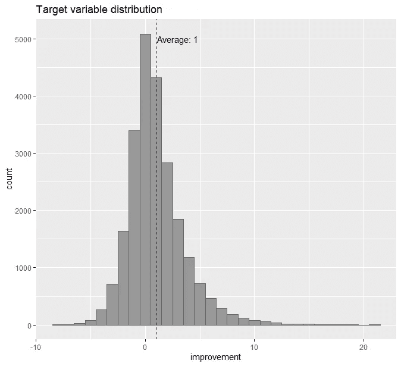
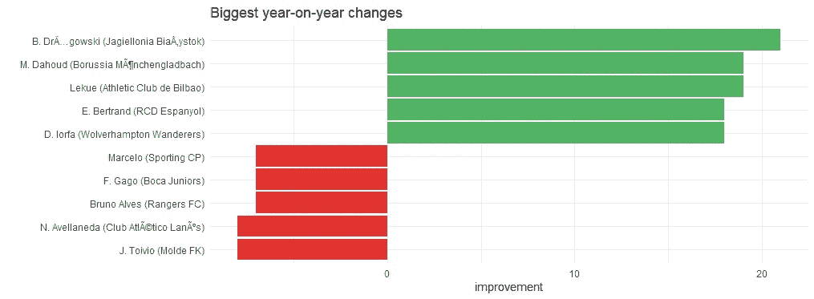
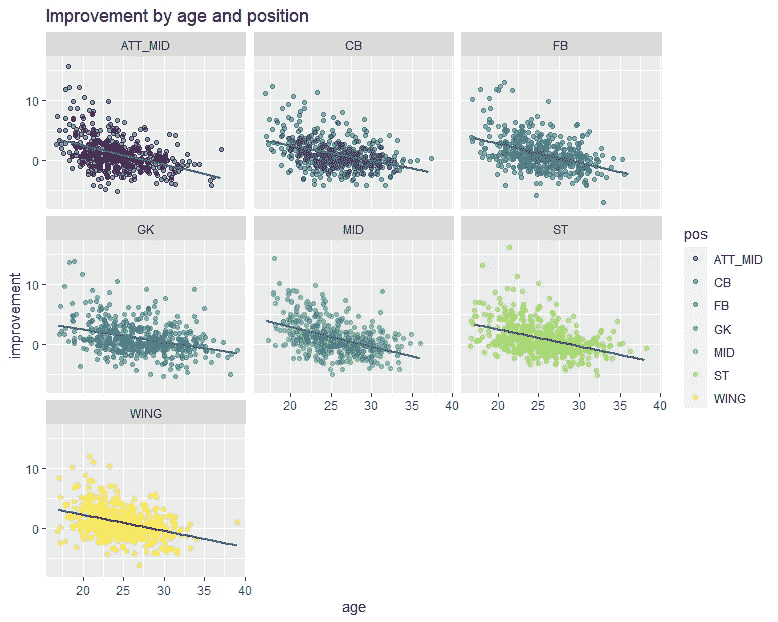
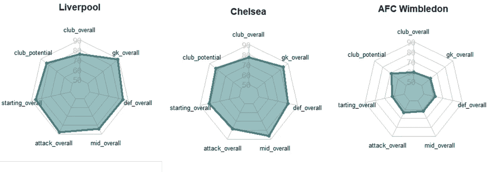
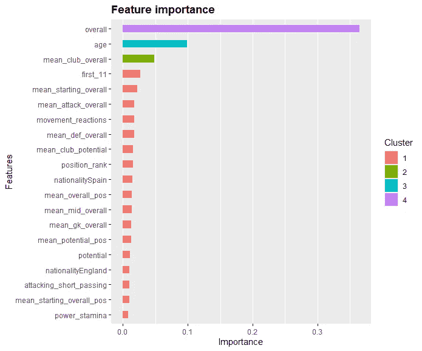

# 利用机器学习识别高价值足球转会目标

> 原文：<https://towardsdatascience.com/using-machine-learning-to-identify-high-value-football-transfer-targets-d4151a7ffcac?source=collection_archive---------17----------------------->

## xgboost 和 FIFA 20 数据集的冒险


斯文·库契尼奇在 [Unsplash](https://unsplash.com?utm_source=medium&utm_medium=referral) 上的照片

*如果你想复制本文中描述的分析，你可以在 GitHub 的* [*这里*](https://github.com/jtattersall09403/football_scout_ml) 找到所有的代码

## 马后炮是一个善变的东西。

回顾过去，我们很容易想到我们应该预见到它们的到来。*当然*，我们认为，我们应该*知道*比特币会成为一个东西，特朗普会在 2016 年获胜，iPod touch 意味着[带按钮的手机的终结](https://www.theverge.com/2016/9/30/13119924/blackberry-failure-success)。

足球转会也是如此。很难不回顾像安迪卡罗尔到利物浦，费尔南多托雷斯到切尔西，阿莱克西斯·桑切斯到曼联，安德烈舍甫琴科到切尔西这样的转会，并认为他们从一开始就注定要失败。

但现实很少如此简单。

## 我们举个例子。

在 2016 年和 2017 年的夏天，两名 25 岁的边锋以俱乐部创纪录的费用转会到了冠军联赛的顶级球队。两人在他们的老东家都表现出色；两者的估价都在 2000 万到 3000 万英镑之间；两人在国际足联的总体评分都在 80%左右。在前一个赛季，一名球员每两场比赛进一球，另一名每三场进一球。他们甚至都曾在英超前四名的俱乐部度过了一段糟糕的时光，然后去了国外以获得更多的比赛时间。

你觉得怎么样？这些玩家各自的命运应该是显而易见的吗？如果你知道他们的名字，你认为你的答案会不同吗？

其中一个是德国国脚安德烈·舒尔勒。他在 2016 年转会到多特蒙德，转会费约为 3000 万€。对他来说不幸的是，事情并没有在威斯特法伦斯坦迪翁解决。舒尔勒在托马斯·图切尔的第一个赛季打了 15 场比赛，[只进了两次球。在接下来的 12 个月里，他的市场价值直线下降，在他大笔转会三年后，他被租借到了莫斯科斯巴达。他在那个赛季结束后退役了。](https://www.transfermarkt.co.uk/andre-schurrle/profil/spieler/58205)

另一个呢？嗯，另一个是[穆罕默德·萨拉赫](https://talksport.com/football/375559/mohamed-salah-news-all-records-broken-liverpool-forward-incredible-premier-league-season/)。

# 机器学习和偏见问题

虽然这些可能看起来像无关紧要的轶事，但后见之明偏见的影响可能比你想象的更大。如果我们总是回过头来想，在那个时候区分一个犹太人和一个萨拉赫人应该很容易，我们就会低估在未来做同样的事情有多难。下一次我们看到一个 25 岁的边锋在欧洲踢球得分，他看起来是下一个大人物，我们会认为很明显他们是一个伟大的转会目标。我们可能会在不经意间让 Schürrles 比 Salahs 多。

那么，我们能做些什么呢？

我们可以做的一件事是将我们的评估建立在更加客观的数据基础上。如果我们可以设计和验证系统来学习与随后的高绩效可靠相关的模式，并证明它们在现实世界中有效，我们就可以开始做出更好的决策，并消除人类偏见。

当然，机器也不会对偏见免疫——远非如此。过去几年中有太多有偏见的算法的例子，这几乎已经成为数据科学领域的陈词滥调。特别是，机器学习算法经常会无意中*放大*人类的偏见，尤其是在根据人类判断生成的数据[进行训练的情况下。不过这通常是可以避免的:如果你知道偏见来自哪里，你就可以想出如何从你的训练过程中消除它们，从而获得更好的结果。](https://www.wired.com/story/algorithms-shouldve-made-courts-more-fair-what-went-wrong/)

但是听着，我知道你不需要我告诉你这些。你已经看过了钱球。你在这里是为了了解我们实际上是如何做到的。

所以让我们继续吧。

# 接下来

在这篇文章的剩余部分，我们将使用一个玩具示例来演示如何使用 R、`xgboost`和 [FIFA 20 数据集](https://www.kaggle.com/stefanoleone992/fifa-20-complete-player-dataset)来构建一个足球转会推荐系统。我们的目标是训练一种算法来**识别在即将到来的赛季中表现出色的球员**。此外，我们真正想知道的是:如果我们签下他们，哪些球员可能会在我们支持的俱乐部表现出色。

我们将把这个问题构建成一个 [**监督机器学习问题**](https://en.wikipedia.org/wiki/Supervised_learning#:~:text=Supervised%20learning%20is%20the%20machine,a%20set%20of%20training%20examples.) ，其中有一个与未来玩家表现相关的连续目标变量，我们的目标是提前预测。

我们将采取的步骤是:

1.  获取数据，设计特征并定义目标变量
2.  探索性可视化
3.  训练和验证一个简单的 xgboost 模型
4.  根据最新数据创建预测并探索结果

(如果您对代码不感兴趣，只想听一些有趣的传输八卦，您可以直接跳到第 4 部分)

# 步骤 1:加载数据和工程特征

首先，我们将加载所有的数据文件并做一些基本的清理。我们还将从国际足联的数据中提取非常详细的“位置”特征，并将其转化为稍微更广泛的类别(守门员、中后卫、边后卫、中场、攻击型中场、边锋、前锋)。

我们还在这里定义了我们的目标变量。在每个赛季开始时，我们希望预测每个球员在该赛季的表现如何。总的来说，在下一个版本的游戏中，拥有一个好赛季的玩家将会被开发者提高他们的总评分。那些赛季表现不佳的人将会看到他们的总体评分下降。因此，我们的目标变量将是**改进**栏，代表从一个赛季到下一个赛季总体评分的**变化。**

## 特征工程

接下来，我们将设计一些我们认为我们的机器学习算法将从中受益的功能。当然，并不是所有的算法都需要这一步。如果我们走深度学习的路线，那么我们[可以在理论上](https://www.kdnuggets.com/2016/07/deep-learning-architecture-engineering-feature-engineering.html)指定一个足够复杂的模型来设计它自己的底层功能，并从中学习。问题是，那种方法[需要大量数据](https://blog.dataiku.com/when-and-when-not-to-use-deep-learning#:~:text=Deep%20learning%20really%20shines%20when,or%20speech%20recognition%2C%20among%20others.)——可能比我们这里得到的还要多。记住:越复杂并不总是越好。编码重要领域专业知识的高质量工程特征可以[极大地改善大多数机器学习模型](https://searchdatamanagement.techtarget.com/feature/Top-5-feature-engineering-tips-for-better-models)，作为足球迷，我们可能有惊人数量的有用知识可以编码到我们的模型中。

比如我们知道**足球是团队游戏**。这意味着一个球员进步(或失败)的程度不仅取决于他们自己的技能和特点，也取决于他们队友的技能和特点。

这些关系远非简单。一方面，你可能听过专家们谈论一个球员如何从身边有一个更好的球队中受益。如果没有维吉尔·范·迪克和阿利松·贝克尔在他身边，乔·戈麦斯会打得像 19/20 那样好吗？

但另一方面，团队中有太多其他优秀球员——特别是如果他们打同一个位置——从发展的角度来看可能不是那么好，因为这意味着你不太可能获得比赛时间。举例来说，如果加布里埃尔·赫苏斯不是一直充当塞尔吉奥·阿奎罗的副手，他在曼城会有更大的进步。

使用像 xgboost 这样的基于树的模型可以帮助我们捕捉其中的一些非线性。为了让它有所作为，我们将为每个玩家创建一些列来表示:

*   球员在俱乐部的平均综合评分
*   球员在俱乐部的平均潜在得分
*   *首发*/首选选手的平均综合评分
*   首发进攻者、中场、防守者和守门员的平均综合评分(作为单独的特征)
*   俱乐部中与目标球员踢相同位置的其他*球员的平均综合评分*
*   同上，但使用潜力而不是总体评分
*   如上，但是是最大等级而不是平均等级
*   玩家在各自职位中的“排位”(按总体评分排序)

注意，我们还对我们的分类变量进行了一次性编码。

# 第二步。探索性可视化

接下来，我们可以检查数据集的一些有趣的特性。我们发现我们的目标变量有一个稍微偏斜的正态分布，平均值大约为+1:



作者图片

我们可以画出一个赛季中最大的 5 个赢家和输家:



作者图片

该数据集中最大的进步是由当时 16 岁的波兰门将 Drągowski 实现的，他的排名在 2015 年和 2016 年之间惊人地上升了 21 分，从 50 分上升到 71 分。另一方面，最大的输家是可怜的老约娜·托伊维奥。芬兰中后卫的整体评分在 2018/19 赛季期间下降了 8 分，从 71 分降至 63 分。我不知道他做错了什么，但这不可能是好事。

凭直觉，我们可能会认为年轻球员更有可能从一个赛季提高到下一个赛季，而老球员则下降。也可能是这样的情况，在某些职位上的改进往往比其他职位快，甚至两者之间可能存在相互作用。让我们快速浏览一下年龄和职位与进步的关系图，看看是否有什么特别之处。(注意，我们在每个位置随机抽取 500 名球员，以便于绘图)。



作者图片

不出所料，年龄和进步之间存在关联——但平均水平也有很大差异。有很多年轻球员一年比一年差，也有很多稍老的球员变得更好。也许有更多的年轻攻击中场球员在这个数据中有所提高，守门员的关系可能比其他位置稍浅，但除此之外，这种模式在所有组中都相当稳定。

最后，让我们生成一些经典的蜘蛛图来看看那些工程团队级的特性。



作者图片

创建这些图的完整代码如下。

# 步骤 3:建模和评估

既然我们已经获得了数据并设计了我们的功能，预测建模的实际代码就相当简单了。当然，调整、调整和改进模型需要时间，但是为了这个实验的目的，一些简单的默认参数就可以了。我们所要做的就是将我们的数据分成训练集和测试集，将它们转换成 xgb 数据矩阵，并通过`xgb.cv`函数运行它们。这将在我们的训练集中进行 [k 倍交叉验证](https://machinelearningmastery.com/k-fold-cross-validation/#:~:text=Cross%2Dvalidation%20is%20a%20resampling,k%2Dfold%20cross%2Dvalidation.)，这将为我们提供估计，我们可能期望该模型在样本外的表现如何。顺便说一下，本节假设您对 xgboost 非常熟悉。如果你不是，这里有一篇[优美温和的介绍](https://machinelearningmastery.com/gentle-introduction-xgboost-applied-machine-learning/)你可以看看。

这里需要注意的一件重要事情是，我们是**而不是**随机划分我们的训练集和测试集。如果我们这样做了，那么我们将在整个时间段的训练集中包括案例。这意味着我们的一些训练数据会比测试数据来得晚。但是测试集应该代表“看不见的”数据，在你训练完你的模型之前，你在现实世界中是无法访问这些数据的。

因此，我们复制更真实的条件，并按时间分割我们的数据。这意味着我们将总是使用过去的数据来预测未来，不需要时间旅行。

我们还在最后添加了一些代码来计算最佳迭代的一些不同的性能指标，包括 RMSE 和 R 平方。我们可能对它作为基本的改进/未改进分类器的表现感兴趣，因此我们添加了一些分类指标(灵敏度、特异性、阳性预测率和阴性预测率)作为良好的度量。

```
# A tibble: 1 x 8
model    rmse  r_square  sens   spec  pos_pred_rate neg_pred_rate
xgboost  2.15     0.339  0.332 0.915          0.651         0.741
```

我们得到的结果看起来相当合理，因为这只是开箱即用的 xgboost。(注意，在 GitHub repo 中，我们还运行了一个简单的线性模型作为基线，这总是一个好主意，但为了节省空间，这里省略了它)。RMSE 分数或多或少表明，该模型的预测正确率平均在+/- 2 点以内，R 平方表明我们解释了目标变量中约 34%的方差。

对于分类指标，该模型正确地识别了大约三分之一将要改进的玩家，并正确地排除了大约 90%没有改进的玩家。总的来说，如果你用它来选择一组预测在即将到来的赛季会变得更好的球员，大约 65%的人会这样做。

另一个重要的意义检查是查看模型使用哪些变量来进行这些预测。如果它过于依赖一个特性，或者一组我们不认为特别重要的变量，那么这可能是一个奇怪的迹象。我们可以使用下面的变量重要性图来检查这一点(只画出了 20 个最重要的特征)。



作者图片

在预测一个球员未来的进步时，看起来最重要的特征是他们当前的总体评分。这从直觉上讲是有道理的:已经非常优秀的玩家更有可能接近他们游戏的巅峰，并且没有更小的“空间”来提高。

同样有希望的是，该模型正在对年龄以及与球员俱乐部相关的各种特征(我们之前添加的那些额外列)产生影响，包括平均总体评级、平均首发评级、位置排名(“啄食顺序”)等等。

最后，我们来看几个玩家级预测的例子。这是从交叉验证的训练数据中随机选择的预测。

请注意，我们的男孩 Mo Salah 和 André Schürrle 都在那里，该模型正确地将 Mo 标记为良好前景(预计会改善)，而 Schürrle 标记为不佳前景(预计会变得更糟)。

因为这个模型看起来很合理(并且因为这只是一个玩具例子)，我们将把我们的评估留在那里，并接受它作为我们的最终模型。然后，我们在保留数据上测试它的性能，看看它在样本外的表现如何。

```
# Predict on test set
preds <- predict(xgb_model, newdata = test_xgb)# Add to data
test <- test %>%
  mutate(pred_improvement = preds,
         residual = improvement - pred_improvement) %>%
  select(1:improvement, pred_improvement, residual, everything())# Metrics
test %>%
  filter(season == 19) %>%
  mutate(pred = pred_improvement, obs = improvement) %>%
  mutate(pred_category = ifelse(pred > 0, "improve", "decline/same"),
         obs_category = ifelse(obs > 0, "improve", "decline/same")) %>%
  filter(!is.na(pred), !is.na(obs)) %>%
  summarise(rmse = RMSE(pred, obs),
            r_square = R2(pred, obs),
            mae = MAE(pred, obs),
            sens = sensitivity(factor(pred_category), reference = factor(obs_category)),
            spec = specificity(factor(pred_category), reference = factor(obs_category)),
            pos_pred_rate = mean(obs_category[pred_category == "improve"] == "improve"),
            neg_pred_rate = mean(obs_category[pred_category != "improve"] != "improve"),
            num = n()) %>%
  mutate(model = "xgboost") %>%
  select(model, everything())## Resultsmodel    rmse r_square   mae  sens  spec pos_pred_rate neg_pred_rate
xgboost  1.82    0.119  1.43 0.410 0.784         0.359         0.818
```

该模型在测试数据上的表现也相当不错——在一些指标上优于交叉验证(RMSE、灵敏度、阴性预测率)，而在其他指标上则较差(R 平方、特异性、阳性预测率)。这里没有任何过度拟合的*主要*证据，所以我们很清楚要真正尝试这个模型，并开始在最新数据中识别转移目标。

# 第四步:确定转移目标

现在我们有了我们的模型，我们准备对最新的数据进行预测，并确定一些转移目标！

为此，我们将建立一个函数，对于任何给定的俱乐部:

1.  计算俱乐部在最近一个赛季的团队级别属性
2.  按位置为该俱乐部的球员创建球员评级矩阵。这使得转会前景可以很容易地与俱乐部中相同位置的其他球员进行比较，从而创建一些预测功能
3.  采用最新的国际足联数据中的所有球员，并设置他们的属性，以便“看起来”他们在新的俱乐部
4.  通过这些新功能预测他们的改进分数
5.  将此与原始预测(使用旧俱乐部的特征生成)进行比较

所以本质上我们在这里做的是说:对于数据集中的每个球员，如果他们的俱乐部级别属性改变了，他们的预测会如何改变？

(我们还增加了一个选项来获得最差的*转会，即我们应该避免的转会目标，我们认为球员在我们的俱乐部会比留在他们原来的俱乐部做得更差)。*

如果我们为**利物浦俱乐部**运行这个程序，并保留前 100 个目标，我们会得到下面的结果。一些特殊字符的格式有点…不寻常，所以你必须原谅那些。

(*注意:当这个帖子被创建时，最新的可用数据是 FIFA 20 数据集——所以这些预测是针对 19/20 赛季的，有点过时了。加入 FIFA 21 的数据将是一个很好的项目扩展！*)

这里有一些有趣的事情:

*   所有十大目标都是进攻型中场，包括像**凯文·德布劳内**(我们可以做梦)**保罗·迪巴拉**和**布鲁诺·费尔南德斯**。解释模型的具体选择是我们可能会保存到未来的帖子中的事情——但看起来模型可能会发现尤尔根·克洛普在 CAM 部门相对缺乏可用的选项
*   其中几名球员实际上是利物浦最近几个赛季的转会目标——最引人注目的是纳比尔·费基尔。所以看起来模型至少做出了一些合理的决定！
*   **De Bruyne** 是排在首位的一个特别有趣的内含物。虽然转会不太可能发生，但该模型预测，如果他留在曼城，KDB 的总体评分在不久的将来可能会略有下降——但如果他转会到安菲尔德，他实际上会有所改善。精神食粮。
*   鉴于默西塞德郡目前的防守伤病危机，选择有前途的莱比锡中后卫易卜拉希马·科纳特是一个有趣的选择。事实上，这位 25 岁的球员在最近几个月与转会到利物浦的联系在一起，我们的模型预测，在克洛普的领导下，他的进步速度将比现在的俱乐部快 60%以上。在这个世界上，他排在范迪克、戈麦斯和马蒂普之后，排在第四位——随着更多的一线队出场，他可能会进步得更快。

我们可能会花一整天的时间来研究这些结果——事实上，这种人工检查通常是机器学习项目中的一个重要步骤。

在下面的附录中，你可以看到 19/20 赛季在英超踢球的每个俱乐部的前 50 名转会目标。你同意你的俱乐部的哪些选择？你认为哪个模型出错了？为什么会这样？回答这类问题通常可以帮助您确定要包含的新数据源、要设计的新功能、要编码的更多领域专业知识，这些可能会改进您对未来的预测。

# 结论

当然，我们在这里采用的方法有很多限制。虽然国际足联的评分系统令人印象深刻的彻底，它自然是不完美的。任何讨论单个玩家评级的留言板都会有很多粉丝抱怨感知的不准确性，而为视频游戏设计的系统永远不会完全捕捉到专业水平所需的所有细微差别。因此，出于类似的原因，我们的“改善”目标有点粗糙。我们也有很多更复杂的方法来模拟这个问题——例如，使用[图形卷积网络](/how-to-do-deep-learning-on-graphs-with-graph-convolutional-networks-7d2250723780)来更全面地捕捉不同类型的球员在同一个俱乐部中产生的复杂互动效应。

然而，我们在这里展示的只是冰山一角。我们已经探索了一些简单、容易获得的数据，用几行代码构建了一个模型，并且已经获得了直观的结果。甚至这个简单的概念证明也能引发一些有趣的转让讨论。但顶级俱乐部可以获得比这更丰富、更广泛的数据来源。想象一下，如果你有资源将机器学习技术应用于类似于 Wyscout 数据库的东西，你会做些什么。

所以这个故事的寓意是:当谈到机器学习时，从简单的东西开始，在你感兴趣的主题上找到一些容易获得的数据，不要害怕陷入其中并进行实验。你可能会对你的发现感到惊讶。

# 附录:所有英超转会目标

下表是通过运行 19/20 赛季英超各队的`get_best_transfers()`函数生成的。对于每支球队，我们都使用一些粗略的启发式方法来筛选更“现实”的转会目标(没有必要只向每个人推荐莱昂内尔·梅西)。

首先，根据国际足联的比赛，我们筛选出那些被记录为市场价值等于或低于目标俱乐部最昂贵球员+ 20%的球员。第二，我们也通过总体评分进行过滤，只显示那些目前在“总体”评分上比首发俱乐部前 11 名中最差球员最多差几分的球员。因此，如果你的球队最差的首发球员总评分为 80，而你最贵的球员价值 5000 万，你会看到当前总评分为 78 或更高的转会目标，当前市值为 6000 万或更少。

在“新俱乐部”栏中搜索你支持的球队，并在探索预测中获得乐趣！