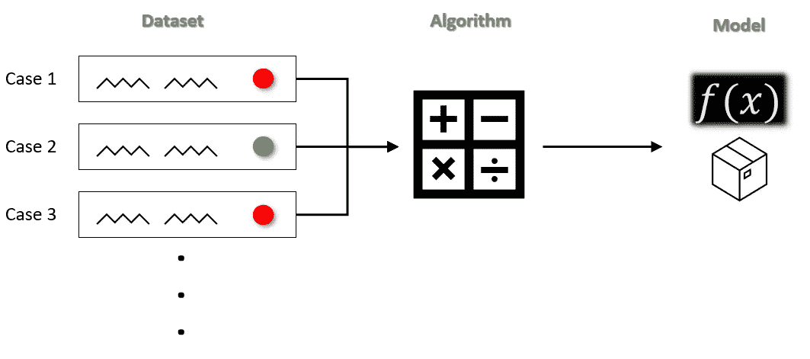
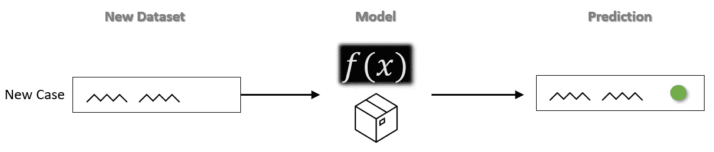
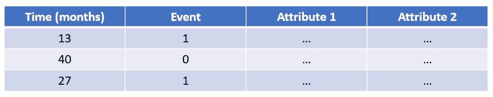
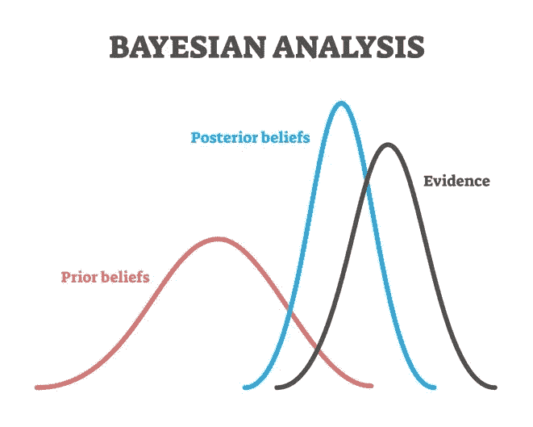

# 使用机器学习预测信贷损失:为什么当前的方法有缺陷

> 原文：<https://towardsdatascience.com/using-machine-learning-to-predict-credit-losses-why-current-methods-are-falling-short-e18ac0a191b3?source=collection_archive---------54----------------------->

> “所有模型都是错的，但有些是有用的”

乔治·博克斯 1976 年论文中的上述引文在 45 年后的今天仍然适用。)在很多方面。过去十年中，机器学习的进步带来了很多希望(和大量宣传)，有助于解决商业中最棘手的挑战:在事情发生之前知道将会发生什么。我们提出，即使所有的模型都是错误的，一些模型比其他模型的错误少*。*

## *背景*

*为了提供机器学习如何解决分类问题的一些基本背景，下面的视觉表示显示了如何通过**算法**将由具有已知结果的案例组成的**数据集**(即，数据集中的每一行代表一笔独特的贷款，每一列中有关于该贷款的属性，最后一列代表该贷款是否违约)馈送给*训练*(即，创建**模型**:*

**

*(图片由作者提供)*

*一旦模型已经根据已知的历史案例和结果(违约与非违约)进行了*训练*，就可以输入结果未知的新案例；该模型根据从*训练*数据集中获得的信息，预测每种新情况的预期结果:*

**

*(图片由作者提供)*

*现在我们有了机器学习如何工作的基本知识。这在理论上听起来很棒，但让我们探索一下为什么像我们上面训练的模型在实践中不适合许多应用，包括大多数信用损失建模。*

## *一个重要的区别*

*在我们的数据仓库中，我们可能存储代表事务的数据。例如，对于每笔贷款，我们可能有多行数据:如果贷款按月偿还，则新的一行表示每个月的未偿余额。这与我们需要训练模型的数据集的结构形成对比；我们训练数据集中的每一行都应该是一个*独特的*案例，我们稍后将要求它对其进行预测。如果我们正在构建一个模型来预测香蕉是成熟还是腐烂，我们的训练数据集中的每一行都必须表示关于一个独特香蕉的信息，而不是每天对多余香蕉的观察。*

## *亏空*

*首先，回想一下，我们的训练数据集由违约或未违约的案例组成。考虑一个贷款组合，我们的数据仓库中有一些历史数据，包含违约或按期全额偿还的贷款(让我们暂时忽略提前还款的想法，我们可以改天再讨论)。然而，我们数据的很大一部分可能代表了仍在账面上的贷款，这些贷款没有违约，但也没有达到贷款期限的末尾(其结果是未知的 T2)。这提出了几个重要的问题:*

> **如果我们不将这些“活跃的”案例包含在我们的训练数据集中，我们是不是遗漏了许多本应该告诉我们的模型的重要信息？毕竟，如果他们还在账面上，他们还没有违约…**

*此外，我们知道训练数据集中的每一行都必须代表一笔*唯一的*贷款:*

> **如果我们的训练数据集中的一个案例具有“违约”的已知结果，那么知道该贷款是在 1 个月后还是在 1 年后违约难道不重要吗？**

*毫无疑问，我们希望我们的模型能够评估这样一位客户，他在 28 年内按时偿还了 30 年期抵押贷款，然后违约，与在最初几个月后破产的客户不同。*

*考虑一个不同的问题，比如访问者是否会点击我们网页上的广告。在这个例子中，可能没有太多的“寿命”要考虑。他们上了我们的网站，在几秒钟内，要么点击了广告，要么继续前进——仅此而已。我们可以快速创建一个训练数据集，该数据集可以输入到一个算法中，并生成一个模型，如我们之前在**背景**部分中所述。*

*相反，客户拖欠贷款不是一个在几秒钟内发生的过程；几乎可以肯定，这是导致违约的几个月或几年内发生的一系列事件的结果。*

*我们可以把前面提到的两个问题归结为一个一般性问题，这个问题包含了我们想要得到的核心内容:*

> **我们如何将关于案例(贷款)的“生命周期”的更多信息整合到我们的模型中？**

*让我们来看三种不同的方法来实现这一点:*

1.  *生存分析*
2.  *IPCW(逆概率截尾加权)*
3.  *贝叶斯推理*

## *生存分析*

*生存分析是一种回归方法，旨在预测事件发生的时间。它还允许我们引入“事件”尚未发生的情况。当训练生存模型时，我们的训练数据集中的每一行都是唯一的贷款，并且列被指定如下:*

*   ***‘时间(月)’**代表我们观察贷款的时间*
*   ***‘事件’**表示事件(默认)是否在观察期间发生；默认值= 1，无默认值= 0*
*   ***【属性 1】****【属性 2】**代表贷款的一些其他信息(即自变量)；这些变量可以是*分类独立变量*，如与贷款相关的客户所在地区，或*连续独立变量*，如观察期间客户的平均债务覆盖率；你可以引入尽可能多的独立变量*来帮助解释你的模型中的方差**

**

*(图片由作者提供)*

*生存模型的输出不同于传统机器学习模型的输出。生存模型输出新贷款案例“存活”(不违约)超过特定月数的概率，而不是输出它对新贷款案例属于哪一类(违约或非违约)的猜测。更具体地说，当输入新病例时，该模型返回在训练数据集中的“**时间(月)】**列中找到的每个唯一时间值之后存活的概率。*

*在我们上面的模拟数据集中——忽略**属性 1**&**2**——我们的生存模型会告诉我们，一笔新贷款有 67%的概率存活过去 13 个月(因为 2/3 的贷款是在过去 13 个月观察到的)，有 33%的概率存活过去 27 个月(因为 3 笔贷款中有 1 笔“存活”过去 27 个月)。当然，更复杂的模型会考虑我们额外的独立变量(如'**属性 1** '和'**属性 2** ')并改变这些概率。*

*生存分析是对传统机器学习的改进，因为它允许我们将嵌入在我们尚不知道结果的案例中的所有信息纳入我们的模型。它还允许我们回答一些非常有力的问题，例如，“在我们投资组合的这一部分中，哪些贷款在 12 个月内违约的可能性大于 50%？24 个月怎么样？”。然而，生存模型假设*事件*(在我们的例子中是违约)将**最终**在未来的某个时刻发生。这并不完全符合我们的业务问题，因为许多贷款不会出现违约(它们将被全额偿付)。也许有一种方法可以将生存分析中的一些方法论融合到传统的机器学习模型中…*

## *IPCW(截尾加权的逆概率)*

*在生存分析中，未知结果的病例被称为“已审查”。在 Vock 等人撰写的 2016 年题为“ [*使机器学习技术适应审查的时间-事件健康记录数据:使用审查权重的逆概率的通用方法*](https://europepmc.org/article/pmc/pmc4893987) 的论文中，作者讨论了一种将生存方法引入任何机器学习分类模型的方法。*

*他们提出的方法要求在训练数据集中只使用结果已知的案例，但是*使用一种叫做**审查加权的逆概率(IPCW)** 的技术对这些案例中的每一个单独进行加权*。这些权重是基于整个数据集计算的(结果已知的病例*和结果未知的病例*)。不是推导事件在时间 *t* 之前发生的概率，而是通过取该推导的逆来计算 IPCW 权重，或者在时间 *t* 之后结果仍然未知的概率。*

*使用 IPCW 加权的训练数据集来开发一个模型，使我们能够利用所有最新和最棒的机器学习算法，同时还可以对我们所有关于未知结果贷款的数据进行编码。特别是，它有助于我们的模型理解在生命中不久违约的贷款和违约但几乎还清的贷款之间的差异。*

## *贝叶斯推理*

*如果您已经做到了这一步，您应该看到我们正在以不同的方式稍微改变估计信用损失的业务问题，以符合适当的建模方法。*

*我们认为，最后一种适合信用损失建模的方法是贝叶斯推理。对于那些不熟悉的人来说，这些模型要求可能的结果和相关概率的*先验*分布，然后添加已经收集的数据(下图中的**证据**)，以创建最终的*后验*分布。它的工作很像我们的大脑工作——我们通常对可能的结果及其可能性有一些预先的信念，我们随着时间的推移收集更多的证据，更新和完善我们的理解。*

**

*[https://data insights . de/introduction-to-Bayes-inference-with-pystan-part-ii/](https://datainsights.de/introduction-to-bayesian-inference-with-pystan-part-ii/)*

*在信用损失建模的背景下，贝叶斯推理为我们提供了两个独特的优势:*

1.  *我们通常不需要像训练频繁模型那样多的数据来训练一个统计上健壮的贝叶斯模型；这对于没有大量历史损失数据的组织尤其有用*
2.  *这些模型输出可能结果的分布，而不是单点估计。这使得我们可以得出这样的结论，“我们有 90%的信心，信贷损失将少于 500 万美元，我们有 95%的信心，信贷损失将少于 1000 万美元”。这通常比传统的频率主义模型更有用，后者仅限于得出结论，“我们预测明年的信贷损失总额将达到 600 万美元”*

*Kwon 在 2012 年的论文 [*“三篇关于信用风险模型及其贝叶斯估计的论文”*](http://nrs.harvard.edu/urn-3:HUL.InstRepos:9288549) 中最好地概述了使用贝叶斯方法对信用损失进行建模。*

## *包扎*

*尽管使用机器学习来帮助改善信用损失预测的承诺是合理的，但这样做需要确保您正确地设置数据和模型。将你的数据直接插入机器学习算法可能会很快，所以考虑使用生存分析的一些方法——包括 IPCW——或贝叶斯推理，以确保你正在用你拥有的信息建立最好的模型。*

*如果你想了解更多关于如何改善你的信用损失评估模型，不要犹豫，与我们联系在[凯奇布鲁克分析](https://www.ketchbrookanalytics.com/contact)。*