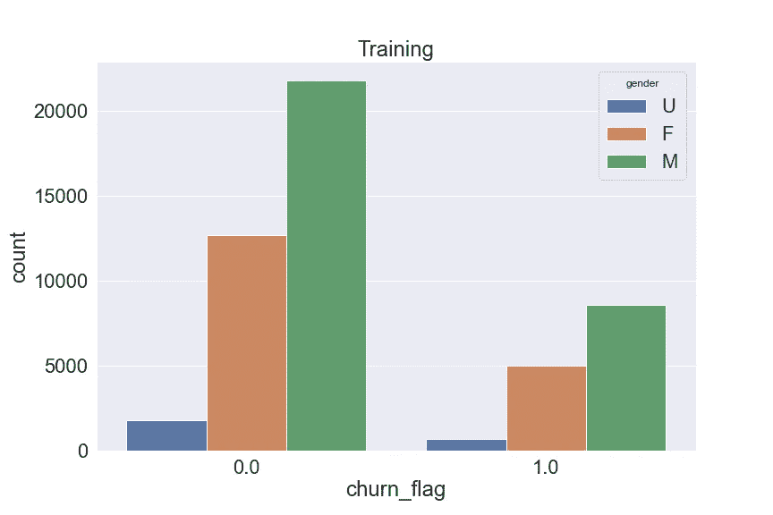
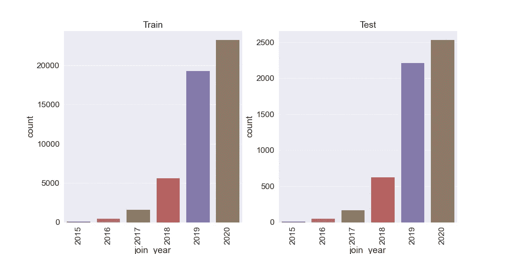
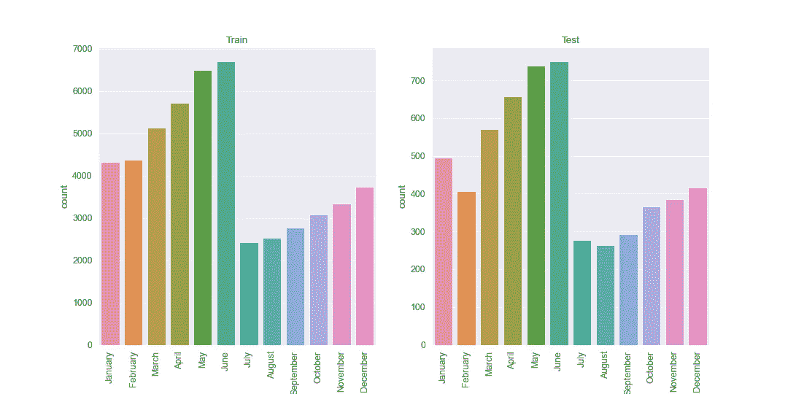
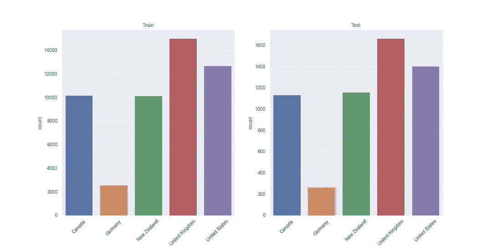
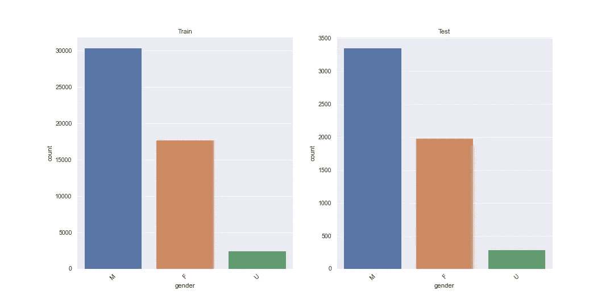
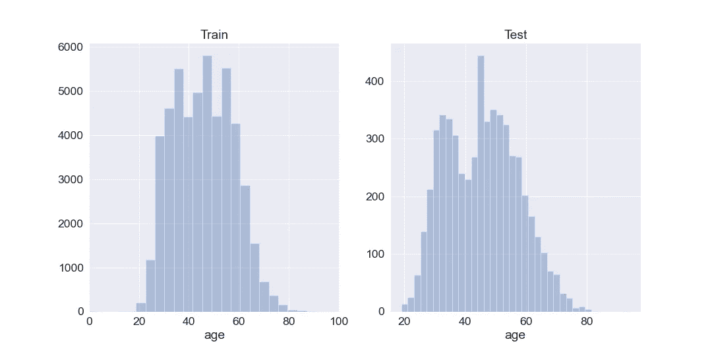
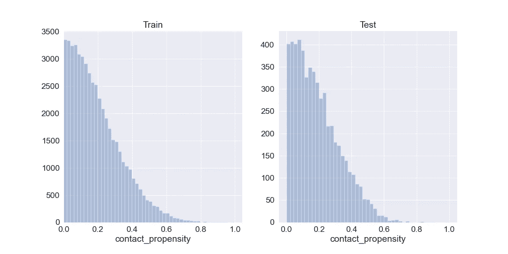
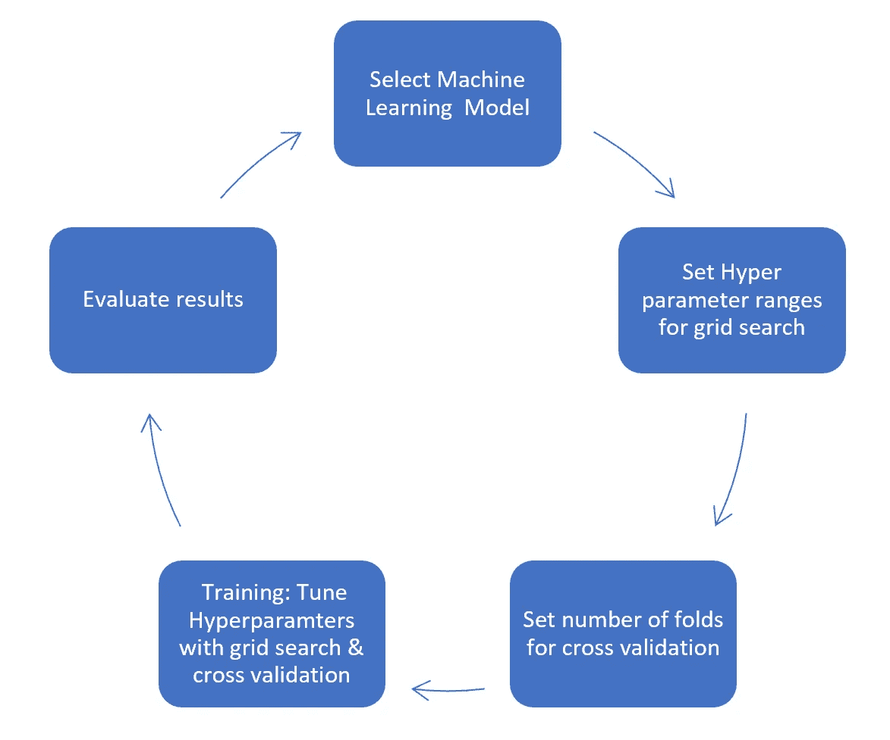
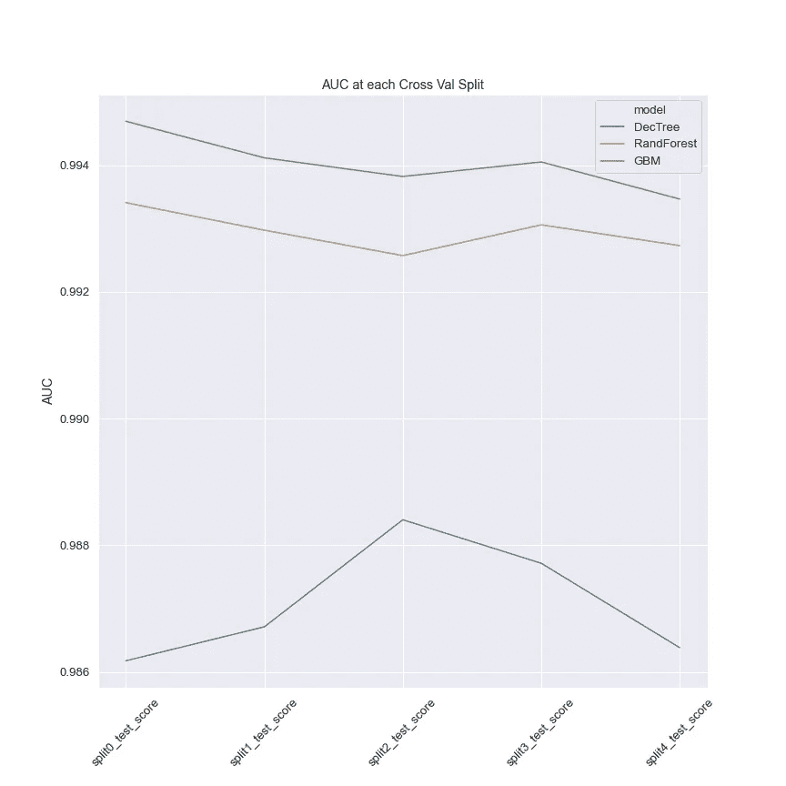

# 使用机器学习预测客户流失

> 原文：<https://towardsdatascience.com/using-machine-learning-to-predict-customer-churn-cd499cb230db?source=collection_archive---------14----------------------->

## 监督机器学习

## 使用逻辑回归、决策树、随机森林和梯度推进预测客户流失

Gert RDA valasevi it 在 [Unsplash](https://unsplash.com?utm_source=medium&utm_medium=referral) 上拍摄的照片

# **简介**

在本文中，我将带您了解机器学习的一个真实的业务用例。通常，企业需要采取主动措施来减少客户流失(流失)。在大数据和机器学习时代，预测客户流失从未如此容易。

我使用四种机器学习方法，并根据性能推荐最佳方法。我用过的四个模型是:逻辑回归、决策树、随机森林分类器和梯度推进机器分类器。

基于两个标准评估模型性能:训练时间和预测能力。AUC 是用于衡量预测能力的指标，因为它提供了一种很好的衡量模型区分流失客户和未流失客户的能力的方法。

# **数据**

模型根据客户数据集进行训练(每个客户都由唯一的客户 id 标识)。特征是与业务相关的客户属性。它们包括以下内容:

*性别——注册时指定的客户性别*

*加入日期——客户加入*的日期

*联系倾向——客户联系客户服务部的可能性*

*Country ID——可以连接到 Country 表以获取客户当前居住国家名称的标识符。国家表也可用于分析。*

目标(或标签)是客户流失标记，它识别客户停止处理业务的情况。

# **数据准备**

这是机器学习管道的第一步，在这里进行一些初始探索、数据源合并和数据清理。

**合并数据**:客户属性和国家数据在国家 ID 上合并，带入当前居住国家的名称。

**重复**:在客户数据的上下文中，重复的观察可能意味着错误的数据管理，因为数据中应该只有一个客户的实例。没有发现重复的观察结果。

**初始特征工程**:加入日期是一个*日期时间*特征，已经被拆分为加入月份和加入年份。这种拆分为模型提供了捕捉客户流失的潜在季节性影响的机会。

**测试&训练**:客户数据被分成测试和训练数据集。具有丢失流失标记的客户被分配到测试集，所有其他客户在训练集中。测试和训练数据集中唯一客户的数量分别为 5，622 和 50，598。

从这一点开始，测试和训练数据被分开处理，以防止两者之间的数据泄漏，这种泄漏会对机器学习的有效性产生不利影响。

**缺失数据**:大量缺失数据会影响下游建模。对 N/A 或空值进行简单检查，以确保测试或训练中没有。没有意外丢失的值。

# **探索性数据分析**

最初的数据探索揭示了一些有趣的怪癖。

性别:在培训和测试中，有三个独特的性别类别。男，女，U(未知)。未知案例大约占测试和训练集所有案例的 5%。

对于未知的情况有两种可能的解释。1)选择不透露性别的客户。2)数据输入或数据质量问题导致信息丢失。

对于未知的情况，很难说清楚这两种情况之间的区别。因此，我做了一个简化的假设，即未知病例是那些选择不透露性别的人。在此基础上，有理由相信这群人的行为可能与那些选择认同的人不同。这就是我在训练数据中留下未知案例的理由。

未知案例在流失客户和固定客户中的分布比例与男性和女性客户相似。

跨流失标志的性别分布

**缺失&未知国家**:在训练数据中，共有 12 名客户的当前居住国缺失或未知。这个相对较小的训练集子集可能是由于数据输入或收集错误造成的。客户不明确说明自己的居住国就注册这项服务似乎不太可能。正因为如此，我将从训练数据中省略这些观察值。

*注意:如果当前居民所在的国家不断更新，将缺失的数据作为其自己的类别保留下来可能是值得的。*

**异常加入日期**:在培训数据中，一些客户的加入日期为 1901，这表明存在一些数据质量问题。这些观察结果在分析中被忽略了。

**非常老的客户**:测试数据中的一位客户年龄为 150 岁。这几乎肯定是数据输入错误，因为目前世界上最长寿的人是 117 岁。荒谬的年龄观察已被纠正，将年龄大于 117 岁的观察替换为客户在其居住国的平均年龄。

*注:117 岁是写作时最长寿的人的年龄。这可能需要重新考虑。*

**训练&测试数据:**训练和测试的分割基于丢失的流失标记。这是有意义的，因为目标是推断丢失的流失标记。但是，检查测试人群是否是训练人群的代表性样本是明智的。

我们可以通过绘制我们特征的分布图，并在测试和训练中进行比较来实现这一点。通过肉眼观察分布，测试集看起来确实是训练集的子集，这是我们进行有效机器学习所需要的。

加入年度分布

加入月份分布

目前居住分布的国家

性别分布

年龄分布

接触倾向分布

# **一个热编码**

机器学习模型解释数字而不是单词。我们的客户数据具有必须转换的分类变量，以便机器学习模型能够处理它们。这是通过一个热编码完成的。

# **造型**

四个机器学习模型已经按照标准建模管道进行了训练。选择一个模型，并结合网格搜索和 5 重交叉验证仔细调整超参数。

作者图片:ML 培训管道

下面是 Python 中培训管道的样子。这个简单的功能涵盖了结果评估阶段的所有内容。

用于训练和调整 Scikit Learn 机器学习模型的管道

时间和计算的约束限制了我在优化超参数方面的搜索空间。但是，可以通过以下启发式调整来获得最佳预测性能:

**逻辑回归**:模型已经用 L2 正则化初始化，这稍微降低了模型的复杂性，以防止过度拟合。超参数 C 是正则化参数的倒数，它被调整以找到最佳拟合。[1]

运行逻辑回归管道的 Python 代码

**决策树**:决策树容易过度拟合，调整最大树深度和最大特征可以避免这种情况。

运行决策树管道的 Python 代码

**随机森林**:要调整的重要超级参数是树的数量和每次分割时要考虑的特征子集的大小[2]。自举样本用于构建树，以使模型对过拟合具有鲁棒性。

运行随机森林管道的 Python 代码

**梯度推进机**:树的数量、学习速率和树的深度是需要调整的重要超参数[2]。

运行梯度提升机器管道的 Python 代码

**不平衡的阶层:**从我们的探索性数据分析中，我们看到流失客户和坚持客户之间的阶层不平衡。所有模型都使用类别加权来解决这个问题。

# **车型评测**

## **预测能力**

使用 AUC 评估预测性能。在预测性能方面，梯度增强优于所有其他模型，平均 AUC 为 0.994。逻辑回归表现不佳，平均 AUC 为 0.7246。

决策树在最佳运行时表现良好。然而，在所有模型中，其最佳运行和整个搜索空间内的方差是最高的，这意味着有些倾向于过度拟合训练数据，这是不容易控制的。

就预测能力而言，随机森林是表现第二好的模型，平均 AUC 为 0.993。然而，它对过度拟合最稳健，交叉验证折叠之间的方差为 0.000287。

跨 5 倍 CV 的最佳超参数空间的模型性能

下面是用于生成所有最佳模型得分表的 Python 代码。

为每个模型生成最佳得分表的 Python 代码

下面是用来生成上面图表的代码。

为每个模型绘制最佳分数的 Python 代码

## **训练速度**

尽管梯度增强在预测能力方面表现最好，但训练速度很慢，仅用了半个多小时。相比之下，随机森林花了大约一半的时间进行训练。逻辑回归和决策树都在不到 10 秒的时间内完成训练。然而，易过拟合和预测性能差使得这些选项不适合商业使用。

# 最佳模特

随着计算能力的提高，我会推荐梯度推进。然而，随机森林提供了出色的预测性能和对过度拟合的鲁棒性，这对于生产模型是很重要的。

# **生产模型**

最终，这种模型不仅仅会出现在你的笔记本电脑上，还会被客户大规模使用，因此需要进行生产。因此，我建议我们应考虑以下几点:

**1)** 这将使测试脚本和调试代码(如果需要的话)变得更加容易。

**2)** **客户数据监控**:我们需要能够预测模型性能何时会受到影响。一种简单的方法是监控我们当前的客户群，并评估它是否与过去的客户群有显著差异。

**3)模型重新评估&重新培训:**我们应该定期根据新数据评估模型的性能。这可能是当我们检测到数据偏差(见第 2 点)或在一个设定的时间框架。如果新数据的模型性能低于我们的阈值，我们将需要重新训练模型。拥有灵活的建模管道将使重新训练模型变得容易。

**4)** **考虑袋外评分**:如果使用随机森林模型，考虑使用袋外验证来加速训练。不是 K-fold 交叉验证，而是在袋外样本上验证随机森林(假设引导样本用于构建树)。

**5)**

**6)** **扩展训练数据**:通过在数据中包含一些附加特征，可以进一步提高预测性能。其中一些是最常见的走廊和定价、每月交易、转介和平均交易金额。

# 代码和数据

这个[分析背后的完整 python 代码可以在这里运行](https://mybinder.org/v2/gh/john-adeojo/ChurnModelling/main?filepath=Churn%20Modelling%20v6%20(2).ipynb)。数据可在我的[流失建模 GitHub repo 中获得。](https://github.com/john-adeojo/ChurnModelling)

<https://www.linkedin.com/in/john-adeojo/> 