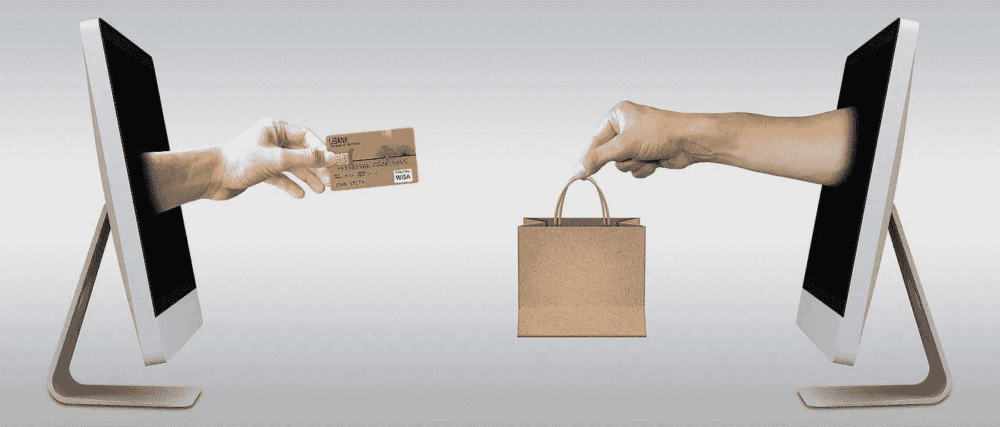
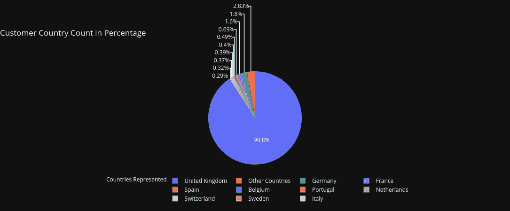
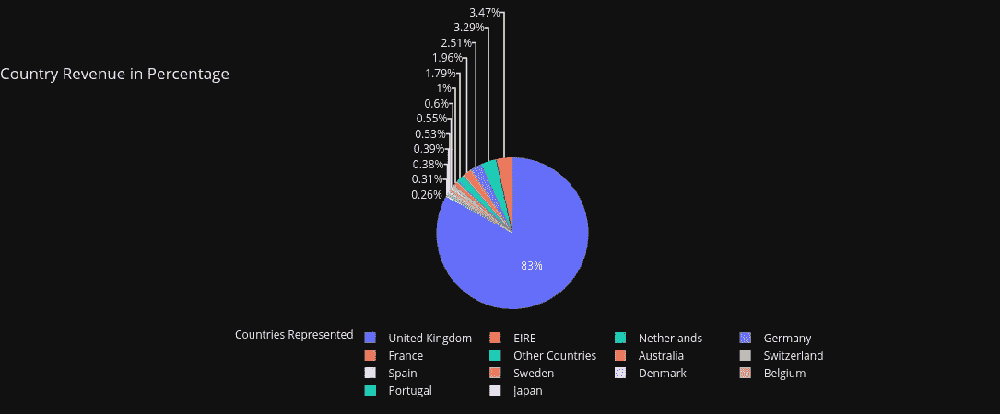
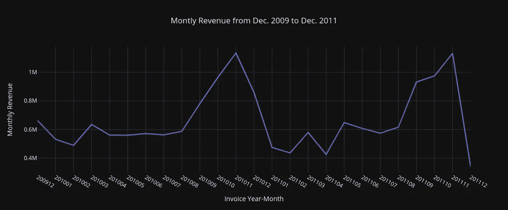
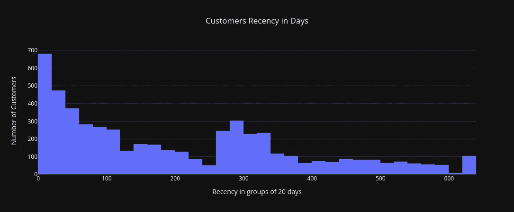
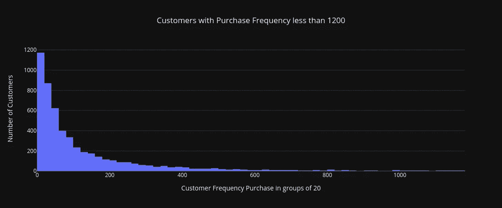
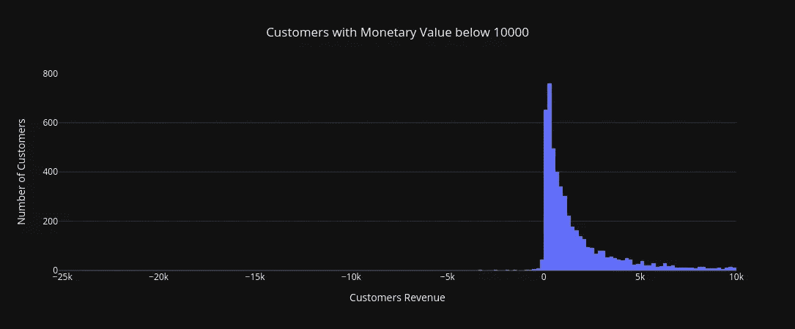
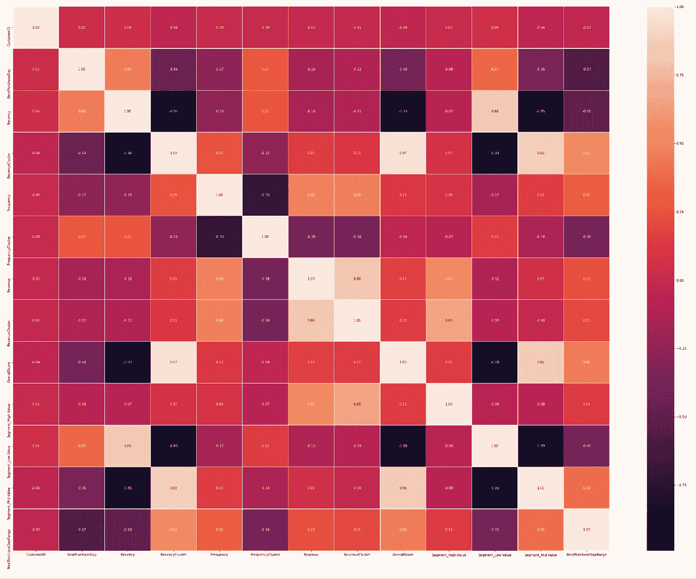

# 使用机器学习来预测客户的下一个购买日

> 原文：<https://towardsdatascience.com/using-machine-learning-to-predict-customers-next-purchase-day-7895ad49b4db?source=collection_archive---------0----------------------->

## 机器学习模型来预测客户是否会在一段时间后进行下一次购买。

图片由 [Mediamodifier](https://pixabay.com/users/mediamodifier-1567646/) 制作，可以在这里[访问。](https://pixabay.com/photos/ecommerce-selling-online-2140603/)

# 介绍

如果说零售业的人从[新型冠状病毒](https://en.wikipedia.org/wiki/Severe_acute_respiratory_syndrome_coronavirus_2)疫情那里学到了一个重要的教训，那就是要求他们转向通过互联网做生意，即[电子商务](https://en.wikipedia.org/wiki/E-commerce)。电子商务的理念有助于管理人员为公司的发展做出决策。毫无疑问，这些决策中的大多数都会受到数据分析、数据科学和机器学习专家对在线客户购买行为数据的研究结果的影响。

假设一家在线零售店的管理团队带着[数据集](https://www.kaggle.com/mashlyn/online-retail-ii-uci/download)来找你，你是一名数据科学家，你想知道顾客是否会在最后一次购物后的 90 天内进行下一次购物。您对他们询问的回答将有助于他们确定他们的营销团队在推出下一次促销活动时需要关注哪些客户。

在本文中，作为一名数据科学家，我的目标是构建一个模型，为公司经理提出的问题提供合适的答案。更准确地说，使用给定的[数据集](https://www.kaggle.com/mashlyn/online-retail-ii-uci/download)，我建立了一个机器学习模型，预测零售店的在线客户是否会在他们最后一次购买的 90 天后进行下一次购买。

值得一提的是[巴尔·卡拉曼](https://medium.com/@karamanbk)已经做了一个[类似的工作](/predicting-next-purchase-day-15fae5548027)回答了一个不同的问题，而不是我们想要先发制人的这个问题的准确预测。

# 关于数据集的一些信息

在开始回答感兴趣的问题之前，我将首先介绍一些关于[数据集](https://www.kaggle.com/mashlyn/online-retail-ii-uci/download)的一般有用信息。

该数据集记录了来自 43 个不同国家的 5942 名在线客户。在零售店的在线客户中，90.8%的人生活在英国。

图 1:以百分比表示的客户国家计数—图片由[作者](https://eocansey.medium.com/)提供

英国有如此庞大的客户群，公司 83%的收入来自英国也就不足为奇了。

图 2:各国收入百分比——图片由[作者](https://eocansey.medium.com/)提供

下面的图 3 给出了在线零售公司每月收入的直观表示。

图 3:2009 年 12 月至 2011 年 12 月的月收入——图片由[作者](https://eocansey.medium.com/)提供。

在这里，我们可以观察到该公司在 2010 年 11 月的收入最高，其次是 2011 年 11 月。此外，8 月份以后每月收入有所上升。

根据本节所做的分析，我们可以向经理们提出一些建议供他们考虑。在该公司努力增加除英国以外的其他国家的客户群的过程中，数据科学家可以向管理团队提出什么建议？在回答这个问题时，我会说…

由于该公司在英国拥有坚实的客户基础，它可以利用这一点推出“双赢促销”。具体来说，对于现有客户购买的任何产品，他/她都有机会通过网络链接邀请英国以外的新客户。如果新客户使用他/她从现有客户那里收到的网络链接从在线商店购买了一些东西，公司将向现有客户和新客户提供一张现金券，双方可以在下次购买时使用该现金券。通过这样做，我们看到公司、现有或以前的客户以及新客户在交易中都获得了一定程度的满意度。

# 预测顾客的下一次购买

在这一节中，我将重点介绍我为解决感兴趣的问题而部署的方法。也就是说，*建立一个机器学习模型，该模型将预测零售店的在线客户是否会在他们最后一次购买的 90 天后进行下一次购买。*

主要步骤包括如下:

*   **数据角力**
*   **特征工程**
*   **建立机器学习模型**
*   **选择型号**

我首先导入必要的 Python 包，下载[数据集](https://www.kaggle.com/mashlyn/online-retail-ii-uci/download)，然后将其加载到我的 Python 环境中。下面的代码片段总结了这个步骤。

## 数据争论

然后，我与数据集争论，让它进入良好的状态，以便引入新的`X`特性。

给定数据集的`CustomerID`列有`243007`缺失数据。这代表了所有在线客户的`22.77%`。此外，`Description`列有`4382`缺失数据。我如何处理这些丢失的数据？在与公司领导交谈后，他们建议应该放弃任何缺少`CustomerID`的项目。

数据帧`df_data`被分成两个熊猫数据帧。即，

*   第一个子数据框架`ctm_bhvr_dt`包含客户在 2009 年 1 月 12 日至 2011 年 8 月 30 日期间的购买情况。从这个数据集中，我得到了所有在线客户的最后购买日期。

*   第二个子数据帧`ctm_next_quarter`用于获取客户从 2011 年 01 月 09 日到 2011 年 11 月 30 日的首次购买日期。

接下来，我创建一个 pandas 数据框架，其中包含每个客户的一组特征，以便我们构建预测模型。我首先创建一个数据集，它包含数据帧`ctm_bhvr_dt`中的不同客户。

然后，我向数据帧`ctm_dt`添加一个新标签`**NextPurchaseDay**`。这个新标签将是数据帧中某个客户的最后一次购买日期之间的天数，该客户拥有最频繁购买的商品，并且缺少 CustomerID 下面的过程处理 CustomerID 列中缺少的值。结果是数据框`ctm_next_quarter`中的`ctm_bhvr_dt`和他/她的首次购买日期。

下面的图 5 是上面代码片段的输出。它显示了 dataframe 对象的前 5 个条目`ctm_dt`。

图 5:客户的下一个购买日数据

在下一节中，我将介绍一些功能，并将它们添加到数据框架`ctm_dt`中，以构建我们的机器学习模型。

## 特征工程

我在我们的数据框架`ctm_dt`中引入了一些特性，这些特性根据客户对公司的价值将他们分成不同的组。在执行这个过程中，我使用了 RFM 分割法。RFM 代表

*   **最近度**:表示顾客购买的时间有多近。
*   频率:顾客购买的频率或次数。
*   **货币价值/收入**:客户在某一时间点购买时所花费的金额。

利用这三个特征，即新近性、频率和货币价值/收入，我创建了一个 RFM 评分系统来对客户进行分组。从本质上讲，RFM 得分有助于洞察客户在未来可能会做出什么样的购买决定。

在计算出 RFM 分数后，我接着应用*无监督机器学习*为每个分数识别不同的组(群)并将它们添加到数据框架`ct_dt`。最后，我将 pandas 数据框架方法`get_dummies`应用到`ctm_dt`来处理数据框架中的分类特征。我现在开始编写代码，找出 RFM 分数和聚类的计算方法。

**新近度**

在了解谁有可能进行当前购买的过程中，我使用最近特征来解决这个问题。考虑到顾客在最后一次购买后离开的时间长度，最近特征在这里就派上用场了。我使用这个特性来了解哪个客户将进行交易。还需要注意的是，最近购买的客户的销售交易远比有一段时间没有购买的客户更有价值。

让我们进入下面的编码。

下面的图 6 给出了在线客户的最近数据的可视化表示。

图 6:客户最近数据的直方图—图片由[作者](https://eocansey.medium.com/)提供。

用于生成上面图 6 的代码可以在 Jupyter 笔记本[这里](https://github.com/evansdoe/online_retail/blob/main/online_retail.ipynb)访问。

接下来，我需要为最近值分配一个最近分数。这可以通过应用 *K 均值聚类算法来实现。*但是，在使用算法之前，我们需要知道聚类的数量。应用 [*肘法*](https://en.wikipedia.org/wiki/Elbow_method_(clustering)) ，可以确定给定数据所需的聚类数。在我们的例子中，给定最近值作为我们的数据，计算的聚类数是 4。用于计算星团数量的代码可在 Jupyter 笔记本[这里](https://github.com/evansdoe/online_retail/blob/main/online_retail.ipynb)获得。

我现在可以使用数据帧`ctm_dt`中的`**Recency**`列构建 4 个聚类，并在`ctm_dt`中创建一个新列`**RecencyCluster**`，其值是由无监督机器学习算法`kmeans`预测的聚类值。使用用户定义的 Python 函数`order_cluster`可访问[这里是](https://github.com/evansdoe/online_retail/blob/main/online_retail.ipynb)，我按照`**RecencyCluster**`中值的降序对数据帧`ctm_dt`进行排序。下面的代码片段输出了图 7。

图 7:客户最近聚类数据

让我们根据标有`**RecencyCluster**`的列中的聚类值对数据帧`ctm_dt`进行分组，并取出每个聚类的`**Recency**`数据的统计描述

图 RecencyCluster 的最近数据的统计摘要

从上面的图 8 中可以看出，聚类值 3 包含最近的客户，而 0 包含最不活跃的客户。

在接下来的小节中，我将我们在这一小节中讨论的方法应用于频率和收入特性。

**频率**

如前所述，在特定的时间段内，如果我们考虑客户参与购买交易的次数，频率就会发挥作用。现在，这种频率特征有助于我们了解特定公司或贸易品牌的客户联盟。考虑到这一点，它使公司能够洞察营销策略，以及在什么时间点进行传递，以便特别触及这些客户。

在这里，我进行了与上一小节相似的分析过程(**新近度**)。

图 9:带有频率的主数据集的前 5 个条目

下面的图 10 展示了购买频率低于 1200 的客户的直方图。

图 10:购买频率低于 1200 的客户直方图—图片由[作者](https://eocansey.medium.com/)提供。

下面的代码片段为每个客户的购买频率分配一个分类值，并按降序对分类值进行排序。

图 11:带有 FrequencyCluster 的主数据集的前五个条目

下面的代码片段根据记录在标签为`**FrequencyCluster**`的列中的聚类值对数据帧`ctm_dt`进行分组，并提取每个`**FrequencyCluster**`值的`**Frequency**`数据的统计描述。

图 12:针对 FrequencyCluster 的频率数据统计摘要

就像最近的情况一样，具有较高频率聚类值的客户是更好的客户。换句话说，他们经常光顾零售店的产品，而不是那些频率聚类值较低的产品。

**货币价值/收入**

为了更详细地描述货币价值或收入，它更侧重于客户在任何时间点购买时所花的钱。因此，这有助于确定顾客在购物时可能会放出多少钱。尽管收入的这一特征并不能让人们预测顾客下一次购买的时间，但知道当顾客完成交易时会有多少收入是值得的。

我再次遵循类似的过程来获得每个客户的收入分数，并根据他们的收入分数为每个客户分配聚类值。

图 13:带有收入的主数据集的前五个条目

下图直观地展示了收入低于 10，000 英镑的客户。

图 14:货币价值低于 10000 的客户直方图—图片由[作者](https://eocansey.medium.com/)提供。

下面的代码片段为每个客户的收入分配一个分类值，并按升序对分类值进行排序。

图 RevenueCluster 的收入数据统计摘要

**总分**

在下面的代码片段中，我向 dataframe `ctm_dt`添加了一个新列`**OverallScore**`,其值是最近、频率和收入的聚类值之和。

图 16:根据整体核心价值分组的近期、频率和收入的平均值

上面的评分清楚地告诉我们，总体得分为 8 分的客户是非常优秀的客户，他们为公司带来了很多价值，而那些得分为 3 分的客户被认为是不可靠的，仅仅是徘徊不定。

作为跟进，我根据总体得分将客户分为以下几类:

*   3 到 4:低值
*   5 到 6:中间值
*   7 到 8:高价值

代码片段如下:

图 17:带有 Segment 列的主数据集的前五个条目

然后，我创建数据集`ctm_dt`的副本，并对其应用方法`get_dummies`，以便将所有分类列`**Segment**`转换为指示变量。

为了实现估计客户是否会在下个季度购买的目标，我创建了一个值为 1 或 0 的新列`**NextPurchaseDayRange**`,定义如下:

*   如果值为 1，则表明客户将在下一季度购买某样东西，即从他或她最后一次购买起 90 天。
*   值 0 表示客户将在自上次购买后的 90 天内购买商品。

我通过计算我们的特征和标签之间的相关性来结束这一部分。我通过对数据帧`ctm_class`应用`corr`方法来实现这一点。

图 18:最小和最大相关系数

从上面的图 18 可以看出，`**OverallScore**`与`**RecencyCluster**`的正相关性最高，为 0.97，`**Segment_Low-Value**` 与`**Segment_Mid-Value**`的负相关性最高，为-0.99。

在下面的图 19 中，我展示了一个很好的系数矩阵的可视化。代码片段如下。

图 19:相关矩阵—图片由[作者](https://eocansey.medium.com/)提供。

## 构建机器学习模型

在本节中，我将介绍构建机器学习模型所需的必要先决条件。下面的代码片段将数据帧`ctm_class`分成`**X**`特征和目标变量`**y**`。之后，我将`**X**`和`**y**`分开，以获得训练和测试数据集，然后测量不同模型的准确度、F₁-score、召回率和精确度。

图 20:所有模型的度量

从上面图 20 的结果中，我们看到`LogisticRegression`模型在度量准确性和 F₁-score.方面是最好的

让我们看看如何通过找到合适的参数来控制模型的学习过程，从而对现有模型`XGB Classifier`进行改进，该模型在上面的图 20 中排名第四。这个过程称为*超参数调整*。然后我用下面的计算来验证改进的`XGB Classifier`模型是否优于`LogisticRegression`模型。

图 21: XGB 分类器模型——超参数调整

图 22:改进的 XGB 分类器准确度分数

## 选择模型

比较上面图 20 中的`LogisticsRegression`和上面图 22 中的精确`XGB classifier`的精度，很明显精确`XGB classifier` 模型比`LogisticRegression`模型精确`0.1`。其他指标呢？

图 23:XGB 和 LogisticRegression 分类器的度量分数

从上面图 23 中的输出可以明显看出，对于每个指标、`accuracy`、`F₁-score`、`recall`和`precision`，改进的`XGB classifier`模型优于`LogisticRegression`模型。

在预测客户在最后一次购买 90 天后在网上零售店再次购买的预期时，我们的提交需要准确。因此，我感兴趣的是在进行这种先发制人时尽可能给出最高精确度的模型。因此，最好选择使用改进的`XGB classifier`型号，而不是`LogisticRegression`型号。

# 结论

从数据集中，我强调了一个事实，即以英国为中心的网上商店的强大客户群是公司从英国作为一个地区获得高收入的主要原因。

我还详细演示了如何建立一个机器学习模型来预测零售商店的在线客户是否会在他们最后一次购买的 90 天后进行下一次购买。在我使用的模型中，我必须通过超参数调整过程进一步改进`XGB classifier`模型，以胜过`LogisticRegression`模型。`XGB classifier`模型`max_depth`和`min_child_weight`的超参数调整后的初始指标都设置为 3，并没有超过`LogisticRegression`的指标。所以我不得不进一步试探性地调整这些值，以便让`XGB classifier`模型的性能优于`LogisticRegression`模型。

尽管如此，进一步研究如何再次提高模型的准确性和 F₁-score 度量将是有趣的。我建议通过引入“正确的”`X`特性来改进数据集，从而避免使用超参数调整过程。所以我现在的问题是

> 在不调整超参数的情况下，将哪些`X-`特征引入数据集以达到或提高模型的高精度和 F₁-score 指标是合适的？

本文使用的 Jupyter 笔记本可从[这里](https://github.com/evansdoe/online_retail/blob/main/online_retail.ipynb)获得。

## 参考

[1] [巴尔斯卡拉曼](https://medium.com/@karamanbk)。(2021 年 4 月 28 日访问)[预测下一个购买日](/predicting-next-purchase-day-15fae5548027)