# 使用 MapQuest API 获取地理数据

> 原文：<https://towardsdatascience.com/using-mapquest-api-to-get-geo-data-a0b4375145e3?source=collection_archive---------22----------------------->

## 数据科学技巧

## 一个友好的关于从街道地址获取邮政编码和其他地理数据的教程。


Jasmin Sessler 在 [Unsplash](https://unsplash.com/s/photos/chucks?utm_source=unsplash&utm_medium=referral&utm_content=creditCopyText) 上拍摄的照片

知道如何处理地理数据是一个数据科学家的必备技能。在这篇文章中，我们将使用 MapQuest Search API 从街道地址中获取邮政编码以及相应的经度和纬度。

# 场景

2019 年，我和朋友参加了 CivTechSA Datathon。在比赛中，我们希望将数据点可视化并覆盖在圣安东尼奥的地图上。问题是，我们的数据不完整。惊喜！我们有的只是一个街道号码和一个街道名称——没有邮政编码，没有纬度，也没有经度。然后，我们转向互联网寻求帮助。

我们在 MapQuest 上找到了一个很棒的 API，它能给我们所需要的东西。只需少量的 Python 代码，我们就能实现我们的目标。

今天，我们将完成这一过程。

# 数据

为了跟进，你可以从[这里](https://sites.google.com/respec.com/smartsa-datathon-2019/)下载数据。只需向下滚动到底部选项卡，转到 2019 年数据目录。寻找 saw(圣安东尼奥水系统),如下所示。

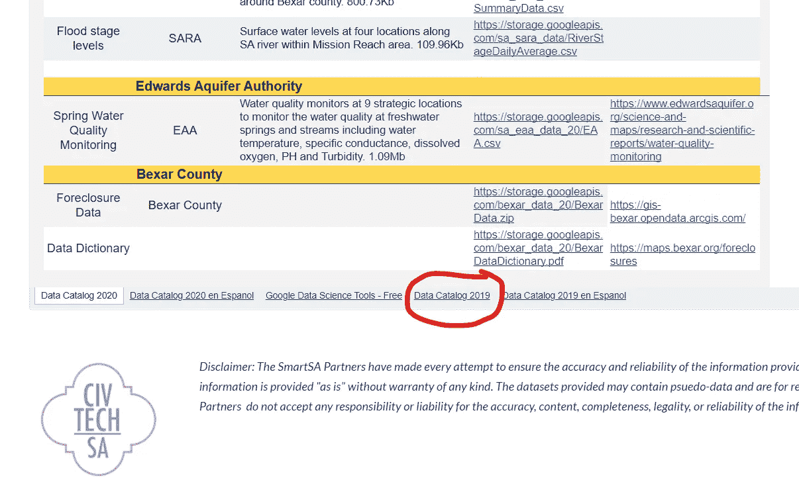

截图作者[edn alin c . De Dios](https://medium.com/@ednalyn.dedios)

通过点击 Excel 文件的链接下载文件。

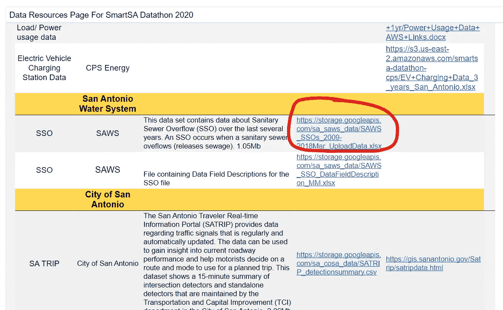

截图作者[edn alin c . De Dios](https://medium.com/@ednalyn.dedios)

或者，你可以点击[这个](https://www.google.com/url?q=https://storage.googleapis.com/sa_saws_data/SAWS_SSOs_2009-2018Mar_UploadData.xlsx&sa=D&source=editors&ust=1613195846105000&usg=AFQjCNFBBdt75RgeqV-MrecZfdJEdOhOFw)。

# MapQuest API 密钥

前往[https://developer.mapquest.com/](https://developer.mapquest.com/)并创建一个账户以获得一个免费的 API 密匙。

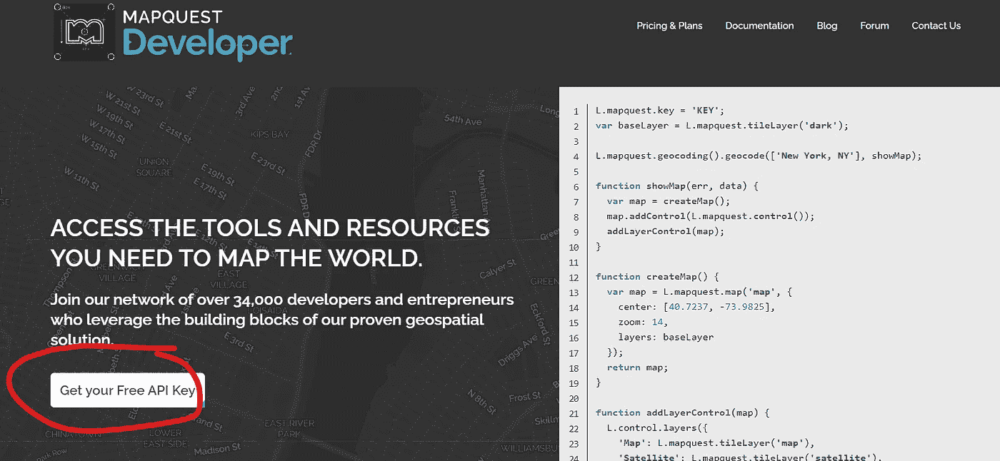

截图来自[edn alin c . De Dios](https://medium.com/@ednalyn.dedios)


截图来自[edn alin c . De Dios](https://medium.com/@ednalyn.dedios)

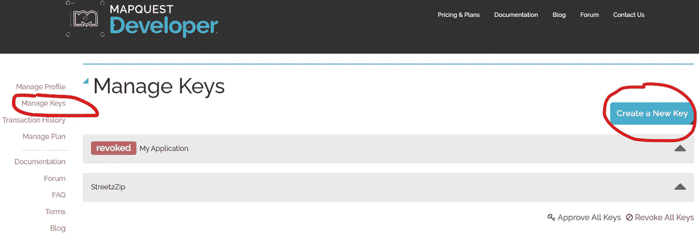

截图来自[edn alin c . De Dios](https://medium.com/@ednalyn.dedios)

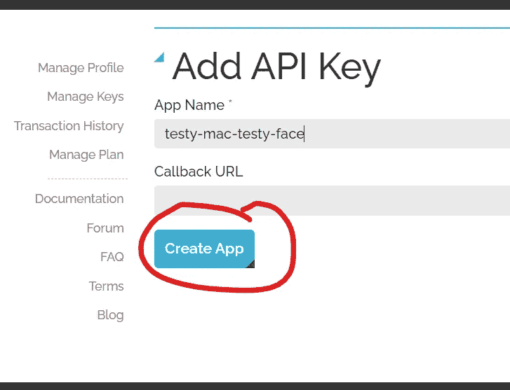

截图来自[埃德纳林·c·德·迪奥斯](https://medium.com/@ednalyn.dedios)

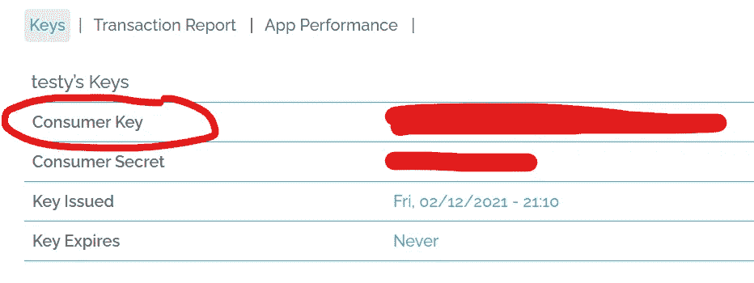

截图来自[埃德纳林·c·德·迪奥斯](https://medium.com/@ednalyn.dedios)

复制“消费者密钥”并将其保存在安全的地方。我们以后会需要它。

# Jupyter 笔记本

现在，让我们打开 Jupyter 笔记本，开始编码吧！

首先，让我们通过几个导入来设置环境。

不要忘记用上面您自己的密钥替换 API_KEY(第 12 行)。

现在。我们用一个简单的`df = pd.read_excel()`来读取 Excel 文件。

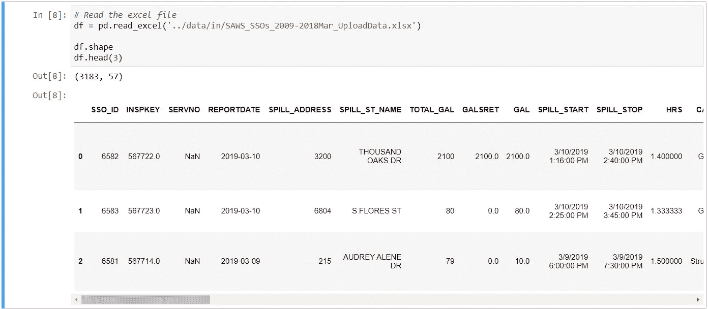

截图来自[埃德纳林·c·德·迪奥斯](https://medium.com/@ednalyn.dedios)

接下来，我们将合并街道编号和街道名称列。

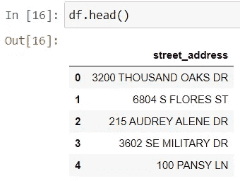

截图作者[edn alin c . De Dios](https://medium.com/@ednalyn.dedios)

所有的大写字母刺痛了我的眼睛。让我们做点什么:

```
df['street_address'] = df.street_address.str.title() .
```

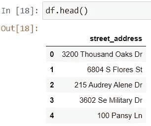

截图作者[edn alin c . De Dios](https://medium.com/@ednalyn.dedios)

下面是两个调用 API 并返回地理数据的函数。

我们可以用下面这条线手动调用它。不要忘记用您自己的 API 键替换' ##### '。您可以使用任何想要的地址(用+字符替换空格)。

```
get_zip('[https://www.mapquestapi.com/geocoding/v1/address?key=####################&inFormat=kvp&outFormat=json&location=](https://www.mapquestapi.com/geocoding/v1/address?key=Zd5jr3WZm1PbGobgPDHzLz9LEFDaco1V&inFormat=kvp&outFormat=json&location=3403+Kildare+Ave&thumbMaps=false&delimiter=%2C')100+ Military+Plaza[&thumbMaps=false&delimiter=%2C'](https://www.mapquestapi.com/geocoding/v1/address?key=Zd5jr3WZm1PbGobgPDHzLz9LEFDaco1V&inFormat=kvp&outFormat=json&location=3403+Kildare+Ave&thumbMaps=false&delimiter=%2C'))
```

但是我们有很多地址，所以我们将使用一个循环来重复调用 API。

让我们看看结果是什么样的:

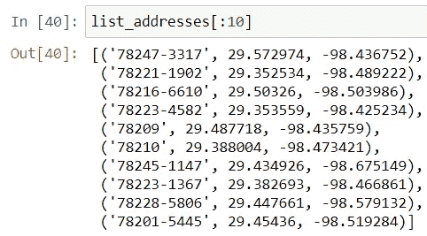

截图来自[edn alin c . De Dios](https://medium.com/@ednalyn.dedios)

最后，让我们创建一个包含街道地址的数据帧——包括邮政编码、纬度和经度。

瞧啊。我们有自己的地理数据。

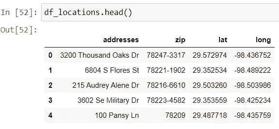

截图来自[edn alin c . De Dios](https://medium.com/@ednalyn.dedios)

为了额外加分，让我们将数据导入 Tableau 并获得一个漂亮的视觉效果:

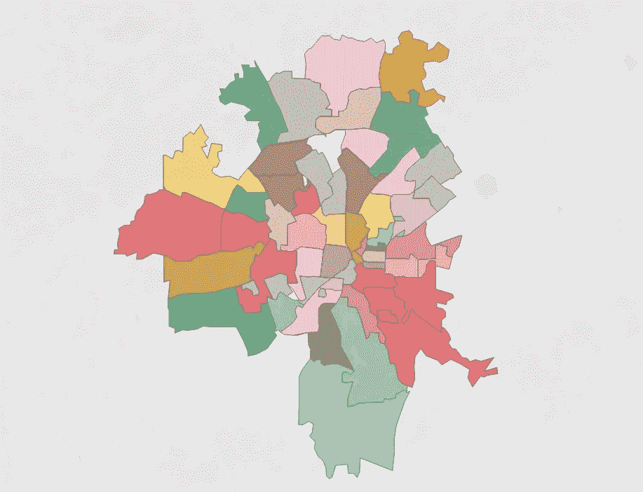

截图来自[edn alin c . De Dios](https://medium.com/@ednalyn.dedios)

就这样，伙计们！

你可以在这里找到 jupyter 笔记本。

谢谢你过来看我的帖子。希望对你有用:-)

*如果你想了解更多关于我从懒鬼到数据科学家的旅程，请查看下面的文章:*

[](/from-slacker-to-data-scientist-b4f34aa10ea1) [## 从懒鬼到数据科学家

### 我的无学位数据科学之旅。

towardsdatascience.com](/from-slacker-to-data-scientist-b4f34aa10ea1) 

*如果你正在考虑改变方向，进入数据科学领域，现在就开始考虑重塑品牌:*

[](/the-slackers-guide-to-rebranding-yourself-as-a-data-scientist-b34424d45540) [## 懒鬼将自己重塑为数据科学家指南

### 给我们其他人的固执己见的建议。热爱数学，选修。

towardsdatascience.com](/the-slackers-guide-to-rebranding-yourself-as-a-data-scientist-b34424d45540) 

*敬请期待！*

你可以通过 [Twitter](https://twitter.com/ecdedios) 或 [LinkedIn](https://www.linkedin.com/in/ednalyn-de-dios/) 联系我。