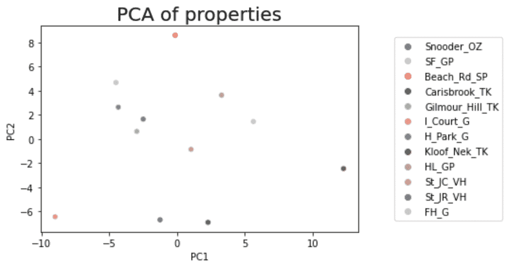
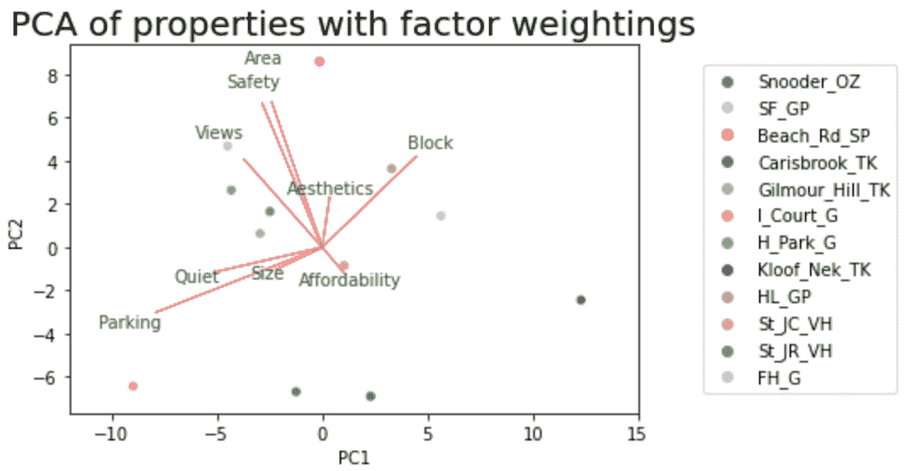

# 运用数学思维寻找完美公寓

> 原文：<https://towardsdatascience.com/using-mathematical-thinking-to-find-the-perfect-apartment-e421c6e621fb?source=collection_archive---------8----------------------->

## 面对铺天盖地的选择，我用数学思维来增强我的决策能力，并在一周内找到了完美的公寓。

照片由 [Pexels](https://www.pexels.com/photo/green-2-seat-sofa-1918291/?utm_content=attributionCopyText&utm_medium=referral&utm_source=pexels) 的 [Chait Goli](https://www.pexels.com/@chaitaastic?utm_content=attributionCopyText&utm_medium=referral&utm_source=pexels) 拍摄

经过几个月紧张的面试，我在一家令人兴奋的公司获得了一个优秀的数据科学职位。2020 年，我回到学校攻读数据科学硕士学位，并准备安顿下来，现在我正在寻找一个令人敬畏的公寓。为了帮助我在最短的时间内找到最好的地方，我为我要看的公寓创建了一个简洁的测量工具，然后计划用它来找到最好的一个。此外，作为一个数据呆子，我做了一点额外的分析只是为了好玩。运用这种方法的很多灵感来自于阅读《思考，快与慢》，并试图在我的思考中避免走捷径。本文中使用的所有数据都来自我在查看每套公寓时进行的一项简短调查。

这篇短文介绍了一种将数据带入决策过程的简单方法，希望这里的想法对你更有用，而不只是在你下次必须做出重大决定时列出利弊清单。它没有描述一种寻找完美地点的复杂方法，但强调了一种为原本可能是情绪主导的决定增加定量思考的方式。它还展示了如何使用数据科学工具包中的两个工具来可视化自己收集的数据，以解决他们自己的个人问题。

# 如何比较属性？

一开始，我想知道房地产对我来说有哪些重要特征。考虑到这一点，并考虑到我看到的第一批房产后的轻微调整，我决定列出对我来说最重要的九个因素。然后，我通过一项调查，从 1 到 10 对每个特征进行评分。值得注意的是，并不是所有的功能都是平等的。我需要将它们分为“保健”因素和“激励因素”。这种思维方式基于工业心理学中的一种理论，叫做“双因素理论”。要点是，在卫生项目上得分很低可能会对我的日常生活产生更大的负面影响，而在激励因素上得分较高则不会产生明显的影响。我也倾向于从公寓广告中了解公寓的激励因素，所以它们的变化小于卫生因素，而卫生因素只有在我看公寓时才能观察到。我用字母(H)表示健康因素，用字母(M)表示激励因素

*   负担能力(百万)
*   停车(H)
*   安全(H)
*   安静(H)
*   尺寸(米)
*   街区(H)
*   面积(H)
*   美学(M)
*   视图(M)

现在，这里有一些事情需要考虑。很多这些都是主观的衡量，例如，“美学”或“观点”，然而这些东西对我来说非常重要，我需要一些方法来比较这些属性。其次，这些数据中的一部分可能是通过更复杂的手段收集的。例如,“安全”可能包含该区域的犯罪统计数据，以及一些与安全警卫和安全级别(如围栏)相关的分类变量。我不认为这种详细程度对于帮助我做出更好的决策是必要的——将它添加到模型中的 ROI 会非常低。最后，在计算每套公寓的得分时，我将卫生因素的权重定为 2，将激励因素的权重定为 1，因为它们对我认为它们会带来的幸福水平的影响是不平衡的。

使用可靠的旧谷歌表，我把一组简单的加权分数放在一起，取平均值。对我来说有趣的是，我真的被困在 H. Park (G)和 HL (GP)公寓之间，但结果显然倾向于 H. Park。我设法在最后一分钟多看了一次，FH (G)显然是赢家，也是我最终选择的。

每个公寓的每个特征的分数，其中每个特征被从 1 到 10 评级，然后乘以其相关的卫生或激励因素权重；作者图片

# 变得更专业一点

作为一个书呆子，数据科学家，我决定看看数据中的两件事。首先，我对不同因素之间的相关性感兴趣。这里有一个非常基础的笔记本，如果你想亲自查看或使用代码，你可以去看看。

特征相关矩阵；作者图片

不出所料，负担能力与其他一切都呈负相关；花更多的钱可以买到更好的公寓。最好的公寓楼有最差的停车位。更好的地区也往往更吵，有更小的公寓，也更安全——尽管肯定更贵。停车似乎也与良好的视野负相关。

我还想对数据进行一点主成分分析，看看公寓是否自然地聚集在一起。我没有得到我期望看到的结果，然而有趣的是，通常得分低(平均)的公寓在图表的底部。鉴于我对公寓的记忆，我不认为它们能在这个二维空间中形成有意义的集群。然而，看看非线性降维方法会产生什么是有趣的。

公寓的主要组成部分；作者图片

我通过查看因子权重进一步研究了 PCA 的减少情况。显而易见，安全性和面积高度相关。就公寓的定位而言，图表下半部分的街区更实惠，但在其他功能上的权重较低；考虑到上面的相关图，这并不奇怪。

主成分和因子权重；作者图片

这里值得注意的是，我故意没有缩放数据，尽管我确实把它放在了中间。我没有对数据进行缩放，因为保健和激励变量的缩放差异很大，我不想从数据中删除这种差异。

# 结论

这项研究最有价值的方面是，它有助于用数字显示我特别感兴趣的公寓之间的差异，并有助于决策过程。对我来说，能够运用一种定量的方法来解决一个主要由直觉驱动的问题也很有趣。有趣的是，一些我在看过之后不会真正考虑的公寓实际上得分并不太差，但仍然不在得分的前一半。我认为可以对流程进行更多的改进，但我认为这是一个迭代过程，我将来肯定会对我做出的决策应用类似的方法。