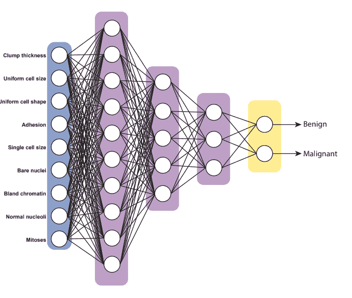
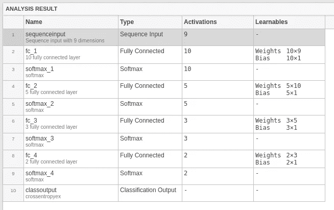
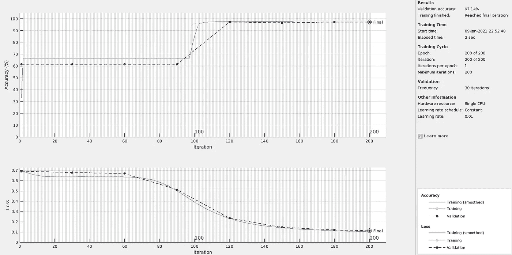
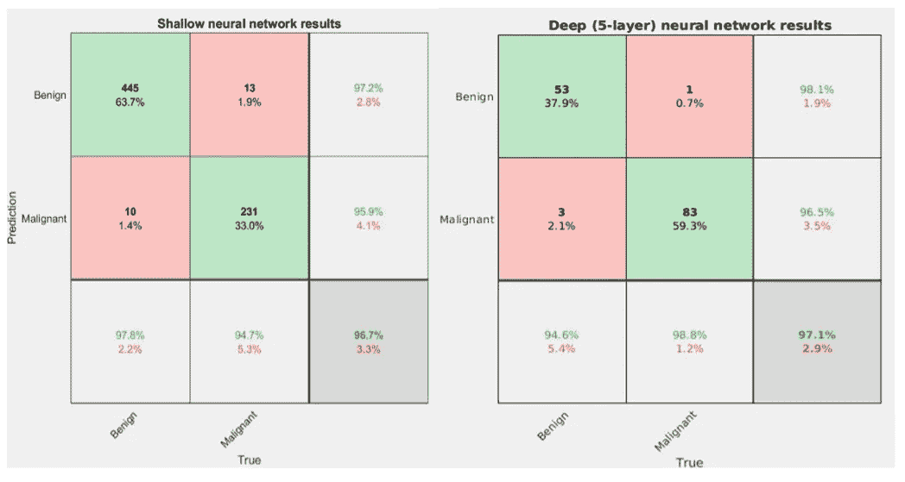

# 使用 MATLAB 的深度学习工具箱|第 2 部分

> 原文：<https://towardsdatascience.com/using-matlabs-deep-learning-toolbox-part-2-b461d7457eb5?source=collection_archive---------16----------------------->

## 使用乳腺癌成像数据训练深度前馈神经网络

艾莉娜·格鲁布尼亚克在 [Unsplash](https://unsplash.com?utm_source=medium&utm_medium=referral) 上的照片

**概述**

在这个 3 篇文章系列的第一部分中，我们介绍了 MATLAB 的[深度学习工具箱](https://www.mathworks.com/products/deep-learning.html) (DLT)，用于训练关于乳腺癌恶性肿瘤数据的浅层神经网络分类器。

如果您想回顾第 1 部分，这里有该文章的链接:

 [## 使用 MATLAB 的深度学习工具箱|第 1 部分:使用浅层神经预测癌症恶性程度…

### 深度学习入门实用指南

towardsdatascience.com](/using-matlabs-deep-learning-toolbox-part-1-predicting-cancer-malignancy-using-shallow-neural-68daa7b34981) 

在本文中，我们将在 MATLAB 内置的同一个[乳腺癌威斯康星州(诊断)数据集](https://archive.ics.uci.edu/ml/datasets/Breast+Cancer+Wisconsin+(Diagnostic))上训练一个深度前馈神经网络。

照片由[凯蒂·罗德里格斯](https://unsplash.com/@katertottz?utm_source=medium&utm_medium=referral)在 [Unsplash](https://unsplash.com?utm_source=medium&utm_medium=referral) 上拍摄

**为什么要用 MATLAB 和深度学习工具箱？**

MATLAB 不会付钱让我(叫我 MathWorks)去检查他们的工具箱。但是，我认为更多的初学者应该使用 MATLAB 入门深度学习的原因并不是最终构建一个将要大规模部署的 AI 应用。

相反，**这篇文章旨在展示训练神经网络所必需的一些实际考虑，而不会陷入每个组件的细节**。

通过这种方式，我的希望是在你的人工智能项目中快速起步并边走边学。

弗兰基·查马基在 [Unsplash](https://unsplash.com?utm_source=medium&utm_medium=referral) 上拍摄的照片

如果你想知道为什么我认为 MATLAB 是从非编程背景开始学习数据科学的编程语言，你可以阅读我写的这篇文章:

 [## 为什么我选择 MATLAB 学习数据科学

towardsdatascience.com](/why-i-chose-matlab-for-learning-data-science-4f5e4650dce9) 

# 乳腺癌数据集的描述

首先，我将简要描述数据集，它是从 699 个活检中获得的。 **cancerInputs** 变量中的每个特征描述了细胞属性(粘附、大小、形状)。

**cancerTargets** 变量被编码成 0 和 1，描述细胞是良性的(0)还是恶性的(1)。我们需要确保输出的数据类型是分类变量。

与浅层神经网络函数相比，没有内置的方法可以自动将数据分为训练集、测试集和验证集，MATLAB 也没有自动完成这一任务的函数。

我写了一个模仿 scikit-learn 的[**train _ test _ split**](https://scikit-learn.org/stable/modules/generated/sklearn.model_selection.train_test_split.html)**()**函数的函数，叫它……嗯，**trainttestsplit()**。该功能概述如下:

我们将首先使用这个**trainttestsplit()**函数分割训练和测试数据。

**注意**特征应横跨行，样本应横跨列。此外，数据类型需要转换为分类类型。最后，对于我们的二元分类任务，我们将只使用其中一个目标标签。

# 设置网络架构

我们将使用以下神经网络架构训练一个 5 层深度前馈神经网络:

我们将要训练的 5 层神经网络结构的示意图。请注意，输出图层是一个包含布尔值的单一矢量，表示我们预测的两种癌症状态(良性/恶性)。这个塑像是由斯科特·坎皮特设计的。

与我们的浅层神经网络分类器相比，我们需要在该网络架构中指定 4 个组件，如下所述:

1.  **输入数据层:**在输入数据集中调用管道的函数因输入的数据类型(如 2D 数值、张量等)而异。).对于我们的数据集，需要使用 **sequenceInputLayer()** 函数，需要将要素的数量作为参数。
2.  **隐层**:设计一个全连接的前馈神经网络，我们需要调用 **fullyConnectedLayer()** 函数，该函数需要将激活节点数作为第一个参数。 **WeightsInitializer()** 和 **BiasInitializer()** 参数解释了如何初始化权重和偏差参数。在下面的代码中，我们指定使用正态分布的小随机数来打破对称。
3.  **激活函数:**每个隐藏层之间是激活函数。虽然我们可以使用交叉熵层进行二元分类，但是我们也可以使用 **softmaxLayer()** 函数，该函数可以推广到多类分类问题。
4.  **分类层**:**分类层()**将概率解码成它们预测的标签。

我们将这些组件存储到变量**层**中:

对于 MATLAB 中可用的不同层对象的描述，您可以查看[文档](https://www.mathworks.com/help/deeplearning/ug/list-of-deep-learning-layers.html)。

# 网络架构的健全性检查和调试

从这里，我们应该停下来，看看我们是否有正确的架构，以及是否有任何潜在的警告或问题会导致培训阶段失败。

我们可以使用[**analyze network**](https://www.mathworks.com/help/deeplearning/ref/analyzenetwork.html)**()**函数，该函数接受我们刚刚设置的 layers 变量并可视化网络架构。

该函数输出一个表格，显示我们刚刚指定的层的概要以及网络中的参数数量。

analyzeNetwork()函数的汇总表，显示了层类型、每层中的节点数量以及模型正在学习的参数数量。

# 指定训练和超参数

接下来，我们必须指定模型超参数。 [**训练选项**](https://www.mathworks.com/help/deeplearning/ref/trainingoptions.html) **()** 函数创建一个模型对象，让您将超参数输入神经网络函数。

我们将使用的具体参数如下所示。

用于模型训练的附加超参数选项可在[这里](https://www.mathworks.com/help/deeplearning/ref/trainingoptions.html)找到。

# 训练 DNN

最后，让我们使用[**train network**](https://www.mathworks.com/help/deeplearning/ref/trainnetwork.html?s_tid=doc_ta)**()**函数来训练神经网络，该函数允许我们训练其他深度神经网络架构。

有关使用此功能训练的其他神经网络的更多信息，您可以[阅读文档](https://www.mathworks.com/help/deeplearning/ref/trainnetwork.html)。

该函数还输出一个图形，显示模型实时训练时的精度和成本曲线。该图如下所示。

trainNetwork()函数输出的训练记录。该图显示了作为时期函数的精确度(顶部)和成本(底部)曲线。这个图形用户界面在模型训练期间弹出。

从该图中可以得出的主要结论是，成本在 200 个历元时收敛到最小值。如果我们增加历元的数量，有证据表明模型开始过度拟合。

# 用深度神经网络做预测

为了使用深度神经网络模型进行预测，我们可以使用内置的[**classify**](https://www.mathworks.com/help/deeplearning/ref/seriesnetwork.classify.html)**()**函数，该函数返回给定验证集的目标标签。

# 针对浅层神经网络的基准模型结果

在第 1 部分中，我们训练了一个浅层神经网络，并根据验证集评估了它的性能。

让我们通过并排绘制混淆矩阵来看看我们更深层次的神经网络是否比浅层次的更好。

在 MATLAB 中生成混淆矩阵的代码如下所示:

将浅层神经网络(准确率:96.7%)与 5 层神经网络(准确率:97.3%)进行基准测试。

5 层神经网络稍微增加了我们的乳腺癌分类任务的准确性。

在这种情况下，我们正在观察深度神经网络的一个普遍趋势:**增加神经网络的深度和节点数量往往会提高精度。**

[粘土堤](https://unsplash.com/@claybanks?utm_source=medium&utm_medium=referral)在 [Unsplash](https://unsplash.com?utm_source=medium&utm_medium=referral) 上拍照

# 超参数调优呢？

MATLAB 中有对深度神经网络进行贝叶斯超参数整定的方法。然而，这个过程更复杂，将在以后的文章中更深入地讨论。

# 摘要

我们将深度前馈神经网络添加到我们的深度学习工具中，并发现它提高了我们对患者是否患有良性或恶性肿瘤进行分类的能力。

但是，您可能已经注意到，我们一直在使用数值数据对肿瘤成像数据进行分类。如果我们想使用原始图像本身呢？

在下一篇文章中，我们将在图像上训练一个卷积神经网络来预测肿瘤致病性。

克里斯汀·休姆在 [Unsplash](https://unsplash.com?utm_source=medium&utm_medium=referral) 上拍摄的照片

# 我们谈谈吧！

如果你想**分享你是如何在你的项目中实现深度神经网络的，或者只是想打个招呼**，请在下面的评论中留下你的回复。

此外，请随时通过 LinkedIn[联系我——我很乐意与你联系并讨论所有书呆子的事情！](https://www.linkedin.com/in/scottcampit/)