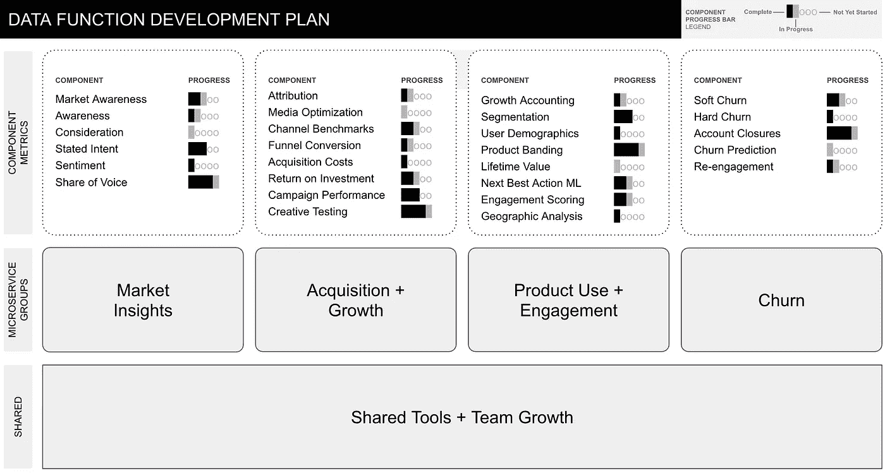
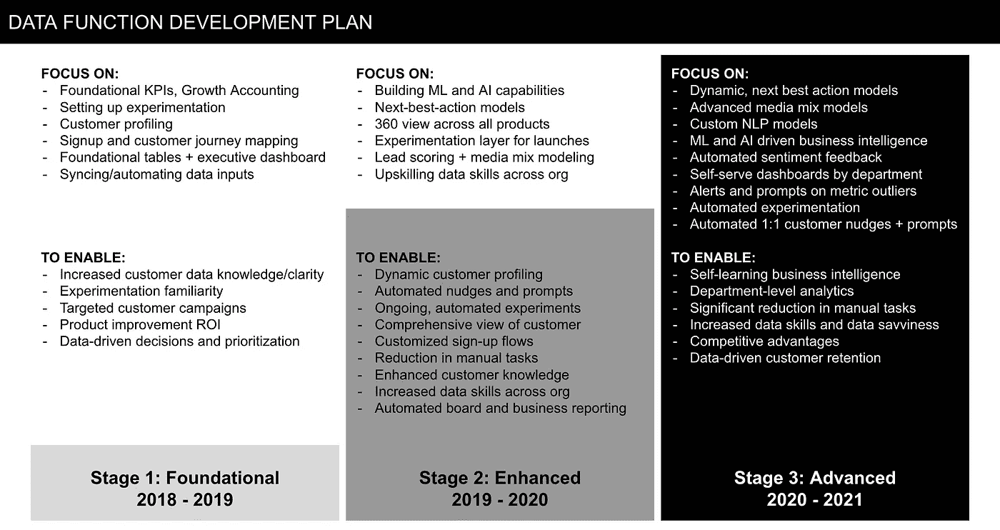

# 使用微服务构建和扩展数据功能

> 原文：<https://towardsdatascience.com/using-microservices-to-build-and-scale-data-functions-28d47f400419?source=collection_archive---------13----------------------->

## [行业笔记](https://towardsdatascience.com/tagged/notes-from-industry)

## 微服务是我构建灵活有效的数据功能的首选框架。以下是我学到的方法和内容。

来源:Unsplash，照片由[米赛尔·莫雷诺](https://unsplash.com/@moreno303)拍摄

数据团队是一个专业的业务职能部门，在决策中利用数据和见解。

在我的职业生涯中，到目前为止，我已经建立了两个数据团队。首先是在 [Instagram](http://instagram.com) 上建立决策科学功能。这是一个职责广泛的重要角色。我们支持世界各地的业务团队。我们实施了一系列工具，如仪表盘和机器学习程序。我们还支持预算规划，为全球战略提供信息，并提出产品建议。

现在，我回到 fin-tech 初创公司[spacex](http://spaceship.com.au)建立数据和分析业务。两家截然不同的公司，两种截然不同的资源。

在这两个例子中，我发现使用微服务架构作为我的框架来编写数据功能计划和扩展团队是成功的。

我想分享一下我是如何在构建数据团队中部署微服务方法的，以及在此过程中的一些收获。

## 微服务架构快速介绍

如果你已经知道这个东西，请跳过它。

微服务架构是一种应用于服务或应用的架构以及代码编写的方法。

微服务架构背后的基本前提是——将大型复杂的业务问题(如应用程序或服务)分解成较小的、**很大程度上独立的**组件。

这些组件通过共享功能**“松散耦合”在一起**，例如表格、定义或公式。但是，在大多数情况下，组件是独立运行的。这意味着一个组件的问题或中断不会影响其他组件，一个小问题也不会影响整个服务。

这与整体架构正好相反，在整体架构中，所有的东西都在一个地方并且相互关联。相反，微服务是独立的，但仍然一起工作来完成相同的任务。例如，在线商店搜索栏可能是一个组件，而“由他人推荐”可能是另一个组件。

关于微服务架构的更多信息，[我发现这个来自软件服务公司 Red Hat](https://www.redhat.com/en/topics/microservices/what-are-microservices#overview) 的概述很容易理解。

## 循序渐进的方法

这些是我根据微服务方法创建数据功能计划和策略时遵循的主要步骤。

第一步——了解业务。

我从深入了解业务开始。

我试图理解广泛的商业动态，商业和产品的经济学。

我观察了广泛的用户行为和用户旅程，从认知到获得再到使用再到流失的漏斗(有漏斗吗？)以及更广泛的市场动态(竞争对手、市场变化、人口采用等)。

这些见解是我接下来工作的基础。

**第 2 步—概述微服务组。**

然后我概述了微服务组。这些组将成为单个组件度量和洞察的集合(参见步骤 3)。我将这些组与业务设置紧密关联。

以宇宙飞船为例。我们有一个线性漏斗。人们了解了宇宙飞船。如果他们感兴趣，他们就签约，他们存一些钱用于投资，并通过存款和经常性投资来增加这些钱。最后，一些人关闭了账户。

所以我的微服务团队很简单:

1.  市场洞察
2.  收购和增长
3.  产品使用和参与
4.  搅拌

**第三步——定义组件。**

接下来，我概述了新数据功能将在每个微服务组中提供的组件指标，以支持业务领导者。

“市场洞察”组中的示例组件包括:行业趋势、品牌(和竞争对手)认知度、品牌考量、意向和品牌情感。

“获取和增长”微服务组的示例组件包括:归因、归因模型、媒体优化、媒体渠道基准(CPM、CPC 等)和漏斗转换百分比。

你会注意到有很多成分。一些复杂的需要专家工作或建模，一些更简单。因此，每个组件都有自己的开发计划和改进清单。

**步骤 4——定义共享工具。**

快速回顾—此时，我列出了我的微服务组和组件。接下来，我概述了许多组件会使用的共享工具。定义这些共享工具有助于减少工作量，简化 SQL 代码并防止数据管道重复。他们还帮助企业中的每个人分享对某些指标和数据类别的共同理解。

共享数据工具包括标准化定义、标准化公式和标准化类别。

一些示例包括:客户平衡的标准化范围、年龄范围和性别等关键人口统计标签、增长会计范围、软流失与硬流失的定义以及一些产品级别的定义。

**第 5 步——盘点和起草。**

此时，我已经为我的新数据功能建立了微服务组、组件指标和共享工具/功能。

接下来，我对我的微服务进行了盘点，以查看已经可用的微服务，并为每个组件起草了开发步骤。

具体来说，我在看:

*   我可以重新利用企业中其他地方的资源，
*   每个组件所需的开发和改进水平，
*   眼前的业务优先级(确定交付什么组件和优先级顺序)

例如，在 Spaceship，表格中已经有了“参与”客户的定义。但是客户流失的定义不可用。所以客户流失的定义是我们建立的。

在 Instagram，人口分组和细分工作已经完成，并由中央数据科学团队提供。所以我们不需要建造这些。但是本地化分析不可用，所以这是我们建立的东西。

第六步——敲定计划。

在流程的这一点上，我有了我的微服务组、组件指标、共享工具，以及对业务和开发步骤中已经可用的东西的理解。

我收集了所有这些信息，并最终确定了我的发展计划。

我用两张幻灯片写了这个计划。一张幻灯片显示了微服务组、组件和组件进度。第二张幻灯片显示了 1 年、2 年和 3 年的计划进度，突出了将通过数据团队交付给企业的广泛关注领域和数据功能。

以下是我总结计划的一个例子:

作者提供的图片—仅作为示例

作者提供的图片—仅作为示例

*注意——这些幻灯片仅供说明之用，已经过编辑，删除了敏感信息，并经过简化以适应本媒体。*

除了上面显示的这些概述幻灯片之外，该计划还得到包含更多详细信息的项目管理表、用于管理“待办事项”列表项目进度和人员/角色规划的 JIRA 委员会的支持。

**第七步——回顾、重复、改进、再回顾。**

接下来，我制定了一个时间表，每半年回顾一次计划。当业务发生重大变化时，我还会审查该计划。在评估过程中，我重点关注:

*   需要升级的组件，因为工作已经完成，组件已准备好进入下一阶段。
*   本可以更高效的组件或增长过大的组件需要拆分成新的组件。
*   我的数据功能不再需要或不再需要支持的组件或微服务。

我还利用评审时间向业务部门展示更新的计划，并提醒领导层计划和交付时间表。

## 使用微服务架构构建数据团队的优势

乍一看，可能很容易将微服务的前提过于简单化。“只是把东西分解成小块？就这样？”但是事情远不止如此。

对数据功能采用微服务方法带来了许多好处，我总结如下:

1.  结构化、层次化的思维方法——从业务理解到微服务组再到组件指标——让整个功能构建过程感觉**可管理、结构化且清晰**。
2.  事实上，每个组件、每个开发步骤和每个微服务组都**与一个业务功能**联系在一起，这意味着这些计划得到了整个业务的广泛支持，并被广泛理解。每个业务领导都可以看到他们将获得的具体指标以及如何使用每个指标。
3.  在业务中寻找**共享的定义和共享的工具**(比如公式)确保了数据功能不会重复工作，并且工作与业务中的其他领域保持一致。
4.  微服务方法鼓励**交付思维***——也就是说，它鼓励向业务交付组件指标，逐步向业务领导推出工具和见解，并关注持续的指标改进以支持业务。*
5.  *与此相关的是，它为每个组件和每个微服务组提供了一种勾勒清晰开发计划的方式。从那时起，这就是一个简单地执行计划并推动每个团队改进的案例。*
6.  *微服务范围带来了独立的数据管道、特定于组的代码库、独特的表格和专用的仪表板，从而**提高了商业智能的连续性**，更快地发现故障和问题，确保表格故障仅影响一小部分组件，并加快了开发速度。*
7.  *最后，我发现微服务方法**非常灵活**,并成功地将其用于较小规模的项目(如活动测量),直到构建本文中概述的完整数据团队。*

*考虑到工作的艰巨性，两次建立数据函数的任务既令人畏惧又令人兴奋。然而，我发现使用微服务方法有很多好处。*

*微服务架构帮助我组织工作，使任务变得非常容易管理。它给了我一个灵活的框架，一个集中我的计划的方法和一个建立有效数据功能的过程。*

*我鼓励任何管理复杂数据项目或组建数据团队的人将微服务概念视为潜在的辅助手段。*