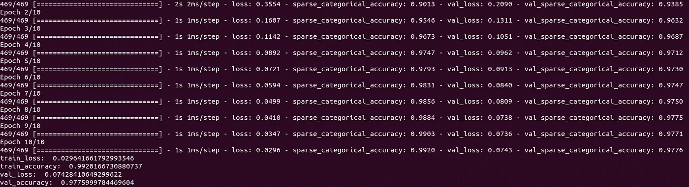
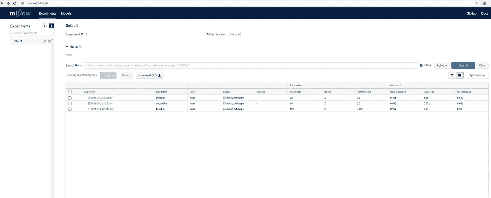
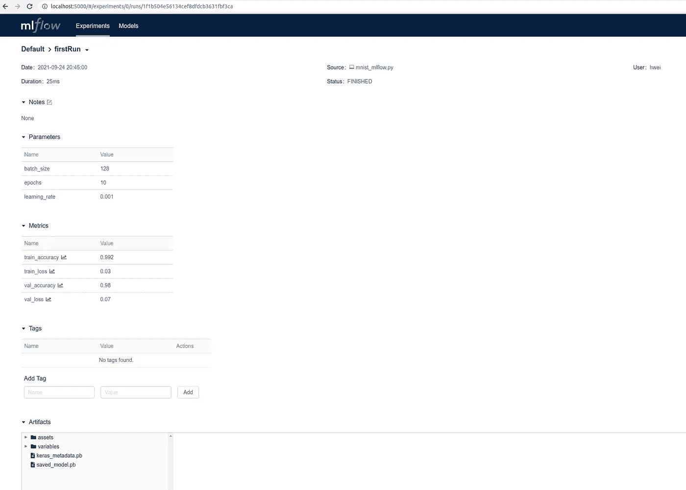

# 使用 MLFlow 跟踪和版本化机器学习模型

> 原文：<https://towardsdatascience.com/using-mlflow-to-track-and-version-machine-learning-models-efd5daa08df0?source=collection_archive---------11----------------------->

## 循序渐进的编码实践

当我们调整机器学习模型的参数时，我们可能需要多次训练它，以便选择最佳模型。如果训练次数过多，我们可能会遇到两个问题。

*   我们如何跟踪每个模型的参数和度量？将它们手动写入 excel 文件？那将是乏味且容易出错的。
*   我们如何对每个模型进行版本控制？用不同的名字保存到磁盘上？很难记住哪个模型来自什么参数。

[MLFlow](https://mlflow.org/) 正是我们解决这些问题所需要的。它是一个强大的 MLOps 工具，用于 ML 模型跟踪、版本控制、打包等等。在这篇博客中，我们将关注跟踪和版本控制。关于跟踪，MLFlow 可以跟踪参数、度量和模型。关于版本控制，MLFlow 将模型存储在一个模型注册表中，然后用户可以很容易地选择一个特定的版本。

MLFlow 可以在本地运行或从 docker 容器运行，也可以部署到 kubernetes。它有 Python、Java、R 和 REST 的 API。

在这篇博客中，我们将展示如何使用 mlflow 来跟踪和版本化 mnist 分类模型。我们将首先使用 tensorflow 运行一个 MNIST 示例，然后扩展代码以集成 mlflow。


图片来自[Unsplash](https://unsplash.com/photos/6EnTPvPPL6I)is AAC Smith

**MNIST 的例子**

首先创建一个虚拟环境，pip 安装 tensorflow 和 mlflow。

```
# my version is 2.6.0
pip install tensorflow
# my version is 4.4.0
pip install tensorflow_datasets
# my version is 1.9.1
pip install mlflow
```

下面是使用 tensorflow 运行 mnist 分类的代码。

张量流中的 MNIST 分类

运行代码，您应该会看到如下所示的日志。它还将模型保存在模型文件夹中。



mnist.py 的日志(图片由作者提供)

**物流跟踪**

现在，让我们跟踪参数、度量以及工件(模型)。见下面的代码，(也见底部的完整代码)。首先，我们需要命名一次跑步。如果我们愿意，我们甚至可以命名一个实验(更高级别的运行)。然后，我们使用函数`log_param`、`log_metric`和`log_artifacts`来记录参数、度量和工件。

```
import mlflowwith mlflow.start_run(run_name=run_name):
  mlflow.log_param("batch_size", batch_size)
  mlflow.log_param("learning_rate", learning_rate)
  mlflow.log_param("epochs", epochs)
  mlflow.log_metric("train_loss", train_loss)
  mlflow.log_metric("train_accuracy", train_acc)
  mlflow.log_metric("val_loss", val_loss)
  mlflow.log_metric("val_accuracy", val_acc)
  mlflow.log_artifacts("./model")
```

运行 mlflow 代码后，我们可以看到磁盘中有一个名为`mlruns` 的新文件夹。这是本地存储参数、指标和工件的地方。

然后，我们可以做一些参数调整，例如，改变批量大小和学习速率。每次运行都将被记录到 mlflow 中。

现在，让我们在 mlflow 的 UI 上查看所有运行。在虚拟环境中，键入:

```
mlflow ui
```

然后，在 [http://localhost:5000/](http://localhost:5000/) 浏览。我们可以看到所有运行都记录在那里。在一个页面上可以清楚地看到参数、指标和运行名称。



在 mlflow 追踪上运行(图片由作者提供)

如果我们点击一次跑步，我们可以看到关于这次跑步的更多细节。除了参数和度量，左下方的工件部分显示了我们的工件(模型)。



mlflow 运行的详细信息(图片由作者提供)

每次运行的 url 地址具有以下格式。每个实验中的运行 id 都是唯一的。

```
http://localhost:5000/#/experiments/<experiment id>/runs/<run id>
```

**MLFlow 模型版本化**

MLflow Model Registry 是存储和版本化模型的中心位置。有了它，一个模型就有了从(例如)v1，v2，…到 v10 的迭代版本。对于每个模型和版本，我们可以写一个降价描述(例如详细的参数),这样我们以后就知道这个模型代表了什么。此外，我们可以用`Staging`、`Production`或`Archived`来标记一个版本。

为了建立模型注册，我们需要一个数据库后端来存储模型，参见这里的[获取说明](https://www.mlflow.org/docs/latest/tracking.html#id12)。之后，我们可以将 tensorflow 模型上传到 mlflow 注册表。下面是一个代码示例。

```
import mlflow.tensorflow
from tensorflow.python.saved_model import signature_constantstag=[tf.saved_model.tag_constants.SERVING]
key=signature_constants.DEFAULT_SERVING_SIGNATURE_DEF_KEYmlflow.tensorflow.log_model(tf_saved_model_dir="./model",
                            tf_meta_graph_tags=tag,
                            tf_signature_def_key=key,
                            artifact_path="model",
                            registered_model_name="mnist")
```

总之，MLFlow 是一个强大的 MLOps 工具，用于跟踪和版本化机器学习模型。它支持 python、java、R 等语言的 API。通过其漂亮的用户界面，我们可以清楚地跟踪、存储和比较不同的模型版本。MLFlow 已经成为许多 ML 项目中流行的 MLOps 工具。

下面是 tensorflow 中带有 mlflow 跟踪的 mnist 分类的完整代码。

张量流中 MNIST 分类的完整代码