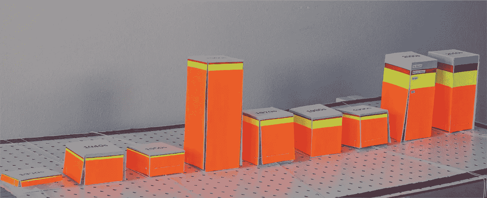
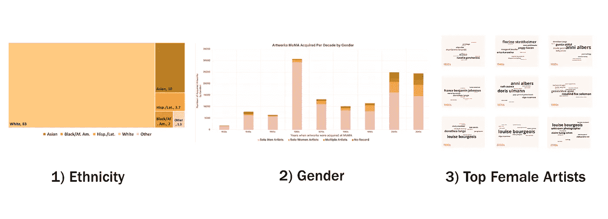
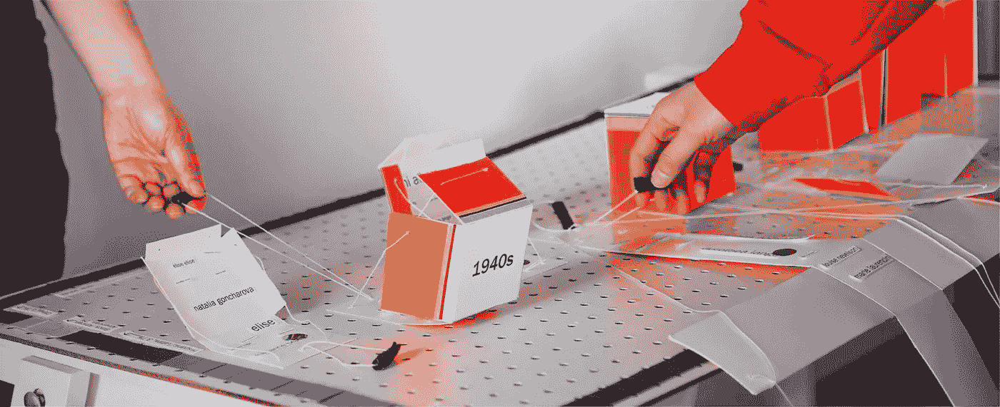
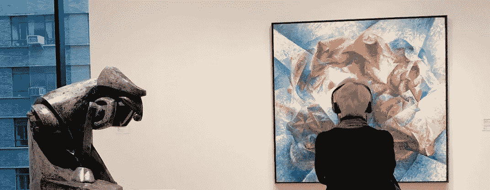
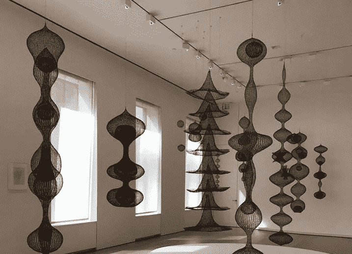
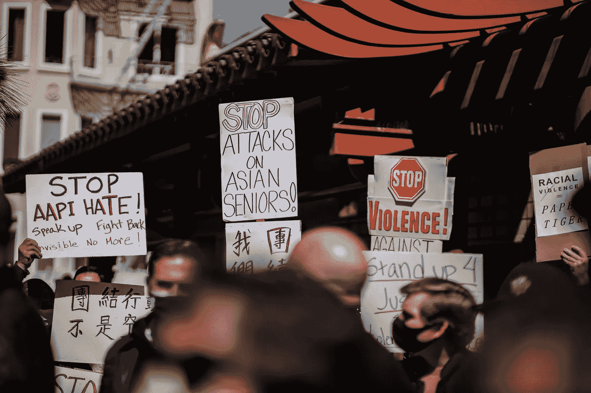

# 使用现代艺术博物馆的收藏数据集来可视化谁的故事不见了

> 原文：<https://towardsdatascience.com/using-momas-collection-dataset-to-visualize-whose-stories-are-missing-76a8960a33c2?source=collection_archive---------18----------------------->

## [数据新闻](https://towardsdatascience.com/tagged/data-journalism)

## 艺术如何影响我们对边缘群体的参考点

上面的橙色代表 MoMA 从单身白人男性艺术家那里获得的作品。图片作者。

在最近的一个班级项目中，我使用 [MoMA 在 GitHub](https://github.com/MuseumofModernArt/collection) 上发布的收藏数据集创建了一个互动装置，揭示了被放大的主导叙事。我对 MoMA 在 1930 年至 2019 年间获得艺术品的 15，222 名艺术家的性别和种族进行了细分。**我们如何将现代艺术博物馆的藏品分成几个部分来评论主流的叙事？**

## 保持机构的问责制

2019 年 9 月， [MoMA 经过紧张的改造后首次对外开放](https://www.nytimes.com/2019/10/03/arts/design/moma-renovation.html)。目标是:扩大博物馆，把“毕加索和莫奈放在更近的、多样化的艺术家旁边。”这已经成为大多数机构和公司发出的一个普遍的前瞻性信息。多元化和包容性的对话是受欢迎的，但我们很少通过行动积极创造实质性的影响。

研究论文“[美国主要博物馆艺术家的多样性](https://www.ncbi.nlm.nih.gov/pmc/articles/PMC6426178/#pone.0212852.ref031)”详细介绍了艺术博物馆馆长协会(AAMD)如何发现其成员机构中 72%的工作人员认为自己是白人。他们还揭示了领导职位中的性别差距，60%的博物馆工作人员是女性，但只有 43%的管理职位由女性担任。

艺术机构是系统的一个具体例子，这个系统曾经无情地启用与白人主导文化一致的标准。更具体地说，通过欧洲现代主义的镜头来评价艺术品。现在，恐惧正因其排他性和自命不凡的白盒基调而受到批评。MoMA 试图重新思考我们谈论和评价艺术品的方式。我想创造一种体验，来帮助说明主要的故事和完全缺失的故事。

## 抓取数据集

图片作者。

1.  **种族:**首先，我使用论文[美国主要博物馆中艺术家的多样性](https://www.ncbi.nlm.nih.gov/pmc/articles/PMC6426178/#pone.0212852.ref031)(Topez，Chad M 等人)中的数据，可视化了 MoMA 中不同种族艺术家的百分比。
2.  **性别:**我使用 MoMA 的收藏数据，提取了从 1930 年到 2019 年每十年获得的每件艺术品中不同性别艺术家的比例。我用颜色来形象化这些百分比。
3.  **前 10 名女艺术家:**从那以后，我把注意力集中在获得最多艺术品的前 10 名女艺术家身上。这是用一个视觉单词云来表示的，其中名字的大小与获得的艺术品数量相关。

# 通过体验体现数据

视频演练“谁重要？”安装。

**第一步:在你认识的名字旁边贴上尽可能多的标签。**在每张纸网上散布着在特定的十年里被 MoMA 获得最多艺术品的前 10 位女性艺术家的名字。名字越大，他们的作品就越多。获得的艺术品越多，它们占据的空间就越大。随着时间的推移，来自艺术观众的集体数据输入将揭示艺术家获得的艺术品数量是否影响他们的曝光水平。

第二步:向后拉黑色手柄。纸网形成三维形状。将显示每十年男性、女性、多位艺术家的百分比，以及未找到的性别记录。

**第三步:后退一步，查看整个棋盘。**钉板的周长用每个种族的百分比进行颜色编码。当你退后一步，绕着棋盘走一圈，主导 3D 条形图的颜色和棋盘的周长揭示了哪个群体主导了博物馆的收藏。

装置的互动性引发了参与者之间的对话。图片作者。

## 洞察力

*   随着时间的推移，最知名的女艺术家将会涌现出来。我和家人一起完成了贴纸活动。我们在认出的女艺术家旁边贴了贴纸。黑板上的名字越大(获得的艺术品越多)，我们就越有可能知道他们的作品。这也促使人们思考遗漏了哪些名字。
*   **现代艺术博物馆主要从男性和白人艺术家那里获得作品。**自 1930 年至 2019 年，MoMA 从其获得艺术品的大多数艺术家都是男性。近几十年来，女性艺术家略有增加。
*   **绕深蓝色边框(代表白人艺术家)花的时间最长。**黑人和拉丁裔艺术家的作品在纽约现代艺术博物馆的展示明显较少。绝大多数艺术家是白人。
*   这个装置的互动部分引发了参与者之间的对话。当我向家里的人演示这个装置时，这些活动促使我们反思我们最初的反应。我们互相询问我们是如何知道某个女艺术家的，并讨论了我们对 MoMA 多样性的差距有多惊讶(或不惊讶)。同时反思我们在艺术行业中的角色。

# 我们的参考点受到缺乏代表性的影响

## 淡化反亚裔情绪

我们周围的叙事中的代表性水平成为我们如何看待文化和其他边缘化群体的参考点。在 MoMA，可以说是最有影响力的博物馆之一，我们主要看到白人男性艺术家的作品。**在我们的家庭、教室和人际关系中，我们周围有哪些观点或经历？**

亚特兰大枪击案中八人丧生，其中六人是亚裔女性，这在亚裔美国人社区中造成了巨大的反感。反亚裔仇恨的增加揭示了助长种族主义、仇外心理和厌恶女性攻击的故事有多危险。无论是我们在原始博物馆看到的艺术，还是我们在网上听到的言论，这些都有助于我们与“他人”联系在一起的参考点。

例如，[《今日美国》](https://www.usatoday.com/story/tech/2021/03/24/asian-american-hate-crimes-covid-harassment-atlanta-google-facebook-youtube/6973659002/)报道称，去年秋天川普被诊断患有新冠肺炎后，反亚裔情绪上升了 85%，ADL [当时发现](https://www.adl.org/news/press-releases/adl-report-anti-asian-hostility-spikes-on-twitter-after-president-trumps-covid)。从他上任到今天，特朗普一直在困扰人们通过使用极端种族主义术语[“中国病毒](https://www.foxnews.com/politics/trump-coronavirus-china-virus-white-house-kung-flu)”来联系亚洲人的参照点。

图片作者。

## 艺术在日益喧闹的世界中的作用

博物馆为故事提供了空间。对于当代艺术来说，对所谓的“艺术”有一种松散的控制。这种控制欢迎抽象和混乱的演绎表演、装置、绘画、混合媒体、雕塑等等。这通常是对文化和社会问题的一种共同的集体理解，它让我们与某些艺术作品产生共鸣。

从我们屏幕上的内容到与他人的对话，都有越来越分裂和政治狂热的背景噪音。我们受益于参与各行各业艺术家的作品，他们的故事与我们的叙述不同。它为自己提供了一个反思和对话的机会。

## 创建真正多样化和包容性的参考点

尽管我讲述了我的背景和目前的身份，但总会有一层阴霾围绕着我。由种族主义和我的韩裔美国人血统的减少构成的阴霾。有时如此微妙，有时我告诉自己没什么可担心的。对 AAPI 社区来说，这从来就不是蓝天。

当我反思自己作为一名亚洲女性的背景和身份时，我使用的参考点是什么？我的社区在艺术、媒体、领导职位、坦诚对话等方面的表现，助长了许多基于我的种族对我的概括。通过摒弃这些有害的刻板印象，我们可以减轻边缘化群体的非人化。

## **露丝·阿莎娃变形钢丝雕塑**

4 件露丝·阿莎娃钢丝雕塑。在大卫·兹沃纳展览上看到的。[图片](https://commons.wikimedia.org/wiki/File:David_Zwirner_Exhibit.jpg)由维基百科作者 [Njdancer15](https://commons.wikimedia.org/w/index.php?title=User:Njdancer15&action=edit&redlink=1) 提供。这张图片是在[知识共享署名-共享 4.0 国际](https://commons.wikimedia.org/wiki/File:David_Zwirner_Exhibit.jpg)许可下授权的。

随着我对日裔美国艺术家露丝·阿莎娃的了解越来越多，我就越觉得她的作品与我作为一名韩裔美国人的经历相关。

在 1946 年夏天到达黑山学院之前，浅泽出生在加利福尼亚的诺沃克。她的父母是来自日本的移民，感受到了针对日本人的歧视性法律的压力。他们不能拥有土地，成为美国公民，或者梦想成为卡车农民。由于不利的经济形势和对日本人的持续歧视，浅泽在大萧条时期的成长经历和股票市场崩盘导致她的家庭陷入困境。他们被安置在两个拘留营里。

浅泽的生物形态般的线雕塑提醒我，我们的情感，无论多么强大和微弱，都不必像金属线一样僵硬和令人恐惧。相反，它们可以转变成一个通风的，动态的，令人难忘的美丽的线雕塑，展示给每个人。她的钢丝雕塑赋予抽象和杂乱的形状。

我在她的作品中感受到了一种艺术反叛，这种反叛存在于一个歧视和种族主义盛行的体系中。她追求将每一点小小的快乐都投射到自己的影子里，以此来定义自己的存在，这种追求形成了一种反叛。

[梁杰森](https://unsplash.com/@ninjason)在 [Unsplash](https://unsplash.com/photos/WVBGF0NNBBE) 上的照片。

## “靠自己的力量振作起来”的谬论

这个使用 MoMA 的收藏数据集的装置是我思考变化有多慢的一种方式。我们可以庆祝 BIPOC 社区取得的进步，但人们强烈呼吁对被系统抹去的故事进行问责和深度投资。黑人、亚洲人、拉丁人、西班牙人、土著人和非二元艺术家的观点一直存在。我们如何重新思考用来评价和思考艺术品的类别？作为观众，我们的角色是什么？

我想知道当我的祖父在 80 年代从韩国移民到波特兰时，在一家卡车工厂工作时介绍自己是什么感觉。通过证明他知道卡车的零件，他能够证明他是一个高度熟练的工人，尽管他不会说英语。他并不比那里的任何人差——这一点必须不断得到证明。

在一个行为主义的时代，我们必须后退。你的故事很重要。正如米歇尔·奥巴马在《T4》*变成* *中写道:“如果你不走出去定义自己，你会很快被别人错误地定义。”分配给边缘化群体的空间越多，我们就越能颂扬和尊重他们的文化和精彩故事。*

捐:[gofundme.com/f/support-aapi-community-fund](https://www.gofundme.com/f/support-aapi-community-fund)
幕:[stopaapihate.org/actnow](https://stopaapihate.org/actnow)
学:[anti-asianviolenceresources.carrd.co](http://anti-asianviolenceresources.carrd.co)
看:[youtube.com/watch?v=14WUuya94QE](https://www.youtube.com/watch?v=14WUuya94QE)