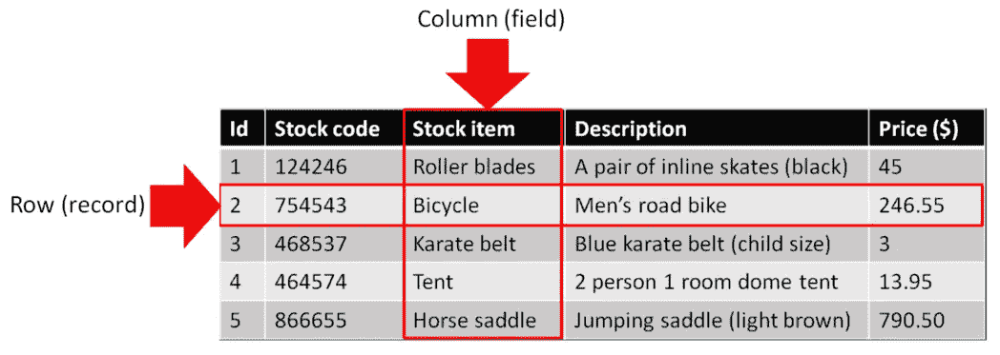
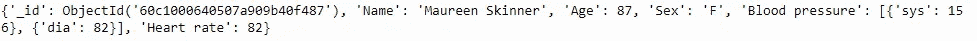
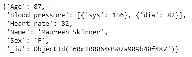
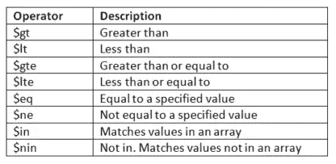
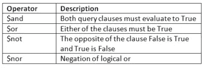
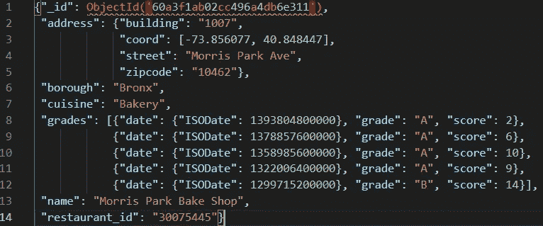
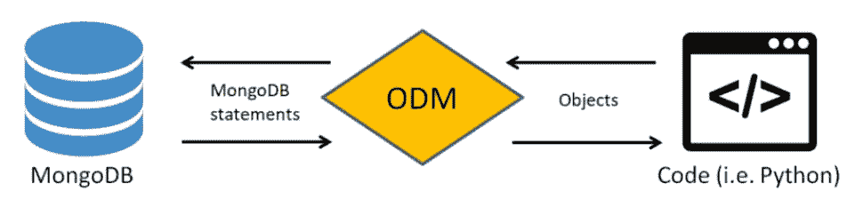
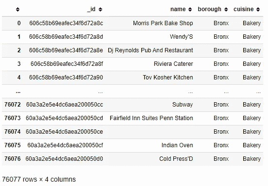

# 在 Python 中使用 Mongo 数据库

> 原文：<https://towardsdatascience.com/using-mongo-databases-in-python-e93bc3b6ff5f?source=collection_archive---------1----------------------->

## 用 PyMongo 介绍 MongoDB


(图片来自[https://www.pexels.com/](https://www.pexels.com/))

MongoDB 是一个基于文档的数据库，具有动态数据模式。它支持的 JavaScript Object Notation (JSON)非常适合使用现代编程语言(如 JavaScript、Python 等)中的对象。这为 SQL 等更传统的关系数据库管理系统(RDBMS)提供了一种替代方案。MongoDB 是 NoSQL 数据库的一个例子。这些数据库通常使用文档集合，而不是 RDBMS 中使用的表。这些数据库支持动态数据库模式，使它们能够响应数据结构的变化。

这篇简短的入门文章给出了一些通过使用 **pymongo** 库将 MongoDB 与 Python 结合使用的例子。本文最后介绍了在现代软件项目中使用 Mongo 数据库的 **mongoengine** ，以及如何将它们转换成 dataframe 对象以供进一步分析。假设读者能够轻松地下载和设置 MongoDB，并且有一些使用 Python 的基本经验。

# 结构

文档数据库的结构不同于以行(记录)和列(字段)存储数据的关系数据库。



显示来自关系数据库的示例股票表的图像(作者提供的图像)

在这种结构中，每一列应该只包含相同类型的数据。例如，我们只希望在库存商品列中看到库存商品数据。任何新数据都需要创建一个新列或新表，然后使用唯一标识符(主键)定义表之间的关系，该唯一标识符在后续表中称为外键。更改此数据的结构，尤其是当它已经包含数据时，会更加复杂，可能需要使用迁移工具。

与此相反，MongoDB 使用键/值对将数据存储为文档集合:


包含数据的一组文档(图片由作者提供)

与我们必须在表中创建新列来存储信息的关系数据库不同，数据可以被嵌入。这意味着我们只需要存储相关的内容，而不是制造冗余。

# 入门指南

Pymongo 是 mongoDB 的 Python 驱动程序，允许您使用 Python 与 Mongo 数据库进行交互。您首先需要在您的系统上安装 MongoDB。如果你还没有这样做，你可以在这里阅读如何做:[https://docs.mongodb.com/manual/installation/](https://docs.mongodb.com/manual/installation/)

要使用 pymongo，首先需要安装库，例如在 Python 提示符下使用 pip:

```
pip install pymongo
```

接下来，我们需要将 pymongo 库导入到 Python 文件或 Jupyter 笔记本中。

```
import pymongo
```

然后连接到 Mongo 客户端。这将连接到默认的主机和端口。

```
client = pymongo.MongoClient(“mongodb://localhost:27017/”)
```

然后我们可以创建一个数据库来存储一些数据。在本例中，它将为医疗系统存储一些患者的详细信息。

```
db = client[“med_data”]
```

接下来，我们可以向数据库添加一个集合。每个数据库可以包含多个集合。这个集合将被称为 **patient_data** ，我们将使用变量 **my_collection** 在 Python 中引用这个集合。

```
my_collection = db["patient_data"]
```

# 插入数据

然后，我们可以将一些数据(文档)添加到集合中。假设我们想存储一个病人的一些基本信息。这可能包括他们的姓名、年龄、生物性别和心率。我们还将存储他们的血压，通常用代表收缩压和舒张压的两个数字来显示，通常以毫米汞柱(mmHg)来测量，例如 156/82。在 MongoDB 中，使用 JavaScript 对象符号将字段(数据项)封装在大括号({})中。每个字段由一个键/值对组成。字段名(键)用引号括起来，后跟冒号和相关值。文本(文本数据)值也用引号括起来，数字(数值数据)则不然。值也可以包含其他对象和数组。数组可以存储数据列表和其他键值对，并用方括号([])表示。在这里，我们可以存储收缩压(sys)和舒张压(dia)的键和值以及数据值。

```
patient_record = {
   "Name": "Maureen Skinner",
   "Age": 87,
   "Sex": "F",
   "Blood pressure": [{"sys": 156}, {"dia": 82}],
   "Heart rate": 82
}
```

只需在右括号后添加一个逗号并添加其他对象，就可以添加多个文档。根据需要，不同的对象还可以包含完全不同的数据字段。

一旦我们创建了文档，我们就可以将它添加到集合中。要添加单个文档，我们首先指定要添加的集合，后面跟一个点，然后我们可以使用 **insert_one** 函数(对于许多文档，我们使用 **insert_many** )传入文档对象变量:

```
my_collection.insert_one(patient_record)
```

为了查看集合的内容，我们可以循环遍历集合中的每一项并打印出来。

```
for item in my_collection.find():
    print(item)
```

这将输出如下数据:



作者图片

以这种方式查看数据会使阅读变得非常困难，尤其是当您有许多字段和文档要输出时。幸运的是，Python 有一个非常好的打印库来实现这个目的。如果我们修改代码来导入库并使用函数(注意打印中的双“p”):

```
from pprint import pprintfor item in my_collection.find():
    pprint(item)
```

您可以看到，它以更易于阅读的格式输出数据:



作者图片

注意，MongoDB 会自动添加一个 **ObjectId** 来惟一地标识每个文档。这是一个 12 字节的十六进制字符串，由时间戳、随机生成的值和递增计数器组成。这些 id 在数据输出时显示。如果需要，您也可以通过为“_id”字段提供您自己的值来覆盖它。

我们可以使用 **insert_many** 函数一次添加多条记录:

```
patient_records = [
 {
   "Name": "Adam Blythe",
   "Age": 55,
   "Sex": "M",
   "Blood pressure": [{"sys": 132}, {"dia": 73}],
   "Heart rate": 73
 },
 {
   "Name": "Darren Sanders",
   "Age": 34,
   "Sex": "M",
   "Blood pressure": [{"sys": 120}, {"dia": 70}],
   "Heart rate": 67
 },
 {
   "Name": "Sally-Ann Joyce",
   "Age": 19,
   "Sex": "F",
   "Blood pressure": [{"sys": 121}, {"dia": 72}],
   "Heart rate": 67
 }
]my_collection.insert_many(patient_records)
```

# 更新数据

我们可能还想更新以前添加到集合中的数据。同样，我们可以更新单个或多个记录。假设我们不小心为达伦·桑德斯和莎莉·安·乔伊斯添加了相同的心率。达伦的应该是 88 岁。这里，我们可以使用 **update_one** 函数传递我们想要更新的字段，搜索键/值对“name”和“Darren Sanders ”,然后我们使用$set 选项(前面有一个美元符号)指定键(心率)和新值(88)。这将用新值覆盖初始值。

```
my_collection.update_one({"Name": "Darren Sanders"}, {"$set":{"Heart rate": 88}})
```

如你所见，我们可以将多层对象和数组嵌套在一起，从而嵌入数据。另一种选择是在单独的集合中分离出数据并链接到它。我们将着眼于嵌入和链接以及问题，以帮助您确定哪一个是最好的。

# 嵌入或链接数据

我们可以通过嵌入来嵌套数据。假设我们想要存储某个病人的一些医学测试结果。这可能包括一些血液检查结果和心电图/EKG 图像，用于心脏病发作的一些调查和一些血液检查，包括:

*   肌酸激酶(CK)
*   肌钙蛋白 I (TROP)
*   天冬氨酸氨基转移酶

我们可以从创建一个包含数组的名为“测试结果”的字段开始。

```
patient_record = {
  "Hospital number": "3432543",
  "Name": "Karen Baker",
  "Age": 45,
  "Sex": "F",
  "Blood pressure": [{"sys": 126}, {"dia": 72}],
  "Heart rate": 78,
  "Test results" : []
}
```

在这个数组中，我们可以存储 ECG 的对象(图像文件的路径)和存储生化结果的另一个数组。

```
patient_record = {
  "Hospital number": "3432543",
  "Name": "Karen Baker",
  "Age": 45,
  "Sex": "F",
  "Blood pressure": [{"sys": 126}, {"dia": 72}],
  "Heart rate": 78,
  "Test results" : [
    {
      "ECG": "\scans\ECGs\ecg00023.png"
    },
    {
      "BIOCHEM": []
    }
  ]
}
```

最后，我们可以将血液结果添加为键/值对:

```
patient_record = {
  "Hospital number": "3432543",
  "Name": "Karen Baker",
  "Age": 45,
  "Sex": "F",
  "Blood pressure": [{"sys": 126}, {"dia": 72}],
  "Heart rate": 78,
  "Test results" : [
   {
     "ECG": "\scans\ECGs\ecg00023.png"
   },
   {
     "BIOCHEM": [{"AST": 37}, {"CK": 180}, {"TROPT": 0.03}]
   }
  ]
}
```

我们可以把这些写在同一行上，就像我们写血压一样，或者写在不同的行上，以增加可读性。

以这种方式嵌入数据的替代方法是链接到它。链接数据也称为引用。这包括将数据存储在不同的集合中，并通过 id 引用它。决定是否链接或嵌入数据取决于某些考虑因素，例如:

*   您需要多久访问一次嵌入的信息？
*   使用嵌入信息查询数据吗？
*   嵌入的数据会经常改变吗？
*   在没有嵌入数据的其他信息的情况下，您需要访问嵌入数据的频率是多少？

根据这些问题的答案，您可能需要链接到数据。考虑下面的例子。您可能希望存储一些关于给定患者开了什么药的信息。您可以嵌入这些信息，但是如果您还想存储更多关于药物的通用信息，该怎么办呢？在这里，您可以有一个单独的集合，其中包含您可以链接到的信息。

```
medication_data = [
 {
   "_id": ObjectId('60a3e4e5f463204490f70900'),
   "Drug name": "Omeprazole",
   "Type": "Proton pump inhibitor",
   "Oral dose": "20mg once daily",
   "IV dose": "40mg",
   "Net price (GBP)": 4.29
 },
 {
   "_id": ObjectId('60a3e4e5f463204490f70901'),
   "Drug name": "Amitriptyline",
   "Type": "Tricyclic antidepressant",
   "Oral dose": "30–75mg daily",
   "IV dose": "N/A",
   "Net price (GBP)": 1.32
 }
]
```

我们可以使用 id 和 **DBRef** 函数来引用另一个集合中的数据。例如:

```
from bson.dbref import DBRefpatient_records = [
 {
   "Hospital number": "9956734",
   "Name": "Adam Blythe",
   "Age": 55,
   "Sex": "M",
   "Prescribed medications": [
     DBRef("medication_data", "60a3e4e5f463204490f70900"),
     DBRef("medication_data", "60a3e4e5f463204490f70901")
   ]
 },
 {
   "Hospital number": "4543673",
   "Name": "Darren Sanders",
   "Age": 34,
   "Sex": "M",
   "Prescribed medications": [
     DBRef("diagnosis_data", "60a3e4e5f463204490f70901")
   ]
 }
]
```

# 查询数据

有几种方法可以查询数据。所有的方法都使用了 **find()** 函数。可以提供一个查询，后跟您希望在表单中返回的一个或多个字段:

```
collection.find({ <query> }, { <field(s)> })
```

要查找单个条目，例如姓名为“Darren Sanders”的患者，我们可以使用查找功能并打印列表中的第一项:

```
pprint(my_collection.find({"Name": "Darren Sanders"})[0]
```

我们也可以使用一个循环来输出结果。我们还可以将查询存储在一个单独的变量中，首先将这个变量传递给 find 函数。当查询可能很复杂时，这很有用，因为它有助于提高代码的可读性:

```
query = {"Name": "Darren Sanders"}doc = my_collection.find(query)
for i in doc:
  pprint(i)
```

最后，如果我们只想要一个结果，我们可以使用 **find_one()** 函数:

```
my_collection.find_one({"Name": "Darren Sanders"})
```

数据库的常见做法是根据特定标准查询数据子集。我们可以使用比较运算符来检索数据子集。例如，我们可以使用大于运算符($gt)来搜索心率大于 70 次/分钟的所有患者姓名。

```
for heart_rate in my_collection.find({"Heart rate": {"$gt": 70}}, {"Name"}):
    pprint(heart_rate)
```

有许多这样的比较运算符可用，包括:



(图片由作者提供)

使用逻辑运算符可以进一步增强这一功能。例如，我们可以使用心率< 70 beats per minute, and who are aged above 20 years.

```
result = my_collection.find({
 "$and" : [
     {
         "Heart rate": {"$lte": 70}
     },
     {
         "Age": {"$gt": 20}
     }
   ]
})for pt in result:
    pprint(pt)
```

Logical operators include:



(Image by author)

You might be wondering how we find data that’s contained in arrays. This can be done by using a period (dot). For example you may recall that we stored the patients’ systolic and diastolic blood pressure like so:

```
"Blood pressure": [{"sys": 126}, {"dia": 72}]
```

We could query patients with a systolic (sys) blood pressure less than 140 mmHG (mm of mercury) like so:

```
for normal in my_collection.find({"Blood pressure.sys": {"$lt": 140}}):
    pprint(normal)
```

Note that we reference the key “blood pressure” add a period (dot) and then the key inside the array, for example sys for systolic.

# Working with existing data

One of the great things about MongoDB is that it is really straight forward to load JSON files and add them to collections. For example if we had some JSON data stored in a JSON file, we could use the json library to read in this data and add it to a MongoDB collection:

```
import jsonwith open('data_file.json') as f:
  file_data = json.load(f)

my_collection.insert_many(file_data)
```

You wouldn’t want to output the entire contents of a database with hundreds of thousands of documents. To view the file and see the structure of the data, you may instead output the first **n** 文档来搜索患者。例如前 10 个文档。这可以通过使用**限制()**功能来实现。

```
for item in my_collection.find().limit(10):
    pprint(item)
```

要检查集合中的文档数量，我们可以像这样使用 **count_documents** 函数:

```
my_collection.count_documents({})
```

同样，我们可以在这里添加一个查询来计算满足某些感兴趣的标准的所有文档。

# 聚合

通常，当处理数据时，我们不仅仅希望使用查询来提取数据的子集，而是希望从现有数据中产生新的信息。这通常包括进行各种计算，比如求某个值的平均值或总和。例如员工的平均工资。

让我们看一个简单的例子，使用一个包含餐馆数据细节的样本数据集(数据可以在这里找到:[https://docs . atlas . MongoDB . com/sample-data/available-sample-datasets/](https://docs.atlas.mongodb.com/sample-data/available-sample-datasets/))。

下面是一个示例文档:



(图片由作者提供)

你可以看到详细的餐厅地址，它是在哪个区，菜肴的类型，名称，身份证和详细的等级授予相关的分数。假设我们想要计算餐馆的平均分数。为此，我们可以使用**聚合**函数。

```
result = my_collection.aggregate(
  [
     {"$unwind": "$grades"},
     {"$match”: {}}, 
     {"$group": {"_id": "$name", "Avg grade": {"$avg": "$grades.score"}}}
  ]
)
```

我们将一个数组传递给聚合函数。$unwind 参数用于解构 grades 数组，以便为每个元素输出一个文档。接下来，我们使用$match 参数，包括所有内容(通过使用左括号和右括号)。我们可以通过提供附加标准来进一步过滤。接下来，我们使用$group 参数对要应用计算的数据进行分组。最后，我们创建一个名为“Avg grade”的新关键字，并将$avg (average)参数应用于引用分数后跟一个点和分数关键字的分数。

产生以下输出(为简洁起见，将其缩短):

```
{'Avg grade': 15.2, '_id': 'Red Star Restaurant'}
{'Avg grade': 13.0, '_id': 'Weather Up'}
{'Avg grade': 9.4, '_id': 'La Nueva Playitas'}
{'Avg grade': 13.0, '_id': “Marcella’S Pizzeria & Catering”}
{'Avg grade': 9.0, '_id': 'Hot Wok'}
{'Avg grade': 9.333333333333334, '_id': '99 Favor Taste'}
{'Avg grade': 18.0, '_id': 'Flavors Corner'}
{'Avg grade': 10.666666666666666, '_id': 'Corona Restaurant'}
{'Avg grade': 9.0, '_id': 'Mila Cafe'}
{'Avg grade': 8.0, '_id': 'Circle Line Manhattan'}
{'Avg grade': 15.6, '_id': “The Old Time Vincent’S”}
{'Avg grade': 10.833333333333334, '_id': 'Riko'}
{'Avg grade': 10.0, '_id': 'Fresh Tortillas'}
{'Avg grade': 10.333333333333334, '_id': 'Le Village'}
{'Avg grade': 13.2, '_id': 'Ruay Thai Restaurant'}
{'Avg grade': 12.0, '_id': 'Lechonera Don Pancholo'}
{'Avg grade': 11.0, '_id': 'Pepe Rosso Social'}
. . .
```

还有许多其他参数可用于常见计算，如$sum、$min、$max 等。

我们还可以根据需要添加额外的功能。例如，我们可能希望按升序或降序对返回的进行排序。我们可以简单地添加另一行，使用 sort 参数指定根据哪个字段进行排序。1(升序)或-1(降序)。

```
result = my_collection.aggregate(
  [
      {"$unwind": "$grades"},
      {"$match": {}}, 
      {"$group": {"_id": "$name", "Avg grade": {"$avg": "$grades.score"}}},
      {"$sort": {"Avg grade": -1}}
  ]
)
```

不使用聚合函数进行排序的另一个选项是使用直接传入字段名的排序函数，例如按名称排序:

```
for item in my_collection.find().sort("name").limit(10):
    pprint(item)
```

我们可以通过在要排序的字段后添加 1 或-1 来选择升序/降序:

```
for item in my_collection.find().sort("name", -1).limit(10):
    pprint(item)
```

# 在软件项目和数据科学中使用 MongoDB

使用 JSON 格式的 MongoDB 的主要优势之一是它提供了与使用类似格式的编程语言的互操作性。这使得在应用程序中处理数据和从数据库中存储/检索数据几乎是无缝的。

将数据库集成到代码中的更好的方法是使用对象关系映射(ORM)之类的方法，或者在 MongoDB 中使用对象文档映射器(ODM)。这是通过将 Python(或其他一些语言)代码翻译成 MongoDB 语句来检索数据的。然后，这些数据被传递回 Python 对象。这样做的好处是确保您只需要使用一种语言(例如 Python)来访问和使用数据库。



(图片由作者提供)

做这件事的一个好库是 **mongoengine** 。在这里，我们导入库并连接到一个 Mongo 客户端，我们称之为 **odm_patients** 。

```
from mongoengine import *
connect('odm_patients')
```

下面的例子展示了我们如何创建一个 Python 类来建模一些数据，创建该类的几个实例并将其写入数据库。按照前面的例子，我们将创建一个类来存储关于病人的数据。

```
class Patient(Document):
    patient_id = StringField(required=True)
    name = StringField()
    age = IntField()
    sex = StringField(max_length=1)
    heart_rate = IntField()
```

我们可以使用 Python 类创建一个对象来操作数据库。在这里，我们通过指定数据项是什么类型的字段来创建数据项。例如，可以使用 **StringField()** 函数和带有 **IntField()** 的整数来创建文本/字符串数据。还可以添加其他参数，例如字符串中的字符数量以及字段是否不能为 null/空。

我们现在可以用 Python 中的标准方式创建这个类的实例。在这里，我们可以创建一对名为 Maxine 和 Hamza 的患者。注意，我们在行尾添加了 **save()** 函数，将这些数据写入数据库。

```
maxine_patient = Patient(patient_id = "342453", name = "Maxine Smith", age = 47, sex = "F", heart_rate = 67).save()hamza_patient = Patient(patient_id = "543243", name = "Hamza Khan", age = 22, sex = "M", heart_rate = 73).save()
```

我们可以使用循环输出这些对象。要访问特定的字段，我们可以使用迭代器，一个点，然后是我们希望输出的字段。例如患者的姓名、id 和年龄。

```
for patient in Patient.objects:
    print(patient.name, patient.patient_id, patient.age)
```

它产生以下输出:

```
Maxine Smith 342453 47
Hamza Khan 543243 22
```

除了将 Mongo 数据库集成到软件项目中，我们还可以将其用于研究和数据科学/分析任务。有一种简单的方法可以将 Mongo 数据库中的数据转换成表格形式，作为 Panda 的 dataframe 对象。首先，我们导入熊猫库。

```
import pandas as pd
```

接下来，我们使用标准查询选择所需的数据，例如，我们将检索 Bronx 区面包店的所有名称。接下来，我们将结果转换成列表数据结构。

```
extracted_data = my_collection.find({},{"borough": "Bronx", "cuisine": "Bakery", "name": 1})
bronx_bakeries = list(extracted_data)
```

最后，我们使用 **from_dict** 函数创建一个数据框，将字典转换成表格数据框:

```
pd.DataFrame.from_dict(bronx_bakeries)
```

这会产生以下输出:



(图片由作者提供)

总之，MongoDB 是一个强大的可伸缩数据库，当数据模式易于频繁更改时，它非常有用。这有助于轻松与现代软件系统集成，并且在分析 JSON 格式的数据(如一些移动应用程序数据或 Twitter 数据)时，也可以用作数据分析管道的一部分。MongoDB 是最受欢迎的 NoSQL 数据库之一，了解它是什么以及它是如何工作的对于软件工程师和数据科学家来说是必须的。