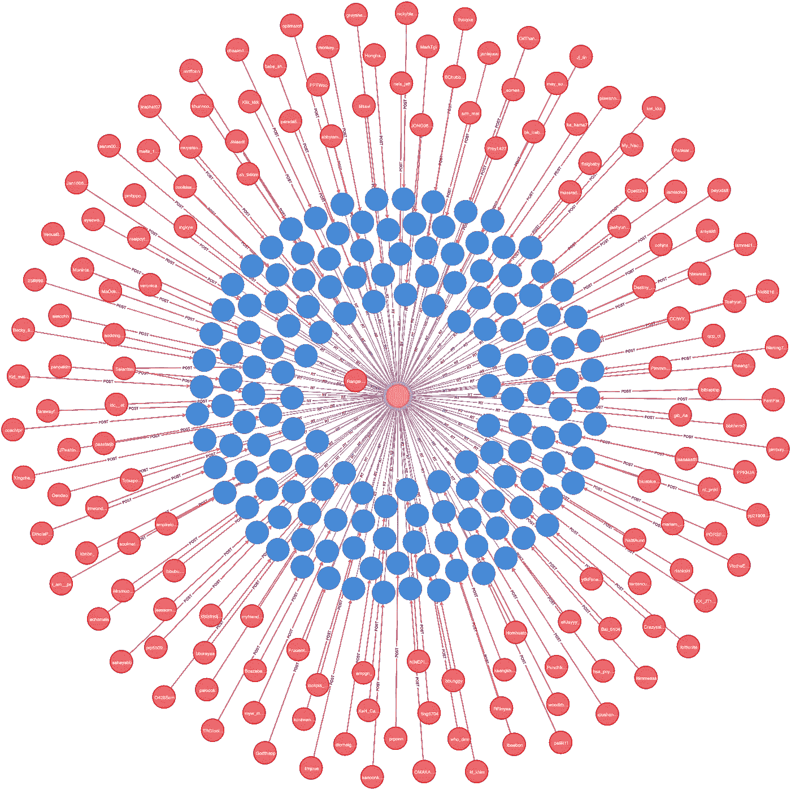
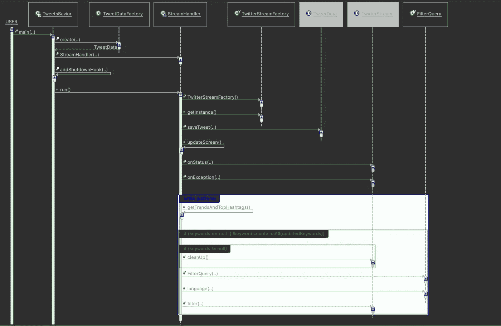
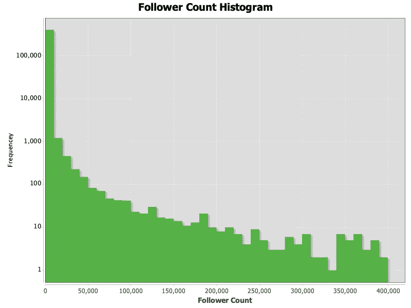
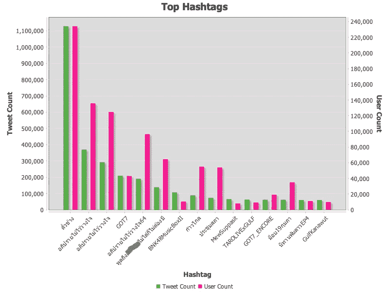
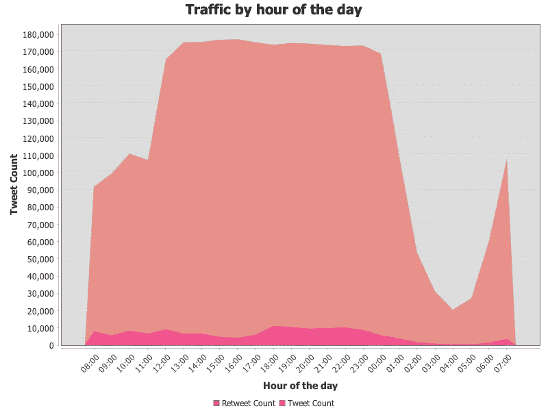

# 使用 Neo4j 图形数据库分析 Twitter 数据

> 原文：<https://towardsdatascience.com/using-neo4j-graph-database-to-analyze-twitter-data-6e3d38042af1?source=collection_archive---------10----------------------->

## 收集 Twitter 数据，将其存储在图形数据库中，并使用图形算法进行分析。

图片作者。Neo4j 浏览器生成的图形。推特数据收集于 2021 年 2 月 19 日。地点是泰国。黄色圆圈代表一条推文。靠近中心的红色圆圈代表发布推文的用户。该用户获得最高的中心性分数。蓝色圆圈代表转发。蓝色圆圈周围的红色圆圈代表发布转发的用户。

我们将开发一个应用程序来收集 Twitter 数据，并将它们存储在 Neo4j 图形数据库中。然后，我们将使用一些图形查询、中心性算法和社区检测算法来分析数据。在本文中，我们将讨论:

*   Neo4j 图形数据库
*   Twitter 数据建模
*   收集 Twitter 数据
*   分析数据

# Neo4j 图形数据库

图形数据库是 NoSQL 数据存储技术之一。有一些图形数据库实现。在本文中，我们将使用 Neo4j 图形数据库。以下是它的优点:

*   Neo4j 社区版是开源和免费的。
*   易于安装和使用。
*   数据库驱动程序有几种语言版本，包括 Java 和 Python。

如果我们的读者对 Neo4j 图形数据库没有任何经验，我们建议从[这里](https://neo4j.com/download/)下载 Neo4j 桌面。然后，看一些教程。安装之后，为 Twitter 数据添加一个本地数据库。

# Twitter 数据建模

在这一部分，我们将讨论如何在图形数据库中建模 Twitter 对象。一般规则是:

*   一个对象可以是一个节点。对象类型或类将是一个标签。
*   对象关联是一种关系。关联类型将是关系类型。

我们感兴趣的 Twitter 对象将是图形数据库中的节点。这些是标签:

*   自录音再现装置发出的高音
*   转发
*   用户
*   标签

这些对象之间的关系将是图形数据库关系。这些是关系:

*   POST 代表用户发布推文。
*   RT 表示用户发布了一条转发消息。
*   标签代表用户用标签来标记推文。
*   REPLY 代表对另一条推文的回复。
*   引用是指引用另一条推文的推文。
*   提及表示提及用户的推文。

下图显示了节点标签和关系类型。

图片作者。它是由下面的 cypher 命令生成的。

我们已经使用 Neo4j 浏览器通过使用以下命令来生成图片:

Neo4j cypher 命令生成上面的模式图像

我们还需要在一些节点标签上创建约束，以确保我们不会创建重复的对象。每个 Twitter 对象都有一个唯一的 id。以下是命令:

Neo4j cypher 命令在节点标签上创建约束

# 收集 Twitter 数据

在开始分析之前，我们需要收集数据。我们将构建一个 Java 应用程序来检索推文、转发、用户、标签和相关数据。所有这些对象都是相关的。使用图模型对它们建模是很自然的。然后，我们将它们存储在图形数据库中。

## TweetsSavior 类

下面的代码显示了 TweetsSavior 类。

“main”方法从命令行参数中获取参数。变量名是不言自明的。然后，创建 TweetData 对象。实例化流处理程序对象。最后，调用流处理程序对象的 run 方法。

## TweetData 接口

这个接口是应用程序和存储 Twitter 对象的数据库之间的抽象层。有了这一层，将来我们可以很容易地用一种类型的数据库替换另一种类型的数据库。比如用 neo4j 数据库替换 SQL 数据库。这个接口有一个重要的方法。saveTweet 将处理并保存 Tweet 和相关对象到底层数据库。

## TweetDataFactory 类

我们已经使用简单的工厂类创建了一个实现 TweetData 接口的对象。在这种情况下，工厂将实例化一个 TweetGraphData 类的对象。

## TweetGraphData 类

以下代码显示了 TweetGraphData 类。它是 TweetData 接口的一个实现，将数据存储在一个图形数据库中。

saveTweet 方法创建一个可调用的任务，并将其提交给 executor 服务。当许多推文在短时间内到来时，利用 executor 服务是有益的。executor 服务将为我们管理线程和任务队列。

## TweetGraphTask 类

这是一个可调用的任务，执行处理和保存 tweet 和相关对象的实际工作。代码依赖于:

*   不管这条微博是不是转发。
*   这条推文是否是对另一条推文的回复。
*   不管它是否引用了另一条推文。
*   这条推文是否有标签，或者是否提到了其他用户。

代码很长，但是很简单。它使用一些 Neo4j Cypher 查询来创建或更新图形节点。代码可以在[这里](https://gist.github.com/mananai/dd09f514f29a78bbf239219a999ab10d)找到。

## StreamHandler 类

下面的代码显示了收集 tweet 数据的 StreamHandler 类。

我们有 run 方法作为我们的切入点，并且有主要的逻辑。它执行以下操作:

*   创建一个 Twitter 流对象。
*   当新的 tweet 到达时，它将调用 Twitter 流对象的 onStatus 方法。
*   我们的 *onStatus* 调用“Tweet data*”*对象的 saveTweet 方法，并传递 tweet 对象。
*   在 while 循环中，它每 15 分钟获取一次当前的 Twitter 趋势。然后，它使用 Twitter 趋势作为我们希望从 Twitter 流中获得的过滤关键字。

回顾一下这个应用程序，下面的序列图显示了我们的关键类之间的交互。

图片作者。序列图是由 Certiv Analytics 在 eclipse 上的序列插件生成的

我们把地点定在泰国，2021 年 2 月 19 日运行程序，时间是早上 8 点到第二天早上 8 点。我们得到了 159，276 条推文，3，078，281 条转发，11，047 个标签和 403，991 个用户。注意，这些并不是所有的用户，而是当天参与活动的用户。我们的读者须知，那天有一项对政府的不信任动议。Twitter 上的活动可能会比平时多一点。
所以，我们收集了大量的 Twitter 数据。让我们看看我们能用它做什么。

# 分析数据

我们使用 Cypher 语言查询 Neo4j 图形数据库。就像我们用 SQL 语言查询关系数据库一样。Cypher 只是一种不同的语言，因为图形数据库有不同的体系结构。我们的读者可以在这里查阅 Cypher 语言文档[。](https://neo4j.com/developer/cypher/)

我们将从使用一些 Cypher 查询来分析数据开始。然后，我们将对我们的数据应用图中心算法。它应该能够识别网络中心的用户。最后，我们将尝试一种图社区检测算法。它根据用户的交互将用户分成不同的组。

## 追随者计数

我们想知道的一件重要事情是谁是有影响力的用户。这很简单，因为我们已经有了这样的属性。每个用户节点都有一些属性。“关注者计数”告诉用户有多少关注者。我们使用下面的查询来查找按关注者数量排序的前 10 名用户。下面显示了 Cypher 查询和结果。

让我们稍微讨论一下 Cypher 查询。

*   第一行是匹配子句。这意味着我们需要带有用户标签的节点。
*   第二行是 where 子句。这意味着我们需要具有特定属性的节点。
*   第三行是 where 子句的一部分。这意味着我们只需要关注者少于 3，700，000 的用户，因为关注者更多的用户可能是非本地用户。
*   第四行是 return 子句。它告诉我们需要什么属性作为回报。
*   最后一行告诉数据库按照追随者计数降序排列结果，并只返回特定数量的行。

因此，我们在数据库中找出最有影响力的用户。这些用户拥有数百万粉丝。

接下来我们想知道的是关注者计数的分布。我们认为很少用户有很多追随者。大多数用户只有几个追随者。让我们看看是真是假。因此，我们将绘制追随者计数直方图。我们将使用 JFreechart 库编写一个 Java 代码来绘制图表。Java 源文件如下:

这是结果直方图:

作者图片

在图表中，我们将最大关注人数限制为 400，000。此外，我们需要在频率轴上使用对数标度，以使图形看起来更好。否则，我们将只能看到第一个条形。第一个箱的频率比其余箱的频率大得多。(第一个箱频率是 400，577。第二箱频率是 1，207。)

从图表来看，很明显大多数用户只有几个追随者。很少有人有很多追随者。

接下来，我们将计算追随者计数的百分位数。在我们继续之前，我们需要安装 APOC 库。详情请看这篇[文章](https://medium.com/neo4j/explore-new-worlds-adding-plugins-to-neo4j-26e6a8e5d37e)。

密码查询和结果如下。

以下是百分位值:

*   50%的用户关注者少于 60 人。
*   75%的用户拥有不到 200 名关注者。
*   90%的用户拥有不到 536 个关注者。
*   99%的用户拥有不到 6，222 名关注者。

有趣的是，平均关注人数是 1374 人。然而，90%的人只有不到 536 个追随者。平均值没有意义，因为跟随者计数分布不是正态分布。它严重倾斜。

## 热门标签

接下来，我们将确定热门标签。我们使用下面的查询来完成。

这个查询比前一个稍微复杂一点。

*   第一行是匹配模式。这里，我们希望匹配标签、推文或转发以及用户。
*   第二行是 where 子句。这意味着模式中的变量 t 要么是 tweet，要么是 retweet。
*   第三条和第四条是退货条款。它告诉数据库返回 hashtag 文本、tweet 和 retweet 计数、用户计数和每个用户的 tweet 计数。
*   在最后一行，我们按照 tweet 计数降序排列结果。然后，取特定数量的顶行。

接下来，我们将制作热门标签的图表。我们将使用 Cypher query 和一些 Java 代码来实现它。这里的代码是。

作者图片

从结果中，我们注意到以下情况:

*   热门标签是政治、流行歌手/偶像或电视节目。
*   我们有每个用户的推文。它显示了用户平均产生多少条推文和转发。我们注意到，对于一些标签，每个用户的 tweets 很高。看起来这些用户做得很好，让他们的标签在 Twitter 上流行起来。
*   从我们的数据来看，每个用户发布超过十条推文的标签是流行歌手/偶像。

## 按时间推文量

这种分析是为了观察推文量在一天中的变化。高峰期是什么时候？对于每个 Tweet 或 Retweet 节点，都有一个存储创建日期时间的 createdAt 属性。我们需要将其转换为 Cypher 可以理解的类型，然后将其分解为年、月、日和小时。然后，计算每小时的推文和转发次数。
下面是要做的查询任务。

*   第一行是匹配节点。
*   第二行是 WHERE 子句，指定每个节点必须是 tweet 或 retweet。
*   第三行是 WITH 子句。我们调整时区，然后将时间戳转换为日期时间类型。
*   第四行是另一个 WITH 子句。它将日期时间值分解为年、月、日和小时。
*   第 5 行和第 6 行计算 tweet 和 retweet 节点。我们使用 case-when 语句来区分 tweets 和 retweets。
*   第 7 和第 8 个是 WHERE 子句。它只包括特定年份、月份、日期范围和时间的推文或转发。
*   第 9 行是退货条款。它返回年、月、日、小时、tweet 计数和 retweet 计数。
*   最后一行是排序结果。

我们使用查询结果来绘制 tweet 音量。这里是[代码](https://gist.github.com/mananai/62b959ba9bff4281e86ff2e29b3366d8)。图表如下。

作者图片

以下是我们的观察结果:

*   正如所料，转发量远远高于推文量。
*   转发量在 13:00–23:00 左右达到峰值并趋于平缓。
*   推文音量在 18:00-22:00 左右达到峰值并趋于平缓。
*   午夜后交易量减少，6 点左右又回升。

## 安装图形数据科学库

我们稍后将使用的中心性和社区检测算法是图形数据科学库的一部分。我们需要将它安装在图形数据库中。详情请看这篇[文章](https://medium.com/neo4j/explore-new-worlds-adding-plugins-to-neo4j-26e6a8e5d37e)。

## 用户投影

在我们继续之前，我们需要建立一个用户预测。这是一个内存中的图表，显示了一个用户如何连接到另一个用户。图形算法稍后会在上面运行。

我们确定了三种类型的用户连接:

*   用户转发、引用或回复推文。另一个用户发布了这条推文。
*   用户发布转发、引用或回复推文。那条推文提到了另一个用户。
*   一个用户发布了一条提到另一个用户的推文。

以下是创建投影图的命令。

*   第一行是对图形数据科学库中的过程的调用。
*   第二行是图形投影名称。我们稍后会提到它。
*   第 3 行指定了要包含在投影中的节点。我们取所有用户节点。
*   第 4-11 行定义了图表中包含的关系。有三种结合在一起的关系类型。
*   最后一行是选项。

## 中心

我们将使用中心算法来识别位于网络中心的用户。有一些算法可用。我们决定使用 PageRank 算法。该算法根据传入关系的数量来衡量每个节点的重要性。它还考虑了源节点的重要性。
我们使用下面的命令来运行 PageRank 算法。

*   第一行是对图形数据科学库中算法的调用。它还指定了算法将运行的投影。这是我们之前创建的投影。
*   第二行存储从算法到变量的输出。
*   第三和第四个指定返回值。
*   第 5 个告诉数据库按照 PageRank 分数对结果进行排序，只返回前 10 个用户。

根据中心性结果，以下是我们的观察结果:

*   和热门标签结果一样，最高分属于政治人物、新闻机构和流行偶像。
*   最高 PageRank 分数的用户是 MP。他在当天的不信任案中进行了辩论。
*   名单中十个有七个来自反对党。
*   列表中的用户具有较高的追随者计数。但没那么高。一个拥有不到 10k 的用户仍然进入了我们的十大名单。所以，要看当天的活动。

## 社区检测

社区检测算法评估节点是如何聚集或划分的。这个库有一些算法可以使用。我们决定使用卢万算法。下面是 Cypher 查询和结果。

*   第一行是对库中 Louvain 算法的调用。投影名称是一个参数。
*   第二行说明了输出、节点 id 和社区 id。
*   第三行使用 WITH 子句计算社区大小并将结果存储在变量中。
*   第四行是 WHERE 子句。我们只想要拥有超过 1000 名用户的社区。
*   第五行是返回子句。我们返回社区 id 和社区大小。注意，社区 id 只是一个数字，没有任何意义。
*   在最后一行，我们按照大小降序排列社区。

因此，我们确定了几十个社区，但我们对每个社区一无所知。我们可以做进一步的分析，看看每个社区都在发什么话题。下面的 Cypher 查询可以做到这一点。

*   第 1-5 行调用 Louvain 算法。它做的事情与前面的查询相同。
*   第 6-9 行是查询的另一部分。它会识别每个社区的标签或被提及的用户。
*   第 10-13 个提取标签或屏幕名称
*   第 14 列指定了我们想要的结果列。我们也只返回每个社区的前 5 个标签或提到的昵称。
*   在最后一行，我们按照大小降序排列社区。

让我们讨论一下结果。

*   最大的社区拥有 230，000+用户。其中三家拥有超过 10，000 名用户。
*   每个社区讨论政治、流行偶像或电视节目。
*   政治是那天的热门话题。一些社区的用户除了偶像标签之外还讨论政治。

# 图形数据库的利弊

在使用 Neo4j 图表数据库进行 Twitter 分析后，我们发现了这些优点和缺点。

## 优点:

*   Cypher query 比 SQL query 可读性更强、更紧凑，尤其是在有关系的情况下。
*   Neo4j 图形数据库有一些图形算法可供使用。

## 缺点:

*   Neo4j 数据库是一个比较新的产品。可用的工具不多。

从性能上来说，已经够快了。凭借 300 多万个节点和 600 多万个关系，我们可以在我们老化的 MacBook Pro 2014 年中期模型上在几秒钟内运行大多数查询。

# 结论

在本文中，我们讨论开发一个 Java 应用程序来收集 Twitter 数据。然后，存储到 Neo4j 图形数据库中。我们以几种不同的方式分析数据:

*   我们用追随者数量的最高值来识别用户。绘制跟踪计数直方图。
*   我们确定热门标签。
*   我们想象推特的流量在一天中是如何变化的。
*   我们找出位于网络中心的顶级用户。
*   最后，我们根据用户的活动将他们划分到社区中。

这是我们分析数据的几个样本。我们可以做得更多。在图形数据科学库中，我们还没有研究的其他算法是可用的。我们希望我们的读者了解我们可以用图形数据库做什么。