# 用神经网络求解常微分方程

> 原文：<https://towardsdatascience.com/using-neural-networks-to-solve-ordinary-differential-equations-a7806de99cdd?source=collection_archive---------4----------------------->


约翰·莫塞斯·鲍恩在 [Unsplash](https://unsplash.com?utm_source=medium&utm_medium=referral) 上拍摄的照片

## 如何使用神经网络解决常微分方程的快速指南(包括张量流实现)

使用神经网络解决常微分方程的想法首先由 [Lagaris 等人](https://arxiv.org/abs/physics/9705023)提出。其背后的想法基本上是训练神经网络来满足微分方程所需的条件。换句话说，我们需要找到一个导数满足 ODE 条件的函数。本文将介绍这个概念的数学基础，然后我们将使用 TensorFlow 实现它。所有的内容都可以在谷歌协作笔记本[这里](https://colab.research.google.com/drive/12ztGwxR1TK8Ka6H3bOsSt57kB71ieQ-W?usp=sharing)中找到。

# 数学基础

假设我们有一个颂歌系统，由下式给出:

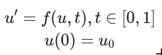

因此，我们可以将微分运算理解为具有已知初始条件 *u* (0)= *u* 0 的域 *t* 上的函数。众所周知，神经网络被称为通用逼近器。我们将利用神经网络的这一特性，用它们来逼近给定常微分方程的解:

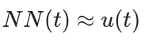

同样，我们可能同意 *NN* ( *t* )的导数会给我们一个类似的等式:


所以，如果 *NN* ( *t* )真的接近于真解，那么我们可以说它的导数也接近于真解的导数，即:

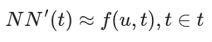

因此，我们可以把这个条件转化为我们的损失函数。我们有给定的导数函数 *f* ( *u* ， *t* )，我们可以计算每一步的神经网络导数*NN*'(*t*)。这激发了下面的损失函数(这是两个值的均方误差):

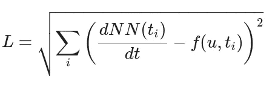

你可能还记得初始条件，我们仍然需要处理它。最直接的方法是在成本函数中加入一个初始条件项。它看起来像这样:

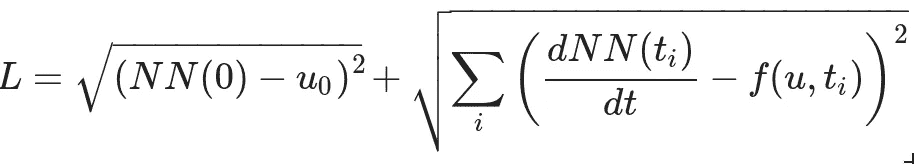

虽然这可行，但可能不是最好的方法。我们都知道损失函数对神经网络训练的至关重要性，我们也知道这个函数的项数将直接影响我们训练的稳定性。损失函数中的更多项(通常)意味着不稳定的训练。为了避免这种情况，我们可以更有效地将初始条件编码到损失中。让我们定义一个新函数并使用它，而不是直接使用神经网络:

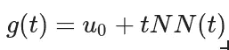

很容易看出， *g* ( *t* )将总是满足初始条件，因为 *g* (0)将导致 *tNN* ( *t* )=0，只留下表达式上的初始条件。这样就可以训练 *g* ( *t* )来满足 ODE 系统而不是神经网络。然后，它会自动成为导函数的一个解。我们可以将这个新的想法融入我们的损失函数:

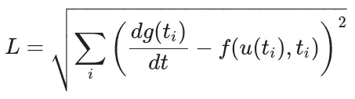

# Python 实现

我们将使用 TensorFlow 库在 python 中实现所描述的方法。为了更好地理解该方法，我们将使用一个低层次的设计，避免库提供的许多可能的优化。目前，我们的重点是清楚地理解和实现 ODE-solver 神经网络。为此，我们也将选择一首简单的颂歌:

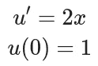

我们可以通过整合解决方案的双方来轻松解决这个问题，导致*u*+*C*=*x*+*C*，在拟合 *C* 以满足初始条件后，我们有 *u* = *x* +1。然而，让我们尝试使用神经网络来解决它，而不是解析地解决它。

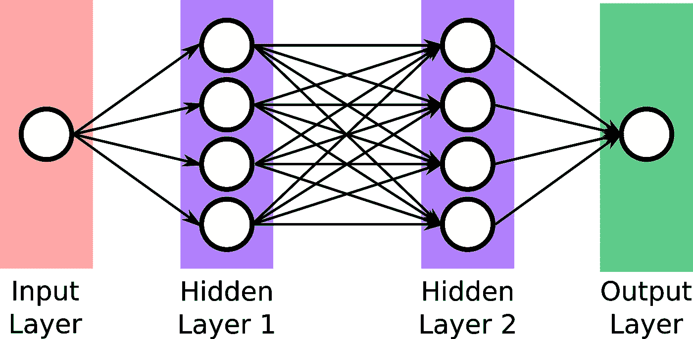

作者图片

> 对于此示例，我们将创建一个具有两个隐藏层、sigmoid 激活函数和梯度下降优化算法的 MLP 神经网络。也可以使用其他拓扑，这只是一个例子。我们鼓励你尝试这种方法的不同途径。

**定义变量**

```
f0 = 1
inf_s = np.sqrt(np.finfo(np.float32).eps)
learning_rate = 0.01
training_steps = 5000
batch_size = 100
display_step = 500# Network Parameters
n_input = 1     # input layer number of neurons
n_hidden_1 = 32 # 1st layer number of neurons
n_hidden_2 = 32 # 2nd layer number of neurons
n_output = 1    # output layer number of neuronsweights = {
'h1': tf.Variable(tf.random.normal([n_input, n_hidden_1])),
'h2': tf.Variable(tf.random.normal([n_hidden_1, n_hidden_2])),
'out': tf.Variable(tf.random.normal([n_hidden_2, n_output]))
}biases = {
'b1': tf.Variable(tf.random.normal([n_hidden_1])),
'b2': tf.Variable(tf.random.normal([n_hidden_2])),
'out': tf.Variable(tf.random.normal([n_output]))
}# Stochastic gradient descent optimizer.
optimizer = tf.optimizers.SGD(learning_rate)
```

**定义模型和损失函数**

```
# Create model
def multilayer_perceptron(x):
  x = np.array([[[x]]],  dtype='float32')
  layer_1 = tf.add(tf.matmul(x, weights['h1']), biases['b1'])
  layer_1 = tf.nn.sigmoid(layer_1)
  layer_2 = tf.add(tf.matmul(layer_1, weights['h2']), biases['b2'])
  layer_2 = tf.nn.sigmoid(layer_2)
  output = tf.matmul(layer_2, weights['out']) + biases['out']
  return output# Universal Approximator
def g(x):
  return x * multilayer_perceptron(x) + f0# Given EDO
def f(x):
  return 2*x# Custom loss function to approximate the derivatives
def custom_loss():
  summation = []
  for x in np.linspace(-1,1,10):
    dNN = (g(x+inf_s)-g(x))/inf_s
    summation.append((dNN - f(x))**2)
  return tf.sqrt(tf.reduce_mean(tf.abs(summation)))
```

> 注意，我们在损失函数中没有任何参数。通常，损失函数会将预测值与实际数据进行比较。**在我们的例子中，我们不需要数据点**。

因为我们知道支配这个模型的 ODE 函数，所以我们可以计算每个点 *x* 的期望值。您可能还注意到，我们总是使用区间 *{-1，1}中的 10 个点来计算损失。对于所有可能的函数来说，这可能还不够，但是考虑到我们例子的简单性，我想我们会做得很好。*

神经网络导数由代码中的变量 **dNN** 表示。我们只是使用差异化定义:

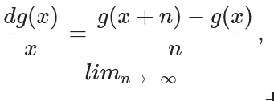

**列车功能**

```
def train_step():
  with tf.GradientTape() as tape:
    loss = custom_loss()
  trainable_variables=list(weights.values())+list(biases.values())
  gradients = tape.gradient(loss, trainable_variables)
  optimizer.apply_gradients(zip(gradients, trainable_variables))# Training the Model:
for i in range(training_steps):
  train_step()
  if i % display_step == 0:
    print("loss: %f " % (custom_loss()))
```

**标绘结果**

```
# True Solution (found analitically)
def true_solution(x):
  return x**2 + 1X = np.linspace(0, 1, 100)
result = []
for i in X:
  result.append(g(i).numpy()[0][0][0])
S = true_solution(X)plt.plot(X, result)
plt.plot(X, S)
plt.show()
```

这将给我们带来以下情节:

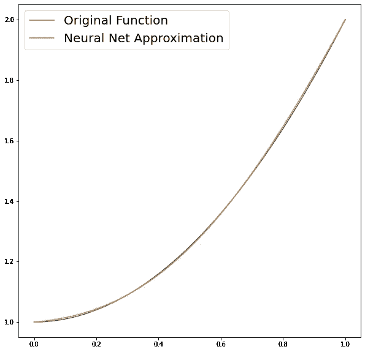

作者图片

这是一个非常近似的结果，如果我们还记得没有用于训练的数据集的话。如果我们使用更多的搭配点来计算损失函数，或者如果我们保持训练时间长一点，可能会更好。我们邀请读者尝试这些代码并进行这些调整，甚至尝试其他代码。你可以在谷歌协作笔记本[这里](https://colab.research.google.com/drive/12ztGwxR1TK8Ka6H3bOsSt57kB71ieQ-W?usp=sharing)找到这篇文章的所有内容。玩得开心！谢谢你的阅读。