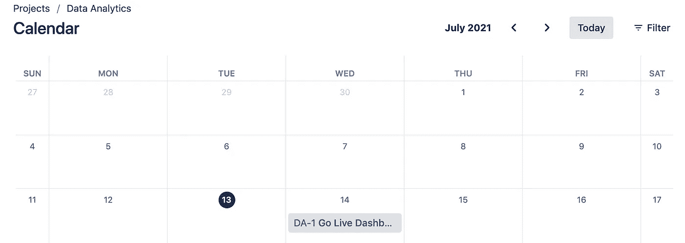
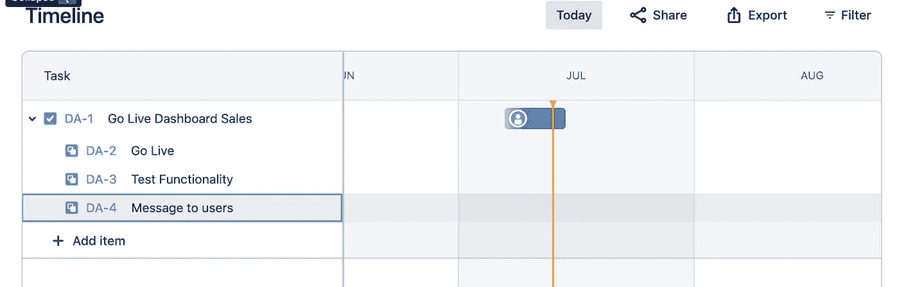
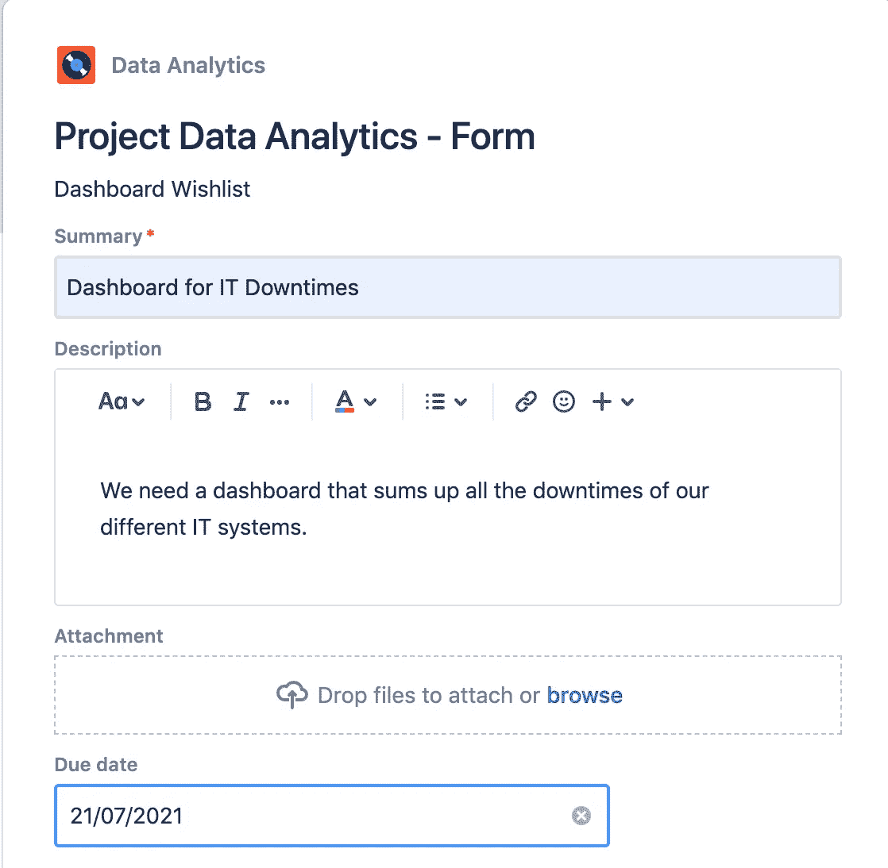

# 为数据科学使用新的吉拉工作管理项目

> 原文：<https://towardsdatascience.com/using-new-jira-work-management-projects-for-data-science-1a75d148a885?source=collection_archive---------36----------------------->

## 吉拉简单的新功能如何支持数据分析团队

在 [Unsplash](https://unsplash.com/s/photos/kanban?utm_source=unsplash&utm_medium=referral&utm_content=creditCopyText) 上[空中聚焦](https://unsplash.com/@airfocus?utm_source=unsplash&utm_medium=referral&utm_content=creditCopyText)拍摄的照片

吉拉工作管理是专为营销，人力资源，财务和其他业务团队。因此，您可以根据自己的需求与其他人一起工作和协作。我真正喜欢这个新功能的是简单的设计，以及以前没有的日历、列表和时间线等工具现在也可以使用了。如果你没有账户，你可以在吉拉云中创建一个用于测试的账户，然后和最多十个同事一起试用。

## 日历

特别是对于 bug 修复或上线约会，日历视图非常方便。每个人都可以很容易地跟踪重要的待办事项并安排它们。

吉拉日历—作者图片

## 时间表/路线图

类似于吉拉的新一代项目，你也可以按照时间表或路线图来规划任务。我已经发现这个功能非常有用，例如在管理演示中显示未来几天、几周和几个月要做的事情。而且对于自己粗略规划的项目来说，这个功能也是极有帮助的。

为您的任务绘制时间线—按作者排序的图像

## 形式

使用新的用于构建块的拖放式表单，在几秒钟内为任何项目创建有用的表单[1]。例如，在这里，我将它用于客户仪表板请求。这样，内部和外部数据用户可以提交想法和请求。通过指定表单，您已经可以尝试在这里建立定义良好的用户故事。

仪表板表单—按作者分类的图像

## 其他有价值的功能

我还发现**列表视图**很有用。在这里，您可以看到任何和所有任务及其各自的优先级。不幸的是，清单在这里不是内置的，但是我发现了有用的附加软件**智能清单**，用它你可以，例如，代表验收标准【2】。像**报告**这样的常用功能，例如评估 sprints，仍然可用。

## 摘要

在我看来，吉拉新的工作管理功能对于快速轻松地绘制数据分析项目非常有用。特别是，如果我想避免项目管理的开销，而是想在小团队中工作。除了项目之外，这些功能对于产品的进一步开发也非常有用，例如，通过表单，客户可以提交请求和想法。我最喜欢的功能是时间线/路线图视图，我喜欢用它来进行管理演示。

GIPHY 的 GIF 图

## 资料来源和进一步阅读

[1]吉拉，[工作管理](https://www.atlassian.com/de/software/jira/work-management) (2021)

[2] Atlassian Marketplace，[适用于吉拉的智能清单。企业](https://marketplace.atlassian.com/apps/1216451/smart-checklist-for-jira-enterprise) (2021)