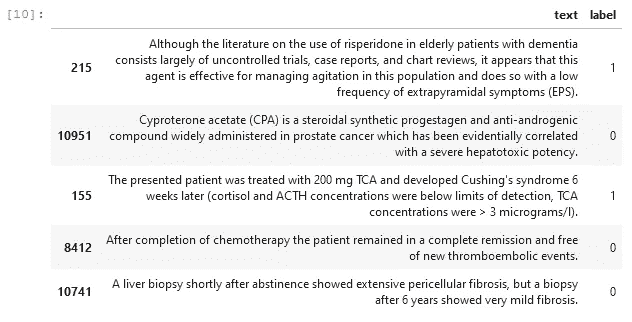
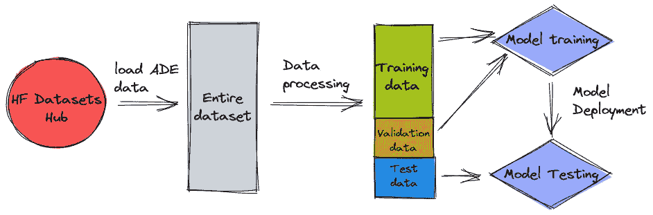
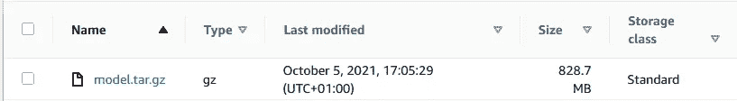

# 使用自然语言处理识别药物不良事件

> 原文：<https://towardsdatascience.com/using-nlp-to-identify-adverse-drug-events-ades-7a0194f1966a?source=collection_archive---------16----------------------->

## 制药和医疗保健公司如何利用 NLP 自动检测非结构化文本中的 ade

莎伦·麦卡琴在 [Unsplash](https://unsplash.com?utm_source=medium&utm_medium=referral) 上的照片

# 这是怎么回事？

*药物不良事件* (ADE)定义为患者因接触药物而遭受的伤害。大量关于药物相关安全性问题(如不良反应)的信息发布在医学病例报告中，由于其非结构化的性质，这些信息通常只能由人类读者来研究。

在本教程中，我们将训练一个自然语言处理(NLP)模型来识别给定文本中的 ade。我们将使用来自拥抱面部数据集中枢的 [ADE 数据集](https://huggingface.co/datasets/ade_corpus_v2)来教导模型 ADE 相关和非 ADE 相关文本之间的区别。我们将使用拥抱脸和亚马逊 SageMaker 来训练和部署模型，并用我们自己的短语进行测试。

# 为什么这很重要？

[根据疾病预防和健康促进办公室的数据](https://health.gov/our-work/national-health-initiatives/health-care-quality/adverse-drug-events)，ade 具有严重的影响:在住院环境中，ade 约占所有医院不良事件的三分之一，每年影响约 200 万次住院，并延长住院时间 1.7 至 4.6 天。在门诊环境中，ade 包括超过 350 万次医生诊室就诊，估计有 100 万次急诊就诊，以及大约 125，000 次住院。

能够使用人工智能模型自动标记非结构化文本数据中的 ADE 相关短语有助于预防 ADE，并带来更安全、更高质量的医疗保健服务、更低的医疗保健成本、更知情和更积极的消费者以及更好的健康结果。

# 数据

对于本教程，我们将使用 [ADE 语料库 V2 数据集](https://huggingface.co/datasets/ade_corpus_v2)。该数据集于 2021 年 5 月发表在拥抱脸网站上，并公开发布。它由 3 个子集组成，(1)ADE 分类语料库，(2)药物 ADE 关系语料库，和(3)药物剂量关系语料库。对于本教程，我们将专注于分类子集，它根据句子是否与 ADE 相关(标签=1)或不相关(标签=0)对句子进行分类。数据集看起来是这样的:

作者图片

# 行动（或活动、袭击）计划

训练 NLP 模型以识别 ADE 相关短语需要几个步骤:首先，我们需要下载并处理数据集，这导致单独的训练、验证和测试数据集。然后，我们用训练和验证数据集训练该模型。之后，我们将它部署到一个端点，在那里我们可以测试模型。下图说明了步骤的顺序:

作者图片

本教程的所有代码都可以在这个 [Github repo](https://github.com/marshmellow77/adverse-drug-effect-detection) 中找到。repo 被分成 4 个笔记本，它们反映了上面概述的步骤:1_data_prep.ipynb(数据处理)，2_inspect_data_optional.ipynb(这使我们可以在训练之前查看已处理的数据)，3_train.ipynb(模型训练)，4_deploy.ipynb(模型部署和测试)。

# 处理数据

为了处理数据，我们将利用亚马逊 SageMaker 上的[拥抱面部处理工作。这允许我们启动一个执行](/huggingface-processing-jobs-on-amazon-sagemaker-b1f5af97b663)[处理脚本](https://github.com/marshmellow77/adverse-drug-effect-detection/blob/main/scripts/preprocess.py)的计算实例。工作完成后，计算实例将自动关闭，我们只需支付处理数据的时间。

让我们看看处理脚本的一些关键部分:

处理脚本做一些事情:下载数据，删除重复数据，重组和分割数据，标记数据，并将其保存到 S3。

## 洗牌和分割数据

有许多方法可以加载数据集、删除重复项并将其分成几个部分。在这个脚本中，我们利用 [Pandas](https://pandas.pydata.org/) 和 [Numpy](https://numpy.org/) 库来完成这个任务，但是[数据集类](https://huggingface.co/docs/datasets/processing.html#processing-data-in-a-dataset)也有方法来[过滤](https://huggingface.co/docs/datasets/processing.html#filtering-rows-select-and-filter)和[分割](https://huggingface.co/docs/datasets/processing.html#splitting-the-dataset-in-train-and-test-split-train-test-split)数据集。

将数据集混洗并分成三部分的一种方法是使用 Numpy 的 split()函数。它允许我们在定义的阈值分割数据集。例如，要将一个数据集混洗并拆分成 70%的训练数据、20%的验证数据和 10%的测试数据，我们可以使用这行代码:

## 将数据符号化

为了使数据集为模型训练做好准备，我们将在将数据集保存到 S3 之前对其进行标记化:

# 训练模型

在 SageMaker 上训练拥抱脸模型很简单，这要归功于拥抱脸和 AWS 之间的合作关系。Github repo 中的[培训笔记本](https://github.com/marshmellow77/adverse-drug-effect-detection/blob/main/3_train.ipynb)遵循了如何培训 NLP 模型的最佳实践，并使用 [SageMaker 培训作业](https://docs.aws.amazon.com/sagemaker/latest/dg/how-it-works-training.html)来旋转短暂的计算实例以培训模型。这些计算实例仅用于训练模型，并在训练完成后立即拆除。该模型保存在 S3 上，可以从那里下载并在任何地方托管该模型:

作者图片

# 部署模型

在本教程中，我们将通过获取我们刚刚训练的模型并像这样将其部署在 S3 上来简化我们的生活(参见 Github repo 中的[部署笔记本](https://github.com/marshmellow77/adverse-drug-effect-detection/blob/main/4_deploy.ipynb)):

这将创建一个 SageMaker 端点，然后我们可以通过 SDK 与之交互。这使得我们可以很容易地测试和摆弄这个模型。

# 测试模型

一旦部署了模型，我们就可以用测试数据(或一些编造的句子)来测试它:

作者图片

# 结论

在本教程中，我们训练了一个 NLP 模型来识别给定短语中的药物不良事件(ade)。我们使用一个带注释的语料库来训练 NLP 模型，并将其部署到 SageMaker 端点，该语料库旨在支持从医学病例报告中提取有关药物相关不良反应的信息。接下来的步骤可能包括使用专用评估脚本进行自动模型评估，并在 Hugging Face 的模型中心发布模型。

# 引用

本教程使用的数据集是本文中描述的工作的产物:

Gurulingappa 等人，《支持药物副作用信息提取的基准语料库》，JBI，2012 年。
[http://www . science direct . com/science/article/pii/s 1532046412000615](http://www.sciencedirect.com/science/article/pii/S1532046412000615)，DOI:[https://doi.org/10.1016/j.jbi.2012.04.008](https://doi.org/10.1016/j.jbi.2012.04.008)