# 利用 OpenAI 的 CLIP 搜索外观设计专利

> 原文：<https://towardsdatascience.com/using-openais-clip-to-search-for-design-patents-7fcc63d91033?source=collection_archive---------32----------------------->

## 使用自然语言搜索和查找自 2002 年以来进入公共领域的六万多项工业设计

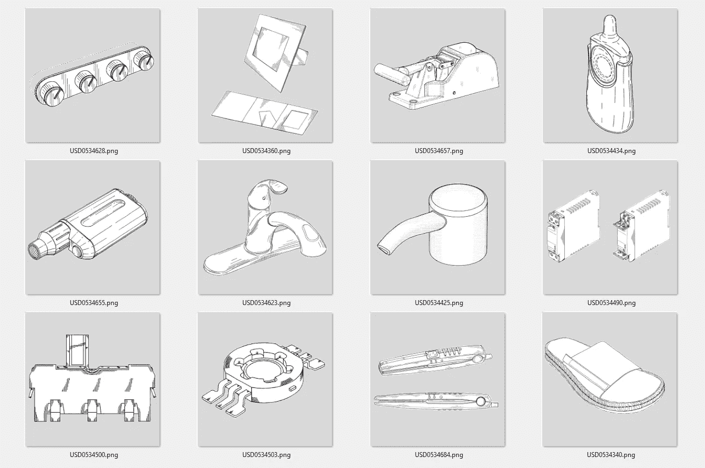

**过期的美国外观设计专利样本**，来源:美国专利商标局，图片由作者提供

每个人都知道利用专利来保护新发明。除非你是专利律师，否则你可能只知道三种主要类型中的一种，即**实用**专利。然而，还有另外两种类型，**设计**和**工厂**专利。目前，已授权的实用专利超过 1000 万项，设计专利 91 万项，植物专利近 3.2 万项。

如果你猜测植物专利是针对植物新品种的，那你就对了！但是什么是外观设计专利呢？这是美国专利商标局的定义:

> 专利法规定授予任何人为制造品发明任何新的和非显而易见的装饰性设计的人外观设计专利。外观设计专利只保护物品的外观，而不保护其结构或功能特征。授予外观设计专利的相关程序与授予其他专利的相关程序相同，但有一些不同……”—USPTO[1]

实用专利和外观设计专利的区别之一是期限，即所有者对专利项目拥有垄断权的时间。目前，实用专利的默认期限是自专利申请之日起 20 年。外观设计专利的默认期限是自专利被授予之日起 15 年。一旦期限届满，或者如果所有者提前放弃专利，作品就进入了公共领域。到那时，任何人都可以使用该设计，而无需获得过期专利所有者的许可。在 91 万项外观设计专利中，超过一半属于公共领域，可以免费使用。

# 概观

在本文中，我将向您展示如何使用 OpenAI 的新剪辑编码器对自 2002 年以来一直处于公共领域的超过 67，000 项设计专利执行基于图像和文本的语义搜索。

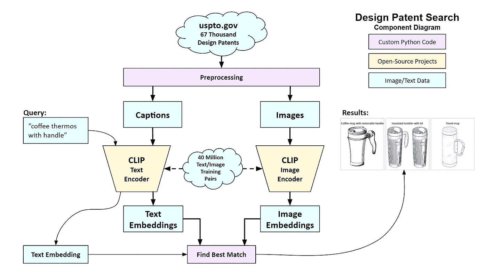

作者图表

该系统基于 CLIP，这是 OpenAI 的一个开源模型，可以对文本和图像进行语义搜索。该模型有两个功能，将文本和图像编码成“嵌入”，即代表原始数据要点的数字串。剪辑模型在 4000 万对带有文本标签的图像上进行预训练[2]，使得从图像编码的嵌入将类似于从文本标签编码的嵌入。

我编写了一个 Python 程序，从 USPTO 下载五年的每周专利公报，并解析文件以提取设计专利名称和相应的图像。然后，我分别通过剪辑文本和图像编码器运行所有的标题和图像，并将结果保存为两组嵌入。

要执行搜索，首先要输入一个简短的查询。该系统通过剪辑文本编码器运行查询，并比较结果嵌入，以使用外观设计专利的文本和图像嵌入来找到最佳匹配。系统显示从索引数组中获得的顶部结果的相应标题和图像。

例如，如果你搜索“折叠蒲团沙发”，下面是前五个结果:

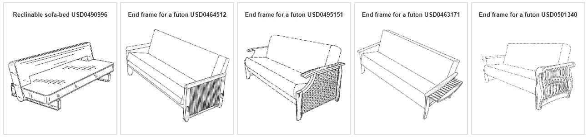

**基于片段的语义搜索结果**，来源:USPTO

在下面的部分中，我将讨论设计专利，并更详细地描述语义搜索过程。这里[有谷歌实验室](https://colab.research.google.com/github/robgon-art/clip-design-patents/blob/main/Using_OpenAI's_CLIP_to_Search_for_Design_Patents.ipynb)，所以你可以自己试试。

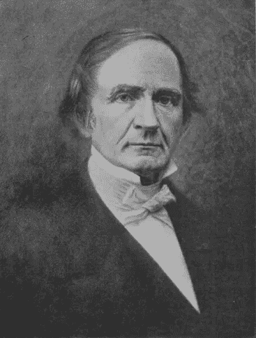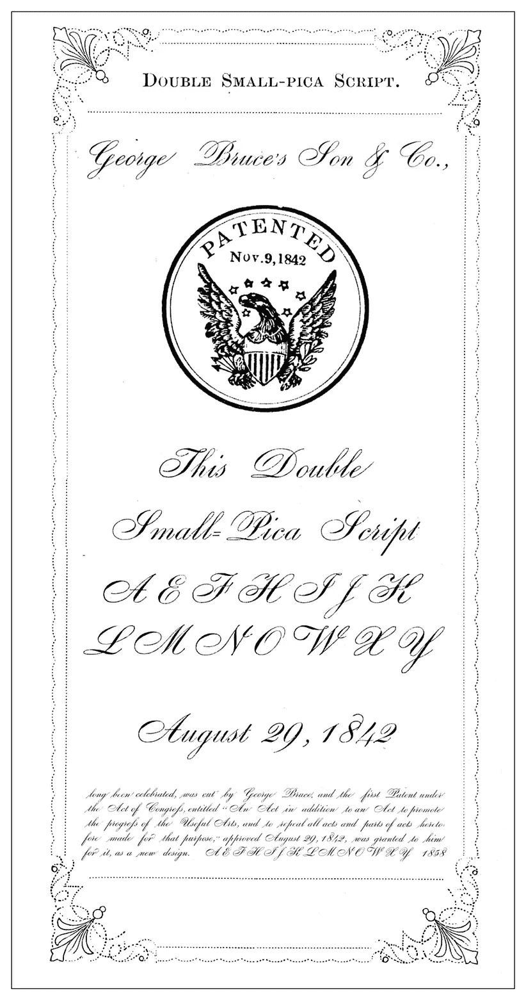

**乔治·布鲁斯**，图片来源:wikimedia.org，**和他的双小异食癖手稿，**图片来源:乔治·布鲁斯的儿子&公司。这两个图片都属于公共领域。

# 外观设计专利

正如我上面提到的，外观设计专利保护的是外观，而不是发明的功能方面。第一项外观设计专利于 1842 年 11 月 9 日授予纽约的乔治·布鲁斯，他发明了一种叫做双小十二点活字的新字体。

专利局将每一项设计专利分为 33 类[4]，如下所列。(简要说明:乍一看，似乎有 35 个类别，D1-D34 加上 D99 杂项。但奇怪的是，类别编号 D31 和 D33 从列表中消失了。也许 USPTO 对时光机和永动机的花饰有秘密分类？😃)

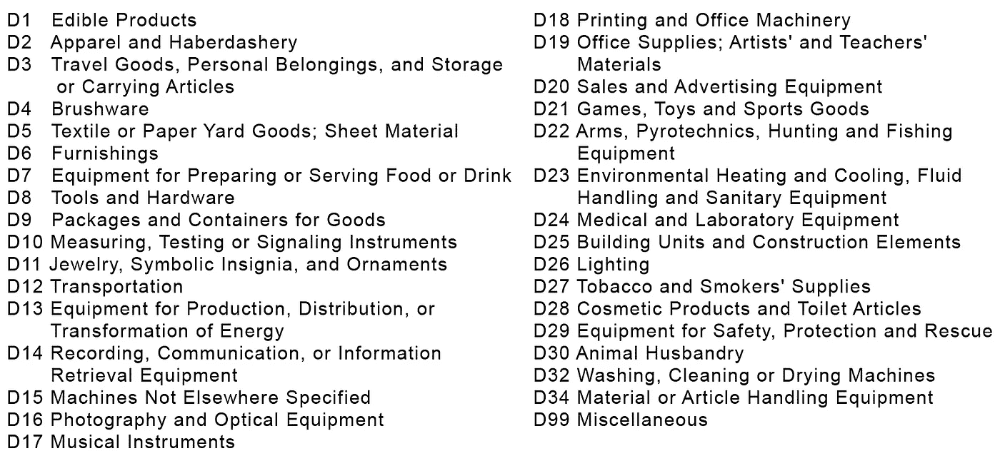

**外观设计专利类别**，来源:USPTO

自 20 世纪 60 年代以来，美国专利商标局每年授予的外观设计专利数量呈指数增长。2019 年，有近 35，000 项设计专利获得授权。


图片由作者提供，数据来源: [USPTO](https://www.uspto.gov/web/offices/ac/ido/oeip/taf/us_stat.htm)

USPTO 每周都会发布最新的在线专利公报，列出最近授予的实用、设计和植物专利[4]。专利公报可以在这里批量下载，[https://bulkdata.uspto.gov/](https://bulkdata.uspto.gov/)。这个网站有从 2002 年 7 月到今天的公报。

对于这个项目，我只下载和处理了已经过期的设计专利，所以我抓取了从 2002 年 7 月到 2007 年 2 月的公报，产生了 67，578 个设计专利。

外观设计专利的一个有趣的方面是使用“虚线”来显示所描绘的物体的元素，这些元素不被视为外观设计专利的一部分[5]。

> 虚线公开应理解为仅用于说明目的，并不构成所要求保护的设计的一部分。不属于要求保护的设计的一部分，但被认为是显示使用该设计的环境所必需的结构，可在图样中用虚线表示—美国专利商标局

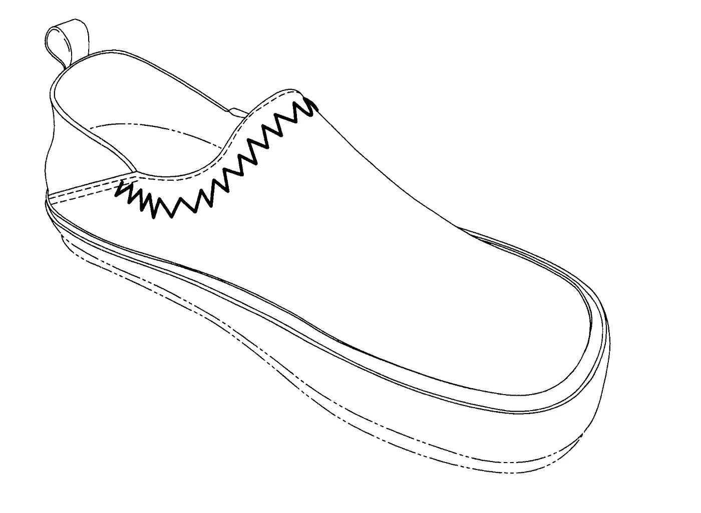

情妇玛侬·贝利和马丁·w·f·迪恩，来源:美国专利商标局

在上面的例子中，你可以看到带有点划线图案的虚线不包括在专利设计中，但鞋顶的缝线包括在内。请注意，所有行都包含在提供给剪辑图像编码器的图像中。

# 外观设计专利的预处理

我编写了一些 Python 代码来下载批量专利公报，解压缩它们，并遍历 HTML 页面来查找设计专利。它们很容易找到，因为外观设计专利以前缀“USD”开头。例如，以下是 HML 文档和相应 PNG 图像的路径:

```
gazettes/1314-1/OG/html/1314-1/**USD**0534338-20070102.html
gazettes/1314-1/OG/html/1314-1/**USD**0534338-20070102.png
```

在 HTML 文档中，我获取专利标题并将其保存到文本文件中。我还将图像调整大小并填充为 224x224 像素，这是剪辑图像编码器使用的大小。完整的源代码可以在[这里](https://colab.research.google.com/github/robgon-art/clip-design-patents/blob/main/Gather_Design_Patent_Images.ipynb)找到。

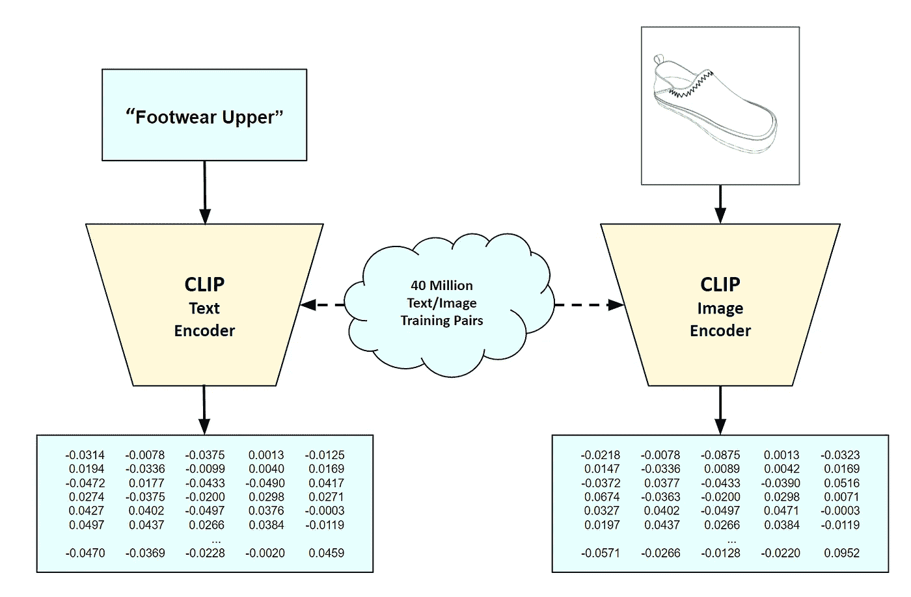

**使用剪辑**创建嵌入，图片作者

# 使用剪辑创建文本和图像嵌入

对文本和图像进行预处理后，创建要搜索的嵌入内容就相当容易了。OpenAI 已经发布了 CLIP 的预训练模型。下载他们的模型后，只需要几行 Python 代码就可以生成嵌入。每次嵌入都是 512 个数字的列表。你可以在这里看到源代码是。

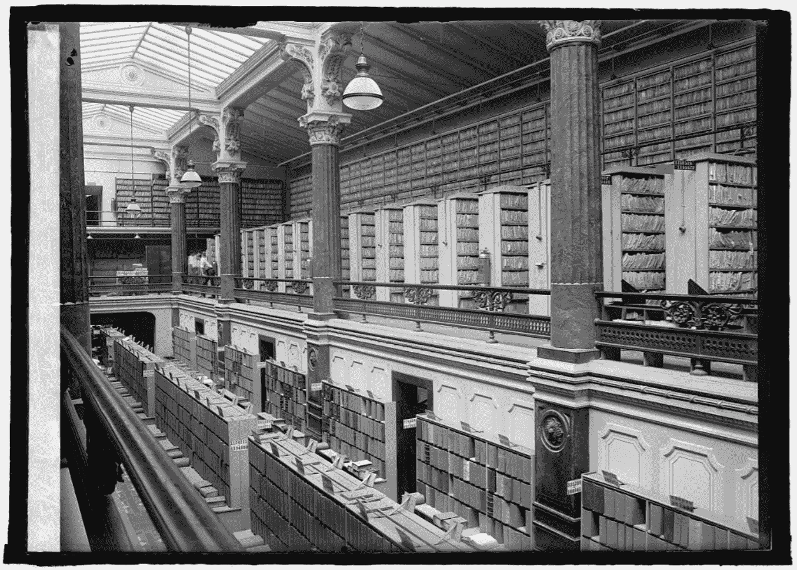

**美国专利局，大约 1925 年**，来源:美国国会图书馆，公共领域

# 搜索外观设计专利

现在我们已经有了超过 67，000 项设计专利的文本和图像嵌入，运行文本搜索变得又快又容易。

搜索从输入查询文本开始，例如，“弯曲的水龙头”。然后，系统使用剪辑文本编码器为查询创建文本嵌入。您可以选择三种搜索方法中的一种。

**1。文本到文本搜索—** 这将查询的嵌入与外观设计专利标题的文本嵌入列表进行比较，并返回最佳结果。

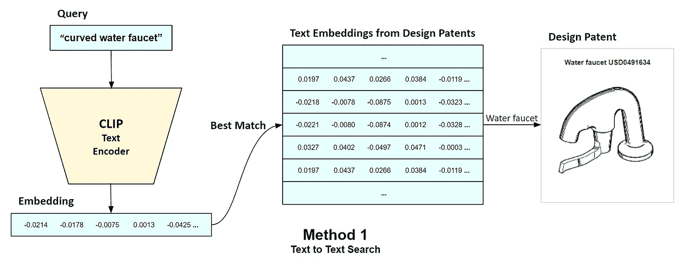

作者图表

**2。文本到图像搜索—** 将查询嵌入与图像嵌入列表进行比较，并返回最佳结果。

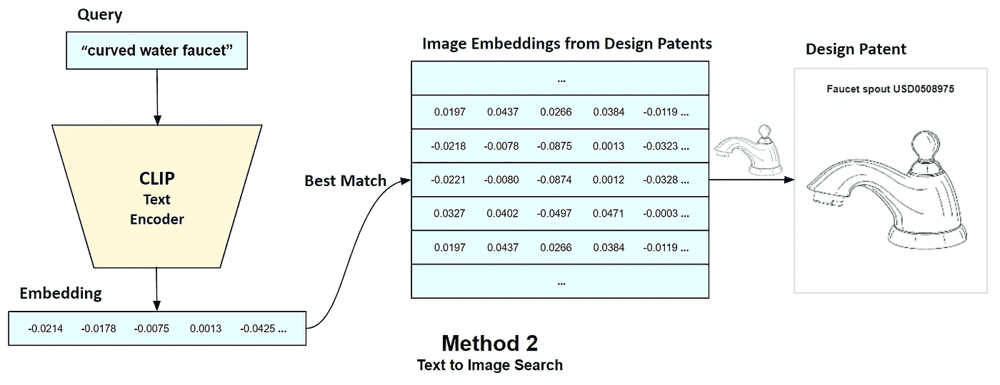

作者图表

**3。text to combined text/image search**—这将复制查询嵌入，并将组合对与组合的文本和图像嵌入列表进行比较，并返回最佳结果。

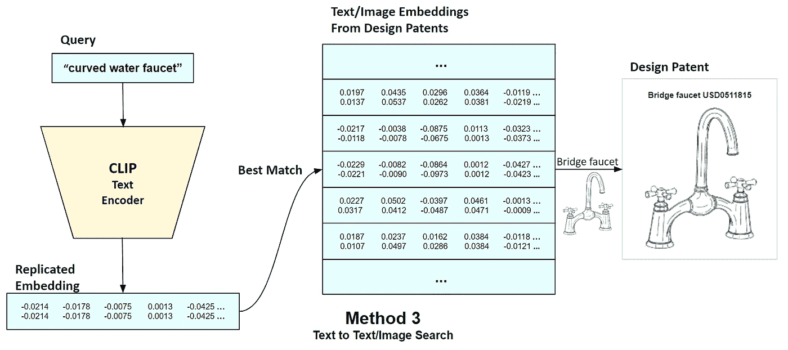

作者图表

注意，使用文本和图像嵌入进行语义搜索并不新鲜。例如，您可以阅读这些论文中的最新进展，郭晓晓等人的“基于对话的交互式图像检索”[6]和等人的“通过探索高阶注意力和分心进行视觉语义匹配”[7]。

# 讨论

在对该系统进行试验后，我发现使用文本和图像的组合嵌入通常会产生最好的结果。外观设计专利的说明文字都很高级，像“男式长靴”。它们通常不包含描述任何关键特征的文本。然而，图像嵌入经常会找到“错误的”对象，而这个对象恰好看起来像被搜索的对象。例如，如果您搜索“体育奖杯”，它可能会显示一个烛台。但是图像嵌入会捕捉设计的一些关键方面，比如上面的“弯曲水龙头”例子。将两种嵌入结合起来进行搜索通常是两全其美的。文本嵌入将搜索限制在查询的范围内，而图像嵌入通过识别关键特征来帮助改进搜索。

请查看下面的附录，查看一些示例搜索结果。

# 未来的工作

有可能训练一个生成性对抗网络(GAN)来基于来自 USPTO 的图像生成新的设计。这类似于 OpenAI 对 DALL E 系统所做的，它使用一个可变的自动编码器从文本中生成新的图像[8]。

# 源代码

这个项目的所有源代码都可以在 [GitHub](https://github.com/robgon-art/clip-design-patents) 上获得。图像文件和标签可在 [Kaggle](https://www.kaggle.com/robgonsalves/design-patent-images) 上获得。您可以使用这个 [Google Colab](https://colab.research.google.com/github/robgon-art/clip-design-patents/blob/main/Using_OpenAI's_CLIP_to_Search_for_Design_Patents.ipynb) 来试验代码。这些源在 [CC BY-SA 许可](https://creativecommons.org/licenses/by-sa/4.0/)下发布。


归属共享相似

# 感谢

我要感谢詹尼弗·林和奥利弗·斯特里普尔对这个项目的帮助。

# 参考

[1]美国专利商标局，“关于专利的一般信息”，2015 年 10 月 15 日，[https://www.uspto.gov/patents/basics#heading-30](https://www.uspto.gov/patents/basics#heading-30)

[2] A .拉德福德，J. W .金，c .哈勒西，a .拉梅什，g .戈，s .阿加瓦尔，g .萨斯特里，a .阿斯克尔，p .米什金，j .克拉克等人，《从自然语言监督中学习可转移的视觉模型》，2021 年 1 月 5 日，[https://cdn . open ai . com/papers/Learning _ Transferable _ Visual _ Models _ From _ Natural _ Language _ Supervision . pdf](https://cdn.openai.com/papers/Learning_Transferable_Visual_Models_From_Natural_Language_Supervision.pdf)

[3] G. Quinn，IP Watchdog，“第一项外观设计专利”，2008 年 11 月 6 日，[https://www . IP Watchdog . com/2008/11/06/The-First-Design-Patent-2/](https://www.ipwatchdog.com/2008/11/06/the-first-design-patent-2/)

[4]美国专利商标局，“官方公报”，[https://www . USPTO . gov/learning-and-resources/Official-Gazette](https://www.uspto.gov/learning-and-resources/official-gazette)

[5] USPTO，《外观设计专利申请指南》，[https://www . USPTO . gov/patents/basics/types-Patent-applications/Design-Patent-Application-Guide # broken](https://www.uspto.gov/patents/basics/types-patent-applications/design-patent-application-guide#broken)

[6] X .郭，h .吴，y .程，s .雷尼，g .特索罗，R. S .费里斯，“基于对话的交互式图像检索”，2018 年 12 月 20 日，

[7] Y .李，d .张，Y. Mu3，“探索高阶注意和注意力分散的视觉-语义匹配”，2020 年 6 月 13 日，[https://open access . the CVF . com/content _ CVPR _ 2020/papers/Li _ Visual-Semantic _ Matching _ by _ Exploring _ 高阶注意 _ and _ 注意力分散 _CVPR_2020_paper.pdf](https://openaccess.thecvf.com/content_CVPR_2020/papers/Li_Visual-Semantic_Matching_by_Exploring_High-Order_Attention_and_Distraction_CVPR_2020_paper.pdf)

[8] A .拉梅什，m .巴甫洛夫，g .高，S.t .格雷，《达勒:从文本中创造图像》，2021 年 1 月 5 日，[https://openai.com/blog/dall-e](https://openai.com/blog/dall-e/)

# 附录-搜索结果

## 鸡尾酒摇壶

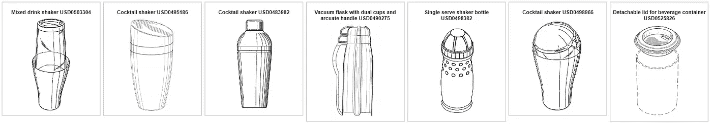

**组合搜索“不锈钢鸡尾酒调酒器”**，作者图片，来源:USPTO

## 发刷


**综合搜索“带刷毛的发刷”，**作者图片，来源:USPTO

## 躺椅

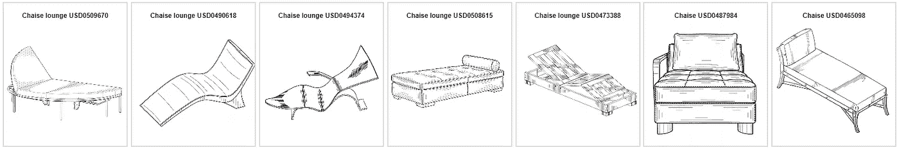

**组合搜索“贵妃椅”**，作者图片，来源:USPTO

为了无限制地访问 Medium 上的所有文章，[成为](https://robgon.medium.com/membership)的会员，每月 5 美元。非会员每月只能看三个锁定的故事。