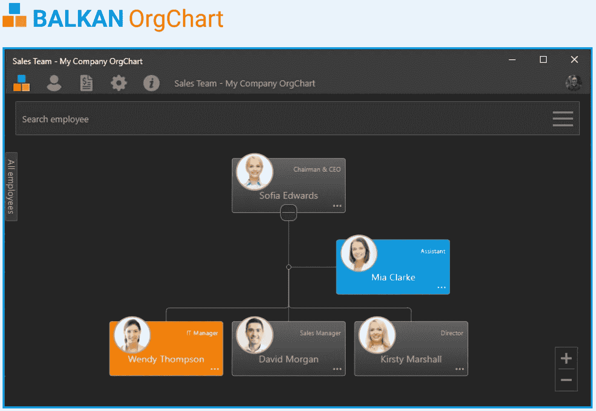
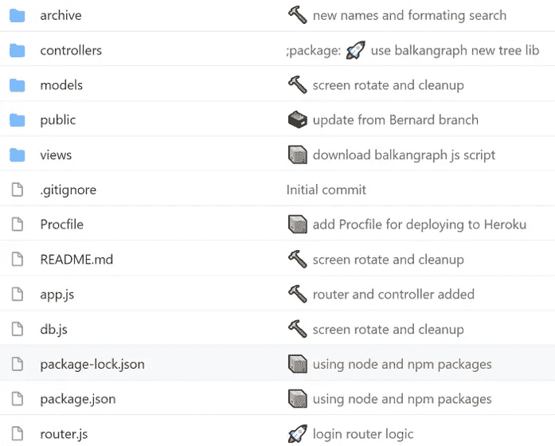
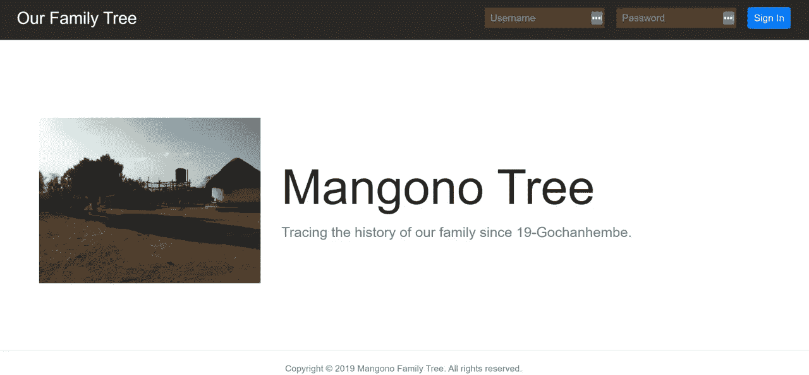
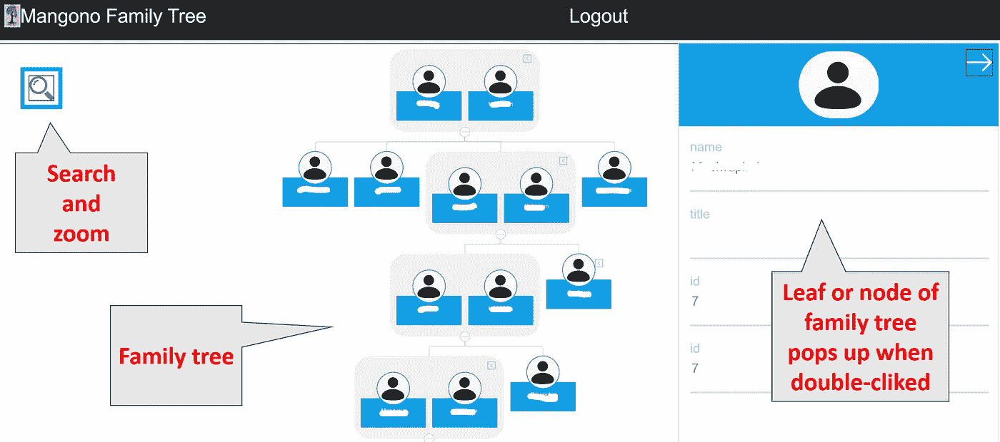

# 使用 OrgChartJS 来可视化我的家谱中的 8 代人——160 多个亲戚

> 原文：<https://towardsdatascience.com/using-orgchartjs-to-visualize-8-generations-160-relatives-in-my-family-tree-78468c39e39a?source=collection_archive---------25----------------------->

莱昂·保罗克霍夫在 [Unsplash](https://unsplash.com/s/photos/baobab?utm_source=unsplash&utm_medium=referral&utm_content=creditCopyText) 上的照片

## 将编码技能应用到对个人有意义的项目中。涵盖的技术:OrgChartJS、JavaScript/React、MongoDB 和 Heroku。

并不是每天都有人能够将他们的编码技能应用到对个人有意义的项目中。今年 1 月，我就这么做了，我利用我的网络开发技能建立了一个应用程序/网站，直观地展示了我家 160 多人 8 代的历史，一直追溯到 19 世纪晚期！在这篇文章中，我们将讨论我的项目的**动机**，我如何**选择工具**，**开发过程**，先睹为快**最终结果**，以及**我接下来要做什么**来推进项目。

# 那么，为什么要建立我自己的家谱呢？

凯文·杰瑞特在 [Unsplash](https://unsplash.com/s/photos/child-build?utm_source=unsplash&utm_medium=referral&utm_content=creditCopyText) 上拍摄的照片

1.  **记录我的过去、现在和未来—** 作为一个津巴布韦的小男孩，我总是对家族历史着迷，对那些在我之前的人充满好奇。他们面临哪些挑战？是什么让他们微笑或者相爱？了解你的家族史是一种特权，它给我一种不同于我经历过的任何事情的根植感。有人说，如果你不知道你从哪里来，就很难对你要去哪里有一个清晰的愿景！
2.  **与我的家人分享——**这份家族历史应该由最关心它的人——我的家人和亲戚——所有 167 个人分享、构建和维护！这是一个连接点，把它想象成我们自己家庭的社交媒体。在一个全球化的世界里，我们都分散在津巴布韦各地，散居各地，我有一种感觉，我们的后代将感谢我们保持这一信息的跟踪，尽管我们之间的物理距离。
3.  **当前的替代方案不充分—** 我对当前大品牌家族史、家谱、祖先网站和应用程序的研究揭示了一个很大的缺口—这个数据库中没有任何非洲人的记录。我的家人不是乘坐[五月花号](https://en.wikipedia.org/wiki/Mayflower)来美国的，所以他们的记录不会在大型网站上被捕获，任何搜索都是徒劳的。从数据收集的角度来看，目前的市场选择对我来说毫无用处。
4.  **保护我们的隐私—** 这是大事！构建自己的应用程序可以让你控制数据并保证其安全——尤其是因为家庭细节是你可以放在那里的一些最敏感的内容。我不知道所有现有的商业应用程序如何处理我的数据，所以我宁愿避开并实现我自己的解决方案。
5.  **提升我的技能—** 最后，我学到了很多自己从头开始研究和实现初稿的知识。但是最终能够使用和理解像 [OrgChartJS](https://balkan.app/OrgChartJS) 这样的实用程序库向我展示了什么是可能的，以及我如何能够利用它而不用在一个项目上花费数周时间。在故障排除过程中，我也更加熟悉了 javascript 数据结构和其他特性。

# 为工作选择正确的工具——组织图表

我使用 JavaScript 已经 4 年多了，最近，我学会了使用 React 库。所以我的第一次尝试是从头开始构建一个简单的版本，但它在视觉上并不令人满意，而且要花很多时间来构建我想要的所有功能，如搜索、缩放、树枝和树叶之间的无缝连接。我还尝试了其他具有层次化视觉效果的图表库，但它们都不太符合要求。不是每个项目都需要你从头开始——为了尽可能高效地执行，你需要为工作选择合适的工具。所以我最终选择了 Balkan 的 OrgChartJS 库，它有更好的视觉效果和即插即用的代码。

来自[https://balkan.app/?aspxerrorpath=/O](https://balkan.app/)的分层视觉样本

# 项目开发过程

该项目有 4 个主要部分:**数据采集**、**前端**、**后端**和**托管/部署**。

1.  **数据收集** —这包括联系我所有的亲戚，为我提供信息以填补空白。我们从家庭的每个分支中选出一个代表，通常是长子，与这个代表协调以获得整个分支的信息会更有效。
2.  **前端/用户体验** —我使用 JavaScript 和 React 来设置项目(使用可信的 create-react-app 实用程序)，然后从[https://balkangraph.com/js/latest/OrgChart.js](https://balkangraph.com/js/latest/OrgChart.js)下载 *OrgChart.js* 文件，将它与我的 *main.js* 文件一起放在我的 *public/scripts* 文件夹中。下面是我的文件夹结构是如何设置的:(i) **archive** —包含旧的代码文件。(ii) **控制器** —包含具有用户登录和注销功能的文件，(iii) **模型** —包含与数据库接口的用户功能，即 CRUD 和用户数据的任何验证和清理，(iv) **公共** —图像、脚本和样式文件夹。脚本文件夹有 orgchart.js 和 main.js 文件，(v) **视图** —包含。主页和树页面的 js 文件。

我的家谱项目的文件夹结构

**2。后端/数据管理—** 我使用 [MongoDB](https://www.mongodb.com/) 来处理我的用户名逻辑。我们只需要一套整个家庭的凭证，因为我只期望定期流量。对于家谱数据，我将它们作为常规对象存储在 main.js 文件中。这不是最佳实践，但对这个 MVP 版本来说是可行的。关于设置对象和链接到 OrgChartJS 函数的入门演示，请参见这里:[https://balkan.app/OrgChartJS-Demos/](https://balkan.app/OrgChartJS-Demos/)。

**3。托管/部署—** 我使用 [Heroku](https://www.heroku.com/) 进行托管/部署。它又快又简单，而且免费！

现在先睹为快最后的结果！

# 决赛成绩

## 1.登录页面

带有家庭住宅旋转图像的登录页面

不算太坏，它完成了任务！

## 2.家谱页面

家谱页面和叶节点弹出窗口—部分，为隐私而编辑

我对结果很满意，所以我制作了一个私人的 YouTube 教程视频，和证书一起发给了我的大家庭。他们都喜欢提供的所有功能，例如搜索、缩放、叶节点弹出等。

# 后续步骤

我们从概念上了解了如何使用 OrgChartJS、Javascript/React、MongoDB 和在 Heroku 上部署来开发私有家谱。我从这次经历中最大的收获是如何为工作选择正确的工具——作为一名开发人员并不意味着你必须从头开始“开发”一切。只要您理解了基本原理，您就可以继续下去并利用那里的实用程序库。我的家人和亲戚可以享受探索他们的祖先。在未来，我计划增加一些功能，比如(i) **上传照片**、(ii) **出生或死亡日期**、(iii) **地址**、(iv) **简历**等。

请分享这篇文章，并在下面写下你对这种方法的看法，或者如果你有任何问题。这对我来说是一次很好的学习经历，我有一个很酷的、有意义的产品可以展示。

编码快乐！