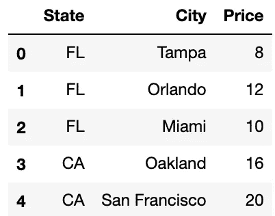

# 通过神游在 Spark 上使用 Pandera 进行数据验证

> 原文：<https://towardsdatascience.com/using-pandera-on-spark-for-data-validation-through-fugue-72956f274793?source=collection_archive---------13----------------------->

## 本教程将展示如何用赋格将熊猫库引入 Spark 和 Dask。在这个例子中，我们将使用 Spark 上的 Pandera 数据验证库。

照片由[EJ·斯特拉特](https://unsplash.com/@xoforoct?utm_source=medium&utm_medium=referral)在 [Unsplash](https://unsplash.com?utm_source=medium&utm_medium=referral) 上拍摄

# 数据有效性

数据验证是进行适当的检查，以确保数据符合我们期望的格式和规范。随着数据管道变得越来越互联，无意中破坏其他管道的变化的机会也增加了。验证用于保证上游的更改不会破坏下游数据操作的完整性。常见的数据验证模式包括检查空值或检查数据框形状，以确保转换不会丢失任何记录。其他经常使用的操作是检查列的存在和模式。使用数据验证可以避免数据流程的无声失败，在这种情况下，一切都可以成功运行，但提供的结果不准确。

数据验证可以放在数据管道的开始，以确保任何转换顺利进行，也可以放在最后，以确保在输出提交到数据库之前一切正常。这就是可以使用像[潘德拉](https://github.com/pandera-dev/pandera)这样的工具的地方。在这篇文章中，我们将制作一个小熊猫数据框来展示例子。有三列，州、城市和价格。

样本数据—每个位置的价格

# 潘德拉

Pandera 是一个轻量级的数据验证框架，有很多内置的验证器来验证 DataFrame 模式和值。当验证失败时，它提供信息性错误，并且它对已经编写的代码也是非侵入性的，因为[decorator](https://pandera.readthedocs.io/en/stable/decorators.html)可以与其他函数一起使用来执行验证。下面是我们将如何检查我们的数据，以确保**价格**在推向生产之前是合理的。

基本的 Pandera 用法

潘德拉代码是直观的。第 3–5 行定义了在**列**上执行的检查。我们正在检查价格值是否在 5 到 20 之间。第 7–10 行只是一个包装器函数(为了后面的目的)，但是我们真正需要的是调用第 9 行的 **validate** 方法来应用验证。

# 对火花(或 Dask)的需求

如果数据变得太大，熊猫无法有效处理(超过 15GB)，我们该怎么办？为了加快我们的工作，我们需要使用分布式计算框架。这就是火花和达斯克的用武之地。计算操作是在一群机器上执行的，而不是在一台机器上。

在很多情况下，我们已经为熊猫写好了逻辑，但想把它带到 Spark。一个用例是写出一个非常具体的大型验证模式。我们需要在 Spark 中重新创建该功能。不幸的是，Pandera 只适用于熊猫，这意味着我们需要从头开始重新创建。问题是定制的业务逻辑需要 Pandas 和 Spark 的两个实现。

# 赋格入门

这就把我们带到了赋格。Fugue 是一个抽象层，允许用户将 Python 或 Pandas 代码移植到 Spark 或 Dask。逻辑与执行解耦，用户只需修改一行代码就可以选择自己需要的引擎。我们可以用下面的代码来激发上面熊猫特有的逻辑。注意，第 12 行之前的所有内容都是从前面的 Pandera 代码片段中复制的。

第 15 行中的**fugeworkflow**类包含一个执行引擎。如果没有传递任何内容，则默认使用熊猫。在这个具体的例子中，我们传递了 **SparkExecutionEngine** ，它在 Spark 中执行我们所有的逻辑。 **price_validation** 函数被映射到 Spark 分区。这将加快大型数据集的验证操作。

# 按分区验证

当前的数据验证框架有一个缺点。根据我们掌握的数据，CA 和 FL 的价格范围相差很大。因为验证是按列应用的，所以我们无法为每个位置指定不同的价格范围。然而，如果我们可以对每组数据应用不同的检查，那将是理想的。这就是我们所说的分区验证**。**

这个操作对于赋格来说变得非常琐碎。我们可以稍微修改上面的例子来达到这个目的。在下面的代码片段中，第 6 行到第 12 行只是前面验证的两个版本。一个用于 FL，一个用于 CA。我们在第 14 行将它们打包成一个字典。

我们的 **price_validation** 函数也做了一些调整。首先，我们的函数现在是在假设传入的数据帧只包含一个状态(CA 或 FL)的情况下编写的。我们从第一行的 State 值中提取位置，从字典中找到适当的验证，并应用它。

另一个变化是第 24 行现在在验证之前按照州对数据进行了划分。这基本上意味着 Spark 数据帧被分割成更小的 Pandas 数据帧，并且对每个数据帧分别进行操作。 **price_validation** 函数为 CA 数据调用一次，为 FL 数据调用一次。这种验证是通过 Spark 执行引擎并行完成的。

# 结论

在这篇博客文章中，我们简要回顾了什么是数据验证。我们将 Pandera 库视为执行数据验证的一种方式。由于该库只在 Pandas 中可用，我们使用 Fugue 将它带到 Spark，这是一个抽象层，允许用户将 Python 和 Pandas 代码移植到 Spark 和 Dask。使用 Fugue，我们可以在每个数据分区上应用 Python/Pandas 包，这允许我们在这里通过分区执行**验证。**

神游也可以将其他基于熊猫的库引入 Spark。这个例子只是针对数据验证的。有关更多信息，请查看下面的参考资料。

# 资源

如果你对使用赋格感兴趣，想给我们反馈，或者有任何问题，我们很乐意在 Slack 上聊天！我们还将为对在数据工作流中应用 Fugue 感兴趣的数据团队举办更详细的研讨会。

[潘德拉](https://github.com/pandera-dev/pande)

## 赋格

[文档](https://fugue.readthedocs.io/en/latest/)
[Git 回购](https://github.com/fugue-project/fugue)
[社区闲置](https://join.slack.com/t/fugue-project/shared_invite/zt-jl0pcahu-KdlSOgi~fP50TZWmNxdWYQ)