# 使用“个性测验”和最近邻居进行推荐(英雄联盟)

> 原文：<https://towardsdatascience.com/using-personality-quizzes-nearest-neighbors-for-recommendations-league-of-legends-9ad399e7ea34?source=collection_archive---------8----------------------->

## 一个初学者友好的 N 维空间，最近邻，欧几里德距离和更多的演练

这是关于推荐方法的 3 部分系列的最后一部分(在这里找到: [1](/graph-networks-for-champion-recommendation-league-of-legends-189c8d55f2b) & [2](/pca-and-content-based-modelling-for-champion-recommendation-league-of-legends-80e909e56672) ，尽管我建议在点击离开之前继续阅读)，然而我认为这实际上是迄今为止我所写的任何文章中最入门的**，因此我建议从这里开始。对于有经验的你来说，我希望仍然有价值——但是你可能想跳过一些介绍性的部分。我会在文章里说清楚这些点在哪里。**

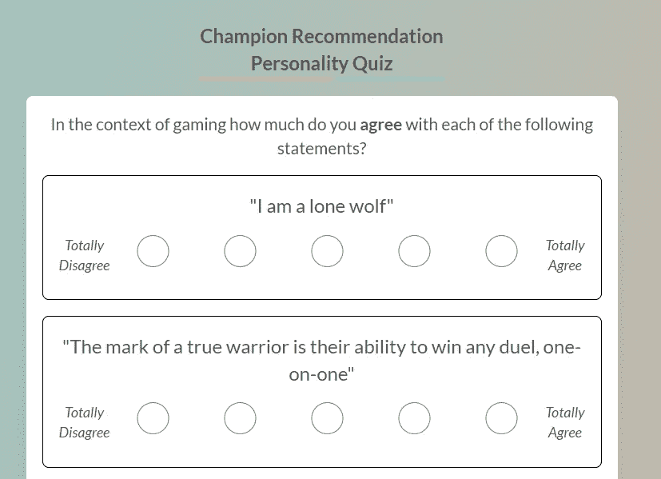

最终产品，一个能够推荐一个英雄联盟冠军的性格竞猜！自己试试[这里](http://itero.gg/champ-recommend)。图片作者。

之前，我写过两种推荐方法:

[**【用户-用户协同过滤】**](http://itero.gg/blog/champ-graph) **:** 相似的用户喜欢相似的产品。

[**【基于内容的模型】**](http://itero.gg/blog/champ-recommend) **:** 如果用户喜欢一个产品，他们也会喜欢类似的产品。

今天，我们来看看标志性的方法:**一个性格测试**。根据用户对调查问卷的回答，找到与用户最相似的产品。这在“现实生活”中是最不受欢迎的，因为它增加了太多的摩擦，而且相对不可靠。然而，它很简单，并且对推荐引擎的主题提供了很好的介绍，同时允许有更多的时间来详细了解核心概念。此外，他们很有趣。

使用的数据科学技术被称为**“最近邻居”**，这个领域的许多人会因为我称之为人工智能而排斥我。无论如何，它构成了后来许多应用程序的主干，因此清楚地理解它永远不应该被低估。

根据我的大多数文章，我使用在线游戏英雄联盟(LoL)来应用这些技术。你不需要理解游戏来理解文章，但是如果你想知道更多，这里有一个游戏的介绍。

# N 维空间导论

在本文的某个地方你会看到*“21 维空间”*。这是我失去一些人的地方。对于非数学家来说，有时会有这样的假设，那些提到第四维度以外的任何维度的人可能事实上正在与神交流，预见未来或者是部分蜥蜴类外星人。如果你在这一点上点头同意，最好完整地阅读这一部分。如果你非常熟悉 N 维空间的含义，请直接跳到最近邻的介绍。

让我们从简单的开始。如果我在研究一群人，我可能会从测量他们的体重开始。我创建了一个一维空间，名为“公斤体重”。一个人只能比下一个人更重或更轻。只有**一个**行进方向。它可以用一条简单的直线来表示。我们越向左走，它们越轻，我们越向右走，它们越重。

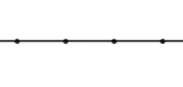

一维空间，没有比这更简单的了！图片作者。

现在我们通过增加它们的高度来移动到二维空间。我们可以绘制出那个空间里每个人的体重，以及他们的身高。一切都很容易想象。

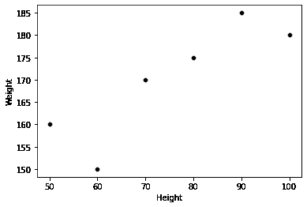

身高和体重的 2D 空间。图片作者。

当我们把他们的年薪计算在内时，事情在三维空间变得更加棘手。想象一个立方体，想象你自己在最近的左下角。你沿着宽度到他们的体重，到他们的高度，然后根据他们的工资深入立方体。你甚至可以拿着尺子跳进盒子里，测量两个人之间的距离，看看他们有多相似。

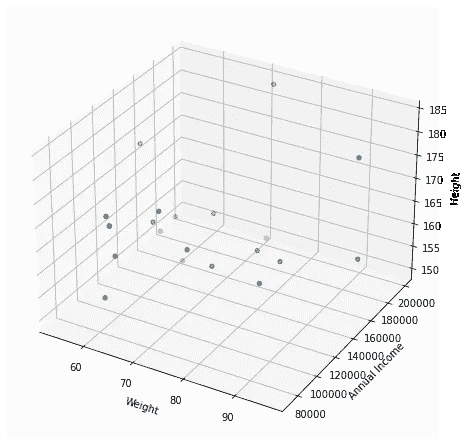

一个 3D 空间，其中点的不透明度表示年收入。图片作者。

然而，当我添加鞋号时会发生什么？我们现在有了四维空间。我们不再能够在脑海中描绘出这将会是什么样子——然而一切都没有改变！那些点仍然出现在一个空间里，只是这个空间在我们这个非常无聊的 3D 世界里无法直观的展现出来。我们甚至还可以测量两点之间的距离，只是我们必须把尺子拿开，用数学方法来计算。

无论我们有 4 维、5 维还是 4500 维，都是如此。没关系！我们不能想象任何超过 3 的东西，但是所有相同的原理和技术都可以以相同的方式应用(数学上),不管我们达到什么样的维度。

# 最近邻居介绍

不管你是跳过这里，还是读过上面，我希望当我说“N 维空间”时，我们都在同一页上。这意味着我们可以转移到实际的技术本身。

**最近邻(NN)** 就是*确切地说就是罐头上写的*。对于空间中的任意一点，找出 N 个最近邻。从字面上看，你只需选择一个点，并找到 N 个最接近该点的点。“N”可以是任何数字，但是标准 Python 实现(sklearn)默认为 5。

希望下面的观想能让这一点变得清晰。蓝色是示例点，红色是 5 个最近的邻居:

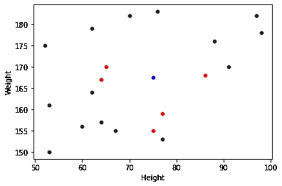

2D 空间中最近邻的直观解释。图片作者。

有一点需要明确的是，当我们说“最近”时，我们指的是什么。在上面的 2D 空间中，我们可以在屏幕上按下一把尺子，然而在难以想象的 4 维空间和更高的空间中会发生什么呢？好吧，我们用数学上相当于尺子的:**欧几里德距离**。

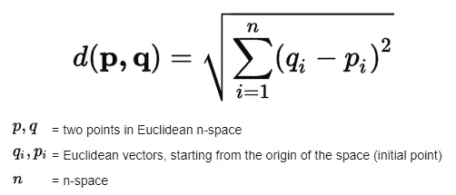

欧几里德距离方程。来源:[维基百科](https://en.wikipedia.org/wiki/Euclidean_distance)。

再次，**【vector】**这个词是许多人的另一个导火索。因此，让我们明确我们的意思(如果你知道所有这些，到**应用与你最近的邻居**！).

回到我们的人口例子。假设我们有两个人的体重和身高。

人 1:70 公斤，170 厘米

人二:90kg，185cm。

重量是矢量(70，90)，高度是矢量(170，185)。根据上面的公式，如果我们想找到它们之间的欧几里德距离，我们做每个点之间的平方差的和。像这样:

重量平方差:(人 1 重量-人 2 重量)=(90–70)= 20 = 400

身高平方差:(人 1 身高-人 2 身高)=(185–170)= 15 = 225

(体重平方差+身高平方差)的平方根)=平方根(400 + 225) =平方根(625) = 25。

个体一(70kg，170cm)和个体二(90kg，185cm)的欧氏距离为 25。

如果我们改为处理 4 个维度(体重、身高、收入和鞋码)，这些值可能是:

人 1:70 公斤，170 厘米，7 万美元，10 号鞋

人 2:90 公斤，185 厘米，95000 美元，12 号鞋

计算是相同的，除了不仅仅是身高和体重的平方差，我们还包括年薪和鞋码。试着自己算出欧几里德距离。答案在文章底部*。

# 将最近邻应用于个性测验

但这一切如何应用于推荐一个基于性格测验的英雄联盟冠军(可玩角色)？

这是如何做到的:

1.  创建一个多维空间，其中的功能有助于描述游戏中的每个冠军(目前有 152 个冠军可供选择)。
2.  让神经网络算法适合这个空间。
3.  创建一个调查，试图把这个人放在那个空间。
4.  使用神经网络算法来确定与该人的调查代表最接近的冠军。

***注意:*** *如果这还没有意义，不要担心，我们将详细介绍它。*

**第一步。**是目前为止最繁琐最耗时的。我们构建了一个脚本，从 Riot API 中获取游戏，并从中提取出所玩游戏的冠军以及在哪条泳道中。我们也抓取一些我们认为有助于描述冠军的特征，比如他们杀了多少人，他们对目标造成了多少伤害，他们阻挡了多少伤害，等等…

我有大约 800 万个游戏的信息，但那是因为我是从其他项目那里得到的。如果你想亲自尝试，我不建议你去那么高的地方。

下面是表格的一个例子，每行代表一名冠军在**一场**比赛中的表现:

显示冠军在一场比赛中的表现的表格。图片作者。

然后，我们可以使用数据帧上的分组来获得所有游戏中每个通道/冠军组合的平均值。看起来是这样的:

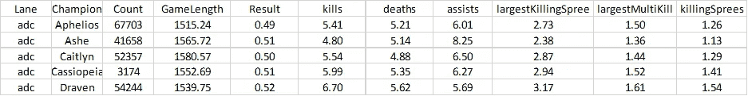

显示冠军在多场比赛中平均表现的表格。图片作者。

最后，我去掉了少于 5000 场比赛的球道/冠军组合。这消除了真正偏离元的选择(<0.25% pick rate) and ensures there’s sufficient data for the averages to converge around their true mean ([中心极限定理](https://en.wikipedia.org/wiki/Central_limit_theorem))。

然后，我们通过按通道过滤将数据帧分成 5 份。你不需要这样做，但我觉得这是一个更干净的过程，我喜欢为每条车道提供个人建议的想法。

我还从原始数据中创建了一些我认为会很有趣的附加特性。例如，我有一个冠军在没有帮助的情况下杀死别人的次数(单杀)，我也有他们杀死的总次数。我创造了一个新的特征，那就是单杀占总杀死数的百分比(单杀百分比=单杀/总杀死数)。

下一步是将数据帧转换成矩阵，其中每行代表一个冠军，有 21 个关于他们在游戏中的表现的各种统计数据，平均跨越许多样本。

然后，我们对数据进行归一化处理，并根据矩阵拟合最近邻算法，默认 N = 5。

## **关于标准化的补充说明**

同样，这篇文章真的是为任何水平的读者准备的——所以我不想只写“我们规范化了数据”而不解释和证明自己。因此，如果您对我们如何/为什么这样做感到满意，请跳过这一部分。如果不是，这里有一个简单的解释:

我们正在使用的最近邻方法完全依赖于两点之间的**欧几里德距离**。我们的问题是每个特征都在不同的**尺度上**。例如，让我们以一个冠军为例，他平均造成 50，000 次伤害，每场比赛赚 10，000 金币。

然后，我们想测量冠军和一个造成 50，000 次伤害，但只获得 8，000 金币的冠军之间的欧几里德距离。花一点时间考虑一下…

…答案是 2000。因为第一个数字(伤害:50，000)不变，所以所有的距离都来自“黄金”特性，区别在于:

10,000 – 8,000 = 2,000.

然后我们将两个平方差求和:

2,000² + 0² = 2,000²

最后，求平方根:

平方根(2000)= 2000

所以，为了减少 20%的杀戮，欧几里德距离是 2000。

现在，想象一个冠军只造成 40，000 点伤害，但仍然得到 10，000 金币。为了减少 20%的伤害，**欧几里德距离现在是 10000**！这意味着最近邻算法对伤害属性的依赖是杀死属性的 5 倍。希望这说明了这一点:

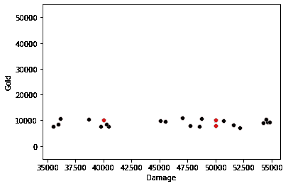

观察值 X:伤害，Y:黄金。说明距离对伤害的依赖远远超过黄金。图片作者。

那么，我们该怎么解决呢？我们**将数据标准化**。或者换句话说，我们确保所有的统计数据都在 0 和 1 之间的相同范围内。为此，我们使用以下方法:

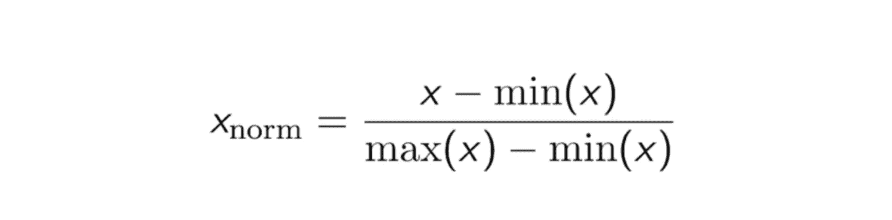

图片作者。

如果 5 个冠军的平均每场杀数是:[3，1，5，6，11]。

最小值(x) = 1，最大值(x) = 11

从列表的开头开始，x=3:

(x-min(x))/(max(x)-min(x))=(3–1)/(11–1)= 2/10 = 0.2

如果我们对列表中的所有数字都这样做，[3，1，5，6，10]=>[0.2，0，0.4，0.5，1]

杀戮现在被限制在 0 和 1 之间。我们对造成的伤害做同样的事情。现在杀戮的变化和伤害的变化一样强大。

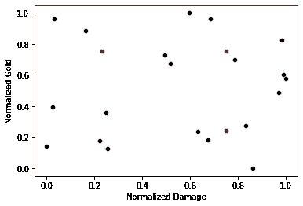

除了两个统计数据都被归一化之外，与上面的图相同。现在伤害和黄金的变化同样强大。图片作者。

# 将问卷转换成数据

在我们开始之前，我跟你说实话。这部分既是科学也是艺术。其实大部分是艺术，带着一大把盐往前走。

所以，我们有了这个 *21 维空间*(我告诉过你它要来了)。每个点代表一个冠军，他们的位置取决于这 21 个统计数据的组合。我们的下一个目标是创建一个问卷，让我们将用户放入这个空间。

为了做到这一点，我们需要根据调查者的“个性”找出 21 个统计数据中每一个的粗略近似值。换句话说，对于每一个统计数据，都需要有一个相应的问题和一种将答案转化为可用数字的方法。

为此，我选择了*“你有多同意以下说法”*式的提问。效果好的原因是因为他们的反应是有规模的，我把它设定为:

> 完全不同意、不同意、中立、同意、完全同意

然后我可以将这些陈述转换成百分位数，然后再转换成数据。一个例子应该有助于说明这一点:

我们数据集中的第一个统计数据是:在没有帮助的情况下完成的冠军猎杀的百分比。我(巧妙地)把它翻译成了下面这句话:

**《我是独狼》**

为什么？高百分比的冠军是那些在单独行动时获得大部分杀戮的人。那些百分比低的人依靠他们的队友来确保安全捕杀。因此，孤狼。这是科学的艺术部分。

因此，那些回答“完全同意”的人被认为是统计数据中前 20%的人，而那些回答“完全不同意”的人是后 20%的人。说中立的人在 40-60%之间。鉴于我们有所有冠军的统计数据，我们只是计算出他们价值的粗略估计。

为了帮助澄清这一点，让我们想象我只有 10 个冠军，我在看他们平均每场比赛杀死的数量:

每场比赛的死亡数= [1，1，2，3，3，3，4，5，7，8]

如果有人说“完全不同意”一个关于每场比赛杀球的陈述(比如“我喜欢杀很多球”)，这将使他们在这个统计中处于倒数 20%。所以，10 个冠军中倒数 20%就是倒数 2 个。对于这个人，我们会给他们每局 1 次的杀戮。为什么？上面列表中最低的 2 个值是 1 和 1。

如果其他人说“完全同意”，他们会排在前 20%。所以每场比赛要么杀 7 个要么杀 8 个。

“同意”怎么样？它在 60-80%之间，所以是 4 或 5。你明白了。

然后，我们继续从 21 个可用的统计数据中创建问题，每次都将它们的答案转换为实际值。问题及其相关统计数据的完整列表可在此处找到:

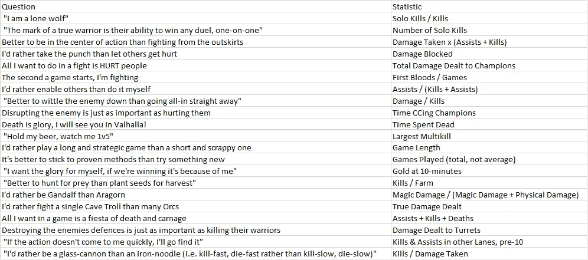

所有提问的表格，以及相关的统计数据。图片作者。

现在，当有人完成“性格测验”时，我们将每个答案转换为统计数据，归一化这些值(使用我们在原始数据集上使用的相同最小/最大值),然后，我们将他们的性格转换为我们 21 维空间中的位置！

最后一步是使用我们之前拟合的神经网络算法来确定哪些原始冠军最接近此人的回答，并向他们提供前 5 名作为推荐！

## 最后一点

你们中的一些人可能会问“但在上面的例子中，你说完全同意可能是 7 或 8，你如何选择？”。答案是，我没有。我使用了一个随机数生成器在这个范围内选择一个值。这意味着每次你回答问题时，你都会得到*稍微*不同的答案，因为你在空间中的点随机在 20%的范围内移动，所以不同的冠军变得更近/更远。一种替代方法是坚持静态答案(即 7 或 8 的中点= 7.5)，但是这意味着您在回答中获得的冠军多样性较少。另一种选择是说“在 1 到 1000 的范围内，您对该陈述的赞同程度如何”，但这感觉对用户不太友好。这里没有正确的答案。

如果你想亲自尝试成品，你可以在这里找到它。我很想听听你是否同意这个结果！

这篇文章比我通常写的要详细得多，我花了很多时间来解释更基本的概念，如维度空间和规范化。这是因为我想找个地方介绍一个完全陌生的人进入这个领域(因为我在工作中遇到了很多这样的人)。然而，我希望仍然有一些老兵发现了足够有趣的材料，值得一读。

**我在 NN 简介中设置的问题答案:25000.013*

你已经看到文章的结尾了！我叫 Jack J，是一名将人工智能应用于竞技游戏和电子竞技的专业数据科学家。我是[iTero 的创始人。GG](https://itero.gg/) 和 [**jung.gg**](https://www.jung.gg/) 。你可以在 [**Twitter**](https://twitter.com/JackJGaming) 上关注我，加入 [**iTero Discord**](https://discord.gg/hZmk3z6adP) 或者给我发邮件到 **jack@itero.gg** 。下一场见。

*最初发表于:*[*https://itero.gg/blog*](https://itero.gg/blog)