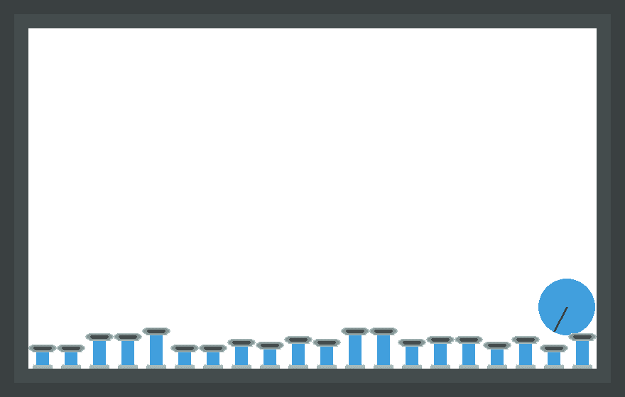
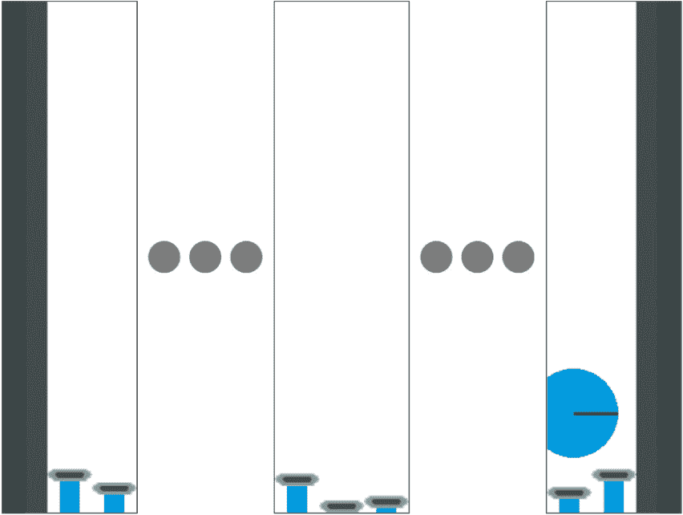

# 使用带 RLlib 的 PettingZoo 进行多智能体深度强化学习

> 原文：<https://towardsdatascience.com/using-pettingzoo-with-rllib-for-multi-agent-deep-reinforcement-learning-5ff47c677abd?source=collection_archive---------4----------------------->

**免责声明**

对于 PettingZoo 和 RLlib 的新版本，本教程不再是最新的。自从这篇文章发表以来，PettingZoo 经历了一些重大的修改，现在是 [Farama 基金会](https://farama.org/)的一部分。有关最新文档和教程，请参见 https://pettingzoo.farama.org/的[。](https://pettingzoo.farama.org/)

## 通过 RLlib 强化学习库使用 PettingZoo 多代理环境的教程

感谢[尤里·普洛特金](https://medium.com/u/bb68bf291304?source=post_page-----5ff47c677abd--------------------------------)、[罗汉·波特达尔](https://medium.com/u/84b22428198a?source=post_page-----5ff47c677abd--------------------------------)、[本·布莱克](https://medium.com/u/8f380a12a0a6?source=post_page-----5ff47c677abd--------------------------------)和[卡安·奥兹多格鲁](https://medium.com/u/8457ef414ca8?source=post_page-----5ff47c677abd--------------------------------)，他们各自创作或编辑了本文的大部分内容。

本教程概述了如何使用 [RLlib](https://docs.ray.io/en/master/rllib.html#rllib-index) Python 库和 [PettingZoo](https://github.com/PettingZoo-Team/PettingZoo) 环境进行多智能体深度强化学习。关于使用 PettingZoo 环境的更多细节可以在最近的博客文章中找到。在下面的文章中，我们将介绍如何使用两个 PettingZoo 环境来训练和评估 RLlib 策略:

活塞球——不存在非法行为，所有特工同时行动

[Leduc Hold'em](https://www.pettingzoo.ml/classic/leduc_holdem) —非法行动掩蔽，基于回合的行动

宠物动物园和滑雪球

PettingZoo 是为多代理强化学习模拟开发的 Python 库。当前的软件提供了一个标准的 API，在使用其他著名的开源强化学习库的环境中进行训练。你可以把这个库想象成类似于 OpenAI 的 [Gym](https://gym.openai.com/) 库，然而，它是为多代理强化学习而定制的。与其他类似，API 的基本用法如下:

```
from pettingzoo.butterfly import pistonball_v5env = pistonball_v5.env()
 env.reset()
 for agent in env.agent_iter():
 observation, reward, done, info = env.last()
 action = policy(observation, agent)
 env.step(action)
```

[Pistonball](https://www.pettingzoo.ml/butterfly/pistonball) 是一个合作的 PettingZoo 环境，如下图所示:



作者图片

环境的*目标*是训练活塞协同工作，尽可能快地把球移到左边。

每个活塞都作为一个独立的代理，由一个策略 *π* 控制，这个策略是用函数逼近技术训练的，比如神经网络(因此是深度强化学习)。每个代理的观察空间是每个活塞上方和侧面的一个窗口(见下文)。



作者图片

我们假设完全可观察，策略 *π* 返回一个动作，用于将活塞从+4 像素升高或降低到-4 像素(图像尺寸为 84x84 像素)。

随着每个活塞的动作，环境输出两个全局奖励

(δx/xₑ)* 100+τt

其中*δx*是球的 x 位置的变化， *Xₑ* 是球的起始位置， *τ* 是时间惩罚(默认值为 0.1)乘以时间长度 *t* 。

关于宠物动物园环境的更多细节，请查看以下[描述](https://www.pettingzoo.ml/butterfly/pistonball)。

**代码**

让我们更详细地浏览一下代码。

首先，为了运行强化学习环境，我们导入所需的库:

```
from ray import tunefrom ray.rllib.models import ModelCatalogfrom ray.rllib.models.torch.torch_modelv2 import TorchModelV2from ray.tune.registry import register_envfrom ray.rllib.env.wrappers.pettingzoo_env import ParallelPettingZooEnvfrom pettingzoo.butterfly import pistonball_v5import supersuit as ssimport torchfrom torch import nn
```

多主体强化学习环境需要分布式训练。为了设置环境，我们使用开源库 [Ray](https://docs.ray.io/en/master/index.html) 。Ray 是为构建分布式应用程序提供通用 API 而开发的框架。 [Tune](https://docs.ray.io/en/master/tune/index.html) 是一个构建在 Ray 之上的库，用于分布式强化学习中的可伸缩超参数调优。因此，我们只使用 Tune 在 [RLlib](https://docs.ray.io/en/master/rllib.html) 中执行一次训练运行。由于我们将需要使用一个定制模型来训练我们的策略 *π* ，我们首先在 RLlib 的 ModelCatalog 中注册这个模型。为了创建自定义模型，我们从 RLlib 中继承了 TorchModelV2 类的子类。

为了将 PettingZoo 环境与 Tune 一起使用，我们首先使用 *register_env* 函数注册环境。*parallelpettingzooeenv*是一个包装器，用于 PettingZoo 环境，如 Pistonball，以与 RLlib 的多代理 API 接口。SuperSuit 是一个为健身房和宠物动物园环境提供预处理功能的库，我们将在下面看到。

最初，我们在 Pytorch 中创建一个卷积神经网络模型来训练我们的策略 *π* :

```
class CNNModelV2(TorchModelV2, nn.Module):def __init__(self, obs_space, act_space, num_outputs, *args, **kwargs):TorchModelV2.__init__(self, obs_space, act_space, num_outputs, *args, **kwargs)nn.Module.__init__(self)self.model = nn.Sequential(nn.Conv2d( 3, 32, [8, 8], stride=(4, 4)),nn.ReLU(),nn.Conv2d( 32, 64, [4, 4], stride=(2, 2)),nn.ReLU(),nn.Conv2d( 64, 64, [3, 3], stride=(1, 1)),nn.ReLU(),nn.Flatten(),(nn.Linear(3136,512)),nn.ReLU(),)self.policy_fn = nn.Linear(512, num_outputs)self.value_fn = nn.Linear(512, 1)def forward(self, input_dict, state, seq_lens):model_out = self.model(input_dict[“obs”].permute(0, 3, 1, 2))self._value_out = self.value_fn(model_out)return self.policy_fn(model_out), statedef value_function(self):return self._value_out.flatten()
```

你可以在这里找到更多关于如何使用 RLlib 库[的定制模型的信息。然后我们需要定义一个函数来创建和返回环境:](https://docs.ray.io/en/master/rllib-models.html#custom-models-implementing-your-own-forward-logic)

```
def env_creator(args):env = pistonball_v4.parallel_env(n_pistons=20, local_ratio=0, time_penalty=-0.1, continuous=True, random_drop=True, random_rotate=True, ball_mass=0.75, ball_friction=0.3, ball_elasticity=1.5, max_cycles=125)env = ss.color_reduction_v0(env, mode=’B’)env = ss.dtype_v0(env, ‘float32’)env = ss.resize_v0(env, x_size=84, y_size=84)env = ss.frame_stack_v1(env, 3)env = ss.normalize_obs_v0(env, env_min=0, env_max=1)return env
```

我们使用 PettingZoo 的[并行 API](https://www.pettingzoo.ml/api) 来创建环境。函数的参数控制环境的属性和行为。我们另外使用 SuperSuit 的包装函数进行预处理操作。

第一个函数用于将环境产生的全色观察图像转换为灰度图像，以降低计算复杂度和成本。随后，我们将像素图像数据类型从 uint8 转换为 float32，将其缩减为 84x84 网格表示，并归一化像素强度。最后，为了测量球的方向变化δX(用于计算总奖励)，将 3 个连续的观察帧堆叠在一起，以提供一种简单的学习策略。

这些预处理操作的更详细的解释可以在之前的[教程](/multi-agent-deep-reinforcement-learning-in-15-lines-of-code-using-pettingzoo-e0b963c0820b)中找到。

在定义了模型和环境之后，我们可以使用配置字典中的参数，使用 tune.run()函数运行训练器。你可以在这里详细了解这些超参数[。值得注意的是，我们实例化了一个多代理特定配置，其中我们使用字典映射来指定我们的策略:](https://medium.com/aureliantactics/ppo-hyperparameters-and-ranges-6fc2d29bccbe)

policy_id 字符串→元组(policy_cls，obs_space，act_space，config)。

policy_mapping_fn 是一个将 agent_ids 映射到 policy_ids 的函数。在我们的特殊情况下，我们使用参数共享来训练活塞，如之前的[教程](/multi-agent-deep-reinforcement-learning-in-15-lines-of-code-using-pettingzoo-e0b963c0820b)中所述，即所有活塞都由 id 为‘policy _ 0’的同一策略 *π* 控制。

```
if __name__ == “__main__”:env_name = “pistonball_v4”register_env(env_name, lambda config: ParallelPettingZooEnv(env_creator(config)))test_env = ParallelPettingZooEnv(env_creator({}))obs_space = test_env.observation_spaceact_space = test_env.action_spaceModelCatalog.register_custom_model(“CNNModelV2”, CNNModelV2)def gen_policy(i):config = {“model”: {“custom_model”: “CNNModelV2”,},“gamma”: 0.99,}return (None, obs_space, act_space, config)policies = {“policy_0”: gen_policy(0)}policy_ids = list(policies.keys())tune.run(“PPO”,name=”PPO”,stop={“timesteps_total”: 5000000},checkpoint_freq=10,local_dir=”~/ray_results/”+env_name,config={# Environment specific“env”: env_name,# General“log_level”: “ERROR”,“framework”: “torch”,“num_gpus”: 1,“num_workers”: 4,“num_envs_per_worker”: 1,“compress_observations”: False,“batch_mode”: ‘truncate_episodes’,# ‘use_critic’: True,‘use_gae’: True,“lambda”: 0.9,“gamma”: .99,# “kl_coeff”: 0.001,# “kl_target”: 1000.,“clip_param”: 0.4,‘grad_clip’: None,“entropy_coeff”: 0.1,‘vf_loss_coeff’: 0.25,“sgd_minibatch_size”: 64,“num_sgd_iter”: 10, # epoc‘rollout_fragment_length’: 512,“train_batch_size”: 512*4,‘lr’: 2e-05,“clip_actions”: True,# Method specific“multiagent”: {“policies”: policies,“policy_mapping_fn”: (lambda agent_id: policy_ids[0]),},},)
```

现在，我们可以看到我们训练过的策略在环境中自动执行。在训练期间，根据 checkpoint_freq 指定的频率，在每个检查点保存策略。默认情况下，RLlib 将检查点存储在~/ray_results 中。我们首先指定检查点的路径:

```
checkpoint_path = “foo”
```

然后，我们可以加载并恢复我们训练过的策略 *π* ，并在每个时间步渲染环境时使用该策略来选择动作。我们将渲染后的视频保存为 GIF 格式:

```
with open(params_path, “rb”) as f:config = pickle.load(f)# num_workers not needed since we are not trainingdel config[‘num_workers’]del config[‘num_gpus’]ray.init(num_cpus=8, num_gpus=1)PPOagent = PPOTrainer(env=env_name, config=config)PPOagent.restore(checkpoint_path)reward_sum = 0frame_list = []i = 0env.reset()for agent in env.agent_iter():observation, reward, done, info = env.last()reward_sum += rewardif done:action = Noneelse:action, _, _ = PPOagent.get_policy(“policy_0”).compute_single_action(observation)env.step(action)i += 1if i % (len(env.possible_agents)+1) == 0:frame_list.append(PIL.Image.fromarray(env.render(mode=’rgb_array’)))env.close()print(reward_sum)frame_list[0].save(“out.gif”, save_all=True, append_images=frame_list[1:], duration=3, loop=0)
```

解决环境的 gif 可以在上面看到。

本教程中详细介绍的整个培训代码可以在[这里](https://github.com/PettingZoo-Team/PettingZoo/blob/master/tutorials/rllib_pistonball.py)找到。并且渲染的代码可以在[这里](https://github.com/PettingZoo-Team/PettingZoo/blob/master/tutorials/render_rllib_pistonball.py)找到。对于代码库的任何改进或本文遇到的任何问题，请在 PettingZoo [资源库](https://github.com/PettingZoo-Team/PettingZoo)中创建一个问题。

**Leduc 德州扑克**

Leduc Hold'em 是 AI 研究中流行的一种扑克变种详细介绍[这里](https://ai.plainenglish.io/building-a-poker-ai-part-8-leduc-holdem-and-a-more-generic-cfr-algorithm-in-python-9dd036bf9a30)和[这里](https://www.pettingzoo.ml/classic/leduc_holdem)；我们将使用双人模式。这种环境是值得注意的，因为它是一个纯粹的回合制游戏，有些动作是非法的(例如，需要动作屏蔽)。

首先，我们需要的初始代码看起来非常相似:

```
from copy import deepcopyimport osimport rayfrom ray import tunefrom ray.rllib.agents.registry import get_agent_classfrom ray.rllib.env import PettingZooEnvfrom pettingzoo.classic import leduc_holdem_v2from ray.rllib.models import ModelCatalogfrom ray.tune.registry import register_envfrom gym.spaces import Boxfrom ray.rllib.agents.dqn.dqn_torch_model import DQNTorchModelfrom ray.rllib.models.torch.fcnet import FullyConnectedNetwork as TorchFCfrom ray.rllib.utils.framework import try_import_torchfrom ray.rllib.utils.torch_ops import FLOAT_MAXtorch, nn = try_import_torch()
```

通过参数动作屏蔽使用动作屏蔽初始化合适的策略，如下所示:

```
class TorchMaskedActions(DQNTorchModel):“””PyTorch version of above ParametricActionsModel.”””def __init__(self,obs_space,action_space,num_outputs,model_config,name,**kw):DQNTorchModel.__init__(self, obs_space, action_space, num_outputs,model_config, name, **kw)obs_len = obs_space.shape[0]-action_space.norig_obs_space = Box(shape=(obs_len,), low=obs_space.low[:obs_len], high=obs_space.high[:obs_len])self.action_embed_model = TorchFC(orig_obs_space, action_space, action_space.n, model_config, name + “_action_embed”)def forward(self, input_dict, state, seq_lens):# Extract the available actions tensor from the observation.action_mask = input_dict[“obs”][“action_mask”]# Compute the predicted action embeddingaction_logits, _ = self.action_embed_model({“obs”: input_dict[“obs”][‘observation’]})# turns probit action mask into logit action maskinf_mask = torch.clamp(torch.log(action_mask), -1e10, FLOAT_MAX)return action_logits + inf_mask, statedef value_function(self):return self.action_embed_model.value_function()
```

Leduc Hold'em 中的渲染功能类似于 Pistonball，使用以下代码片段:

```
import rayimport pickle5 as picklefrom ray.tune.registry import register_envfrom ray.rllib.agents.dqn import DQNTrainerfrom pettingzoo.classic import leduc_holdem_v4import supersuit as ssfrom ray.rllib.env.wrappers.pettingzoo_env import PettingZooEnvimport PILfrom ray.rllib.models import ModelCatalogimport numpy as npimport osfrom ray.rllib.agents.registry import get_agent_classfrom copy import deepcopyimport argparsefrom pathlib import Pathfrom rllib_leduc_holdem import TorchMaskedActionsos.environ[“SDL_VIDEODRIVER”] = “dummy”parser = argparse.ArgumentParser(description=’Render pretrained policy loaded from checkpoint’)parser.add_argument(“checkpoint_path”, help=”Path to the checkpoint. This path will likely be something like this: `~/ray_results/pistonball_v4/PPO/PPO_pistonball_v4_660ce_00000_0_2021–06–11_12–30–57/checkpoint_000050/checkpoint-50`”)args = parser.parse_args()checkpoint_path = os.path.expanduser(args.checkpoint_path)params_path = Path(checkpoint_path).parent.parent/”params.pkl”alg_name = “DQN”ModelCatalog.register_custom_model(“pa_model”, TorchMaskedActions)# function that outputs the environment you wish to register.def env_creator():env = leduc_holdem_v4.env()return envnum_cpus = 1config = deepcopy(get_agent_class(alg_name)._default_config)register_env(“leduc_holdem”,lambda config: PettingZooEnv(env_creator()))env = (env_creator())# obs_space = env.observation_space# print(obs_space)# act_space = test_env.action_spacewith open(params_path, “rb”) as f:config = pickle.load(f)# num_workers not needed since we are not trainingdel config[‘num_workers’]del config[‘num_gpus’]ray.init(num_cpus=8, num_gpus=0)DQNAgent = DQNTrainer(env=”leduc_holdem”, config=config)DQNAgent.restore(checkpoint_path)reward_sums = {a:0 for a in env.possible_agents}i = 0env.reset()for agent in env.agent_iter():observation, reward, done, info = env.last()obs = observation[‘observation’]reward_sums[agent] += rewardif done:action = Noneelse:print(DQNAgent.get_policy(agent))policy = DQNAgent.get_policy(agent)batch_obs = {‘obs’:{‘observation’: np.expand_dims(observation[‘observation’], 0),‘action_mask’: np.expand_dims(observation[‘action_mask’],0)}}batched_action, state_out, info = policy.compute_actions_from_input_dict(batch_obs)single_action = batched_action[0]action = single_actionenv.step(action)i += 1env.render()print(“rewards:”)print(reward_sums)
```

与之前类似，本教程中使用的完整训练代码可以在[这里](https://github.com/PettingZoo-Team/PettingZoo/blob/master/tutorials/rllib_leduc_holdem.py)找到，渲染代码可以在[这里](https://github.com/PettingZoo-Team/PettingZoo/blob/master/tutorials/render_rllib_leduc_holdem.py)找到。如果您对这段代码有任何改进，或者对本文有任何问题，请在 PettingZoo [资源库](https://github.com/PettingZoo-Team/PettingZoo)上创建一个问题，我们很乐意提供帮助。