# 使用 pgfplots 在 LaTeX 中制作经济图表

> 原文：<https://towardsdatascience.com/using-pgfplots-to-make-economic-graphs-in-latex-bcdc8e27c0eb?source=collection_archive---------1----------------------->

## [实践教程](https://towardsdatascience.com/tagged/hands-on-tutorials)

## 用行业标准排版语言制作光滑、专业图形的通俗易懂的指南

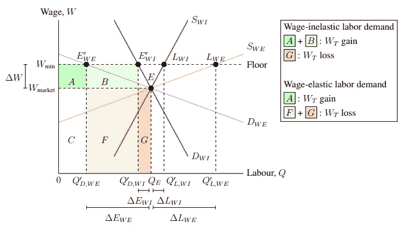

**图 0–1:**工资弹性和总收入。(图片由作者提供)

# **1。简介**

经济学大量使用图表来说明重要的概念和现象。然而，当在这个领域打一篇论文时，人们可能注意到的第一件事是使用文字处理器制作这些图表的困难。这就是乳胶发挥作用的地方。本指南将解释我们如何使用 pgfplots 包在 LaTeX 中制作精美的经济图表。

## **1.1。不熟悉乳胶？**

有些读者可能不熟悉 LaTeX。它是一种功能强大的排版语言，能够对文本、数学公式、表格以及 word 和 Google Docs 等文字处理器无法处理的许多其他元素进行排版。它的功能通过包来扩展。本指南将重点介绍使用为绘制图形而设计的包——pgfplots——制作图形，PGF plots 本身依赖于为制作图形而设计的包——TikZ。

LaTeX 强大的能力和可定制性带来了良好的学习曲线。不要绝望。本指南是在假设读者熟悉 LaTeX 的基础知识的情况下编写的，但仅此而已。(在第 8 节:资源中，您可以使用一些资源来设置和学习 LaTeX 的基础知识。)如果您可以创建一个文本文档，加载到包中，并在 LaTeX 的显示数学模式下编写一个方程，那么您不需要知道其他任何东西。尽管如果您已经熟悉 pgfplots 和 TikZ，您可能仍然会发现这里使用的一些技术对于经济图表的非常具体的特性非常有用。

## 1.2.GitHub 项目资源库

此处显示的所有完成的图表都可以在本指南的 GitHub 资源库中找到。你可以在 https://github.com/jackypacky/pgf-econ-graphs[访问知识库。在那里，可以找到所有图形的 TeX 源代码和 pdf。](https://github.com/jackypacky/pgf-econ-graphs)

## 1.3.包装

我们将使用 pgfplots 来绘制经济图表，因此应该调用 pgfplots 包。这也将调用 TikZ 和 xcolor。因为我们希望能够对曲线下的区域进行着色，所以应该调用 fillbetween pgfplots 库。因为我们希望能够指定坐标周围的位置，并在 TikZ 中使用各种箭头，所以也应该调用定位和 arrows.meta TikZ 库。此外，由于我们希望能够使用 LaTeX 的数学模式，我们需要调用 amsmath 包。总的来说，我们在文档的开头有以下代码片段:

出于个人喜好，我们将使用 Times New Roman 12 号字体，行距为 1.25 倍(相当于 1.5 倍行距)。因此，我们将使用此文档序言:

# 2.概述轴

首先，我们需要画出绘制经济图表的坐标轴。由于 pgfplots 是 TikZ 的依赖项，我们需要用`\begin{tikzpicture}`和`\end{tikzpicture}`打开和关闭 TikZ 环境。在这个环境中，为了构建 pgfplots 环境，我们插入了`\begin{axis}`和`\end{axis}`。既然我们希望经济图表位于页面的中心，那么所有这些都应该在中心环境中，用`\begin{center}`和`\end{center}`包含代码。所以我们有:

对于 axis 环境，参数影响整个图形(即缩放比例、轴刻度、网格线)，而命令影响特定的绘图(即函数、线、坐标点)。从语法上来说，需要注意的一点是，参数用逗号分隔，而命令用分号分隔。

## 2.1.axis 环境

在开始绘制函数之前，我们需要指定我们希望显示笛卡尔平面的哪个区域。为了指定域，我们使用参数`xmin = 0`和`xmax = 10`，其中 0 和 10 是域的最小和最大边界。类似地，为了指定范围，我们使用参数`ymin = 0`和`ymax = 10`分别指定最小和最大范围界限。到目前为止，我们已经有了这个图形的基本轮廓代码:

运行这段代码会产生 Figure 2–1。

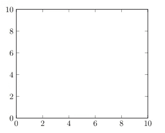

**图 2–1:**x 轴和 y 轴，带勾和框。(图片由作者提供)

## 2.2.轴线方向

我们需要做一些修改，使其适合经济图表。图表框架的默认样式是框形，图的四周都是黑线。虽然这对于折线图和散点图(pgfplots 的初衷)很好，但经济图通常有一个 L 形框架。要改变框架样式，我们需要使用参数`axis lines = style`，样式可以是`left`、`right`、`center`、`box`或`none`。figure 2–2 显示了轴线的一些样式。

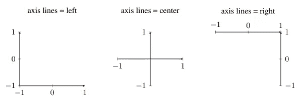

**图 2–2:**左、中和右轴线。(图片由作者提供)

显然，我们需要使用`axis lines = left`作为参数来制作大多数经济图所具有的 L 形框架。此外，轴末端的箭头可以通过在`axis lines`的末端附加一个星号来删除，所以我们使用`axis lines* = left`。

## 2.3.轴刻度、比例和剪裁

经济图表通常没有沿着轴运行的数字。这是因为它们中的大多数都是理论图表，并且不管涉及的数量级如何都适用。为此，我们需要删除沿 x 轴和 y 轴的线条和数字，它们分别称为轴刻度和轴刻度标签。实现这一点的参数分别是 x 轴和 y 轴的`xtick = {tick numbers}`和`ytick = {tick numbers}`。在`xtick`和`ytick`参数后面的花括号中，我们放置了一个由逗号分隔的数字列表，我们希望这些数字沿着各自的轴运行。由于经济图表在很大程度上保持零在左下方，我们将把它保持在 x 刻度上`xtick = {0}`。因为我们不希望 y 轴上有轴记号，所以我们写`ytick = \empty`。空轴刻度数列表是一种特殊情况。因为如果花括号内没有任何内容，pgfplots 将使用默认的轴记号，所以我们需要用`\empty`指定它是空的。为了制作非空白的轴线——例如，具有特定经验值的图表——第 4 节:经验曲线涵盖了网格线和轴刻度。

考虑到页面上图形的大小，默认的大小太小了，不能在不弄乱可用空间的情况下展示太多的插图。为了稍微增加图形的大小，我们编写了参数`\scale = 1.2`。当然，如果你有一个更复杂或更重要的插图，可以使用更大的因子来创建更大的图形。另一方面，较小的因子可以用来创建较小的图形。1.2 的比例因子占据了大约三分之一的页面。

我们需要添加的最后一个参数是`clip = false`。通常情况下，pgfplots 会切断图形外部的所有绘图，这对于自动限制函数非常有用。但是，我们希望能够将标签放在图形之外，所以我们用这个参数禁用了这个特性。相反，我们将手动指示所绘制函数的域和范围。

## 2.4 轴标签

最后，在图表上绘制任何东西之前，我们必须考虑的最后一个问题是轴标签。将它们放在轴的末端比通常放在底部(对于 x 轴)和左侧(对于 y 轴)更方便，因为我们希望将该空间用于其他东西(如可变标签和尺寸线)。要在 x 轴和 y 轴的末端放置标签，命令采用以下形式:

提醒一下，分号应该在这些行的末尾，因为它们是命令，而不是到目前为止一直使用的参数。(第 3.5 小节:标签更详细地解释了该命令工作的原因。)为了演示，我们将分别使用`$x$`和`$y$`的 x 轴和 y 轴标签。将美元符号放在 x 和 y 周围会将它们置于 LaTeX 的数学模式，允许我们编写 LaTeX 已知的数学表达式。

在考虑了所有这些因素后，我们最终得到了图 2–3:

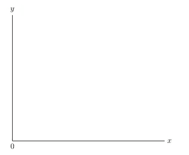

**图 2–3:**成品 x 轴和 y 轴，毛坯和 L 形。(图片由作者提供)

现在，图表已经准备好在其上绘制图形(例如函数)。产生图 2–3 的代码如下:

# 3.绘图、颜色和标签(例如无差别地图和预算约束)

有了轴，我们就可以开始在图上画画了。假设我们想用无差异曲线来解释为什么需求是向下倾斜的——这意味着需求量随着价格的上升而下降。更具体地说，我们想在商品 A 和 B 之间绘制一个无差异图，预算约束显示商品 A 的价格增加对应于商品需求量的减少。

## 3.1 绘图功能

首先，我们想画一条无差异曲线， *U₁* ，定义为，

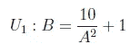

这是通过以下命令完成的:

这是一个很长的命令。让我们把它拆成碎片。`domain = min:max`的 addplot 参数将绘制的函数限制在由最小 x 值、 *min* (在本例中为 0)和最大 x 值、 *max* (在本例中为 10)限定的范围内。类似地，`restrict y to domain = min:max`将函数限制在介于*最小值*和*最大值*之间的范围内(在本例中为 0 和 10)。(将 y 限制在一个“域”中有点用词不当，因为 y 值集的正确数学术语是“范围”。)注意，我们需要定义域和范围的原因，如前所述，是因为我们禁用了 pgfplots 的裁剪特性。addplot 参数`samples = n`告诉 pgfplots 取一定数量的 x 值， *n* ，在这些值处计算函数并通过所有计算出的坐标画一条线。实际上，样本数量越多，绘制的曲线越平滑。最后一个 addplot 参数`color = colour name`不言自明。它将线条着色为颜色名称。颜色将在下一小节中详细介绍。在第 3.2 小节“颜色”中，有一个预定义颜色名称的列表，以及关于如何添加更多预定义颜色集和定义新颜色名称的解释。

转到花括号内的数学表达式，这是我们放置函数表达式`10/(x^2)+1`的地方。需要注意的是，传统的乘法并置符号(将数字和字母并排放置)会产生错误。相反，星号—“*”—只能表示乘法。否则，传统的计算机符号适用，加法、减法、除法和分组分别用“+”、“-”、“/”和“()”表示。绘制上述命令会产生 Figure 3–1。

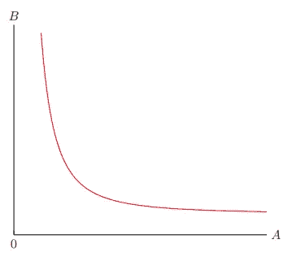

**图 3–1:**绘制好 A 和好 b 之间的无差别曲线。(图片由作者提供)

产生图 3–1 的代码是:

关于图 3–1 及其代码，需要注意的一点是 x 轴标签是 *A* ，y 轴标签是 *B* 。这是因为，在这个例子中，我们想表明商品 A 价格的增加会导致该商品需求量的减少。

自然，无差异贴图包含不止一条曲线。因此，让我们通过将第一条曲线向右平移一个单位和向上平移一个单位来绘制多条曲线。在变换符号中，这对应于(x，y)→(x1，y+1)。

在 *U₁* 上相继运用这种变换产生了 *U₂* 、 *U₃* 、 *U₄* 、 *U₅* ，

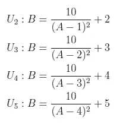

绘制所有这五条曲线会产生图 3–2。

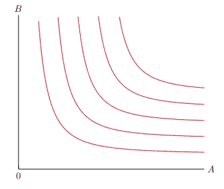

**图 3–2:**绘制好 A 和好 b 之间的差异图。(图片由作者提供)

图 3–2 中的无差异曲线由以下代码片段绘制:

请注意，每个函数的域限制是不同的。 *U₁* 被限制为 *A* ∈ (0，10)，而 *U₂* 被限制为 *A* ∈ (1，10)， *U₃* 被限制为 *A* ∈ (2，10)，以此类推。这是因为每条无差异曲线的方程都有不同的垂直渐近线，对于 *U₁* 为 *A* = 0，对于 *U₂* 为 *A* = 1，对于 *U₃* 为 *A* = 2 等等。因为我们只关心在垂直渐近线右侧的方程的图形，所以我们将效用函数限制在垂直渐近线右侧的区域。figure 3–3 说明了这种域限制。

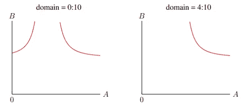

**图 3–3:**限制无差异曲线的范围。(图片由作者提供)

现在我们已经绘制了无差异图，我们需要绘制响应商品 A 价格上涨的变化的预算约束。实际上，这意味着两条对角线:一条从正 B 截距到正 A 截距，另一条从 B 截距到减少的正 A 截距。这代表了在商品 B 的最大数量保持不变的情况下，由于价格上涨，商品 A 的最大购买数量发生了变化。此外，因为我们想显示在预算约束收缩后消费者决策的变化，这两个预算约束必须与无差异曲线相切。我们将使用 *U₃* 在 *A* = 4.7 处与原始预算约束相切，使用 *U₂* 在 *A* = 3.3 处与新预算约束相切。原始和新的预算约束分别计算为等式*B*= 9.16-1.02*A*和*B*= 9.16-1.59*A*(这些是实际切线的近似值)。从逻辑上讲，这些预算约束的方程式可以预先计算或近似计算，可以手动计算，也可以用 WolframAlpha 或 Desmos 等软件计算。(比如用 WolframAlpha，输入`tangent at x = 4.7 for y = 10/((x-2)^2)+3`就能找到原来的预算约束方程，输出`y = 9.14744–1.01611x`。)使用我们之前用来绘制无差异曲线的 addplot 命令，我们可以绘制两个预算约束。

最后，为了让预算约束线在无差异图中脱颖而出，我们需要加粗它们。这是通过向 addplot 添加参数`thick`来实现的。预设的线条粗细有`ultra thin`、`very thin`、`thin`、`thick`、`very thick`或`ultra thick`——或者我们可以用`line width = width`参数定义自己的粗细，其中`width`以长度为单位。总的来说，预算约束行的代码片段如下:

将它们标绘在图上会产生图 3–4。

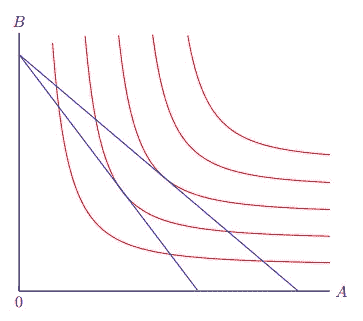

**图 3–4:**在图表上绘制预算约束。(图片由作者提供)

## 3.2.旗帜

在前面的小节中，我们使用两种颜色——红色和蓝色——来绘制函数。你可能想知道我们可以使用多少种颜色，或者如何定义新的颜色。记住，我们称之为 xcolor 包是因为它扩展了 LaTeX 处理和使用颜色的有限基础能力。

LaTeX 预定义了 19 种默认颜色:

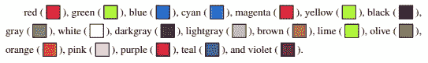

(我在第 6.2 小节解释了如何制作这些彩色方块，生成红色方块的命令是`\fcolorbox{black}{red}{\textcolor{red}{\rule{\fontcharht\font`X}{\fontcharht\font`X}}}`。)

然而，如果这些颜色太有限，xcolor 提供了多种选项来定义更多的颜色。例如，dvipsnames 选项定义了另外 68 种颜色:

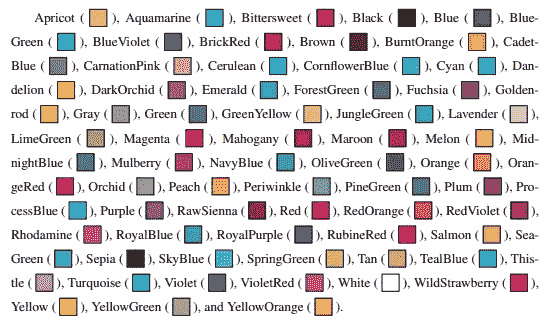

需要注意的是，这些颜色名称区分大小写。意思是 color = violet 不同于 color = VIOLET，color = Violet 会抛出错误。

为了添加 dvipsnames 调色板，我们使用 dvipsnames 选项调用 xcolor 包，所以，`\usepackage[dvipsnames]{xcolor}`。如果在 pgfplots 之后调用 usepackage 命令，将会引发错误。这是因为 TikZ 默认调用 xcolor，与这个新的 usepackage 命令冲突。所以要确保在 TikZ 包之前调用 xcolor 包。或者，如果这不起作用，那么我们可以将参数`xcolor = {dvipsnames}`添加到文档类命令中。对我们来说，我们会用，`\documentclass[12pt, xcolor = {dvipsnames}]{article}`。

除了 dvipsnames 之外，还有其他调色板，比如定义了 151 种颜色的 svgnames，或者定义了 317 种颜色的 x11names。此外，可使用命令`\definecolor{name}{model}{variable 1, variable 2, variable 3}`手动定义新颜色，其中模式为 rgb、HTML、cmyk 等。例如，浅棕色可由`\definecolor {name}{rgb}{0.95, 0.95, 0.92}`定义。

乳胶可以做很多颜色。我们可以给文本着色，使用背景色，并使页面颜色不同于标准的白色(尽管考虑到打印机的压力，这是不明智的)。其中大多数都超出了本指南的范围，因此不在讨论之列。第 8 节:资源中提供了资源，其中包括关于 xcolor 包的文档和指南。

## 3.3.绘制虚线部分

回到我们正在制作的无差异图和预算约束图，下一步是在上面画虚线。Pgfplots 有一个用于线图的命令，它会用一条穿过坐标的线将所有输入的坐标依次连接起来。原始决策点的坐标(原始预算约束与无差异曲线相切的位置)计算为(4.7，4.37)。因此，虚线将从 A 截距(4.7，0)到决策点(4.7，4.37)，再到 B 截距(0，4.37)。执行此操作的命令如下:

正如所见，这条线经过的坐标应该列在花括号内。此外，因为我们希望这条线是虚线，所以我们包含了参数`dashed`。其他两个参数`color = black`和`thick`已经在前面的小节中介绍过了。它们分别将生成的线条涂成黑色，并使其线宽变粗。对(3.3，3.9)处的新决策点重复此过程，得到图 3–5。

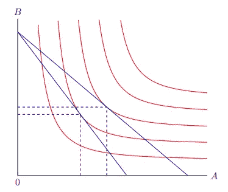

**图 3–5:**在图表上绘制虚线。(图片由作者提供)

## 3.4.绘制坐标点

方便的是，在图形上施加黑色坐标点非常类似于画一条线。事实上，为了制作散点图，pgfplots 使用了以前用于绘制连接线段的相同命令。然后添加两个参数。第一个是`mark = *`，在线连接的每个坐标处画一个实心圆。可以使用“*”以外的标记，如“x”、“+”、“|”、“o”(所有这些看起来都像代表它的字符)，以及许多其他标记。其次，为了删除这条线，我们编写了参数`only marks`。此外，为了增加标记的大小，我们添加了参数`mark size = 3`。总之，我们有以下命令来绘制坐标点:

在图上使用此命令会产生 Figure 3–6。

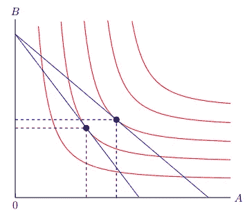

**图 3–6:**在图形上绘制坐标点。(图片由作者提供)

## 3.5.贴标签于

最后，为了完成这个图表，我们需要标注所有相关的部分。具体来说，我们需要在 A 截距和 B 截距、坐标点和函数端点附近放置字母。要标记图形的一部分，该命令采用以下形式:

该命令将在指定的坐标旁边放置一些文本，即标签。此外，标签在坐标附近的位置取决于位置，它可以是坐标的`left`、`right`、`above`或`below`。例如，要将标签 *Qₐ* 放在(4.7，0)下面，从原始决策点向下延伸的虚线与 a 轴相交的地方，我们编写以下命令:

我们之前在标注轴时已经使用了节点命令的一种形式。但是，请注意，轴标签的坐标点是不同的，因为它指的是轴的末端。使用标注命令来标注图形的其余部分，例如函数和坐标，我们最终得到图 3–7。

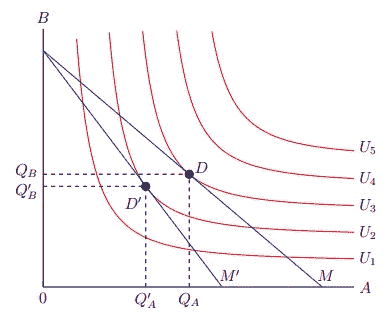

**图 3–7:**商品 A 的价格上涨对商品 A 和商品 b 之间的预算约束和无差异图的影响。(图片由作者提供)

最后，我们完成了无差异图，解释了需求下降的原因。这是因为预算从 *M* 转移到*m′*时*q′ₐ*少于 *Qₐ* 。更重要的是，我们用 LaTeX 来说明这一点！figure 3–7 由以下代码生成，结合了本节中涉及的所有元素:

# 4.经验曲线(例如市场均衡)

在本指南的开始，我假设我们正在处理一个空白图。也就是说，x 轴和 y 轴没有任何刻度，因为它们没有任何关联的值。这些类型的图表对理论模型很有用——适用于相关情况，无论数量级如何。然而，有时我们实际上有经验数据。在这种情况下，我们可能需要网格线，在网格线上绘制诸如函数、坐标、虚线等图形。需要做一些修改来将我们的“空白”图转换为服务经验值。具体来说，我们希望添加网格线，然后解决易读性问题，例如在图表中远离轴标签并在标签后面放置白色背景色以避免混乱。让我们转换一个市场均衡曲线，图 4-1，这样就能反映经验数据。

**图 4–1:**小工具市场的市场均衡(空白图上)。(图片由作者提供)

Figure 4–1 中的元素已经在前面的章节中解释过了。它由以下代码生成:

## 4.1.主网格线和次网格线

首先，我们希望轴记号和数字沿着两个轴运行。这在第 2.3 小节:轴刻度、缩放和剪裁中有简要介绍，但我们在这里主要是讨论如何移除它们。提醒一下，控制刻度的轴参数是`xtick = {tick numbers}`和`ytick = {tick numbers}`。我们希望它们是符合我们数据的数字，而不是只包含 0 或为空。在这种情况下，他们两个的滴答数集合将是`{0,1,2,3,4,5,6, 7,8,9,10}`。接下来，我们要在图表上添加网格线。我们仍然在使用轴参数，而不是命令。有用的是，有两种类型的网格线，主要网格线和次要网格线。主网格线从轴记号和数字开始延伸。同时，次要网格线从主要记号之间的较小记号延伸，并且没有与之关联的编号。他们都有不同的风格，因此可以传达更多的审美精度。要显示两个网格，包括轴参数`grid = both`。类似地，如果我们只需要一个网格或者不需要任何网格，我们将使用`major`、`minor`或`none`的值——尽管默认情况下两个网格都不显示。要设置主刻度之间的副刻度数，使用轴参数`minor tick num = number`，其中数字是副刻度数。在这种情况下，我们希望在主要刻度之间有一个次要刻度，否则会太混乱，所以次要刻度的数量是 1。此外，我们希望主要网格线是实线，次要网格线是虚线。这样，半增量和全增量在视觉上是明显的。为了将主网格线和次网格线的样式改为实线和虚线，我们分别使用`grid style = solid`和`minor grid style = dotted`。更多款式包括`dashed`、`thin`、`thick`。将网格样式定义为实心是多余的，因为这是默认的，但是我选择将其显式化。到目前为止，我们已经添加或修改了以下代码片段中的参数:

此代码片段在 x 轴和 y 轴上以 1 为增量添加从 1 到 10 的轴刻度。此外，它还显示次要网格线和主要网格线，将主要刻度之间的次要刻度数设置为一个刻度，并将主要网格线设置为实线，次要网格线设置为虚线。将这些参数用于空白市场均衡图，结果如图 4–2 所示。

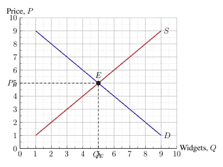

**图 4–2:**在图形上添加网格线。(图片由作者提供)

啊！太丑了。虽然我们得到了我们正在寻找的轴记号和网格线，但这导致了该图可读性的其他问题。具体来说， *Qₑ* 和 *Pₑ* 的标签需要远离轴编号，轴标签应该稍微远离图形，并且 *E* 、 *S* 和 *D* 的标签需要具有白色背景以减少混乱。另外，原点有两个零——一个就够了。

## 4.2.分隔标签，给标签背景着色

从前一个问题开始，x 和 y 截距标签需要从图表中移走，以便为轴数腾出空间。回想一下标签的形式:

虽然在大多数情况下，位置可以很好地确定标注离坐标的距离，但有时我们希望增加这个距离。在这种情况下，可以用`position = distance`指定距离。因此，例如， *Qₑ* 的位置可以更改为`below = 10pt`。对 *Pₑ* 标签重复此操作，我们得到以下代码片段:

转到后一个问题。去掉 y 轴标签 0 和移动轴标签都可以通过改变图中显示的域和范围来完成。为了去除 y 轴上的 0，我们将范围的最小值定义为 0.01(任何非常小的数字都可以，尽管这取决于数据的数量级)。所以我们有`ymin = 0.01`作为轴参数。为了使轴标签远离，域和范围的最大值都应该扩展到 10.5(这也根据数量级而变化)。总之，我们有以下代码片段:

最后，我们想把图上标签的背景涂成白色。否则，我们将被穿过 *E* 、 *S* 和 *D* 的线卡住，这看起来不太好。这也涉及到一个相对简单的调整。我们将参数`fill = white`添加到标签的节点命令中。已更改标签的代码片段如下:

*E* 的标签也已使用上一段中解释的定位参数隔开 5 磅。这样做是为了避免用白色背景覆盖供需线。有其他方法可以解决这种不便。例如，因为 pgfplots 按顺序对这些图进行分层(后面的命令覆盖前面的命令)，所以只需将标签的节点命令放在供应线和需求线曲线的上方即可。这样，供应和需求曲线的命令将在标签之后执行，并将覆盖白色背景。

综合所有这些调整，我们最终得到了图 4–3。

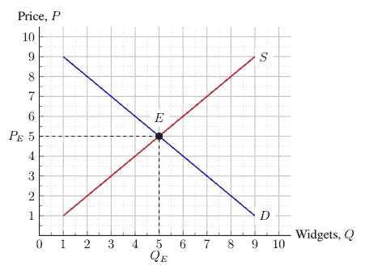

**图 4–3:**小工具市场的市场均衡。(图片由作者提供)

因此，我们已经完成了将空白图表调整为带有刻度和网格线的图表，以便它可以容纳经验数据并表示特定值。图 4–3 的代码是:

# 5.阴影、箭头和图表并排(例如。供应增加，价格接受公司)

通过绘制曲线、直线和坐标点可以做很多事情。但有时我们需要指出特征或指出图上的区域。这可以通过画箭头和用颜色在图上画阴影来实现。让我们用这些工具来解释丰收悖论:为什么农民的收入在大丰收后会下降。丰收对应于市场均衡图中供应向右移动，此时需求相对缺乏价格弹性。这在 Figure 5–1 中进行了描述。

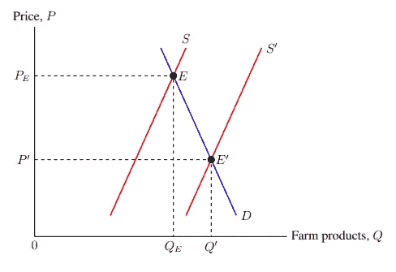

**图 5–1:**丰收对农产品市场的影响。(图片由作者提供)

figure 5–1 是使用上述章节中已经解释过的工具绘制的。代码如下:

## 5.1.不透明度和透明度

现在，两条供给曲线都是同样不透明的红色。为了使原始供给曲线和新供给曲线变得明显，我们将使新供给曲线略微透明。我们通过向 addplot 命令添加参数`opacity = opacity value`来实现这一点，其中不透明度值是绘图不透明的百分比，范围从 0(完全透明)到 1(完全不透明)。使新曲线基本透明似乎表明它是新的。所以我们为它的 addplot 命令写`opacity = 0.3`。使新的供给曲线更加透明的结果如图 5-2 所示。

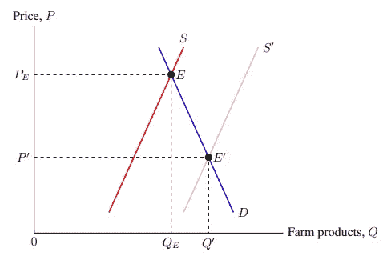

**图 5–2:**使图表上的新供应曲线更加透明。(图片由作者提供)

需要注意的是，xcolor 包——在 3.2 小节:颜色中提到过——提供了一种更简洁但可读性稍差的方法来使颜色透明。当使用一种颜色时，可以在颜色名称后使用一个感叹号，紧接着是不透明度值— `colour name!opacity value`。这个范围从 0 完全透明到 100 完全不透明。比如`red!10`多为透明，`red!50`为半透明，`red!90`多为不透明。(不过，如果我可以补充的话，那种“基本透明的红色”看起来更像鲑鱼。)

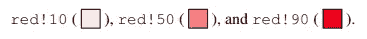

## 5.2.用颜色在方框中添加阴影

既然我们已经区分了哪条供给曲线是新的(不仅仅是使用标签*S′*)，我们还想指出代表农民总收入损失和总收入增加的区域。这样，我们可以用图表显示总收入的损失远大于总收入的增加。用颜色填充图形区域的命令采用以下形式:

在这个命令中，(A)、(B)、(C)。。。，是一个不定数量的坐标。命令用指定的颜色在由坐标定义的多边形中着色。看图，原来的均衡点是(5.5，7.67)，新的均衡点是(7，3.67)。这意味着，对于损失区域，我们需要将坐标(0，7.67)、(0，3.67)、(5.5，3.67)和(5.5，7.67)定义的正方形涂成橙色。类似地，我们将由坐标(5.5，0)、(5.5，3.67)、(7，3.67)和(7，0)定义的增益区域涂成绿色。到目前为止，我们有以下代码片段:

因为我们希望这些彩色区域不引人注目，所以颜色大部分需要透明。这可以用与前面小节“5.1 小节:不透明度和透明度”中所示的绘制方法相同的方法来完成，或者通过 TikZ 的不透明度参数，或者通过 xcolor 的感叹号符号。所以图表中使用的片段是:

不幸的是，我们不能简单地将这些命令放到 axis 环境中。有几个注意事项需要解决，以便这些彩色区域不会干扰和重叠图表上的其他要素。因为 pgfplots 按顺序处理命令，所以后面的图会叠加在前面的图上，所以填充命令应该在每隔一个命令之前，否则彩色区域会覆盖图形的另一部分。此外，由于填充命令不能在轴参数之前，应添加轴参数`axis on top`。这可确保轴线不会被绘图和其他命令覆盖。彩色区域如图 5–3 所示。

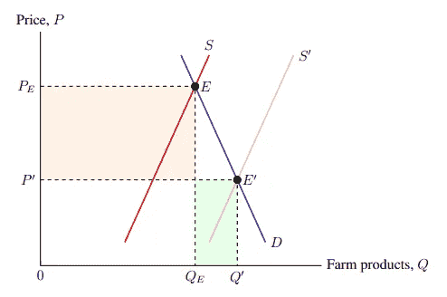

**图 5–3:**给图上的区域着色。(图片由作者提供)

## **5.3。直箭头和弯箭头**

虽然此图通过阴影区域的相对大小说明了大丰收，但它缺少关于这些阴影区域代表什么的信息。当然，读者可以从上下文中推断出橙色区域代表总收入损失，绿色区域代表总收入增加，但我们也可以使图表对他们来说更具可读性。所以让我们用弯曲的箭头标出阴影部分。此外，由于我们想说明供给曲线从原始曲线到新曲线的移动，我们可以画一个从原始曲线到新曲线的直线箭头。

从后者开始，因为这更容易，绘制箭头的命令采用以下形式:

该命令绘制一个从(A)开始到(B)结束的箭头。B 处的箭头尖端由`arrowhead`值指定。TikZ 可供选择的箭头有限，所以这就是为什么我们在 1.3 小节:包中加载了`arrows.meta` TikZ 库。有了这个库，我们可以访问更多的箭头，如`Triangle`、`Circle`、`Square`、`Diamond`等等，这些箭头都是自描述的。`Triangle`箭头最适合显示从原始供应曲线到新供应曲线的转变。

使用此命令，我们将从原始供应曲线的右侧到新供应曲线的左侧绘制一个箭头。这对应于箭头为`Triangle`的从(6.3，8.5)到(8.3，8.5)的箭头。因此，我们有以下代码片段:

虽然这可以完成工作，但是我们应该做一些改变来提高箭头的美观性和可读性。首先，如果箭头是几乎透明的红色，以显示它正在修改供应曲线，那就更好了。方便的是，这就像我们之前做的用颜色填充区域和着色图一样。我们将`red, opacity = 0.3`作为参数写入箭头的绘制命令。第二，默认情况下，箭头很小。我们想让供应曲线移动箭头稍微大一点。这稍微难一点。首先，我们用花括号将箭头值括起来，表示我们正在使用自定义箭头。于是我们有了`-{Triangle}`。然后，作为箭头值的参数*，我们添加参数`length = 4mm, width = 2mm`来修改箭头的尺寸。相应地，我们得到了供应转移箭头的最终代码片段:*

使用此命令在图表上绘制箭头，结果如图 5–4 所示。

**图 5–4:**从原始供给曲线到新供给曲线画一条直线。(图片由作者提供)

接下来，我们将标记收益和损失区域。简单地从 x 轴下方放一个垂直箭头到绿色区域会显得过于杂乱。我们将让标签 *Q* 、*Q′*和一个箭头共享这个小空间。相反，让我们画一个弯曲的箭头，从轴的右下角指向绿色区域的中心，以逆时针方向弯曲，这样就可以避开 *Q* 和*Q′*标签。使用绘图命令绘制弯曲箭头，其形式为:

请注意，除了一处增加之外，这几乎与直线箭头的命令相同。在“到”后面的方括号内，参数指定了从起点坐标到终点坐标的角度，曲线的线应在该角度处绘制。它们以弧度表示，意思是从 0 度向右，到 90 度向上，到 180 度向左，到 270 度向下，再到 360 度向右，以及其间的一切。我事先发现，弯曲箭头的起始坐标是(10，-1.5)，终止坐标是(6.5，0.7)。由于箭头应该从起点坐标向上弹出，并从右侧进入终点坐标，因此出角为 90 °,入角为 0°。所以产生指向增益区的弯曲箭头的代码片段是:

对损失区域、从顶部到橙色框的箭头重复此操作，并添加文本标签(在 3.5 小节:标签中讨论过)，我们有以下代码片段:

将直箭头和弯箭头组合起来，就产生了 Figure 5–5。

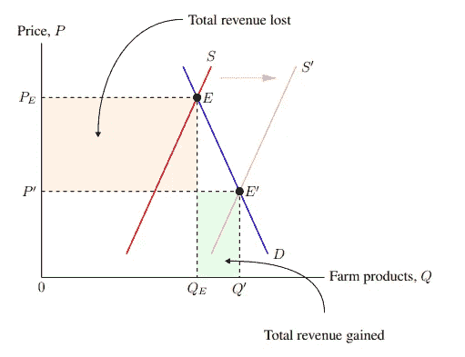

**图 5–5:**大丰收悖论:为什么农民的收入在大丰收后会减少。(图片由作者提供)

figure 5–5 由以下代码生成:

## 5.4.并排排列图表

在经济学中，通常将市场均衡图与接受价格的厂商图并列排列。这有助于显示市场的变化是如何决定单个企业的运营价格的。更一般地说，我们将使用这个例子来演示如何将图表并排放置。假设我们想说明市场均衡中的价格下降是如何导致个体农民的总经济利润下降的。这种情况下的取价图如图 5–6 所示。

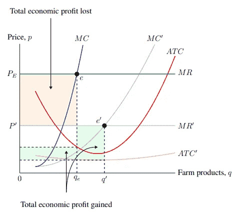

**图 5–6:**丰收对个体农民的影响。(图片由作者提供)

上图完全是用前面几节已经介绍过的工具和技术制作的。它是绘图、坐标点、标签、颜色和透明度等的组合。figure 5–6 由以下代码生成:

我们希望市场均衡图(图 5-5)位于面板的左侧，而价格接受公司(图 5-6)位于面板的右侧。令人惊讶的是，这其实很简单。我们所需要做的就是在第一个 axis 环境之后创建另一个 axis 环境，但是仍然在同一个 tikzpicture 环境中。这将把两个图形重叠在一起。然后，我们将参数`shift = (axis cs: x-shift, y-shift)`添加到第二个轴环境，其中 x 和 y 位移是第二个图形将从其原始位置移开的量。因为我们想将第二个图(价格接受公司)移到第一个图(市场均衡)的右边，所以我们将使用 17 的 x 位移和 0 的 y 位移。所以我们有:

最后，我们需要进行调整以适应页面上的图形。由于图片的宽度大于页边距所允许的范围，我们告诉 TikZ 通过加宽图片框架来忽略页边距。为此，我们在`\begin{tikzpicture}`前和`\end{tikzpicture}`后写下`\hspace*{-3cm}`，分别将图片的框架向左和向右加宽 3 厘米。总之，将所有这些放在一起会产生图 5–7。

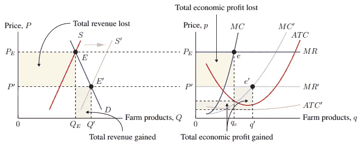

**图 5–7:**丰收对农产品市场(L)和个体农民(R)的影响。(图片由作者提供)

产生 Figure 5–7 的代码是:

使用命令和参数执行代码，分别生成图 1 和图 2 的图 5–5 和图 5–6。(同样，图 5–7 的完整代码可以在 GitHub 库[https://github.com/jackypacky/pgf-econ-graphs](https://github.com/jackypacky/pgf-econ-graphs)上获得。)

## 5.5.曲线下区域的阴影

结束这一部分，我们将简要讨论如何对曲线下的区域进行着色，以及如何对两条曲线之间的区域进行着色，因为这在前面的示例中没有涉及。假设我们想用透明的蓝色在商品 A 和商品 B 之间的生产可能性边界下的区域涂上阴影，以说明存在的不一定有效的产出可能性。生产可能性边界如图 5-8 所示。

**图 5–8:**A 和 B 之间的生产可能性边界(无阴影)。(图片由作者提供)

产生 Figure 5–8 的代码是:

为了在两个函数之间的区域进行着色，我们使用了一个命令，其形式为:

其中`parameters`是修改 addplot 命令的参数，`f`和`g`是函数的*名称路径*。对于参数，我们将使用`blue`和`opacity = 0.1`来创建一个透明的蓝色，类似于我们在第 5.1 小节:不透明度和透明度中所做的。

然而，为了输入名称路径`f`和`g`，我们首先需要预先定义名称路径。为了定义曲线的名称路径，我们将参数`name path = label`添加到 addplot 命令中，其中`label`是我们想要分配给它的名称。因此，我们将使用 addplot 参数`name path = frontier`作为绘制生产可能性曲线的命令。因为我们需要另一个函数，在这个函数之间我们可以对这个区域进行着色，并且因为我们想要对曲线下的区域进行着色，我们需要绘制一条由公式 *y* = 0 定义的新曲线，并将其命名为`axis`。对于这个新的轴曲线，我们添加 addplot 参数`line width = 0pt`使其不可见——因为我们不希望它出现在图表上。

总的来说，生产可能性曲线下区域的阴影如图 5-9 所示。

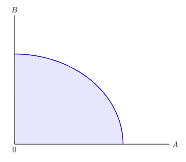

**图 5–9:**A 和 b 之间的生产可能性边界

figure 5–9 由以下代码生成:

# 6.轴尺寸线、标签中的换行符和图例(例如消费税)

继续我们关于增强图表可读性的讨论，现在让我们在图表上加上尺寸线和图例。我们可以添加一个图例来显示每个区域所代表的内容，而不是在图表上放置一个标签来指向彩色区域。此外，为了表明两个轴标签之间的差异和含义，可以使用尺寸线。尺寸线是在图表、图形和绘图中用来表示大小、数量和距离(尺寸)的线。在尺寸线的每一端，都有一条垂直线与之相连，就像“T”一样。(尺寸线看起来有点像这样:“|—–|”。)

我们将使用消费税图表来说明尺寸线的用途。假设我们想说明汽油消费税的税收归宿。图 6–1 显示了这一点。

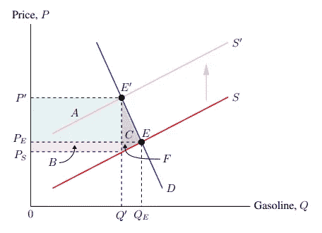

**图 6–1:**汽油消费税的影响。(图片由作者提供)

产生图 6–1 的代码是:

## 6.1.在标签中添加尺寸线和换行符

添加尺寸线的方式与绘制箭头的方式相同。回想一下，箭头命令采用以下形式:

我没有告诉你的是箭头可以被附加到箭头的末端和起点。因此，尾部和头部带有箭头的箭头的形状为:

尺寸线使用箭头“|”，这是对箭头外观的一种很好的符号描述。我们有:

*Qₑ* 和*q′*的区别在于征收消费税后消耗的气体量减少。为了在图上进行说明，我们将从*q′*的底部到 *Qₑ* 绘制一个尺寸指示器。在此之下，我们将添加一个带有文本“消费减少”的标签由于*q′*处于 *Q* = 4.14，而 *Qₑ* 处于 *Q* = 5.05，我们有:

我们想对消费者事件——在 *Pₑ* 和*p′*之间——和生产者事件——在 *Pₛ* 和 *Pₑ* 之间重复这一点。然而，简单地复制上面的内容是行不通的，因为标签宽度会太大。相反，我们需要在两个标签中的两个单词之间插入一个换行符。这是通过添加参数`align = left`来告诉堆叠的文本应该如何对齐(左对齐、右对齐或居中)，并通过添加两个反斜杠—“\ \”—在我们希望换行的地方来完成的。因此，消费者和生产者事件的尺寸线和标签代码为:

添加一条从 *Pₛ* 到*p′*的尺寸线来表示总税收，并添加到目前为止提到的所有尺寸线和标签，结果如图 6–2 所示。

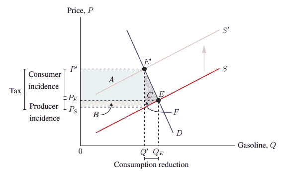

**图 6–2:**向图形添加尺寸线。(图片由作者提供)

## 6.2.添加图例

使用图例，我们可以指定图形上的区域 *A* 、 *B* 、 *C* 和 *F* 代表什么。添加图例结合了上一小节中使用的几个命令和参数。虽然 pgfplots 有自己内置的图例功能，但使用起来相当笨拙。相反，我们将使用一个文本标签，并将其放在图表的右上角。标签应该允许换行符，并有一个黑色的边框。因此，我们将使用:

回想一下，向节点命令添加参数`align`允许在标签中使用换行符——使用`\\`。此外，由于对齐方式设置为左对齐，文本行将向左对齐。这些在前面的小节中已经介绍过了。然而，新的是`draw`节点参数，它在标签周围画了一个黑色边框。在该命令中，图例的左上角将位于(10.5，10)，这对应于图形的右上角，也就是我们希望图例所在的位置。添加描述这些区域代表什么的文本，我们有:

使用上面的节点命令向图表添加一个图例，我们得到 Figure 6–3。

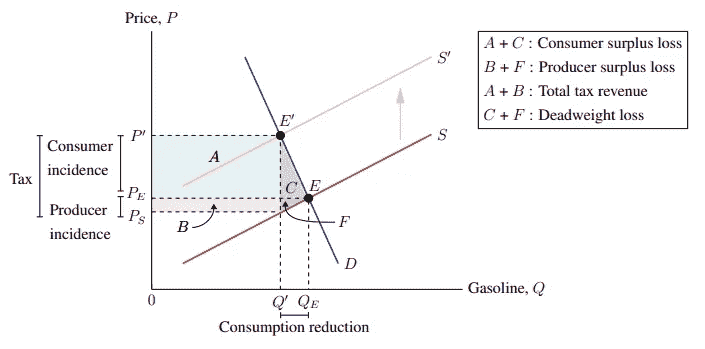

**图 6–3:**向图表添加图例。(图片由作者提供)

照目前的情况来看，这个传说看起来有点无聊。为了提高图例的美观性，我们可以给字母 *A* 、 *B* 、 *C* 和 *F* 添加一个彩色背景，以便在视觉上将图例与它们所指向的彩色区域联系起来。如果 *A* 被涂成非常透明的蓝绿色， *B* 被涂成非常透明的紫罗兰色，以此类推，效果会很好。

幸运的是，xcolor 包有一个命令可以做到这一点。向文本添加彩色背景的 xcolor 命令采用以下形式:

在该命令中，框架颜色是环绕彩色背景边缘的颜色。背景色是文本后面的颜色。对于图例中的 *A* 文本，因为我们希望它的背景是非常透明的蓝绿色，所以我们需要的命令是:

请注意，该命令没有以分号结尾，这是因为它不是 TikZ 命令。

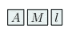

虽然 *A* 看起来不错，但是背景颜色的宽度是由其中文本的宽度决定的。因此，当我们对不同宽度的文本使用多种背景颜色时，遇到了一个障碍。例如， *M* 的背景颜色比 *l* 的背景颜色要宽。除了彼此，不一致的宽度是显而易见的。为了解决这个问题，我们将使用 makebox LaTeX 命令(`\makebox[width]{text}`)，宽度为“X”，高度为(`\fontcharht\font`X`)。这意味着我们将用来为字母制作彩色背景的命令是:

如果不把它分成几个部分来处理的话，看起来会让人不知所措。

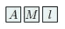

你可能不熟悉重音符“`”。在传统的美式键盘上，它位于左上角。它在 LaTeX 中有多种用途，包括引号和给字符添加重音符。(例如，使用`\`a`给“a”添加重音符会产生“à”。)这样， *M* 正好和 *l* 一样宽。不幸的是，控制高度要困难得多，我将在本指南中跳过它。如果我们想要一个没有文字的彩色框，我们可以使用:

运行上面的命令产生一个透明的蓝绿色的盒子。

这是因为`\rule{width}{height}`产生了一个矩形的墨水滴。顺便说一句，这就是我在本指南中介绍颜色的方式。最后，因为添加图例通常会使图表的宽度大于页边距所允许的宽度，所以我们在`\begin{tikzpicture}`之前和`\end{tikzpicture}`之后添加了`\hspace*{-3cm}`。当我们遇到同样的问题时，我们也在 5.4 小节:并排排列图表中这样做了。

总的来说，我们有以下图例的代码片段:

将此添加到图表中，我们得到图 6–4。

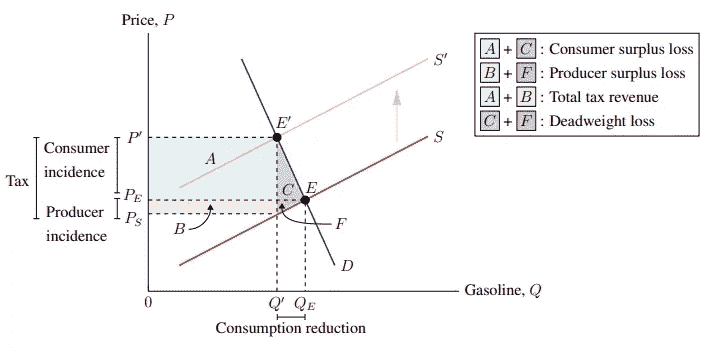

**图 6–4:**汽油税对消费、生产和总税收的影响。(图片由作者提供)

还有维奥拉。我们添加了尺寸线和图例，进一步传达了图表不同部分的含义。现在，任何人看到这张图表都会明白，消费者承担了大部分税收负担和汽油消费税的盈余损失——以及原因。(假设供给相对价格弹性，需求相对价格弹性。)产生图 6–4 的代码是:

# 7.结论

有了这个工具箱，你几乎可以创建任何经济图表。学习 pgfplots 和 LaTeX 的努力是值得的。一方面，大多数文字处理器，如 Google Docs(带 Google Sheets)和 word(带 Excel)可以提供经济图表的必需品——轴、线、曲线和标签——PGF plots 具有更大的灵活性，从阴影区域到添加虚线，再到添加尺寸线。一切都很有型。

当然，既然是乳胶，这只是冰山一角。每个人都站在巨人的肩膀上。首先，Donald Knuth 创建了 TeX 来排版文档。然后 Leslie Lamport 创造了 LaTeX 作为 TeX 的标记。然后 Till Tantau 在这个基础上创造了 TikZ 来创造图形。在这一系列事件之后、之前和之间，还有许多其他对我们所站的巨人做出贡献的人。最后，我们偶然发现，我们可以为经济学创造美丽而流畅的图表。

然而，我们总是可以做得更多。例如，我们可以通过定义变量和自动计算交点来自动创建图形。但是，这超出了本指南的范围。

如果我成功地完成了我的工作，你已经部分地扩展了 LaTeX 在制作图表这一领域的著名学习曲线。如果我没有，你就被抛弃了，没有任何关于如何开始你的提升的指导(至少，没有来自我的指导！).让我们期待前者。

# 8.资源

【LaTeX 入门和学习

*   德州直播:[http://www.tug.org/texlive/](http://www.tug.org/texlive/)。这是一个安装 TeX、TeXworks IDE 和一些普遍存在的包(包括 pgfplots 和 xcolor)的门户。
*   背面:【https://www.overleaf.com/】T2。如果安装 LaTeX 是一项太大的任务，那么有许多在线 LaTeX 编辑器足以完成本指南。背面已经安装了 pgfplots 和 xcolor，所以您不需要担心这一点。在定价方面，他们提供了一个免费版本，其中包含了所有的基本要素，只缺少一些专业功能，如 GitHub 集成或实时协作。
*   维基百科上的乳胶:【https://en.wikibooks.org/wiki/LaTeX】T4。本指南解释了 LaTeX 的基本工作原理。从安装 LaTeX 到制作文档，再到更多的技术方面，如盒子，Wikibook 都有解释和附带的代码。
*   TeX-LaTeX 栈交换:[https://tex.stackexchange.com/](https://tex.stackexchange.com/)。Stack Exchange 是一个论坛，人们可以在这里提问和回答问题。该分论坛专门处理包括 pgfplots 在内的 LaTeX。当然，如果你有一个问题，首先使用搜索功能来检查它是否已经回答过。然后，看规则，问吧。

**Pgfplots 和 TikZ 导轨**

*   Pgfplots 包装指南背面:[https://www.overleaf.com/learn/latex/Pgfplots_package](https://www.overleaf.com/learn/latex/Pgfplots_package)。Pgfplots 设计用于制作线形图和散点图。我们必须将它用于经济图表。但是，如果您想将 pgfplots 用于更常规的目的，请阅读下页的指南。
*   Kevin Goulding 为经济学家提供的 use package { TikZ:[http://static . latex studio . net/WP-content/uploads/2016/06/tikzforeconomists-110619150244-PHP app 01 . pdf](http://static.latexstudio.net/wp-content/uploads/2016/06/tikzforeconomists-110619150244-phpapp01.pdf)。这是另一个用 LaTeX 制作经济图表的指南。然而，它使用 TikZ，并且是在 pgfplots 发布之前编写的。由于 pgfplots 是 TikZ 的依赖项，Kevin Goulding 指南中解释的代码可能适用于使用 pgfplots 制作经济图表。

**包安装链接和文档**

虽然上面的 LaTeX 编辑解决方案——TeX Live 和 over leaf——已经预装了这些包，但是如果你没有这些包或者想要最新的版本，你可以通过这些 CTAN 链接访问它们。此外，软件包手册可以在 CTAN 上找到，但要注意它们是数百页的技术文档。

*   https://ctan.org/pkg/pgfplots CTAN PGF plots 套餐:。这个 pgfplots 包安装链接也是 TikZ 附带的。
*   https://ctan.org/pkg/xcolor CTAN[xcolor 套餐](https://ctan.org/pkg/xcolor)。

# 9.其他示例

同样，本指南中所有完成的图表 PDFs 和代码——都可以在 GitHub 存储库中找到，包括下面的例子。该知识库可以在 https://github.com/jackypacky/pgf-econ-graphs[的](https://github.com/jackypacky/pgf-econ-graphs)访问。

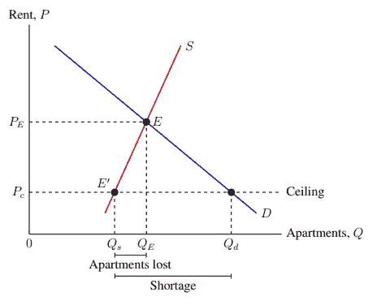

**图 9–1:**租金管制对租赁市场的影响。(图片由作者提供)

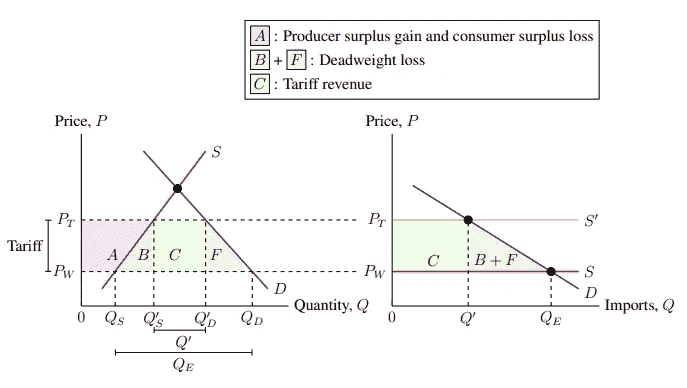

**图 9–2:**小经济体关税对国内市场(L)和进口市场(R)的影响。(图片由作者提供)

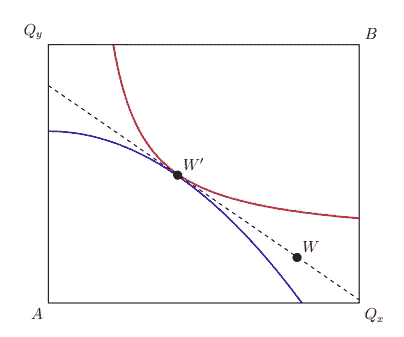

**图 9–3:**两个消费者 A 和 B 以及两种商品 x 和 y 之间的市场均衡 W′(图片由作者提供)