# 使用 Plotly Express 创建交互式散点图

> 原文：<https://towardsdatascience.com/using-plotly-express-to-create-interactive-scatter-plots-3699d8279b9e?source=collection_archive---------5----------------------->

## 使用测井数据创建交互式散点图的示例

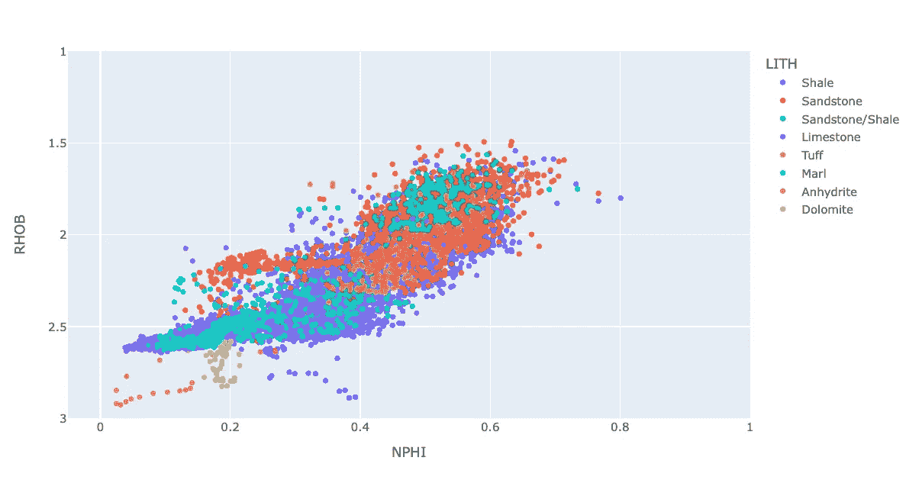

图示测井数据的散点图。图片作者。

散点图允许我们从一个数据集中绘制两个变量，并对它们进行比较。从这些图中，我们可以了解这两个变量之间是否存在关系，以及这种关系的强度如何。

在岩石物理散点图中，通常称为[交会图](https://en.wikipedia.org/wiki/Cross-plot)。它们通常用作岩石物理解释工作流程的一部分，可用于多种任务，包括:

*   用于粘土或页岩体积计算的粘土和页岩端点识别
*   离群点检测
*   岩性识别
*   碳氢化合物识别
*   岩石分类
*   回归分析
*   更多

在这个简短的教程中，我们将看到如何使用流行的 [Python](https://plotly.com) 绘图库 [Plotly](https://plotly.com) 生成散点图。

# 普洛特利图书馆

Plotly 是一个基于网络的工具包，用于生成强大的交互式数据可视化。这是非常有效的，可以用很少的代码行生成图。这是一个受欢迎的库，包含各种各样的图表，包括统计、金融、地图、机器学习等等。

Plotly 库有两种主要用途:

*   Plotly Graph Objects，这是一个用于创建图形、轨迹和布局的低级接口
*   Plotly Express，它是 Plotly 图形对象的高级包装器。Plotly Express 允许用户键入更简单的语法来生成相同的绘图。

这也是我们在本教程中所要关注的。在以下教程中，我们将了解如何:

*   创建用分类数据着色的 2D 散点图
*   创建用连续数据着色的 2D 散点图
*   将轴设置为对数

我的 YouTube 频道上有本教程的视频版本:

# Jupyter Plotly 教程

## **导入库**

在本教程中，我们将使用两个库。Pandas，作为 pd 导入，将用于加载和存储我们的数据，以及 Plotly Express，这是本教程的主要重点，将用于生成交互式可视化。

```
import plotly.express as px
import pandas as pd
```

**加载&检查数据**

我们将在本文中使用的数据集来自 Xeek 和 FORCE([https://xeek.ai/challenges/force-well-logs/overview](https://xeek.ai/challenges/force-well-logs/overview))举办的岩性预测机器学习竞赛。竞赛的目的是从由 98 口训练井组成的数据集中预测岩性，每口井的测井完整性程度不同。目的是根据测井测量预测岩相。要下载该文件，请导航到上面链接的数据部分。原始数据源可在:[https://github . com/bolgebrygg/Force-2020-机器学习-竞赛](https://github.com/bolgebrygg/Force-2020-Machine-Learning-competition)下载

一旦数据加载完毕，我们可以通过调用`df`来查看数据帧。正如您在下面看到的，数据集有 18，270 行和 30 列，这使得它很难在单一视图中可视化。因此，pandas 会截断显示的列数。

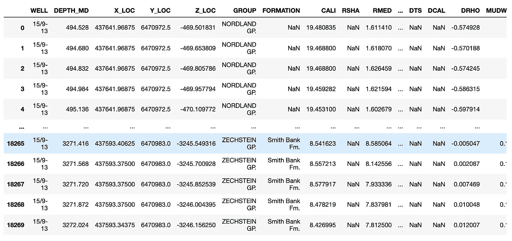

为了查看所有的列，我们可以调用`df.columns`来查看所有可用的列:

```
Index(['WELL', 'DEPTH_MD', 'X_LOC', 'Y_LOC', 'Z_LOC', 'GROUP', 'FORMATION','CALI', 'RSHA', 'RMED', 'RDEP', 'RHOB', 'GR', 'SGR', 'NPHI', 'PEF','DTC', 'SP', 'BS', 'ROP', 'DTS', 'DCAL', 'DRHO', 'MUDWEIGHT', 'RMIC','ROPA', 'RXO', 'FORCE_2020_LITHOFACIES_LITHOLOGY', 'FORCE_2020_LITHOFACIES_CONFIDENCE', 'LITH'],
      dtype='object')
```

现在我们可以看到我们所有的列，如果需要，我们可以很容易地调用它们。

## 创建简单的 2D 散点图

用 [plotly express](https://plotly.com/python/plotly-express/) 创建散点图非常简单。我们调用`px.scatter`并传入数据帧，以及 x 轴和 y 轴的关键字参数。

```
px.scatter(df, x='NPHI', y='RHOB')
```

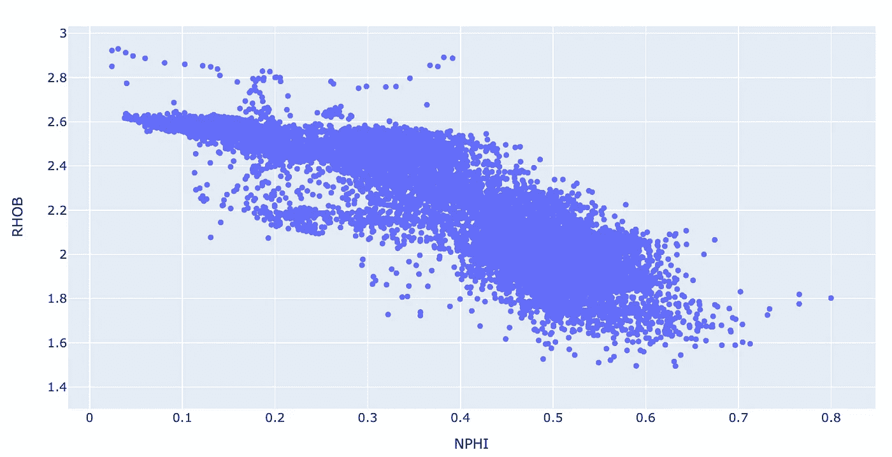

体积密度(RHOB)与中子孔隙度(NPHI)的简单 2D 散点图。图片由作者提供。

当我们运行上面的代码时，我们得到了密度(RHOB)和中子孔隙度(NPHI)数据的基本散点图。

当处理这种类型的数据时，通常将 y 轴(RHOB)从大约 1.5 克/立方厘米缩放到大约 3 克/立方厘米，并将缩放比例反转，使得最大值在轴的底部，最小值在轴的顶部。

对于 x 轴，数据通常从-0.05 到 0.6，但是，当我们有超过 0.6 的数据点时，我们将最大值设置为 1(代表 100%孔隙度)。

为此，我们需要传入两个参数:`range_x`和`range_y`。要反转 y 轴，我们可以先传递最大的数字，然后传递最小的数字，就像这样:`range_x=[3, 1.5]`。

一旦我们添加了范围参数，我们将得到以下代码:

```
px.scatter(df_well, x='NPHI', y='RHOB', range_x=[-0.05, 1], range_y=[3, 1])
```

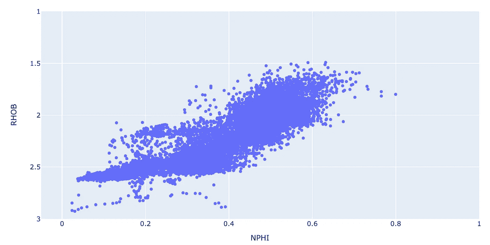

体积密度(RHOB)与中子孔隙度(NPHI)的简单 2D 散点图。图片由作者提供。

## 将轴改为对数轴

有些情况下，我们希望以对数刻度显示数据。这可以应用于单个轴或两个轴。

在下面的例子中，我们使用的数据略有不同。该数据是从沿着岩心样本以指定间隔进行的岩心栓测量中获得的。

```
core_data = pd.read_csv('L05_09_CORE.csv')
core_data
```

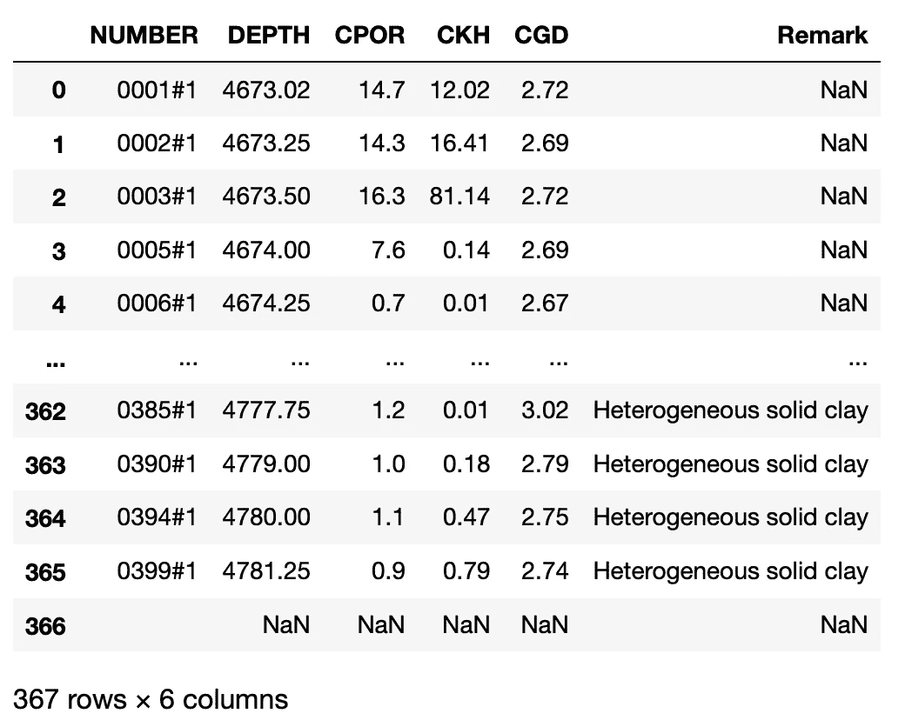

熊猫生成的井芯数据的前五行和后五行。作者图片

现在让我们创建一个简单的散点图，称为 poro-perm 交会图。这种类型的绘图通常用于分析岩心数据内的趋势，并推导岩心测量孔隙度和渗透率之间的关系。然后，可将其应用于测井得出的孔隙度，以预测连续渗透率。

和以前一样，创建散点图就像调用`px.scatter`一样简单。

```
px.scatter(core_data, x='CPOR', y='CKH', color='CGD', range_color=[2.64, 2.7])
```

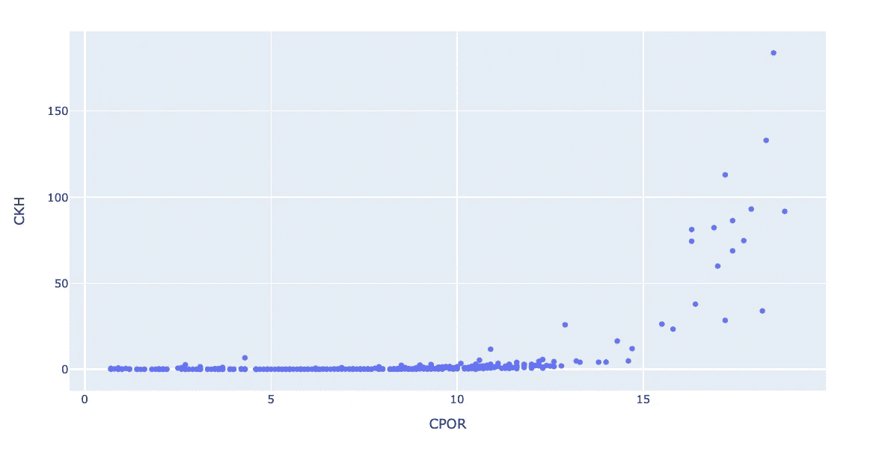

在线性-线性标度上绘制的岩心孔隙度与岩心渗透率。图片由作者提供。

我们可以看到生成的图看起来不太对。这是因为渗透率(CKH)的范围可以从低至 0.01 mD 到数千 mD。为了更好地理解数据，我们通常以对数标度显示。

为此，我们可以添加一个名为`log_y`的参数，然后指定我们想要显示数据的对数范围。在这种情况下，我们将设置为 0.01 至 1，000 mD。

```
px.scatter(core_data, x='CPOR', y='CKH', log_y=[0.01, 1000])
```

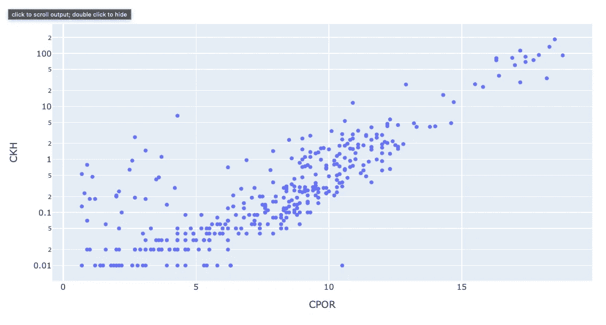

岩心孔隙度与岩心渗透率以对数线性标度绘制。图片由作者提供。

## 用连续变量添加颜色

为了更深入地了解我们的数据，我们可以通过在颜色参数中设置第三个变量，将它添加到散点图中。在这个例子中，我们将传入 GR(伽马射线)曲线。

```
px.scatter(df_well, x='NPHI', y='RHOB', range_x=[-0.05, 1], range_y=[3.5, 1], color='GR')
```

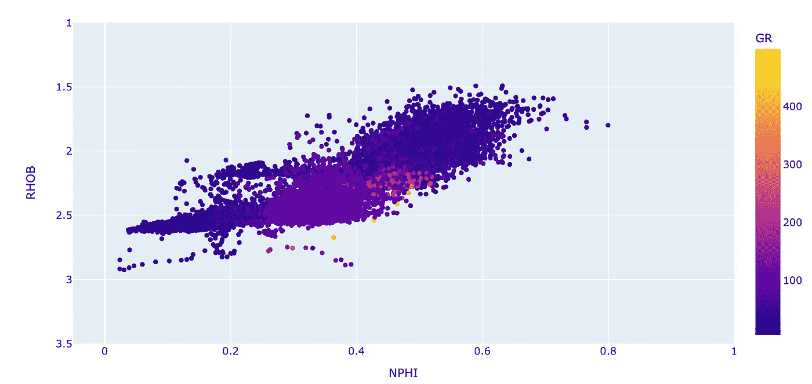

如你所见，颜色有点暗淡。这是因为 GR 曲线的范围从 0 延伸到超过 400 API 的值。通常这种类型的数据在 0 到 150 API 的范围内。为了显示第三个变量的更多细节，我们可以通过设置一个从 0 到 150 的`range_color`参数来改变颜色范围。

```
px.scatter(df_well, x='NPHI', y='RHOB', range_x=[-0.05, 1], range_y=[3.5, 1], color='GR', range_color=[0,150])
```

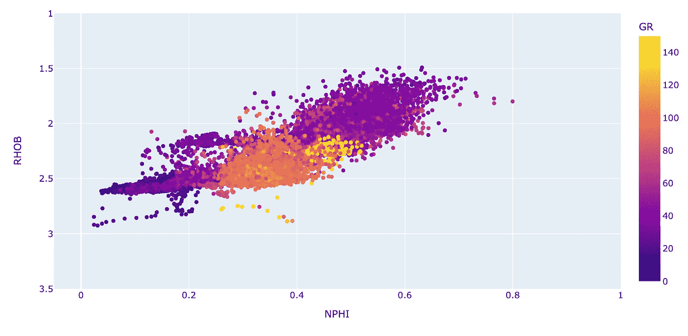

用伽马射线着色的中子孔隙度与体积密度散点图。图片由作者提供。

## 用分类变量添加颜色

我们还可以使用分类变量来可视化数据中的趋势。通过将 dataframe 中的`GROUP`列传递到`color`参数中，这可以很容易地添加到我们的散点图中。

```
px.scatter(df_well, x='NPHI', y='RHOB', range_x=[-0.05, 1], range_y=[3.5, 1], color='GROUP')
```

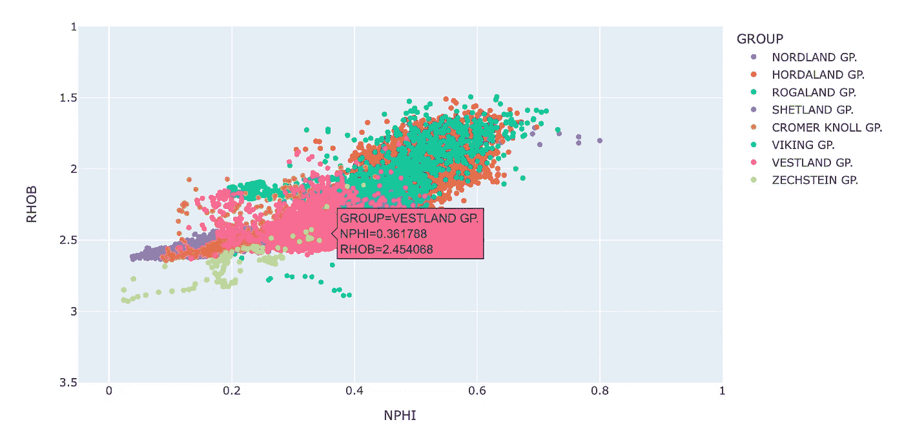

中子孔隙度与体积密度散点图，按地质分组着色。图片由作者提供。

如果我们只想显示几个组，我们可以在图例中的名称上单击鼠标左键，这将关闭该组。

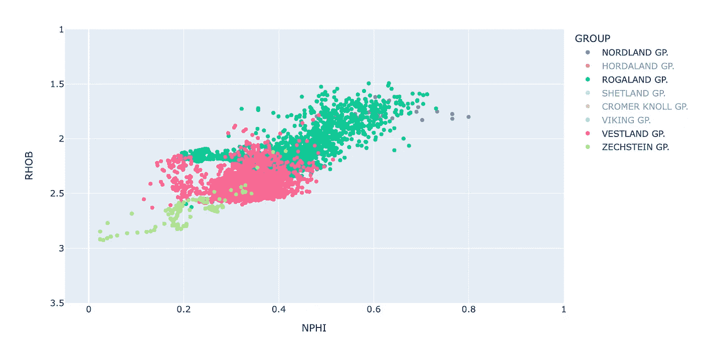

中子孔隙度与体积密度散点图，由选定的地质组着色。图片由作者提供。

# 摘要

从上面的例子可以看出，Plotly Express 是一个强大的数据可视化库。它允许你用最少的代码创建非常强大和交互式的情节。颜色形式的额外信息可以增强我们对数据的理解，以及它是如何分布在不同类别中或随着另一个变量而变化的。

*感谢阅读！*

*如果你觉得这篇文章有用，请随时查看我的其他文章，这些文章从不同的角度研究了 Python 和测井数据。你也可以在* [*GitHub*](https://github.com/andymcdgeo) *找到我在这篇文章和其他文章中使用的代码。*

*如果你想联系我，你可以在*[*LinkedIn*](https://www.linkedin.com/in/andymcdonaldgeo/)*或者我的* [*网站*](http://andymcdonald.scot/) *找到我。*

*有兴趣了解更多关于 python 和测井数据或岩石物理学的知识吗？跟我上* [*中*](https://andymcdonaldgeo.medium.com/subscribe) *。*

如果你喜欢阅读这些教程，并想支持我作为一名作家和创作者，那么请考虑报名成为一名媒体成员。一个月 5 美元，你就可以无限制地阅读数千篇各种主题的文章。如果您使用 [**我的链接**](https://andymcdonaldgeo.medium.com/membership) **，**注册，我将为您赚取一小笔佣金，无需额外费用！

<https://andymcdonaldgeo.medium.com/membership> 