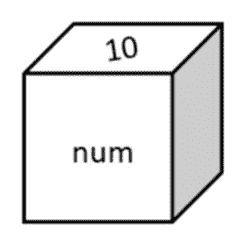
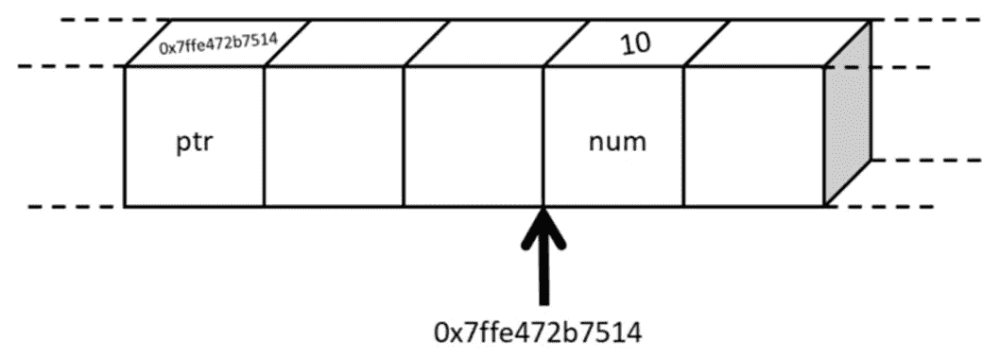
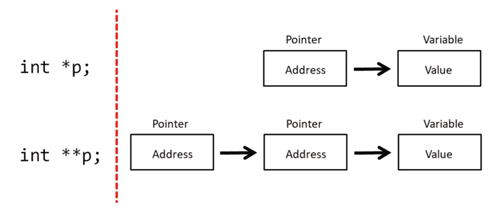

# 在 C #中使用指针

> 原文：<https://towardsdatascience.com/using-pointers-in-c-95ba8802e3d4?source=collection_archive---------15----------------------->

## 简介


亚历山大·巴甫洛夫·波德瓦尼摄于 Pexels

假设您熟悉编程概念，并熟悉 Python 或 r 等现代高级语言。C 编程语言自 20 世纪 70 年代初就已出现，是一种通用编程语言，用于从网络编程到视频游戏，再到数据科学的各种用途。与 Python 等语言不同，C 是一种编译语言。这意味着它通常需要更长的开发时间，因为每次运行时都需要编译。另一方面，最终编译的程序将比解释语言运行得快得多。一些依赖于性能的 Python 包，如 **numpy** 和 **pandas** 有一部分是用 C 语言编写的，C 也可以用来创建速度很重要的数据产品。C 语言的一个特点是它使用指针。这篇简短的文章将通过几个例子介绍 C 语言中的指针。

让我们首先快速浏览一个基本的 C 程序及其结构。

```
#include <stdio.h>int main(void);int main(void)
{
    printf("Hello world\n\r");
    return 0;
}
```

对于不熟悉 C 语言的人来说，上面的程序会在屏幕上显示消息“Hello world”。第一行包括标准的输入和输出头文件，其中包含有用的函数，如用于输出消息的 **printf()** 。下一行是一个函数原型，告诉编译器将有一个名为 main 的函数，它将返回一个整数值，并且不带任何参数。其次是函数本身。所有的 C 程序都需要一个名为“main”的函数，它是第一个被执行的函数。在函数内部(由左大括号和右大括号{})我们有 main 函数的主体，它使用 **printf()** 函数显示文本字符串“Hello world ”,后跟换行符“\n”和返回符“\r”。最后返回数字零。这可以用来检查程序是否仍在运行。

## 什么是指针？

指针是一种变量，它允许我们通过内存中的地址来存储另一个变量在内存中的位置。变量名就像是我们引用这个位置的标签，所以我们可以访问存储在那个位置的值。在 C 语言中可以使用指针，原因有很多，包括:

*   微控制器编程
*   创建动态数据结构(如链表)
*   访问存储在数组中的信息
*   优化程序以运行更快和/或使用更少的内存

如果我们声明一个整数变量，并将其命名为 **num** ，我们可以给它赋值(例如 10):

```
int num = 10;
```

这类似于创建一个“盒子”来存储值，并给这个盒子一个标签来引用里面的值，如下图所示。



作者图片

我们实际上可以使用 C 语言中的&符号(操作符的地址)输出变量存储的地址(内存中的位置)。

```
printf("Address of num is %p", &num);
```

这给出了输出:

```
Address of num is 0x7ffe472b7514
```

当然，根据数据在实际设备内存中的存储位置，这个输出在不同的机器上会有所不同。指针是为处理这种类型的数据而设计的，可以在 C 语言中通过在变量名前加一个星号(*)来声明，也称为间接或取消引用运算符，因为它是间接工作的。

```
int *ptr = &num;
```

这里我们创建一个指向整数的指针(指针类型必须与它所指向的对象类型相同)并用变量 **num** 的地址初始化它。下图以图形方式显示了这一点，其中方框代表内存中的位置。我们可以在盒子的前面看到变量名，在盒子的顶部看到存储的内容。你可以看到变量 **num** 存储在内存中的位置 0x7ffe472b7514，这也是指针变量的值。



作者图片

这允许我们通过指针间接地操作存储在那个位置的值。

我们可以写一个简短的程序来输出变量的值、变量的地址、指针以及指针所指向的值:

```
#include <stdio.h>int main(void);int main(void)
{
    int num = 10;
    int *ptr = &num; printf("Value of num = %d", num);
    printf("\n\rAddress = %p", &num);
    printf("\n\rPointer ptr = %p", ptr);
    printf("\n\rValue pointer is pointing at = %d", *ptr);

    return 0;
}
```

百分比符号是占位符，指示要放在文本字符串中的值的类型。 **%d** 用于整数， **%p** 用于指针的值。该代码产生以下输出:

```
Value of num = 10
Address = 0x7ffe472b7514
Pointer ptr = 0x7ffe472b7514
Value pointer is pointing at = 10
```

## **这有什么帮助？**

本质上，你可以使用一个指针指向任何相同类型的变量(例如，任何整数、双精度、字符等)。).这可用于改变/更新相同类型的许多不同变量的值。使用指针时，执行时间也更快。更有效地访问存储器。它们还可以用来访问数组和结构的元素，并通过引用而不是通过值将参数传递给函数。它们对于需要访问特定内存位置的低级编程任务也很有用。我们将快速浏览一下其中的一些特性。

## 指针符号

可以用几种不同的方式声明指针。以下两个例子都是有效的:

```
int* p = &i;
```

或者

```
int *p = &i;
```

您还可能遇到箭头操作符(->)，它与指向结构或联合的指针变量一起使用。

结构是允许几种不同的变量类型一起存储在单个数据结构中的数据结构。在这个例子中，我们创建了一个名为 **person** 的结构，它包含一个由 100 个字符组成的数组(一个字符串)来表示这个人的名字，一个整数表示他们的年龄，一个浮点数表示他们的薪水。然后，我们创建一个指向这个名为 **deptManager** (部门经理)的结构的指针，并将其设置为 **NULL** 。在 main 函数中，我们使用内存分配函数 **malloc** 为这个结构创建一些内存，然后使用指针的名称，后跟箭头操作符来提供姓名、年龄和薪水的值。我们使用字符串库(string.h)中的字符串复制函数( **strcpy** )将名称值复制到字符串变量中。最后，我们用 **printf** 函数输出这些值。

```
#include <stdio.h>
#include <string.h>int main(void);struct person {
    char name[100];
    int age;
    float salary;
};struct person *deptManager = NULL;int main(void)
{
    deptManager = (struct person*)malloc(sizeof(struct person));
    strcpy(deptManager->name, "Derek Sanders");
    deptManager->age = 47;
    deptManager->salary = 22.000; printf("Department manager's name = %s", deptManager->name);
    printf("\n\rDepartment manager's age = %d", deptManager->age);
    printf("\n\rDepartment manager's salary = %f", deptManager->salary);

    return 0;
}
```

哪些输出:

```
Department manager's name = Derek Sanders
Department manager's age = 47
Department manager's salary = 22.000
```

写 **deptManager- >年龄**与写 **(*deptManager)相同。年龄**

您还可以通过在变量前添加更多星号来创建指针对指针等:

```
*p;
**p;
***p;
…
```



作者图片

## **指针和数组**

我们也可以在数组中使用指针。例如——我可以使用一个字符数组生成一个文本字符串，并将其命名为 **myName** ，将其值设置为我的名和姓。我可以使用索引(在 C 中从 0 开始)来访问数组的元素。为了得到字母“A”，我可以输出数组的第一个元素**我的名字【0】**。这种表示法掩盖了指针的使用，所以我们可以使用指针表示法来达到同样的目的:

```
int main(void)
{
  char myName[] = "Alan Davies"; printf("The first letter of my name is %c", myName[0]);
  printf("\n\rThe first letter of my name is %c", *(myName));
  printf("\n\rThe first letter of my surname is %c", myName[5]);
  printf("\n\rThe first letter of my surname is %c", *(myName + 5)); return 0;
}
```

对于后续元素，我们可以只添加索引，因此对于第 5 个元素“D ”,我们可以添加 5，以此类推。这会产生以下输出:

```
The first letter of my name is A
The first letter of my name is A
The first letter of my surname is D
The first letter of my surname is D
```

这也可以应用于更高维的阵列。我们可以编写一个程序来创建一个 8×8 的矩阵，并用随机数填充它。我们可以这样做:

```
#include <stdio.h>
#include <stdlib.h>int main(void);int main(void)
{
    int x, y;
    int data[8][8]; for(x=0; x<8; x++)
    {
        for(y=0; y<8; y++)
        {
            data[x][y] = rand()%100;
        }
    }
    return 0;
}
```

这里我们声明一个二维数组来存储矩阵值。然后，我们使用两个 for 循环遍历矩阵中的行和列，使用来自 **stdlib** 库的 **rand()** 函数添加一个随机数。这可能会产生类似下面的 if 输出。

```
49 21 62 27 90 59 63 26
40 26 72 36 11 68 67 29
82 30 62 23 67 35 29 2
22 58 69 67 93 56 11 42
29 73 21 19 84 37 98 24
15 70 13 26 91 80 56 73
62 70 96 81 5 25 84 27
```

我们可以使用指针用更紧凑的代码实现同样的事情:

```
#include <stdio.h>
#include <stdlib.h>int main(void);int main(void)
{
    int i, data[8][8]; for(i=0; i<64; i++)
        *(*data + i) = rand()%100;

    return 0;
}
```

在这个例子中，我们使用指针指向内存中的矩阵位置，并为每个矩阵元素生成一个随机数。这与前一个例子归档了相同的最终目标，但是使用了指针。

使用指针访问多维数组中的数据有几种不同的方式。例如，要获取第一行和第一列中的元素，我们通常会写:

```
data[0][0]
```

我们可以写:

```
*data[0]
```

或者甚至:

```
**data
```

对于零以上的元素，如 **data[0][1]** ，我们可以编写以下任何一个:

```
data[0][1]
*(data[0] + 1)
*(*data + 1)
```

## **指针和变量范围**

指针的另一个有用的方面与变量范围有关。假设您想创建一个简单的函数，将传递给它的变量的值加倍。您可以编写一个简单的函数，将数字作为参数，然后将值加倍并输出。如果在调用 double 函数之前和之后输出变量的值，变量的值将保持不变，因为我们没有更新原始变量的值。

```
#include <stdio.h>int main(void);
void doubleVariable(int);void doubleVariable(int var)
{
    var = var * 2;
    printf("\n\rvariable = %d", var);
}int main(void)
{
    int num = 10; printf("num = %d", num);
    doubleVariable(num);
    printf("\n\rnum after doubling = %d", num);

    return 0;
}
```

因此，输出将是:

```
num = 10
variable = 20
num after doubling = 10
```

如果我们想更新原始值，我们可以改变程序来使用指针。

```
#include <stdio.h>int main(void);
void doubleVariable(int*);void doubleVariable(int *var)
{
    *var = *var * 2;
    printf("\n\rvariable = %d", *var);
}int main(void)
{
    int num = 10; printf("num = %d", num);
    doubleVariable(&num);
    printf("\n\rnum after doubling = %d", num); return 0;
}
```

它产生:

```
num = 10
variable = 20
num after doubling = 20
```

注意，C 知道在乘法运算中使用星号和在基于上下文的指针中使用星号的区别。在这个例子中，我们将变量的地址传递给一个指针参数，它可以更新原始变量。在某些情况下，这可以作为创建全局变量的替代方法，并通过引用而不是通过值来传递变量。

## **指针和字符串**

C #中的字符串表示为字符数组。您可以明确指定在方括号之间使用多少个字符，或者由字符串的长度来定义:

```
char myStr[20] = "This is my string";
char myStr[] = "This is my string";
```

我们可以更新这些字符串的值。例如，我们可以在原始字符串上复制一个新字符串:

```
char myStr[20] = "This is my string";
printf("myStr = %s", myStr);
strcpy(myStr, "New string");
printf("\n\rmyStr = %s", myStr);
```

它将输出:

```
myStr = This is my string
myStr = New string
```

我们也可以将指针与字符串一起使用:

```
char *newStr = "A new string";
```

我们可以用同样的方式输出字符串:

```
printf("\n\rnewStr = %s", newStr);
```

我们不能像以前那样更新这个字符串。如果你以这种方式声明一个字符串，它被大多数编译器存储在只读存储器中，所以不能被更新。这对于创建不可变的字符串很有用。我们也可以使用内存分配函数为一个字符串创建可以访问的内存。然后我们可以更新字符串。

```
char *newStr = (char*)malloc(sizeof(char)*4);
newStr = "Alan";
printf("String = %s", newStr);
newStr = "Dave";
printf("\n\rString = %s", newStr);
```

使用字符指针也适用于单个字符。当与 string 一起使用时，它们实际上指向一个空终止字符串的第一个字符(\0)。

最后，我们可以用它们来节省内存。例如，假设我们有一个水果列表(一个字符串数组)。我们可以说明列表中有多少项(即 5)，然后每个项有多少个字符(即 15)。我们也可以像这样输出第一项“苹果”。

```
char fruitList[5][15] = {
    "Apples",
    "Pears",
    "Oranges",
    "Bananas",
    "Mangos"
};printf("Fruit[0] is %s", fruitList[0]);
```

这里的缺点是，我们使用了比我们需要(即 75 字节)更多的字节(每个字符是一个字节)来存储数据，因为我们允许每个单词最多 15 个字符，即使他们不需要全部 15 个字符。我们可以通过使用指针来改进这一点，因此我们只使用我们需要的字节数:

```
char *fruitList[5] = {
    "Apples",
    "Pears",
    "Oranges",
    "Bananas",
    "Mangos"
};printf("Fruit[0] is %s", fruitList[0]);
```

## **一句警告的话**

指针的误用也会导致问题。权力越大，责任越大——您可能会覆盖内存中存储的其他信息，带来灾难性的后果。当您声明一个指针并试图在指向某个地方之前更新它的值时，就会发生这种情况。例如:

```
int *p;
*p = 10;
```

应该是这样的:

```
int i, *p;
p = &i;
*p = 10;
```

## **总之**

c 语言是一种编译语言，与许多其他现代语言相比，它更接近于计算机的一些低级功能。c 程序编译运行很快。当我们需要为性能(例如实现机器学习算法)或用其他语言(例如 Python)创建数据科学库编写最佳代码时，这可能特别有利。虽然指针最初很难掌握，但它是一个特别强大的工具，可以以多种不同的方式使用，包括优化程序以使用更少的内存和/或运行更快。