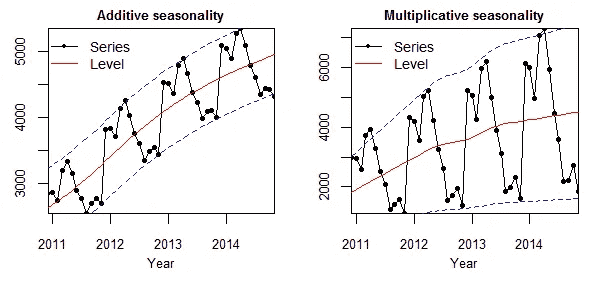

# 在 COVID 之后使用 Prophet？先看这个。

> 原文：<https://towardsdatascience.com/using-prophet-after-covid-read-this-first-fc27cd77f3d7?source=collection_archive---------9----------------------->

## 如何处理 **COVID 对时间序列数据的影响**？**加法 vs 乘法**，选哪个？如何处理**非日常数据**？


弗里达·布莱德森在 [Unsplash](https://unsplash.com?utm_source=medium&utm_medium=referral) 上拍摄的照片

> Prophet 是基于**加法模型**预测**时间序列数据**的程序，其中非线性趋势与**年、周、日季节性**、**加上假日效应**相符合。它最适用于具有强烈季节效应的时间序列和几个季节的历史数据。Prophet 对缺失数据和趋势变化具有很强的鲁棒性，通常情况下,**能很好地处理异常值,**。

通过使用可分解的时间序列模型，Prophet 模型有三个主要组件:

```
**y(t) = g(t) + s(t) + h(t) + e(t)**g(t): **trend** functions that models *non-periodic* changes; 
s(t): **seasonality** functions that models *periodic* changes; i.e. weekly, monthly, yearly seasonality;
h(t): **holdiay** function that represents the effects of potentially irregular scheduled holidays;
e(t): **error** terms that represents changes that are not captured by the model;
```

如果你是 Prophet 新手，想了解更多的细节，请查看这些令人敬畏的媒体文章([一篇](https://medium.com/future-vision/intro-to-prophet-9d5b1cbd674e)、[两篇](https://medium.com/swlh/facebook-prophet-426421f7e331)、[三篇](https://medium.com/future-vision/the-math-of-prophet-46864fa9c55a))以及[原始出版物](https://doi.org/10.7287/peerj.preprints.3190v2)，它们可以让你快速而深入地开始。假设您已经使用过 Prophet 模型有一段时间了，并且理解了基本原理，那么本文涵盖了在新冠肺炎之后使用 Prophet 建模时间序列时迟早会遇到的 3 个重要的高级主题。

*   *如何应对 COVID 的冲击？*
*   *加法 vs 乘法模型？选哪个？*
*   *如何处理非日常数据？*

# **1。如何应对 COVID 的冲击？**

COVID 的影响已经渗透到方方面面。如果你正在处理时间序列数据，你可能已经注意到 2020 年后一些奇怪的模型表现。这就像是由 COVID 对时间序列数据的趋势和季节性的影响所驱动的。有几种方法可以处理这个问题。

## 方法 1:将 COIVD 视为“假日”事件

模特没有情感。我们可以做一个简单的“把戏”，让模型将 COVID 视为一个事件或“假日”。这个概念很简单。就像在假日购物季期间，我们预计购物中心的客流量会增加一样，该模型会将 COVID 视为一个特殊的“假日”，估计购物中心的客流量会减少。下面的代码将完成这项工作。

```
COVID_lockdown = pd.DataFrame({
        'holiday': 'covid',
        'ds':  pd.date_range(start='2020-03-15', 
                             end='2020-05-01',
                             freq='D'),
        'lower_window': 0,
        'upper_window': 0,
        'prior_scale': 1 
        })
```

然而，这种方法很棘手，因为有太多的外部因素(州政策变化)使得 COVID“假日”效应在不同时间和不同场景下不一致。

## 方法 2:简单地丢弃或替换 2020 COVID 数据(有风险)

这是最简单的方法。只需丢弃 2020 年的数据或在 2019 年数据的基础上插入 2020 年的数据。然而，正如你可以想象的，这种方法是非常不可靠的，尤其是当你有短的历史数据。我们仍然希望包括 2020 年的真实数据，以帮助模型了解季节性。然而，如果您的时间序列数据总体上逐年稳定，并且您认为 COVID 在您的数据中不再起作用，则该方法值得测试。

## 方法 3:指定“pre_covid”和“post_covid”季节性

COVID 可能会创建一个周季节性模式，该模式在疫情/锁定期间与疫情之后不同。此方法将允许您训练两个独立的季节性模式，这可能对某些时间序列数据有所帮助。然而，在实验过程中，我发现这种方法产生的模型性能最差。因此，请再次考虑使用两种不同的季节来模拟您的数据是否有意义。

```
#define pre and post covid period
def is_postcovid_seasonality(ds):
            date = pd.to_datetime(ds)
            return date.date() >= pd.to_datetime('2021-03-15').date()
dfprophet['pre_covid_seasonality']=~dfprophet['ds'].apply(is_postcovid_seasonality)
dfprophet['post_covid_seasonality'] = dfprophet['ds'].apply(is_postcovid_seasonality)#add pre-covid and post-covid seasonality to the model 
base_model.add_seasonality(name='pre_covid_seasonality', period=7, fourier_order=3, condition_name='pre_covid_seasonality')
base_model.add_seasonality(name='post_covid_seasonality', period=7, fourier_order=3, condition_name='post_covid_seasonality')
```

## 方法 4:添加与 COVID 相关的回归变量，例如 google mobility

在许多业务场景中，这可能是处理 COVID 影响的最佳方法。我们将在此添加流动性数据等外部回归变量，以帮助模型获得 COVID 的影响。由于那些外部回归变量将极大地吸收 COVID 的影响，这将使 COVID 对季节性的影响最小化。以下是一些你可以使用的公开可用指标。[消费者信心指数(CCI)](https://data.oecd.org/leadind/consumer-confidence-index-cci.htm#indicator-chart) ，[谷歌流动性](https://www.google.com/covid19/mobility/)， [COVID 案例预测](https://covid19.healthdata.org/united-states-of-america?view=infections-testing&tab=trend&test=infections)

```
#add a list of external regressors
regressors = ['CCI','google mobility','covid cases']
for regressor in regressors:
            base_model = base_model.add_regressor(regressor,
                                                  prior_scale=1,  
                                                 standardize='auto',   mode='multiplicative')
```

需要注意的一点是，其中一些指标可能只是暂时可用的，如谷歌移动数据，它也不提供预测数据。为了利用它，我们可能需要对这些外部变量做自己的预测。尽管如此，包括这些指标将大大提高模型性能。当 COVID 影响消退，我们有了更稳定的时间序列数据时，我们可能只需要重新访问模型。

# *2。加法 vs 乘法模型？选哪个？*

第二个话题也有很多问题和讨论。你可能知道 Prophet 对于**季节性和回归量**有两种模式，一种是加法模式(默认)，另一种是乘法模式。
加性模式下，季节性/回归量逐年不变；而在乘法模式下，季节性/回归量的大小随着趋势而变化(见下图)。



尼古拉·考伦茨的加法与乘法季节性

先知的公式可以写成:

```
df['yhat'] = df['trend'] * (1 + df['multiplicative_terms']) + df['additive_terms']
```

由于季节性和回归量都有两种模式，因此有四种组合:

## 案例 1:附加季节性，附加回归量

***【yhat(t)=趋势(t) +季节性(t)+β*回归量(t)***
意思是回归量增加一个单位会产生 yhat 的β增加。

## 案例 2:倍增季节性，倍增回归量

***yhat(t) = trend(t) * (1 +季节性(t) + beta *回归量(t))***
意思是回归量增加一个单位会产生 yhat 的 beta *趋势增加。

## 案例 3:加性季节性，乘性回归

***【yhat(t)= trend(t)*(1+beta *回归量)+季节性(t)***
意为回归量增加一个单位将产生 yhat 的 beta *趋势增加。

## 案例 4:乘法季节性，加法回归

***yhat(t)= trend(t)*(1+beta *季节性(t)) +回归量(t)***
意思是回归量增加一个单位会产生 yhat 增加一个单位。

## **一般规则:**

因此，在选择加法或乘法模式之前，要问一个问题——回归变量中的一个单位变化是否总是有恒定的影响？或者它将取决于趋势的基础。通常，使用乘法模式更有意义，因为我们可以想象季节性的大小与趋势的大小是一致的。更多信息见[本](https://facebook.github.io/prophet/docs/multiplicative_seasonality.html)。

例如，夏季气温升高一度，必然会比冬季气温升高一度引发更多的冰淇淋销售。所以在这种情况下，乘法模型更有意义。


[Jared](https://unsplash.com/@tsuneya?utm_source=medium&utm_medium=referral) 在 [Unsplash](https://unsplash.com?utm_source=medium&utm_medium=referral) 上拍照

**然而，由于 COVID…** ，规则略有不同

由于 COVID 的影响，2020 年的数字可能非常低，因此如果我们使用乘法季节性，模型将被低基线误导，认为从 2019 年到 2020 年季节性的幅度有很大下降，然后预测 2021 年的季节性幅度甚至小于 2020 年。使用乘法可能会严重低估模型预测。

综上所述， ***在疫情期间使用加性季节性更有意义，这样就不会因 2020 年的异常基线而产生偏差，尤其是当 COVID 对你的时间序列数据产生很大影响的时候。*** 当我们走出疫情的时候，我们可能需要重温一下模型的超参数。

# *3。如何处理非日常数据？*

现在，您可能希望每周或每月汇总一次数据，以抵消 COVID 带来的波动。在 Prophet 中处理非日常数据时有许多注意事项。下面我列出了两个基本的:

## *警告 1:确保“假期”是在代表周或月的日期。*

尽管您有每月或每周的汇总数据，但 Prophet 模型并不知道这一点，它仍然在拟合一个连续的模型，并将每周或每月的数据点视为仅在这些特定日期的单个数据点。因此，那些不属于数据中使用的特定日期的假期将被忽略！！！

例如，如果您有每月数据，并且每个月由该月的第一天表示(01/01/2021、02/01/2021、03/01/2021)，那么如果您想要将圣诞节作为假日事件，则需要将圣诞节设置为 2021 年 12 月 1 日，而不是 2021 年 12 月 25 日。为了处理这个潜在的问题，我们只需要将假日移到代表周或月的日期(见下面的代码)。

```
#Convert date to first day of month
df['First_day_of_the_month'] =
df['date'].to_numpy().astype('datetime64[M]')#Convert date to first day of week (sunday)
df["First_day_of_the_week"] = df['Date'].apply(lambda x: (x - timedelta(days=x.dayofweek + 1)), axis = 1)
```

## *警告 2:并非所有的前科都是平等的。*

在 Prophet 中，您可以为**趋势**、**季节性、节假日和额外回归变量**设置先验。然而，选择正确的先验范围并不是一件容易的事情。

例如，如果数据的变化已经被额外的回归因素捕捉到，那么假日效应可能就是错误的，例如，如果我们使用营销支出作为额外的回归因素来预测需求，我们可能会意外地看到黑色星期五对需求产生负面影响。这是因为营销支出已经解释了需求的大多数变化，这导致了假日的不正确(反直觉)效应。

另一个例子是，如果您增加之前的假期并减少之前的季节性，那么模型会更倾向于使用假期而不是季节性来解释数据的变化。如果您确实想使用季节性，您可以将节假日设置在一个非常小的数字(如 0.00001)之前，将季节性设置在一个非常大的数字(如 0.5)之前。

当然，如果您的目标是短期的准确性，您可以使用网格搜索方法(参见下面的代码块)来优化超参数。但是如果你也关心可解释性，你需要考虑哪一个对特定的变化或改变、季节性、假日或额外的回归变量更有影响，并且相对地增加那个部分的先验。

```
# Python
import itertools
param_grid = {  
    'changepoint_prior_scale': [0.001, 0.01, 0.1, 0.5],
    'seasonality_prior_scale': [0.01, 0.1, 1.0, 10.0],}# Generate all combinations of parameters
all_params = [dict(zip(param_grid.keys(), v)) for v in itertools.product(*param_grid.values())]
rmses = []  # Store the RMSEs for each params here# Use cross validation to evaluate all parameters
for params in all_params:
    m = Prophet(**params).fit(df)  # Fit model with given params
    df_cv = cross_validation(m, cutoffs=cutoffs, horizon='30 days', parallel="processes")
    df_p = performance_metrics(df_cv, rolling_window=1)
    rmses.append(df_p['rmse'].values[0])# Find the best parameters
tuning_results = pd.DataFrame(all_params)
tuning_results['rmse'] = rmses
print(tuning_results)
```

# 最后的

我希望这篇文章可以帮助您了解如何处理 COVID 影响，如何选择加法和乘法模式，以及如何处理非日常数据。这三个主题变得特别重要，甚至是在新冠肺炎之后使用先知时必须知道的。

我对你如何看待 COVID 在你的模型中的影响也很感兴趣，欢迎在下面发表评论。

保持积极，感谢阅读！

# 参考

1.  泰勒 SJ，勒撒姆 B. 2017。大规模预测。PeerJ 预印本 5:e 3190v 2[https://doi.org/10.7287/peerj.preprints.3190v2](https://doi.org/10.7287/peerj.preprints.3190v2)