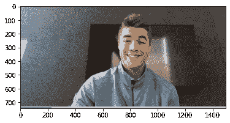
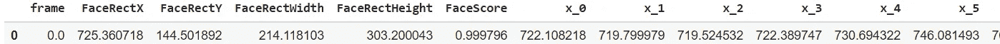
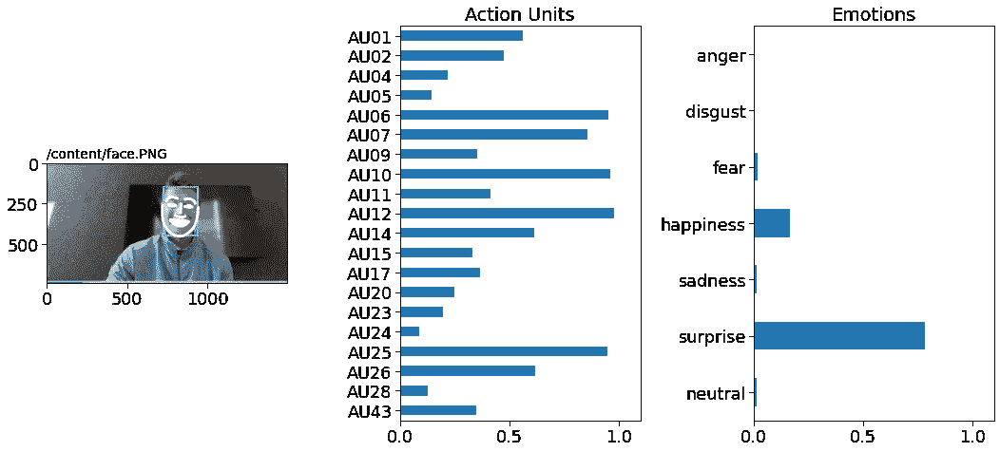

# 使用 Py-Feat 绘制面部表情预测

> 原文：<https://towardsdatascience.com/using-py-feat-to-plot-facial-expression-predictions-86a9064990ce?source=collection_archive---------20----------------------->

## 可视化面部表情数据的实用 python 工具包


图片来自[大卫·克洛德](https://unsplash.com/@davidclode)来自 [Unsplash](https://www.unsplash.com)

# 介绍 Py-Feat

Py-feat 是一个免费、开源、易于使用的面部表情数据处理工具，它提供了一个工具包，可以轻松地从图像和视频中检测面部表情，预处理和分析面部表情数据，并可视化面部表情数据。您可以通过浏览以下链接了解更多关于 Py-feat 的信息:

  <https://github.com/cosanlab/py-feat>  

在本教程中，我们探索如何使用 Py-Feat 在一个单一的人脸图像。

## 装置

```
!pip install py-feat
```

# 在单幅图像中检测面部表情

首先，加载检测器类。您可以指定要使用的模型。您可以在这里探索 Py-feat 工具包[中包含的模型。](https://py-feat.org/api/index.html)

```
**from** **feat** **import** Detector
face_model = "retinaface"
landmark_model = "mobilenet"
au_model = "rf"
emotion_model = "resmasknet"
detector = Detector(face_model = face_model, landmark_model = landmark_model, au_model = au_model, emotion_model = emotion_model)
```

找到您要处理的文件。在我们的例子中，我们将使用我们的测试图像*face.png*。

```
*# Find the file you want to process.*
test_image = os.path.join("face.png")
```

这是我们的测试图像的样子。

```
**from** **PIL** **import** Image
**import** **matplotlib.pyplot** **as** **plt**
f, ax = plt.subplots()
im = Image.open(test_image)
ax.imshow(im);
```



加载的图像-作者提供的图像

现在，我们使用初始化的`detector`实例通过`detect_image()`方法进行预测。

```
image_prediction = detector.detect_image(test_image)
*# Show results*
image_prediction
```



预测表-按作者分类的图像

1 行× 170 列

输出是一个`Fex`类实例，它允许您运行`Fex`的内置方法。

# 可视化检测结果。

现在，您可以轻松地绘制检测结果。

```
image_prediction.plot_detections();
```



探索模型预测-作者图片

## 减去

你有它！在这个例子中，我们在单个图像上使用了来自机器学习模型的面部表情和情绪预测，并绘制了结果。Py-feat 是计算机视觉和人类行为研究人员解释和分析面部表情数据的有用工具。要亲自尝试，请查看下面的完整代码。

[https://colab . research . Google . com/drive/1d 64 vlwbnhrd 9 we 9 tnlz 8 l 1 lnoflzn 5 VD？usp =共享](https://colab.research.google.com/drive/1D64vLwbnhrD9wE9tNlZ8L1LNofLZN5vd?usp=sharing)

## 作者的相关文章—

</can-you-teach-a-computer-to-see-your-pain-18c0f60eb0e4>  </introducing-openhac-an-open-source-toolkit-for-digital-biomarker-analysis-and-machine-learning-6e107c4524ad>  </making-it-rain-with-raincloud-plots-496c39a2756f>  

*感谢您的阅读！*