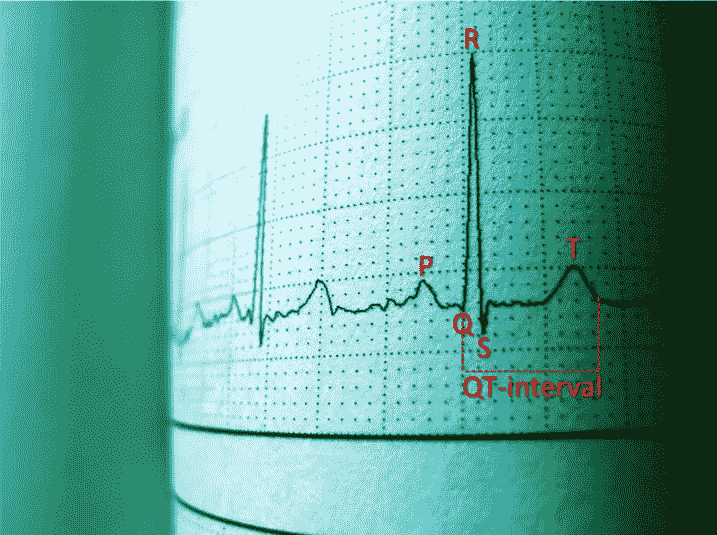
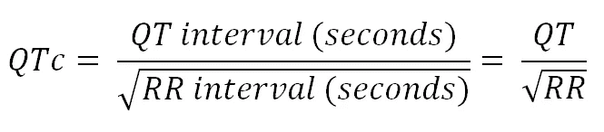
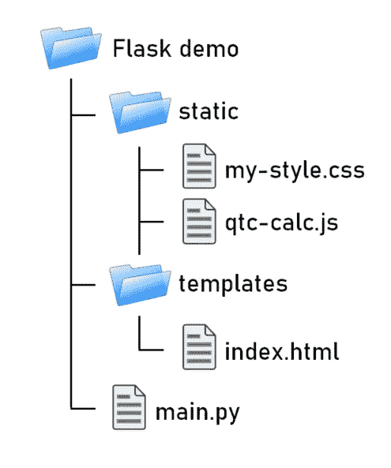
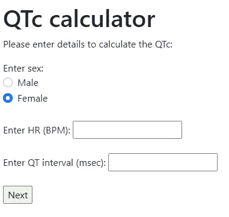
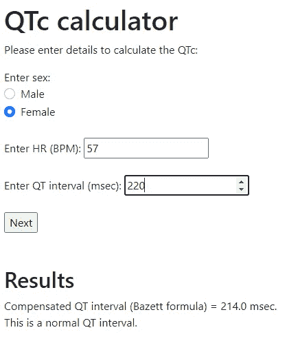
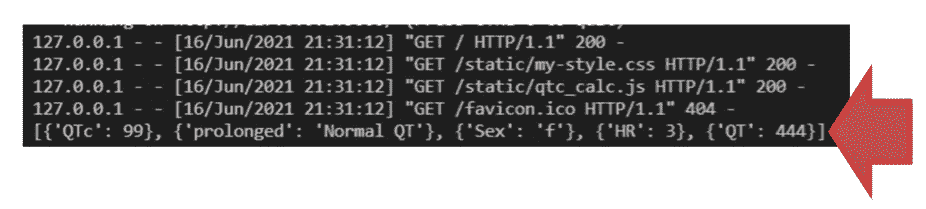
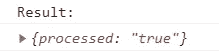
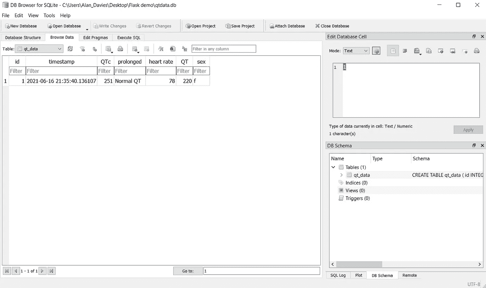
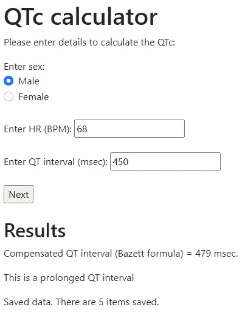

# 使用 Python Flask 和 Ajax 在客户机和服务器之间传递信息

> 原文：<https://towardsdatascience.com/using-python-flask-and-ajax-to-pass-information-between-the-client-and-server-90670c64d688?source=collection_archive---------0----------------------->

## 构建 QT 间期计算器


图片来自 Pexels([https://www.pexels.com/](https://www.pexels.com/))

下面提供了一个例子，说明我们如何在 Python Flask 应用程序中将信息从客户机传递到服务器。首先演示如何将数据从客户端发送到服务器并进行处理，然后我们如何通过在客户端执行计算并使用 Ajax 在同一页面上返回结果来提高效率。为了说明这是如何工作的，这个例子着重于创建一个简单的计算器来计算补偿的 QT 间期，这是医学上使用的 ECG 心电图波形的一部分。这个计算器只是一个例子，**不应该用于医疗目的。**假设读者对基本的 HTML、CSS、JavaScript 和 Python 有所了解。

# QT 间期

QT 间期代表心室激活和恢复的总时间。QT 间期是指从 Q 波开始到 T 波结束的时间，根据心率的不同而不同，女性的 QT 间期也比男性稍长。



Luan Rezende 摄于 Pexels(作者改编以显示 PQRST 波和 QT 间期)

由于间期受心率影响(即心率越高，间期越短)，因此存在各种公式来对此进行补偿，包括 Bazett 公式、Fredericia 公式、Hodges 公式和 Framingham 公式[1](补偿后称为 QTc，c)。QT 间期延长会使患者面临心脏性猝死的风险。这可以由某些条件触发，也可以由药物诱发[2]。

对于计算器，我们将使用最流行的公式之一；巴泽特的定义是:



作者图片

# 蟒蛇皮烧瓶

flask(https://flask.palletsprojects.com/en/2.0.x/)是一个微型网络框架，它允许我们使用 Python 来构建和提供网页。Flask 应用程序要求应用程序以某种方式构建，HTML 文件存储在 **templates** 文件夹中，其他文件(如 CSS 和 JavaScript)存储在 **static** 文件夹中。如果需要分离多个 JavaScript/CSS 文件，您也可以在较大的项目中使用子目录。在这个名为 **Flask demo** 的文件夹中创建的示例中，我们有一个静态文件夹，其中包含我们的样式表( **my-style.css** )和一个 JavaScript 文件( **qtc-calc.js** )。templates 文件夹包含这个示例的主 HTML 页面，名为**index.html**。在这两个文件夹之外，我们有 Python 文件 **main.py** 中的主 Flask 应用程序。



Flask 项目的文件/文件夹结构(图片由作者提供)

我们将从创建**index.html**文件开始。我们可以添加以下代码:

```
<html>
  <head>
    <title>QT-calculator</title>
    <meta charset="UTF-8" />
    <meta name="viewport" content="width=device-width, initial-scale=1.0" />
    <link rel="stylesheet" href="{{ url_for('static', filename='my-style.css') }}”> 
    <link href="[https://cdn.jsdelivr.net/npm/bootstrap@5.0.1/dist/css/bootstrap.min.css](https://cdn.jsdelivr.net/npm/bootstrap@5.0.1/dist/css/bootstrap.min.css)" rel=”stylesheet” integrity=”sha384-+0n0xVW2eSR5OomGNYDnhzAbDsOXxcvSN1TPprVMTNDbiYZCxYbOOl7+AMvyTG2x" crossorigin="anonymous">
  </head>
  <body>
  </body>
</html>
```

在 HTML 文件的 head 部分，我们导入了 Bootstrap(https://get Bootstrap . com/docs/5.0/getting-started/introduction/)，它提供了一个免费的 CSS 框架，使我们能够轻松地制作更专业的 web 内容。这里最大的不同是我们包含本地样式表的方式。通常我们会像这样加载样式表:

```
<link rel="stylesheet" href="my-style.css">
```

为了让它与 Flask 一起工作，我们使用 Jinja 模板引擎，使用 **url_for** 函数指向**静态**文件夹。你可以在这里找到更多关于金贾的信息:[https://jinja.palletsprojects.com/en/3.0.x/](https://jinja.palletsprojects.com/en/3.0.x/)

我们现在可以将下面的代码添加到 HTML 文档的 body 部分，为用户添加一些输入字段来输入数据。这包括一些选择男性或女性的无线电选项，以及心率(每分钟心跳数)和 QT 间期(毫秒)的输入字段。

```
. . .
<body>
  <div id="calc-container">
    <h1>QTc calculator</h1>
    <p>Please enter details to calculate the QTc:</p>
    <label>Enter sex:</label>
    <div class="form-check">
      <input class="form-check-input" type="radio" name="sex" value="m" id="male-option">
      <label class="form-check-label" for="male-option">
        Male
      </label>
   </div>
   <div class="form-check">
     <input class="form-check-input" type="radio" name="sex" value="f" id="female-option" checked>
     <label class="form-check-label" for="female-option">
       Female
     </label>
   </div>
   <br>
   <label>Enter HR (BPM):</label>
   <input type="number" name="hr">
   <br><br>
   <label>Enter QT interval (msec):</label>
   <input type="number" name="qt">
   </br><br>
   <input type="submit" name="next" value="Next">
  </div>
</body>
```

这里我们使用了一些单选按钮的引导样式。我们向收集用户数据的各种 HTML 元素的 name 属性添加值。这是因为 Flask 利用这个属性来访问表单信息。整个计算器包含在一个名为 **calc-container** 的 div 中。我们在本地样式表中添加了一些填充(10 像素)来改善外观，方法是引用前面带有散列的 **id** 属性并添加填充:

```
#calc-container {
  padding: 10px;
}
```

接下来，我们将创建 Flask 应用程序。首先，我们需要安装烧瓶模块。我们可以在 Python 终端中使用 **pip** 来做到这一点:

```
pip install Flask
```

然后，我们可以在应用程序的主文件夹中创建一个名为 **main.py** 的 Python 文件，并添加以下代码:

```
from flask import Flask, render_template, url_for, requestapp = Flask(__name__)[@app](http://twitter.com/app).route('/')
def index():
  return render_template('index.html')if __name__ == "__main__":
  app.run(debug=True)
```

我们从 flask 模块导入一些函数，接下来我们创建应用程序并添加一个名为 **index** 的函数，该函数使用 **render_template** 函数来渲染存储在 **templates** 文件夹中的**index.html**文件。我们可以使用 **app.route** 装饰器来指定这个页面的主路径。最后，我们在调试模式下运行应用程序。当 **main.py** 文件运行时，它在默认地址/端口上运行，从而在浏览器中呈现索引页面。

```
Running on [http://127.0.0.1:5000/](http://127.0.0.1:5000/) (Press CTRL+C to quit)
```

看起来像这样:



在 Chrome 浏览器中运行的应用程序(图片由作者提供)

现在我们已经设置了前端。我们可以将其连接到后端，以便执行计算。为了向服务器发送数据，我们可以使用一个**表单**标签。我们需要将希望发送的数据包含在表单标记中，并指定将处理数据的 Python 函数的名称。

这里，我们将计算器代码包装在表单标记中，并使用 **url_for** 函数将其发送到 main.py 文件中的索引函数，以便使用 POST 请求进行处理。

```
<form action="{{ url_for('index') }}" method="POST">
  <label>Enter sex:</label>
  <div class="form-check">
    <input class="form-check-input" type="radio" name="sex" value="m" id="male-option">
    <label class="form-check-label" for="male-option">
      Male
    </label>
   </div>
   <div class="form-check">
     <input class="form-check-input" type="radio" name="sex" value="f" id="female-option" checked>
     <label class="form-check-label" for="female-option">
       Female
     </label>
   </div>
   <br>
   <label>Enter HR (BPM):</label>
   <input type="number" name="hr">
   <br><br>
   <label>Enter QT interval (msec):</label>
   <input type="number" name="qt">
   </br><br>
   <input type="submit" name="next" value="Next">
</form>
```

超文本传输协议(HTTP)支持几种方法，其中最常用的是 POST 和 GET 方法。然后我们可以修改索引函数来处理这些数据。我们将把 GET 和 POST 方法添加到 **app.route** 装饰器中。接下来，我们可以检查 POST 方法并使用 **request.form** 捕获表单数据。这将存储在一个名为**的 Python 变量中，格式为**。然后，我们将这个表单数据传递给一个新函数来计算 QTc，并将结果返回到 index.html 文件中一个名为 **QTc_result** 的变量中。

```
[@app](http://twitter.com/app).route('/', methods=['GET', 'POST'])
def index():
  QTc_result = False
  if request.method == 'POST':
    form = request.form
    QTc_result = calculate_qtc(form) return render_template('index.html', QTc_result=QTc_result)
```

接下来，我们需要创建一个函数来实际执行计算。

```
def calculate_qtc(form):
  sex = request.form['sex']
  heart_rate = int(request.form['hr'])
  qt_int = int(request.form['qt'])

  qt_seconds = qt_int / 1000 
  rr_interval = (6000 / heart_rate) 
  QTc = qt_seconds / math.sqrt(rr_interval) 
  formated_QTc = round((QTc * 1000) * 10, 0) if (formated_QTc > 440 and sex == 'm') or (formated_QTc > 460 and sex == 'f'):
    prolonged = True
  else:
    prolonged = Falsereturn (formated_QTc, prolonged)
```

我们可以通过使用 HTML 元素的名称属性作为字典键来获取在 HTML 输入字段中输入的数据。我们可以将数字数据转换成整数进行计算。接下来，我们应用 Bazett 公式进行实际计算。我们需要导入 math 模块，以便对公式的平方根部分使用 sqrt 函数。我们分别对照男性和女性的正常值检查结果，并相应地将延长变量设置为真或假。最后，我们返回一个元组中的 QTc 和扩展变量。

最后，我们可以更新 index.html 文件来处理结果。我们可以在结束表单标签下添加下面的代码。

```
<br><br>

   <h2>Results</h2>
   <p>Compensated QT interval (Bazett formula) = {{QTc_result[0]}} msec.
   <br>
   
     This is a prolonged QT interval.
   
     This is a normal QT interval.
    

```

在这里，我们检查是否有任何结果要显示。如果是这样，我们输出 QTc(元组的第一个元素)以及间隔是否延长(元组的第二个元素)。Flask 变量可以用双括号({{ }})显示在 HTML 中。现在，当我们在输入字段中输入数据并单击 next 按钮时，我们会得到以下输出:



计算输出(图片由作者提供)

**index.html**文件的完整代码如下所示:

```
<!DOCTYPE html>
<html>
  <head>
  <title>QT-calculator</title>
  <meta charset="UTF-8" />
  <meta name="viewport" content="width=device-width, initial-scale=1.0" />
  <link rel="stylesheet" href="{{ url_for('static', filename='my-style.css') }}"> 
  <link href="[https://cdn.jsdelivr.net/npm/bootstrap@5.0.1/dist/css/bootstrap.min.css](https://cdn.jsdelivr.net/npm/bootstrap@5.0.1/dist/css/bootstrap.min.css)" rel="stylesheet" integrity="sha384-+0n0xVW2eSR5OomGNYDnhzAbDsOXxcvSN1TPprVMTNDbiYZCxYbOOl7+AMvyTG2x" crossorigin="anonymous">
  </head>
  <body>
    <div id="calc-container">
      <h1>QTc calculator</h1>
      <p>Please enter details to calculate the QTc:</p>

      <form action="{{ url_for('index') }}" method="POST">
        <label>Enter sex:</label>
        <div class="form-check">
          <input class="form-check-input" type="radio" name="sex" value="m" id="male-option">
          <label class="form-check-label" for="male-option">
            Male
          </label>
        </div>
        <div class="form-check">
          <input class="form-check-input" type="radio" name="sex" value="f" id="female-option" checked>
          <label class="form-check-label" for="female-option">
            Female
          </label>
        </div>
        <br>
        <label>Enter HR (BPM):</label>
        <input type="number" name="hr">
        <br><br>
        <label>Enter QT interval (msec):</label>
        <input type="number" name="qt">
        </br><br>
        <input type="submit" name="next" value="Next">
     </form>
     <br><br>
     
       <h2>Results</h2>
       <p>Compensated QT interval (Bazett formula) = {{QTc_result[0]}} msec.
       <br>
       
         This is a prolonged QT interval.
       
         This is a normal QT interval.
        
    
   </div>
 </body>
</html>
```

main.py 文件的完整代码:

```
import math
from flask import Flask, render_template, url_for, requestapp = Flask(__name__)[@app](http://twitter.com/app).route('/', methods=['GET', 'POST'])
def index():
  QTc_result = False
  if request.method == 'POST':
    form = request.form
    QTc_result = calculate_qtc(form) return render_template('index.html', QTc_result=QTc_result)def calculate_qtc(form):
  sex = request.form['sex']
  heart_rate = int(request.form['hr'])
  qt_int = int(request.form['qt'])

  qt_seconds = qt_int / 1000 
  rr_interval = (6000 / heart_rate) 
  QTc = qt_seconds / math.sqrt(rr_interval) 
  formated_QTc = round((QTc * 1000) * 10, 0) if (formated_QTc > 440 and sex == 'm') or (formated_QTc > 460 and sex == 'f'):
    prolonged = True
  else:
    prolonged = False return (formated_QTc, prolonged)if __name__ == "__main__":
  app.run(debug=True)
```

# 使用 Ajax 请求

这是可行的，我们可以成功地将数据从前端发送到后端进行处理。但是，我们应该问自己，是否有必要首先将这些信息发送到后端。毕竟，我们可以用 JavaScript 创建一个函数来执行计算。这比增加进出服务器的流量要有效得多。我们通常考虑向后端发送信息的主要原因是，我们通常希望将这些数据存储在数据库中，或者访问数据库并将特定的结果返回给前端。

我们在这里应用的计算显然是琐碎的，不需要太多的计算能力。然而，如果你正在运行一个强化的机器学习算法，这将是一个非常不同的故事。如果可能的话，最好是在客户端执行计算，并将计算结果返回给服务器以写入数据库。

让我们修改现有代码，用 JavaScript 在客户端执行计算，而不是用 Python 在服务器端执行。我们还可以使用 Ajax 处理用户输入，而不是呈现模板。在客户端执行计算后，我们将把用户输入和结果传递到服务器，存储在数据库中。

Ajax(异步 JavaScript 和 XML)用于在应用程序的后台异步发送/检索数据，而无需重新加载整个页面。当我们希望只更新现有页面的一部分，而不将用户导向新页面或重新加载现有页面时，通常会使用这种方法。当用户填写表单(例如购买产品)时，现有的 form 方法非常有用。他们输入自己的详细信息，这些信息被传递给服务器进行处理，然后被重定向到一个新页面，告诉他们交易成功(或失败)。对于像交互式数据仪表板和计算器这样需要不断更新页面的一部分而不是将用户发送到新页面/重新加载的工具来说，Ajax 是更好的方法。

要修改代码以使用 Ajax，我们需要首先删除 form 标签。然后我们可以添加一个 **onclick** 事件到 **next** 按钮，该按钮将启动一个名为 **calculateQTc** 的 JavaScript 函数。

```
<label>Enter sex:</label>
<div class="form-check">
  <input class="form-check-input" type="radio" name="sex" value="m" id="male-option">
  <label class="form-check-label" for="male-option">
    Male
  </label>
</div>
<div class="form-check">
  <input class="form-check-input" type="radio" name="sex" value="f" id="female-option" checked>
  <label class="form-check-label" for="female-option">
    Female
 </label>
</div>
<br>
<label>Enter HR (BPM):</label>
<input type="number" name="hr" id="hr">
<br><br>
<label>Enter QT interval (msec):</label>
<input type="number" name="qt" id="qt">
</br><br>
<input type="submit" name="next" value="Next" onclick="calculateQTc();">
```

接下来，我们将添加一个 div 元素来显示结果。这里我们将添加一些带有 id 属性的 span 元素来添加结果，称它们为 **qtc** 和**延长的**。

```
<br><br>
<div id="qtc-results">
  <h2>Results</h2>
  <p>Compensated QT interval (Bazett formula) = <span id="qtc"></span> msec.
  <br>
  <p><span id="prolonged"></span></p>
</div>
```

最后，我们将给包含 div 一个 id，并使它不可见，默认情况下隐藏结果。为此，我们在 CSS 文件中将 div 元素的显示样式设置为 **none** 。

```
#qtc-results {
  display: none;
}
```

我们现在可以用 JavaScript 而不是 Python 来实现计算 QTc 的函数，因此它是在客户端执行的。我们可以创建一个名为 **qt-calc.js** 的 JavaScript 文件，并添加以下代码:

```
function calculateQTc() {
  var prolonged;
  var heartRate = parseInt(document.getElementById("hr").value);
  var qtInt = parseInt(document.getElementById("qt").value);
  var sex = document.getElementsByName("sex");
  var qtcResult = document.getElementById("qtc");
  var prolongedResult = document.getElementById("prolonged");
  var resultsContainer = document.getElementById("qtc-results");
}
```

这里我们使用 **document.getElementById** 函数通过元素的 Id 属性(通过在引号中提供 id 值)来访问元素。我们还使用 **parseInt** 函数将数据转换成整数格式，以便在适当的时候进行计算，这与我们在 Python 中使用的方式非常相似。例外的情况是我们使用**document . getelementbyname**作为性单选按钮。当函数被调用时，我们希望显示结果，所以接下来我们通过将显示样式设置为**块**来使结果 div 可见。

```
resultsContainer.style.display = "block";
```

接下来，我们使用 for 循环来查找被选中的单选按钮(男性或女性)，该按钮将值“m”或“f”存储在名为 **selectedSex** 的变量中。

```
for(var i=0; i<sex.length; i++) {
  if(sex[i].checked) var selectedSex = sex[i].value;
}
```

接下来我们可以添加计算本身。这里唯一的主要区别是我们使用 JavaScript 标准数学库来计算平方根和舍入。最后，我们用结果更新 HTML span 元素。

```
qtSeconds = qtInt / 1000; 
rrInterval = (6000 / heartRate); 
QTc = qtSeconds / Math.sqrt(rrInterval); 
formatedQTc = Math.round((QTc * 1000) * 10, 0);
qtcResult.innerHTML = formatedQTc;
```

该函数的最后一部分涉及计算 QTc 是否延长，更新 HTML 结果字段，并将延长状态存储在一个名为**delivered**的变量中。

```
if((formatedQTc > 440 && selectedSex == 'm') || 
  (formatedQTc > 460 && selectedSex == 'f')) {
    prolongedResult.innerHTML = "This is a prolonged QT interval";
    prolonged = "Prolonged QT";
}
else{
  prolongedResult.innerHTML = "This is a normal QT interval";
  prolonged = "Normal QT";
}
```

最后，我们需要将 JavaScript 文件加载到 head 部分的 HTML 文档中。

```
<script src="{{ url_for('static', filename='qtc-calc.js') }}"></script>
```

Ajax 允许我们用少量数据异步更新 web 页面的各个部分，作为重载和呈现整个页面的替代方法。

一个简单的方法是使用来自 **jQuery** JavaScript 库的 ajax 方法。您可以直接下载它并将其作为本地资源包含在您的 web 页面中，或者您可以通过在 HTML 文档的 head 部分包含以下代码行，使用 CDN(内容交付网络)连接到它。

```
<script src="[https://ajax.googleapis.com/ajax/libs/jquery/3.5.1/jquery.min.js](https://ajax.googleapis.com/ajax/libs/jquery/3.5.1/jquery.min.js)">
</script>
```

然后，我们可以修改 JavaScript 代码来实现 jQuery ajax 方法。首先，我们可以将想要传递回服务器的数据存储在一个数组中。这里我们将键/值对作为 JavaScript 对象添加到名为 **server_data** 的数组中。

```
var server_data = [
  {"QTc": formatedQTc},
  {"prolonged": prolonged},
  {"HR": heartRate},
  {"QT": qtInt},
  {"Sex": selectedSex}
];
```

接下来，我们可以创建 ajax 请求。jQuery 库使用美元($)符号定义一个选择器，然后指定一个动作。这里我们将类型定义为 POST 请求。url 映射到 Python 中应该处理请求的特定函数的 route decorator。发送到服务器的数据应该是字符串(文本数据)，所以我们可以使用 JSON.stringify 函数将 JSON (JavaScript 对象表示法)转换为字符串格式，以便传输到服务器。

```
$.ajax({
  type: "POST",
  url: "/process_qtc",
  data: JSON.stringify(server_data),
  contentType: "application/json",
  dataType: 'json' 
});
```

然后我们需要更新 Python 文件来处理 ajax 请求。我们需要从 flask 导入 **jsonify** 。我们还可以删除计算 QT 间期的原始函数，并修改 index 函数，只呈现 index HTML 文件。这里我们使用 **request.get_json** 函数获取数据，并将其存储在一个名为 **qtc_data** 的 Python 变量中。现在，我们将把数据输出到控制台，并把一个带有键和值的对象:**已处理的**和**真的**返回到前端。

```
from flask import Flask, render_template, url_for, request, jsonifyapp = Flask(__name__)[@app](http://twitter.com/app).route('/')
def index():
  return render_template('index.html')[@app](http://twitter.com/app).route('/process_qtc', methods=['POST', 'GET'])
def process_qt_calculation():
  if request.method == "POST":
    qtc_data = request.get_json()
    print(qtc_data)

 results = {'processed': 'true'}
 return jsonify(results)if __name__ == "__main__":
  app.run(debug=True)
```

从客户端返回的打印数据可以在控制台中看到。



显示返回输出的控制台屏幕截图(图片由作者提供)

回到 JavaScript 函数，我们可以添加一个 **success** 函数来处理从 Python 函数返回的数据:

```
$.ajax({
  type: "POST",
  url: "/process_qtc",
  data: JSON.stringify(server_data),
  contentType: "application/json",
  dataType: 'json',
  success: function(result) {
    console.log("Result:");
    console.log(result);
  } 
});
```

我们可以使用 **console.log** 函数输出请求成功完成时返回的结果。如果我们在 web 浏览器中查看控制台，我们可以看到预期的输出。



Chrome 控制台显示成功功能输出的屏幕截图(图片由作者提供)

# 添加数据库

如前所述，我们希望向服务器返回数据的主要原因之一是为了从数据库中存储或检索数据。在最后一部分，我们将向应用程序添加一个 SQLite 数据库，以存储输入的结果并返回保存在数据库中的商品数量。

首先我们需要添加几个模块。我们将使用 **SQLAlchemy** 模块来管理数据库，使用 os 来设置数据库相对于 Flask 应用程序的路径，使用 datetime 来为数据库中存储的每个项目添加时间戳。最后，我们还需要从 flask 模块导入会话。

```
import os
from flask import Flask, render_template, url_for, request, jsonify, session
from flask_sqlalchemy import SQLAlchemy
from datetime import datetime
```

我们可以使用 **os** (操作系统)模块来找到主 Python 文件，并使用它来添加数据库，我们将把这个数据库称为 **qtdata.db** 到 main.py Python 文件所在的同一个文件夹中。首先，我们将获得当前文件的路径，并将其存储在一个名为 **basedir** (基本目录)的变量中。

```
basedir = os.path.abspath(os.path.dirname(__file__))
```

接下来，我们将数据库文件添加到此位置，并使用应用程序配置设置这些数据库参数:

```
app.config['SQLALCHEMY_DATABASE_URI'] = 'sqlite:///' + os.path.join(basedir, 'qtdata.db')
app.config['SQLALCHEMY_COMMIT_ON_TEARDOWN'] = True
```

接下来，我们可以将数据库实例绑定到我们的特定应用程序:

```
db = SQLAlchemy(app)
```

对象关系映射(ORM)可用于将 Python 类映射到 SQLite 数据库中的表。在这里，我们可以定义与表中的列名相关的变量。我们将调用表 **qt_data** 并使用 **db。**列功能定义表中字段(列)的名称和每列相关的数据类型。例如，下面的代码定义了一个名为 QTc 的 Python 变量，该变量引用了表中的一个列名(同名)。使用 **db 将数据类型定义为整数。整数**。我们可以根据需要定义其他数据类型，比如浮点值、字符值、字符串等等。例如:

```
QTc = db.Column('QTc', db.Integer)
```

这里我们定义了类( **Store_QTc_data** )、表名和列:

```
class Store_QTc_data(db.Model):
  __tablename__ = 'qt_data'
  id = db.Column('id', db.Integer, primary_key = True)
  timestamp = db.Column('timestamp', db.DateTime)
  QTc = db.Column('QTc', db.Integer)
  prolonged = db.Column('prolonged', db.String(50))
  heart_rate = db.Column('heart rate', db.Integer)
  QT = db.Column('QT', db.Integer)
  sex = db.Column('sex', db.CHAR)
```

除了 QT 数据之外，我们还有一个 id 列，它定义了主键(每个记录的惟一标识符)和一个时间戳，时间戳将存储记录写入数据库的日期和时间。最后，我们可以添加一个初始化方法，允许我们为这些字段传递值:

```
class Store_QTc_data(db.Model):
  __tablename__ = 'qt_data'
  id = db.Column('id', db.Integer, primary_key = True)
  timestamp = db.Column('timestamp', db.DateTime)
  QTc = db.Column('QTc', db.Integer)
  prolonged = db.Column('prolonged', db.String(50))
  heart_rate = db.Column('heart rate', db.Integer)
  QT = db.Column('QT', db.Integer)
  sex = db.Column('sex', db.CHAR) def __init__(self, QTc, prolonged, heart_rate, QT, sex):
   self.QTc = QTc
   self.prolonged = prolonged
   self.timestamp = datetime.now()
   self.heart_rate = heart_rate
   self.QT = QT
   self.sex = sex
```

我们现在可以更新**索引**函数来创建数据库(如果还不存在的话):

```
[@app](http://twitter.com/app).route('/')
def index():
  if not os.path.exists(os.path.join(basedir, 'qtdata.db')):
    db.create_all()return render_template('index.html')
```

接下来，我们可以更新 **process_qt_calculation** 函数，将数据写入数据库。我们可以使用 **db.session.add** 函数，使用 ajax 将前端发送的数据传入 **Store_QTc_data** 类。然后，我们通过 **db.session.commit** 函数将这些更改写入数据库。

```
[@app](http://twitter.com/app).route('/process_qtc', methods=['POST', 'GET'])
def process_qt_calculation():
  if request.method == "POST":
    qtc_data = request.get_json()
    db.session.add(Store_QTc_data(qtc_data[0]['QTc'], qtc_data[1]['prolonged'], qtc_data[2]['HR'], qtc_data[3]['QT'], qtc_data[4]['Sex']))
    db.session.commit() results = {'processed': 'true'}
 return jsonify(results)
```

如果我们随后向计算器添加一些数据并单击 next，这些数据将被写入数据库。如果我们打开数据库(使用类似 SQLite[https://sqlitebrowser.org/](https://sqlitebrowser.org/)的 DB 浏览器)，您可以看到数据已经成功添加到数据库中。



显示数据成功写入数据库的数据库浏览器屏幕截图(图片由作者提供)

最后，我们将修改结果以返回数据库中的数字项，并将其显示在 HTML 文档中。我们可以使用 count 函数来查找数据库中的记录数，并修改结果变量以将其发送回 ajax 函数。

```
rows = db.session.query(Store_QTc_data).count()
```

然后，我们可以显示数据库中的记录数量以及计算结果。我们将添加一个 span 元素来显示记录的数量，作为 id 为 **num-rows** 的消息的一部分。

```
<div id="qtc-results">
  <h2>Results</h2>
  <p>Compensated QT interval (Bazett formula) = <span id="qtc"></span> msec.
  <br>
  <p><span id="prolonged"></span></p>
  <p>Saved data. There are <span id="num-rows"></span> items saved.   </p> 
</div>
```

最后，我们将更改 console.log，以便在成功处理请求时更新 span 元素。

```
$.ajax({
  type: "POST",
  url: "/process_qtc",
  data: JSON.stringify(server_data),
  contentType: "application/json",
  dataType: 'json',
  success: function(result) {
    numRows.innerHTML = result.rows; 
  } 
});
```

输入数据后，最终的计算器看起来是这样的:



显示输入数据和生成结果的图像(作者提供的图像)

Python、HTML 和 JavaScript 文件的最终代码可以在这里看到:

```
<!DOCTYPE html>
<html>
  <head>
  <title>QT-calculator</title>
  <meta charset="UTF-8" />
  <meta name="viewport" content="width=device-width, initial-scale=1.0" />
  <link rel="stylesheet" href="{{ url_for('static', filename='my-style.css') }}”> 
  <link href="[https://cdn.jsdelivr.net/npm/bootstrap@5.0.1/dist/css/bootstrap.min.css](https://cdn.jsdelivr.net/npm/bootstrap@5.0.1/dist/css/bootstrap.min.css)" rel="stylesheet" integrity="sha384-+0n0xVW2eSR5OomGNYDnhzAbDsOXxcvSN1TPprVMTNDbiYZCxYbOOl7+AMvyTG2x" crossorigin="anonymous">
  <script src="{{ url_for('static', filename='qtc-calc.js') }}"></script>
  <script src="[https://ajax.googleapis.com/ajax/libs/jquery/3.5.1/jquery.min.js](https://ajax.googleapis.com/ajax/libs/jquery/3.5.1/jquery.min.js)"></script>
  </head>
  <body>
    <div id="calc-container">
      <h1>QTc calculator</h1>
      <p>Please enter details to calculate the QTc:</p> 
      <label>Enter sex:</label>
      <div class="form-check">
        <input class="form-check-input" type="radio" name="sex" value="m" id="male-option">
        <label class="form-check-label" for="male-option">
          Male
        </label>
      </div>
      <div class="form-check">
        <input class="form-check-input" type="radio" name="sex" value="f" id="female-option" checked>
        <label class="form-check-label" for="female-option">
          Female
        </label>
     </div>
     <br>
     <label>Enter HR (BPM):</label>
     <input type="number" name="hr" id="hr">
     <br><br>
     <label>Enter QT interval (msec):</label>
     <input type="number" name="qt" id="qt">
     </br><br>
     <input type="submit" name="next" value="Next" onclick="calculateQTc();">

     <br><br>
     <div id="qtc-results">
     <h2>Results</h2>
     <p>Compensated QT interval (Bazett formula) = <span id="qtc">   </span> msec.
     <br>
     <p><span id="prolonged"></span></p>
     <p>Saved data. There are <span id="num-rows"></span> items saved.</p>
     </div>
    </div>
  </body>
</html>
```

JavaScript 文件:

```
function calculateQTc() {
  var prolonged;
  var heartRate = parseInt(document.getElementById("hr").value);
  var qtInt = parseInt(document.getElementById("qt").value);
  var sex = document.getElementsByName("sex");
  var qtcResult = document.getElementById("qtc");
  var prolongedResult = document.getElementById("prolonged");
  var resultsContainer = document.getElementById("qtc-results");
  var numRows = document.getElementById("num-rows"); resultsContainer.style.display = "block"; for(var i=0; i<sex.length; i++) {
    if(sex[i].checked) var selectedSex = sex[i].value;
  } qtSeconds = qtInt / 1000; 
  rrInterval = (6000 / heartRate); 
  QTc = qtSeconds / Math.sqrt(rrInterval); 
  formatedQTc = Math.round((QTc * 1000) * 10, 0);
  qtcResult.innerHTML = formatedQTc; if((formatedQTc > 440 && selectedSex == 'm') || 
     (formatedQTc > 460 && selectedSex == 'f')) {
    prolongedResult.innerHTML = "This is a prolonged QT interval";
    prolonged = "Prolonged QT";
  }
  else{
    prolongedResult.innerHTML = "This is a normal QT interval";
    prolonged = "Normal QT";
  } var server_data = [
  {"QTc": formatedQTc},
  {"prolonged": prolonged},
  {"HR": heartRate},
  {"QT": qtInt},
  {"Sex": selectedSex}
 ]; $.ajax({
   type: "POST",
   url: "/process_qtc",
   data: JSON.stringify(server_data),
   contentType: "application/json",
   dataType: 'json',
   success: function(result) {
     numRows.innerHTML = result.rows; 
   } 
 });
}
```

Python 文件:

```
import os
from flask import Flask, render_template, url_for, request, jsonify, session
from flask_sqlalchemy import SQLAlchemy
from datetime import datetimebasedir = os.path.abspath(os.path.dirname(__file__))
app = Flask(__name__)app.config['SQLALCHEMY_DATABASE_URI'] = 'sqlite:///' + os.path.join(basedir, 'qtdata.db')
app.config['SQLALCHEMY_COMMIT_ON_TEARDOWN'] = Truedb = SQLAlchemy(app)class Store_QTc_data(db.Model):
  __tablename__ = 'qt_data’
  id = db.Column('id', db.Integer, primary_key = True)
  timestamp = db.Column('timestamp', db.DateTime)
  QTc = db.Column('QTc', db.Integer)
  prolonged = db.Column('prolonged', db.String(50))
  heart_rate = db.Column('heart rate', db.Integer)
  QT = db.Column('QT', db.Integer)
  sex = db.Column('sex', db.CHAR)def __init__(self, QTc, prolonged, heart_rate, QT, sex):
  self.QTc = QTc
  self.prolonged = prolonged
  self.timestamp = datetime.now()
  self.heart_rate = heart_rate
  self.QT = QT
  self.sex = sex[@app](http://twitter.com/app).route('/')
def index():
  if not os.path.exists(os.path.join(basedir, 'qtdata.db')):
    db.create_all() return render_template('index.html')[@app](http://twitter.com/app).route('/process_qtc', methods=['POST', 'GET'])
def process_qt_calculation():
  if request.method == "POST":
    qtc_data = request.get_json()
    db.session.add(Store_QTc_data(qtc_data[0]['QTc'], qtc_data[1]['prolonged'], qtc_data[2]['HR'], qtc_data[3]['QT'], qtc_data[4]['Sex']))
    db.session.commit()
    rows = db.session.query(Store_QTc_data).count() results = {'rows': rows}
  return jsonify(results)if __name__ == "__main__":
  app.run(debug=True)
```

总之，我们需要考虑何时将数据返回到服务器进行处理，使用哪种方法，以及何时最好在客户端实现这一点，以充分利用资源。有时我们想返回数据，处理数据，并把用户导向一个新的页面。在其他场合，我们希望在同一页面上来回传递信息。为了实现这一点，我们可以使用 ajax 在同一页面上的客户机和服务器之间快速来回传递对象。随着交互式仪表盘等工具在向用户传递信息方面变得越来越受欢迎，数据科学家应该了解在客户端和服务器之间传递数据的一些不同选项，以及何时应用它们以获得预期结果。

# 参考

[1] Davies，A，Scott，A (2015)开始读心电图:*理论与实践综合指南*。伦敦

[2] Alahmadi，A，Davies，A，Royle，J，Jay，C (2021) *一种可解释的算法，用于检测存在尖端扭转型室性心动过速(TdP)风险的药物诱发的 QT 间期延长，与心率和 T 波形态无关*。生物学和医学中的计算机。131(1):104281