# 用 python 解决一个复杂的数学问题

> 原文：<https://towardsdatascience.com/using-python-to-solve-a-complicated-mathematical-problem-17d36acf9f96?source=collection_archive---------30----------------------->

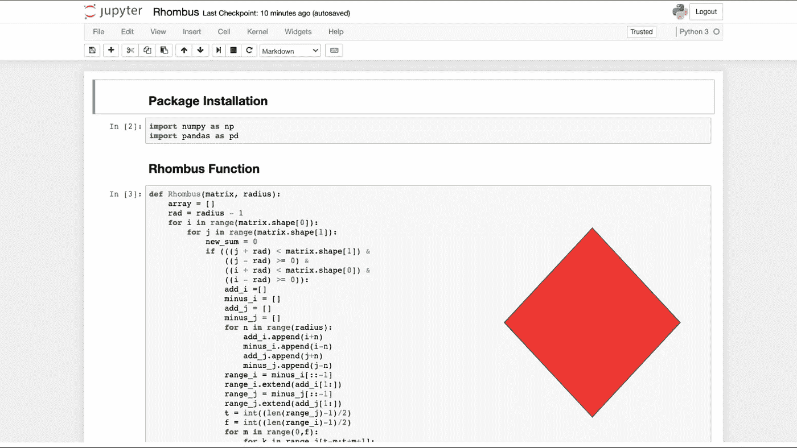

图片来源:我

## 获得矩阵中三个最大菱形和的分步指南

我最近接受了一个 Roblox 编码面试，任务是通过 codesignal 解决一个非常有趣和复杂的编码问题。虽然我不能在结束时间之前完成这个问题，但我被驱使继续这个问题，并在以后结束它。手头的任务是创建一个函数，在一个矩阵中寻找所有可能的菱形(具有特定的半径)，对每个菱形中包含的所有数字求和。最后返回具有三个最大菱形和的输出。

在我展示我的函数之前。我想详细说明两个概念:菱形的定义和一个小矩阵函数的例子。

## 什么是菱形？

菱形是一种类似钻石的形状，它的四条边是相等的。这就像拿两个相同的等边三角形，把它们放在彼此的上面，其中一个倒过来。下图清楚地描绘了菱形的样子。其面积的计算方法是将对角线相乘，然后除以 2。

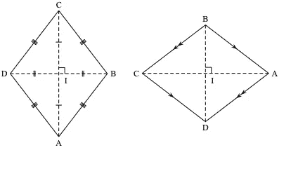

菱形的图像。图片来源:[https://upload . wikimedia . org/Wikipedia/commons/b/b5/rhombus . SVG](https://upload.wikimedia.org/wikipedia/commons/b/b5/Rhombus.svg)

## **矩阵带有菱形或菱形**

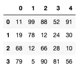

矩阵的图像

在上图中，我们可以看到一个 4x 5 的矩阵。总共有 6 个菱形，我们将在下面计算它们的总和(*请原谅我画的菱形很糟糕)。*

**菱形 1**

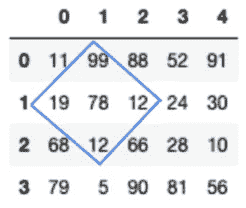

菱形半径为 2 的矩阵。

菱形 1 用蓝色菱形突出显示。菱形 1 包含的位数求和如下:99 + 19 + 78 +12 + 12 = 220。

**菱形 2**

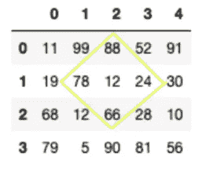

菱形 2 用黄色菱形突出显示。菱形 2 包含的位数求和如下:88 + 78 + 12 + 24 + 66 = 268。

**菱形 3**

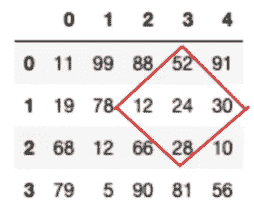

菱形 3 以红色菱形突出显示。菱形 3 包含的位数求和如下:52+ 12+ 24+ 30+ 28= 146。

**菱形 4**

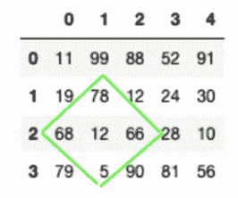

菱形 4 用绿色菱形突出显示。菱形 4 包含的位数求和如下:78+ 68+ 12+ 66+ 5= 229。

**菱形 5**

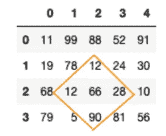

菱形 5 用橙色菱形突出显示。菱形 5 包含的位数求和如下:12+ 12+ 66+ 28+ 90= 208。

**菱形 6**

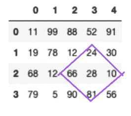

菱形 6 用紫色菱形突出显示。菱形 6 包含的位数求和如下:24+ 66+ 28+ 10+ 81= 209。

看看上面六个菱形的总和。最大的总数按降序排列是 268，229，220。下一节将展示这个函数以及它是如何工作的。

# 密码

上面的代码从一个具有一定半径的矩阵开始。然后，它继续从输入半径偏移 1，以便正确考虑中心点，因此它被考虑用于计算半径。

创建一个 for 循环来遍历矩阵中的每一个点。在 for 循环中，设置了一个条件，以确保矩阵的一部分被视为参与菱形求和，其中心点(当前正在迭代的点)必须以半径为 r 的菱形为界。如果一部分不满足该条件，for 循环将迭代到矩阵中的下一个点。

一旦一个点满足条件，属于菱形的垂直对角线的所有点的指数的垂直阵列被计算，并且属于菱形的水平对角线的所有点的指数的水平阵列被计算。然后，使用这些指数来找出哪些点位于菱形内，并计算与这些指数匹配的所有数字的总和。

在收集所有总和后，该函数将按降序对它们进行排序，并返回三个最大的总和。

# 测试

下图测试了该函数的有效性。该函数接收标题为 ***矩阵中使用的相同矩阵，上面有菱形*** ，半径为 2。然后返回矩阵中三个最大的菱形和。

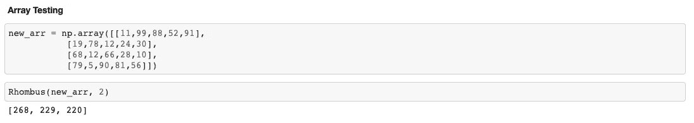

测试功能

可以观察到，我们得到了与在**什么是菱形中相同的结果。**节前。这个函数的伟大之处在于它可以处理更大的矩阵。因此，对于想要计算较大矩阵的三个最大菱形和的人来说，节省了时间，而不必在得出答案之前使用纸笔方法来计算每个单个菱形和。

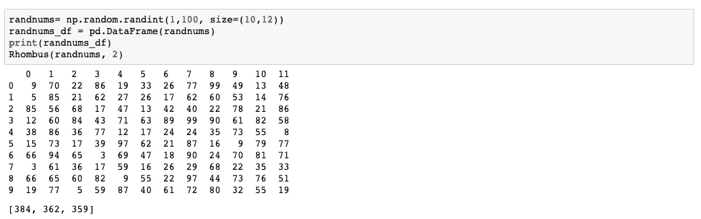

用更大的矩阵测试函数

在上面随机生成的矩阵中，三个最大的菱形和是 384、362 和 359。

# 结论

这个问题非常有趣，需要用到两个领域的知识:数学和编码。在我能够用 python 化的方式表达我的函数*，*之前，我必须首先从数学上考虑它。我开始考虑矩阵的任何部分被归类为菱形所需的所有条件。因此，我能够创建一个对菱形有界点进行分类的数学条件和一个对所有数字求和的数学公式。

之后，在数学上修补这个问题，我能够用 python 来表达它。起初，我在将条件和公式翻译成代码时遇到了问题。然而，在测试和优化函数之后，我能够创建一个有效的函数。

感谢您的阅读。

用于构建和测试该功能的完整代码可以在 [**这里**](https://github.com/MUbarak123-56/Qiskit-Learning/blob/master/Rhombus.ipynb) 找到。

你可以通过这个 [**链接**](https://medium.com/@Mubarak_Ganiyu/membership) 获得一个中级会员来支持我的写作。你的一部分会员费每个月会直接给我。