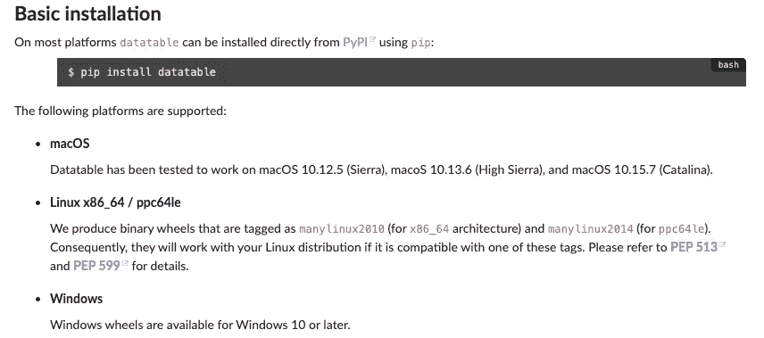
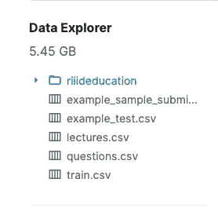

# 在 Kaggle 上无缝使用 Python 的数据表库

> 原文：<https://towardsdatascience.com/using-pythons-datatable-library-seamlessly-on-kaggle-f221d02838c7?source=collection_archive---------32----------------------->

## 在 Kaggle 上管理大型数据集，无需担心内存不足的错误


作者图片

[**Datatable**](https://datatable.readthedocs.io/en/latest/start/index-start.html) 是一个用于操作大型数据帧的 Python 包。它旨在提供大数据支持并实现高性能。这个工具包很像 [**熊猫**](https://pandas.pydata.org/) 但是更注重速度。支持内存外数据集，多线程数据处理，有灵活的 API。过去，我们写过几篇文章，详细解释了如何使用 datatable 以令人难以置信的速度读取、处理和写入表格数据集:

*   [**Python 的数据表包概述**](/an-overview-of-pythons-datatable-package-5d3a97394ee9)
*   [**用 Python 的数据表包**](/speed-up-your-data-analysis-with-pythons-datatable-package-56e071a909e9) 加速你的数据分析

这两篇文章在某些参数上比较了 datatable 和 pandas 库的性能。此外，他们还解释了如何使用 datatable 进行数据争论和管理，以及与同一领域的其他库相比，他们的性能如何。

<https://h2oai.github.io/db-benchmark/>  

然而，本文主要关注那些对在 Kaggle 平台上使用 datatable 感兴趣的人。最近，Kaggle 上的许多比赛都有数据集，这些数据集是不可能单独通过熊猫读取的。我们将看到如何使用 datatable 高效地读取这些大型数据集，然后无缝地将它们转换成其他格式。

> 目前`datatable`处于测试阶段，正在积极开发中。

# 装置

[Kaggle Notebooks](https://www.kaggle.com/docs/notebooks) 是一个云计算环境，支持可重复的协作分析。datatable 包是 Kaggle 的 docker 映像的一部分。这意味着在 Kaggle 上安装这个库不需要额外的工作。您所要做的就是导入库并使用它。

```
**import** datatable **as** dt 
**print**(dt.__version__)
```

0.11.1

但是，如果您想要下载特定版本的库(或者最新版本的库)，您可以通过 pip 安装库来完成。确保笔记本电脑中的互联网设置为打开。


```
*!pip install datatable==0.11.0*
```

如果你想在你的系统上本地安装 datatable，遵循官方[文档](https://datatable.readthedocs.io/en/latest/start/install.html#prerequisites)中给出的说明。



来源:[https://datatable . readthedocs . io/en/latest/start/install . html # basic-installation](https://datatable.readthedocs.io/en/latest/start/install.html#basic-installation)

# 使用

现在让我们看一个例子，使用 datatable 的好处显而易见。我们将在演示中使用的数据集来自最近一次名为 [Riiid 答案正确性预测竞赛](https://www.kaggle.com/c/riiid-test-answer-prediction) *的 Kaggle 竞赛。* [挑战](https://www.kaggle.com/c/riiid-test-answer-prediction)是通过随着时间的推移对学生知识进行建模来创建“知识追踪”的算法。换句话说，目的是准确预测学生在未来的互动中会如何表现。


[https://www.kaggle.com/c/riiid-test-answer-prediction](https://www.kaggle.com/c/riiid-test-answer-prediction)

`**train.csv file**`由大约一亿**百万行**组成。数据大小非常适合演示数据表库的功能。



训练数据大小

不幸的是，Pandas 抛出了一个**内存不足错误**，无法处理如此大规模的数据集。让我们试试 Datatable，并记录读取数据集及其随后转换为 pandas 数据帧所用的时间

## 1.读取 CSV 格式的数据

数据表中的基本分析单位是一个`Frame`。这与 pandas DataFrame 或 SQL 表的概念是一样的，即数据排列在具有行和列的二维数组中。

```
%%time

*# reading the dataset from raw csv file*

train = dt.fread("../input/riiid-test-answer-prediction/train.csv").to_pandas()

print(train.shape)
```


上面的`fread()`功能既强大又极快。它可以自动检测和解析大多数文本文件的参数，从。压缩档案或网址，阅读 Excel 文件，等等。让我们检查数据集的前五行。

```
train.head()
```


Datatable 读取整个数据集并将其转换为 pandas 不到一分钟。

## 2.以 jay 格式读取数据

数据集也可以首先以二进制格式保存。jay)然后使用数据表读入数据。 [**。jay 文件**](https://github.com/h2oai/datatable/issues/1109) 格式是明确为 datatable 的使用而设计的，但它也可以被其他一些库或程序采用。

```
*# saving the dataset in .jay (binary format)*
dt.fread("../input/riiid-test-answer-prediction/train.csv").to_jay("train.jay")
```

现在让我们看看读取 jay 格式文件所花费的时间。

```
%%time

*# reading the dataset from .jay format*

train = dt.fread("train.jay")

print(train.shape)
```


中读取整个数据集只需不到一秒钟的时间。杰伦格式。现在让我们把它转换成熊猫，这也相当快。

```
%%time

train = dt.fread("train.jay").to_pandas()

print(train.shape)
```


让我们快速浏览一下框架的前几行:

```
train.head()
```


这里我们有一个熊猫数据框架，可用于进一步的数据分析。同样，转换所用的时间仅为 27 秒。

# 结论

在本文中，我们看到了 datatable 包在处理大数据时的表现。[由于强调大数据支持](https://datatable.readthedocs.io/en/latest/index.html)，datatable 提供了许多好处，可以缩短在数据集上执行争论任务所需的时间。 [Datatable 是一个开源项目](https://github.com/h2oai/datatable)，因此它对贡献和合作开放，以改进它，使它变得更好。我们希望您能尝试一下，并在您的项目中使用它。如果你对使用`datatable`有疑问，使用`[py-datatable]`标签在[堆栈溢出](https://stackoverflow.com/questions/tagged/py-datatable)上发帖。