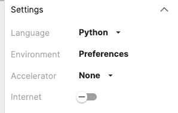
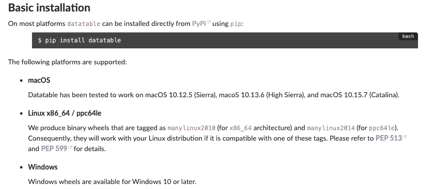
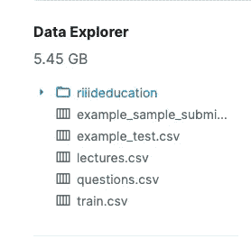
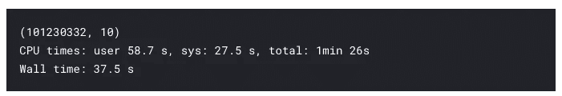
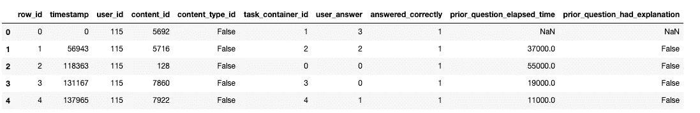
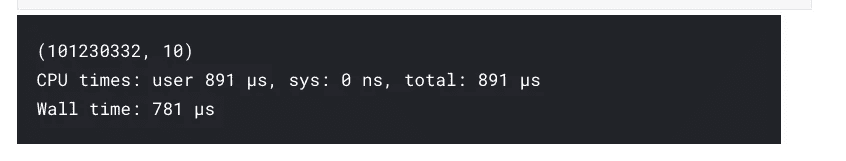
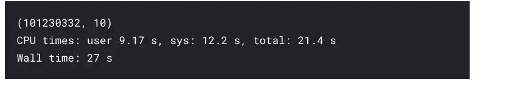
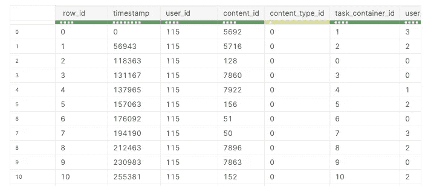

# 在 Kaggle 上无缝使用 Python 的数据表库

> 原文：<https://towardsdatascience.com/using-pythons-datatable-library-seamlessly-on-kaggle-f221d02838c7?source=collection_archive---------32----------------------->

## 在 Kaggle 上管理大型数据集，无需担心内存不足的错误


作者图片

[**Datatable**](https://datatable.readthedocs.io/en/latest/start/index-start.html) 是一个用于操作大型数据帧的 Python 包。它旨在提供大数据支持并实现高性能。这个工具包很像 [**熊猫**](https://pandas.pydata.org/) 但是更注重速度。支持内存外数据集，多线程数据处理，有灵活的 API。过去，我们写过几篇文章，详细解释了如何使用 datatable 以令人难以置信的速度读取、处理和写入表格数据集:

*   [**Python 的数据表包概述**](/an-overview-of-pythons-datatable-package-5d3a97394ee9)
*   [**用 Python 的数据表包**](/speed-up-your-data-analysis-with-pythons-datatable-package-56e071a909e9) 加速你的数据分析

这两篇文章在某些参数上比较了 datatable 和 pandas 库的性能。此外，他们还解释了如何使用 datatable 进行数据争论和管理，以及与同一领域的其他库相比，他们的性能如何。

[](https://h2oai.github.io/db-benchmark/) [## 类似数据库的运营基准

### 该页面旨在对开源数据科学中流行的各种类似数据库的工具进行基准测试。它经常与…发生冲突

h2oai.github.io](https://h2oai.github.io/db-benchmark/) 

然而，本文主要关注那些对在 Kaggle 平台上使用 datatable 感兴趣的人。最近，Kaggle 上的许多比赛都有数据集，这些数据集是不可能单独通过熊猫读取的。我们将看到如何使用 datatable 高效地读取这些大型数据集，然后无缝地将它们转换成其他格式。

> 目前`datatable`处于测试阶段，正在积极开发中。

# 装置

[Kaggle Notebooks](https://www.kaggle.com/docs/notebooks) 是一个云计算环境，支持可重复的协作分析。datatable 包是 Kaggle 的 docker 映像的一部分。这意味着在 Kaggle 上安装这个库不需要额外的工作。您所要做的就是导入库并使用它。

```
**import** datatable **as** dt 
**print**(dt.__version__)
```

0.11.1

但是，如果您想要下载特定版本的库(或者最新版本的库)，您可以通过 pip 安装库来完成。确保笔记本电脑中的互联网设置为打开。



```
*!pip install datatable==0.11.0*
```

如果你想在你的系统上本地安装 datatable，遵循官方[文档](https://datatable.readthedocs.io/en/latest/start/install.html#prerequisites)中给出的说明。



来源:[https://datatable . readthedocs . io/en/latest/start/install . html # basic-installation](https://datatable.readthedocs.io/en/latest/start/install.html#basic-installation)

# 使用

现在让我们看一个例子，使用 datatable 的好处显而易见。我们将在演示中使用的数据集来自最近一次名为 [Riiid 答案正确性预测竞赛](https://www.kaggle.com/c/riiid-test-answer-prediction) *的 Kaggle 竞赛。* [挑战](https://www.kaggle.com/c/riiid-test-answer-prediction)是通过随着时间的推移对学生知识进行建模来创建“知识追踪”的算法。换句话说，目的是准确预测学生在未来的互动中会如何表现。


[https://www.kaggle.com/c/riiid-test-answer-prediction](https://www.kaggle.com/c/riiid-test-answer-prediction)

`**train.csv file**`由大约一亿**百万行**组成。数据大小非常适合演示数据表库的功能。



训练数据大小

不幸的是，Pandas 抛出了一个**内存不足错误**，无法处理如此大规模的数据集。让我们试试 Datatable，并记录读取数据集及其随后转换为 pandas 数据帧所用的时间

## 1.读取 CSV 格式的数据

数据表中的基本分析单位是一个`Frame`。这与 pandas DataFrame 或 SQL 表的概念是一样的，即数据排列在具有行和列的二维数组中。

```
%%time

*# reading the dataset from raw csv file*

train = dt.fread("../input/riiid-test-answer-prediction/train.csv").to_pandas()

print(train.shape)
```



上面的`fread()`功能既强大又极快。它可以自动检测和解析大多数文本文件的参数，从。压缩档案或网址，阅读 Excel 文件，等等。让我们检查数据集的前五行。

```
train.head()
```



Datatable 读取整个数据集并将其转换为 pandas 不到一分钟。

## 2.以 jay 格式读取数据

数据集也可以首先以二进制格式保存。jay)然后使用数据表读入数据。 [**。jay 文件**](https://github.com/h2oai/datatable/issues/1109) 格式是明确为 datatable 的使用而设计的，但它也可以被其他一些库或程序采用。

```
*# saving the dataset in .jay (binary format)*
dt.fread("../input/riiid-test-answer-prediction/train.csv").to_jay("train.jay")
```

现在让我们看看读取 jay 格式文件所花费的时间。

```
%%time

*# reading the dataset from .jay format*

train = dt.fread("train.jay")

print(train.shape)
```



中读取整个数据集只需不到一秒钟的时间。杰伦格式。现在让我们把它转换成熊猫，这也相当快。

```
%%time

train = dt.fread("train.jay").to_pandas()

print(train.shape)
```



让我们快速浏览一下框架的前几行:

```
train.head()
```



这里我们有一个熊猫数据框架，可用于进一步的数据分析。同样，转换所用的时间仅为 27 秒。

# 结论

在本文中，我们看到了 datatable 包在处理大数据时的表现。[由于强调大数据支持](https://datatable.readthedocs.io/en/latest/index.html)，datatable 提供了许多好处，可以缩短在数据集上执行争论任务所需的时间。 [Datatable 是一个开源项目](https://github.com/h2oai/datatable)，因此它对贡献和合作开放，以改进它，使它变得更好。我们希望您能尝试一下，并在您的项目中使用它。如果你对使用`datatable`有疑问，使用`[py-datatable]`标签在[堆栈溢出](https://stackoverflow.com/questions/tagged/py-datatable)上发帖。