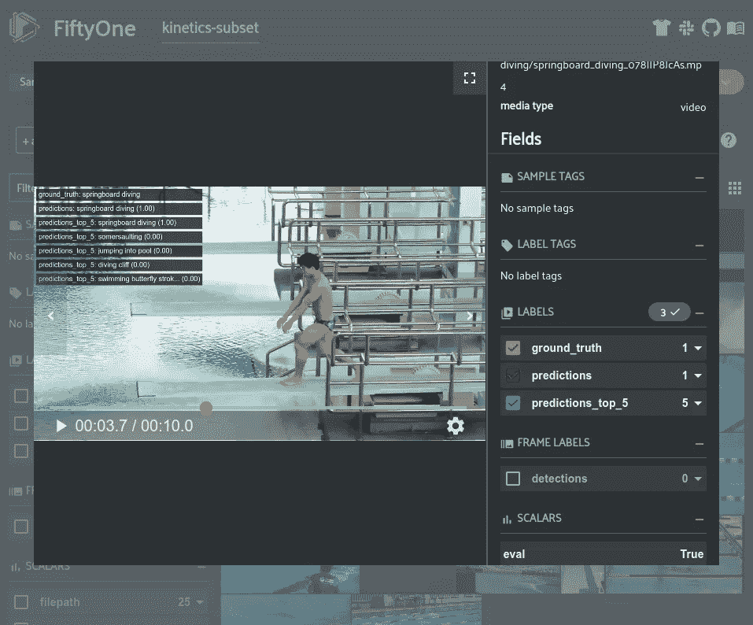
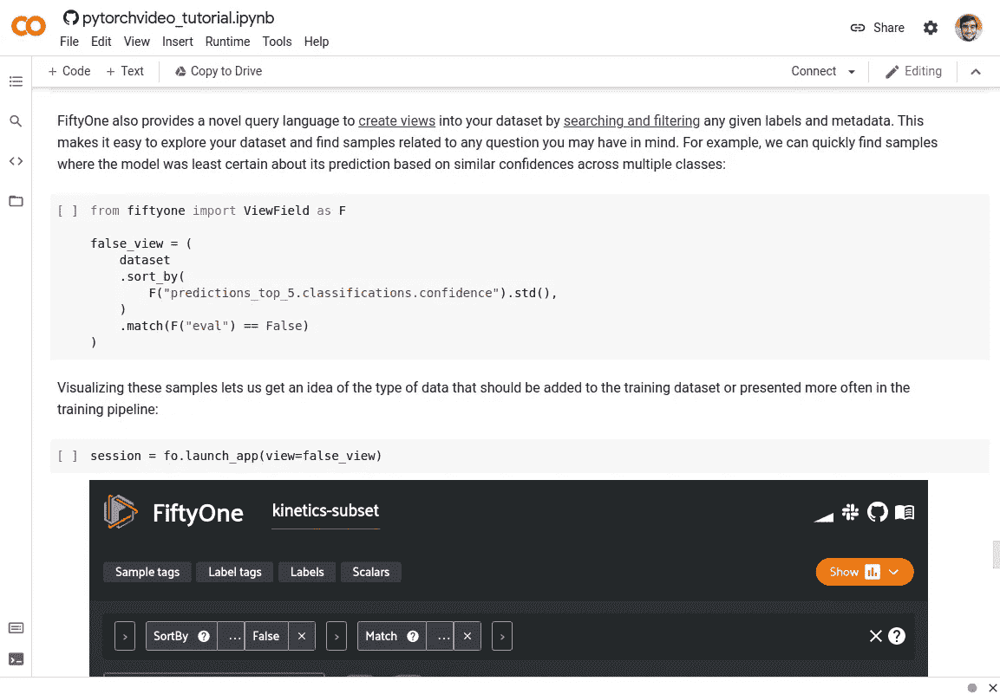
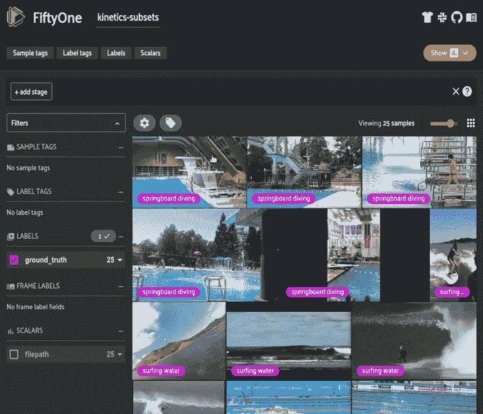
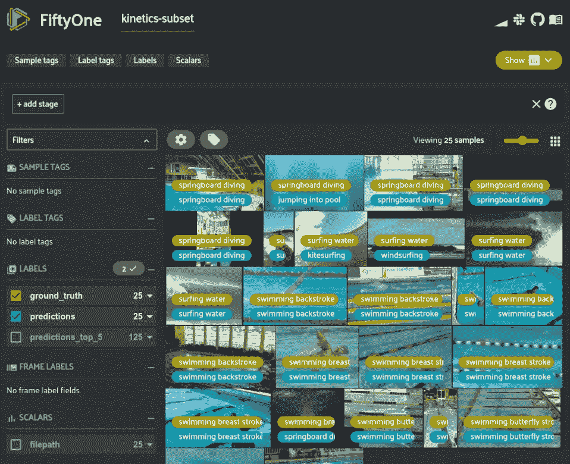
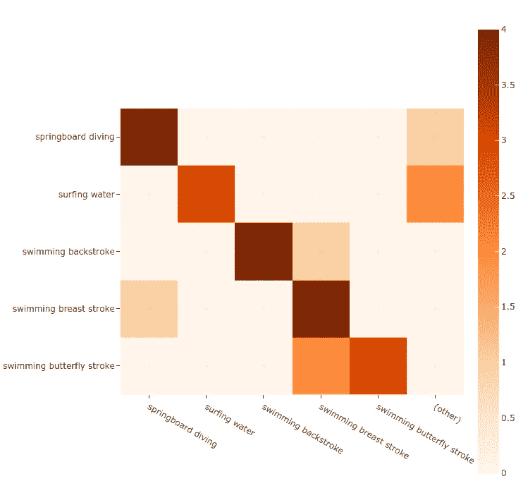
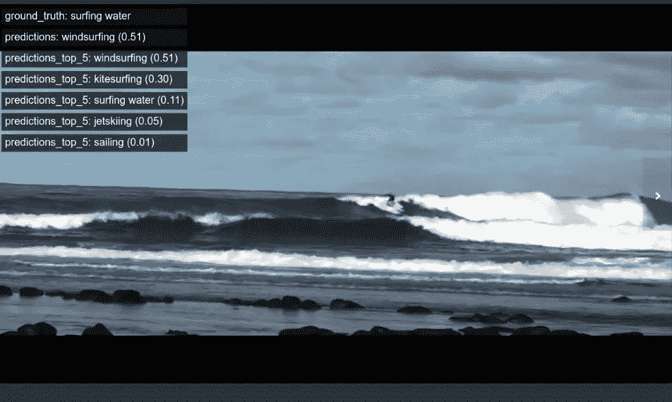
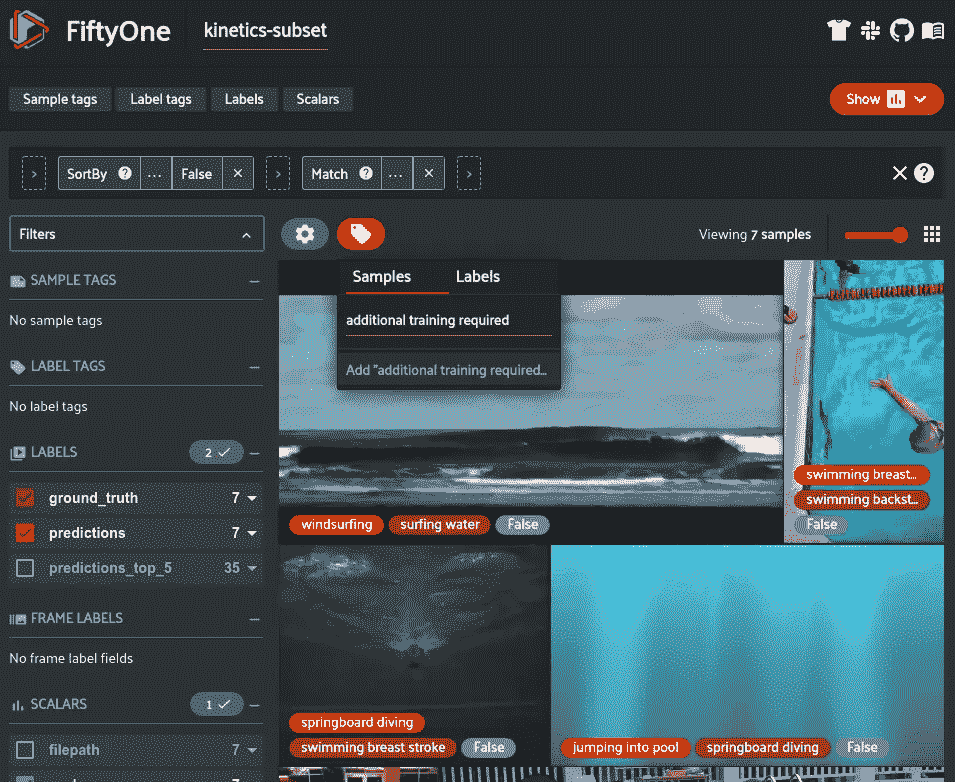
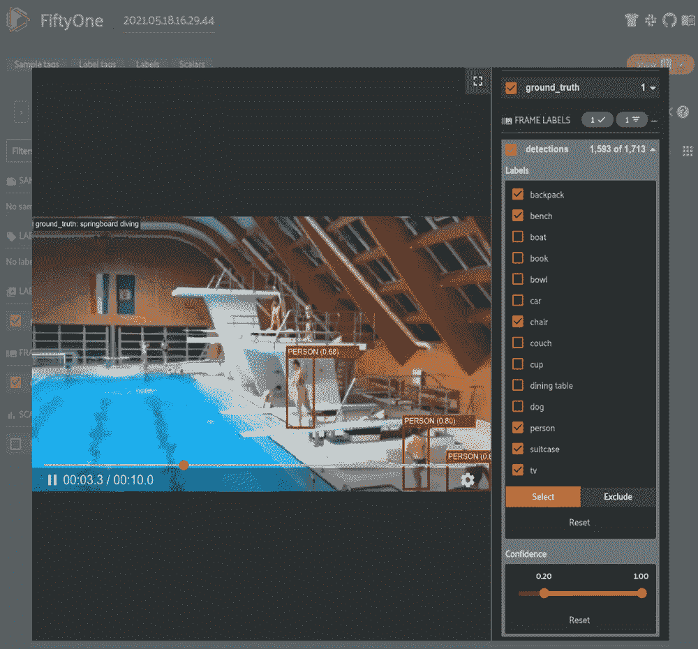

# 使用 PyTorchVideo 实现高效的视频理解

> 原文：<https://towardsdatascience.com/using-pytorchvideo-for-efficient-video-understanding-24d3cd99bc3c?source=collection_archive---------8----------------------->

## 了解如何轻松可视化和评估 PyTorchVideo 库中的活动分类模型



[PyTorchVideo](https://pytorchvideo.org/) 预言在[第五十一](http://fiftyone.ai/)可视化(图片由作者提供)

如果你试图找到最好的模型，或者仅仅是与你的任务相关的基线，那么海量的计算机视觉模型可能很难导航。像 [TensorFlow Hub](https://www.tensorflow.org/hub) 和[脸书的 Detectron2](https://github.com/facebookresearch/detectron2) 这样的模型动物园让人们很容易接触到受欢迎的模型。此外，像 PyTorch lightning 这样的库使得修改这些模型来满足你的需求变得容易。这对于图像来说很好，但对于视频来说，这是另一回事。视频数据正变得越来越受欢迎，但随之而来的额外复杂性往往使与视频相关的任务处于次要地位。

> [**PyTorchVideo**](https://pytorchvideo.org/)**是一个新的库，旨在使视频模型像图像模型一样易于加载、构建和训练**。

PyTorchVideo 提供对视频模型动物园、视频数据处理功能和以视频为中心的加速器的访问，以部署所有受 [PyTorch](https://pytorch.org/) 支持的模型，允许无缝集成到现有工作流程中。

**[**PyTorchVideo**](https://pytorchvideo.org/)**要完成您的视频工作流程，唯一缺少的是可视化数据集和解释模型结果的方法**。这就是第 51 个[出现的地方。](http://fiftyone.ai/) [FiftyOne 是我在](https://github.com/voxel51/fiftyone) [Voxel51](https://voxel51.com/) 一直在做的开源工具。它旨在使可视化任何图像或视频数据集变得容易，并探索存储在本地[或云中](https://voxel51.com/docs/fiftyone/environments/index.html)的地面真相和预测标签。[51 个数据集](https://voxel51.com/docs/fiftyone/user_guide/basics.html)和[51 个应用程序](https://voxel51.com/docs/fiftyone/user_guide/app.html)的灵活表示让您可以快速操作您的数据集并解释您的[模型，以找到故障模式](https://voxel51.com/docs/fiftyone/tutorials/evaluate_detections.html)、[注释错误](https://voxel51.com/docs/fiftyone/tutorials/detection_mistakes.html)、[可视化复杂标签](https://voxel51.com/docs/fiftyone/user_guide/dataset_creation/index.html)等等。**

**这篇博文是最近的 PyTorchVideo 教程的延伸，旨在教你如何将 [PyTorchVideo](https://pytorchvideo.org/) 与[fiftone](http://fiftyone.ai/)集成起来，从而结束基于视频的 ML 工作流程。具体来说，这篇文章包括:**

*   **下载[动力学数据集](https://deepmind.com/research/open-source/kinetics)的子集**
*   **加载带有 51 个的[视频数据集](https://voxel51.com/docs/fiftyone/user_guide/dataset_creation/datasets.html#videoclassificationdirectorytree-import)**
*   **使用 [PyTorchVideo 进行推理](https://pytorchvideo.org/docs/tutorial_torchhub_inference)**
*   **[可视化和评估](https://voxel51.com/docs/fiftyone/tutorials/evaluate_classifications.html)PyTorchVideo 模型**

# **跟随 Colab！**

**你可以在你的浏览器中直接运行这篇博文中的例子。**

****

**Google Colab 中[这个演练的截图(图片由作者提供)](https://colab.research.google.com/github/voxel51/fiftyone-examples/blob/master/examples/pytorchvideo_tutorial.ipynb)**

# **设置**

**为了完成这个演练，您需要安装 [FiftyOne](https://voxel51.com/docs/fiftyone/getting_started/install.html) 、 [PyTorchVideo](https://github.com/facebookresearch/pytorchvideo/#installation) 、 [PyTorch 和 TorchVision](https://pytorch.org/get-started/locally/) :**

```
pip install fiftyone pytorch torchvision
```

**虽然 [PyTorchVideo](https://github.com/facebookresearch/pytorchvideo/blob/master/pytorchvideo/models/slowfast.py) 也可以通过`pip`安装，但本文中的功能要求它通过 [GitHub](https://github.com/facebookresearch/pytorchvideo) 安装:**

```
git clone https://github.com/facebookresearch/pytorchvideo.git
cd pytorchvideo
pip install -e .
```

**本演练使用了 [Kinetics-400 数据集](https://deepmind.com/research/open-source/kinetics)的子集，可通过以下代码片段下载:**

**视频数据集比图像数据集更难处理的原因之一是，许多流行的视频数据集只能通过 YouTube 获得。因此，你不需要下载一个包含你需要的所有内容的 zip 文件，而是需要运行如下脚本，从 YouTube 下载自数据集管理以来可能不可用的单个视频。**

# **加载和浏览视频数据集**

**对于图像数据集，有一些基本的选项可用于可视化批量数据，如 [pillow](https://pillow.readthedocs.io/en/stable/) 和 [OpenCV](https://opencv.org/) 。用于可视化视频数据集的选项非常少。 [FiftyOne](https://voxel51.com/docs/fiftyone/user_guide/dataset_creation/index.html) 是一个新的开源库，为图像和视频数据集提供简单而强大的可视化。**

**如果您的数据集遵循一种通用格式，比如用于检测的 [COCO 格式](https://voxel51.com/docs/fiftyone/user_guide/dataset_creation/datasets.html#cocodetectiondataset-import)，那么您可以在一行代码中加载它:**

**即使你的数据集是一个[自定义格式](https://voxel51.com/docs/fiftyone/user_guide/dataset_creation/samples.html)，用 FiftyOne 加载你的数据集仍然很简单。例如，如果您使用的是对象检测视频模型，您可以按如下方式加载数据:**

**在本例中，我们将按照 [PyTorchVision 教程](https://pytorchvideo.org/docs/tutorial_torchhub_inference)运行视频分类模型。通常，视频分类数据集将存储在磁盘上的[目录树](https://voxel51.com/docs/fiftyone/user_guide/dataset_creation/datasets.html#videoclassificationdirectorytree-import)中，该目录树的子文件夹定义了数据集类别。这种格式可以在一行代码中加载:**

***如果您自己也在关注，请将鼠标悬停在样本上或点击样本来播放视频:***

****

**在[五十一应用](https://voxel51.com/docs/fiftyone/user_guide/app.html)中观看的动力学视频(图片由作者提供)**

**我们还需要下载并[存储一个默认类名列表](https://voxel51.com/docs/fiftyone/user_guide/using_datasets.html#storing-class-lists)，在评估预测时会用到:**

```
wget [https://dl.fbaipublicfiles.com/pyslowfast/dataset/class_names/kinetics_classnames.json](https://dl.fbaipublicfiles.com/pyslowfast/dataset/class_names/kinetics_classnames.json)
```

# **运行 PyTorchVideo 模型**

**在本节中，我们使用 PyTorchVideo 下载并运行视频分类模型，该模型基于我们在上一节中加载的数据，并将结果存储在我们的数据集中。本节代码改编自[本 PyTorchVideo 教程](https://pytorchvideo.org/docs/tutorial_torchhub_inference)。**

**[Torch Hub](https://pytorch.org/hub/) 是一个预训练 PyTorch 模型的存储库，允许您下载模型并在数据集上运行推理。PyTorchVideo 通过其火炬中心支持的[模型动物园](https://pytorchvideo.readthedocs.io/en/latest/model_zoo.html)提供了[数量的视频分类模型](https://pytorchvideo.readthedocs.io/en/latest/model_zoo.html)，包括 SlowFast、I3D、C2D、R(2+1)D 和 X3D。以下代码片段下载带有 ResNet50 主干的 SlowFast 的慢速分支，并将其加载到 Python 中:**

**每个模型都有它期望的特定输入结构。标准的工作流程是编写定制脚本，执行必要的加载和转换功能，为每个模型格式化数据。 [PyTorchVideo](https://pytorchvideo.org/) 通过[以灵活的方式为您提供这些功能](https://pytorchvideo.readthedocs.io/en/latest/transforms.html)来加速这一过程，这些功能将满足大多数视频处理需求。例如，以下代码构造了[转换](https://pytorchvideo.readthedocs.io/en/latest/transforms.html)来对视频帧进行采样、归一化、缩放和裁剪，而无需自己编写任何函数:**

**由于数据集存储在 fiftone 中，我们可以轻松地遍历这些样本，使用 PyTorchVideo 加载并运行我们的模型，并将预测存储回 fiftone 中，以便进一步可视化和分析:**

# **评估 PyTorchVideo 模型**

**除了作为数据集监管的开源生态系统，FiftyOne 还旨在通过允许您快速[找到并解决模型故障模式](https://voxel51.com/docs/fiftyone/tutorials/evaluate_classifications.html)来可视化、评估和解释模型。**

**为此，我们可以从可视化上一节中生成的预测开始:**

****

**PyTorchVideo 模型预测在[第五十一](http://fiftyone.ai/)中可视化(图片由作者提供)**

**然后，我们可以使用 [FiftyOne 来评估](https://voxel51.com/docs/fiftyone/user_guide/evaluation.html)具有基本事实的预测，以查看聚合指标和图表，显示诸如[混淆矩阵](https://voxel51.com/docs/fiftyone/user_guide/evaluation.html#confusion-matrices)和[精确召回曲线](https://voxel51.com/docs/fiftyone/user_guide/evaluation.html#binary-evaluation)之类的东西。这种评估将每个样本的正确性标签(“eval”)添加到数据集，这使得通过正确/不正确的预测进行过滤变得容易，或者更一般地，通过 TP/FP/FN 进行对象检测。评估只需一行代码即可完成:**

```
 precision    recall  f1-score   support springboard diving       0.80      0.80      0.80         5
            surfing water       1.00      0.60      0.75         5
      swimming backstroke       1.00      0.80      0.89         5
   swimming breast stroke       0.57      0.80      0.67         5
swimming butterfly stroke       1.00      0.60      0.75         5 micro avg       0.82      0.72      0.77        25
                macro avg       0.87      0.72      0.77        25
             weighted avg       0.87      0.72      0.77        25
```

**让我们为我们感兴趣的类绘制混淆矩阵:**

****

**[结果在第五十一个](https://voxel51.com/docs/fiftyone/user_guide/evaluation.html#confusion-matrices)的混淆矩阵中可视化(图片由作者提供)**

**我们可以将这个图附加到一个会话对象上，使其[交互](https://voxel51.com/docs/fiftyone/user_guide/plots.html)。因此，如果您单击其中一个单元格， [FiftyOne App](https://voxel51.com/docs/fiftyone/user_guide/app.html) 会话会更新以显示该单元格中的样本。**

****

**[Jupyter 实验室与 FiftyOne 的互动混淆矩阵](https://voxel51.com/docs/fiftyone/user_guide/plots.html#confusion-matrices)(图片由作者提供)**

***注意:目前只有 Jupyter 笔记本中的绘图是交互式的，但其他环境将很快得到支持！***

**FiftyOne 还提供了一种新颖的查询语言，通过搜索和过滤任何给定的标签和元数据来创建数据集的视图。这使得浏览数据集和查找与您想到的任何问题相关的样本变得非常容易。例如，我们可以基于跨多个类别的相似置信度快速找到模型对其预测最不确定的样本，并使用来自先前评估的每样本正确性标签(“eval”)来仅查看错误预测的样本:**

****

**不确定的 PyTorchVideo 模型预测在[51](http://fiftyone.ai/)中被可视化(图片由作者提供)**

**可视化这些样本让我们了解应该添加到训练数据集中的数据类型。为了标记这些以备将来参考，我们可以使用 51 应用程序中的[标记功能:](https://voxel51.com/docs/fiftyone/user_guide/app.html#tags-and-tagging)**

****

**[在第五十一个应用](https://voxel51.com/docs/fiftyone/user_guide/app.html#tags-and-tagging)中标记样本(图片由作者提供)**

**这种动手分析的便利性通常会显著提高数据集质量，从而提高模型性能，比仅使用聚合数据集统计数据的任何分析都要快。**

## **视频中的目标检测**

**虽然大多数大型视频数据集和研究工作都围绕着分类问题，如人类活动识别，但基于视频的 ML 的应用通常涉及对象检测。目前，PyTorchVideo 主要支持视频分类问题，但是，在 FiftyOne 中有视频对象检测功能。**

**FiftyOne 允许您从 [FiftyOne 模型动物园](https://voxel51.com/docs/fiftyone/user_guide/model_zoo/index.html#basic-recipe)中基于图像的对象检测模型生成预测，或者[将来自您自己模型的预测](https://voxel51.com/docs/fiftyone/recipes/adding_detections.html)添加到视频数据集中。动物园里有许多模型可供选择。例如，让我们使用 [EfficientDet-D0](https://voxel51.com/docs/fiftyone/user_guide/model_zoo/models.html#efficientdet-d0-coco-tf1) 。我们首先需要安装 [TensorFlow](https://www.tensorflow.org/) 和 [AutoML](https://github.com/google/automl) 。我们可以使用 FiftyOne 附带的 [eta](https://github.com/voxel51/eta) 包轻松安装 AutoML:**

```
pip install tensorflow==1.14
eta install automl
```

**现在，让我们将该模型应用于视频并可视化结果:**

****

**可视化视频对象检测在[第五十一](http://fiftyone.ai/)(图片由作者提供)**

**这种可视化需要编写定制脚本来加载原始视频、注释和预测，然后使用像 [OpenCV](https://opencv.org/) 这样的软件来绘制方框并将可视化导出到磁盘上的新视频中。然后，如果你想改变你正在看的标签，你需要重写你的脚本，并每次重新生成视频。相反，所有这些只花了我们几行代码，并产生了更易于使用和更灵活的数据表示。**

# **摘要**

**基于视频的机器学习模型越来越受欢迎，但缺乏相同水平的易用代码库，以允许快速开发和评估图像模型。 [PyTorchVideo](https://pytorchvideo.org/) 旨在通过他们的模型动物园、以视频为中心的组件和加速功能，使视频模型更容易实现、训练和评估。另一方面， [PyTorchVideo](https://pytorchvideo.org/) 正在使视频模型的工作变得更容易， [FiftyOne](http://fiftyone.ai/) 是一个开源库，旨在使管理、评估和改进视频(和图像)数据集变得简单高效。 [FiftyOne](http://fiftyone.ai/) 和 [PyTorchVideo](https://pytorchvideo.org/) 共同为创建高质量视频数据集和模型节省了大量时间和精力。**

# ****关于体素 51****

***披露:我在 Voxel51 工作，是* [*五十一*](http://fiftyone.ai/) 的开发者**

**[Voxel51](https://voxel51.com) 总部位于密歇根州安阿伯，由密歇根大学教授杰森·科尔索博士和布莱恩·摩尔博士于 2016 年创立，是一家人工智能软件公司，通过提供开放核心软件构建模块，使计算机视觉和机器学习工程师能够快速设计数据驱动的工作流，从而实现软件 2.0 的民主化。**

**在 [fiftyone.ai](http://fiftyone.ai) 了解更多！**