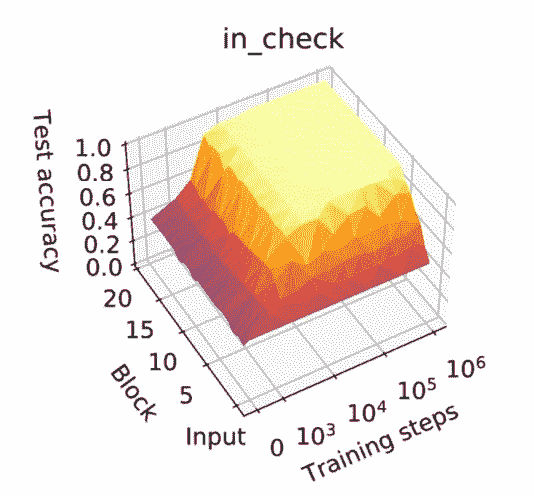
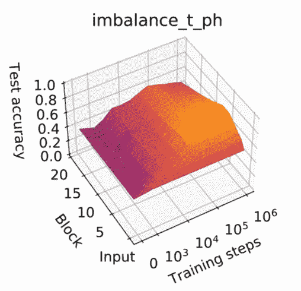

# 使用回归来理解 AlphaZero 象棋引擎

> 原文：<https://towardsdatascience.com/using-regression-to-understand-the-alphazero-chess-engine-aba67148978b?source=collection_archive---------14----------------------->

## 研究人员已经开始用人类的语言解释 AlphaZero 在想什么。请继续阅读，了解更多信息。

达米亚诺·林戈里在 [Unsplash](https://unsplash.com?utm_source=medium&utm_medium=referral) 上拍摄的照片

神经网络的一个关键问题是所谓的“黑箱问题”。神经网络已经在许多领域(语音识别、自动驾驶汽车、游戏、蛋白质折叠等)产生了最先进的结果。)但是我们无法用人类的语言来解释他们所做的决定。让我们举一个具体的例子:象棋引擎。今天最强的两个国际象棋引擎是 Stockfish 和 AlphaZero。

Stockfish 是一个传统的引擎——它用人类创造的**概念**来评估国际象棋的位置。一个简单的概念是位置上的兵差。如果白棋的棋子比黑棋多，这个概念将为白棋返回正数，为黑棋返回负数。其他的概念更复杂，但是只要有足够的时间，任何人都可以理解所有的 Stockfish 概念(你可以自己查看 Stockfish 代码[这里](https://github.com/official-stockfish/Stockfish))。从数学上讲，您可以将 Stockfish 概念想象成一个函数，该函数将国际象棋的位置作为输入，并输出一个数字来表示该位置上的概念的评估。

AlphaZero 与 Stockfish 有着本质的不同。根本没有人类创造的概念。AlphaZero 通过一个大型神经网络运行每个国际象棋位置，并在最后吐出它认为最好的棋步。这是一个黑箱:我们不能像看 Stockfish 那样看着一些代码并理解它的思维过程。那么我们是不是注定永远无法理解 AlphaZero 是怎么想的？直到最近，是的。然而，在过去的几年里，有几种方法已经开始破解黑盒。我想强调一个特别简单而有效的方法。这种方法的来源以及结果，见本文[的第 4 节](https://arxiv.org/abs/2111.09259)。

我们所做的是获取 Stockfish 概念，看看 AlphaZero 神经网络是否包含它们。我们到底该怎么做？对于 AlphaZero 网络中的每一层，我们在该层的激活上运行给定 Stockfish 概念的回归。然后，我们使用该回归的 r 平方来确定该图层是否与 Stockfish 概念相关，r 平方越高，越表明该图层相关。

# 回归详细信息

上面的描述比较抽象，我们来看一个具体的回归来理清事情。首先，让我们选择一个 Stockfish 概念和一个 AlphaZero 神经网络层。我们将挑选国王安全和第 10 层的概念。这个概念接受一个国际象棋的位置，通过几次试探返回一个代表国王安全程度的数字。接下来，因为我们在做回归，我们需要足够的数据。没问题——我们将从国际象棋数据库中随机抽取几千个位置。然后，我们在每个位置运行 Stockfish king 安全概念。结果是一系列数字——这些是我们回归的 y(因变量)。

为了获得回归的 x(独立变量),我们采用相同的位置样本，并通过 AlphaZero 神经网络逐一运行它们。由于我们选择了第 10 层，所以我们不会通过网络全程运行每个位置；我们停在第 10 层的激活。这些激活是我们的 x。注意，每个 y 是一个标量，每个 x 是一个矢量。

现在，有了数据，我们需要明确我们想要什么样的回归。我们可以做一个简单的线性回归，不需要任何修饰，但是有一个问题。也就是说，AlphaZero 网络中的每一层都很大(总激活数以千计)。因此，正态回归会严重过度拟合，导致人为的高 r 平方值。为了解决这个问题，我们做了一个 **L1 正则化回归**，取结果的 r 平方作为我们想要的最终值。在这个特定的回归中(第 10 层的国王安全)，r 平方为 0.6。因此，我们可以得出结论，第 10 层 AlphaZero 正在计算与 king safety 适度相关的内容。

我们可以对网络中的所有层进行同样的回归，以查看是否存在任何基于层的模式(例如，可能后面的层比前面的层与 king safety 更相关)。我们也可以在网络训练过程中进行这种回归**，以深入了解 AlphaZero 如何学习不同的国际象棋概念。作为一名棋手，我对最后一个用例特别感兴趣。人类学习国际象棋从基本概念开始(例如，棋子如何移动，一步棋威胁)，然后逐渐进入更高级的概念(国王安全，棋子移动性等)。).AlphaZero 也是如此吗？**

在我们继续讨论结果之前，让我们用一些伪代码回顾一下广义回归过程:

广义回归算法。图片作者。

# 结果

最初论文中的研究人员对 93 种鱼类概念进行了上述回归过程。首先，他们注意到所有概念都出现了一种模式:从训练步骤 16，000 到训练步骤 128，000，所有层的每个概念的 r 平方增加最多。换句话说，AlphaZero 网络中的大部分学习都发生在这个区间。早些时候，我们问了一个问题，AlphaZero 是否会跟随人类，在学习复杂概念之前学习简单概念——答案似乎是否定的； **AlphaZero 在相似的时间内学习概念，不管人为指定的难度如何**。

研究人员还注意到，一旦网络经过大部分训练(步长> 128，000)，大多数简单的概念，如国王是否在检查中或某个棋子是否可以被捕获，都具有在初始层急剧上升的 r 平方，然后在高 r 平方处稳定下来。这表明 AlphaZero **在网络早期**处理简单的概念，而 **AlphaZero 同意简单的人类象棋概念**。当然，当网络还没有被训练时(步骤< 128，000 ),所有层的 r 平方都如预期的那样低。

两个简单概念的回归结果图。左边的概念是游戏方是否可以在一步棋中被将死。正确的概念是玩的一方是否在检查。颜色越浅，r 平方越高。“块”是指神经网络层。经许可从原始[纸张](https://arxiv.org/pdf/2111.09259.pdf)拍摄的图像。

对于复杂的概念，情况就不那么清楚了。某些复杂的概念，如 Stockfish 材料不平衡(不仅仅是简单的棋子数差异，涉及国际象棋策略)**实际上在后面的训练步骤**(步骤> 100，000)中 r 平方递减。这意味着 AlphaZero 不同意鱼群物质不平衡公式的某些内容。随着一些复杂概念的训练进展，这些较低的 r 平方证实了人类国际象棋大师对 AlphaZero 的定性观察:它下棋的方式与人类“不同”。综上所述， **AlphaZero 并不认同一些复杂的人类象棋概念**。

一个复杂概念的回归结果:鱼群物质不平衡。请注意，在高训练步数时，r 平方实际上是如何降低的。经原始[纸张](https://arxiv.org/pdf/2111.09259.pdf)许可拍摄的图像。

当然，这个回归过程并没有告诉我们，例如，AlphaZero 关于物质不平衡的想法与人类有何不同。然而，据我所知，这是第一次，我们找到了一种数学方法来证明存在差异，而在过去，我们所拥有的只是我们的直觉。

在本文中，我们描述了一个回归过程，该过程能够将神经网络中的层与人类概念相关联。这是朝着解决黑箱问题迈出的一步，因为神经网络的内部工作方式对于人类来说是众所周知的难以理解。在未来，我希望看到这种方法应用到国际象棋之外的更多领域。感谢阅读，并请留下任何问题/评论！

更正:Stockfish 的最新版本(从 2020 年 8 月起)现在也有一个神经网络组件。因此它们不再完全是人类可以理解的。