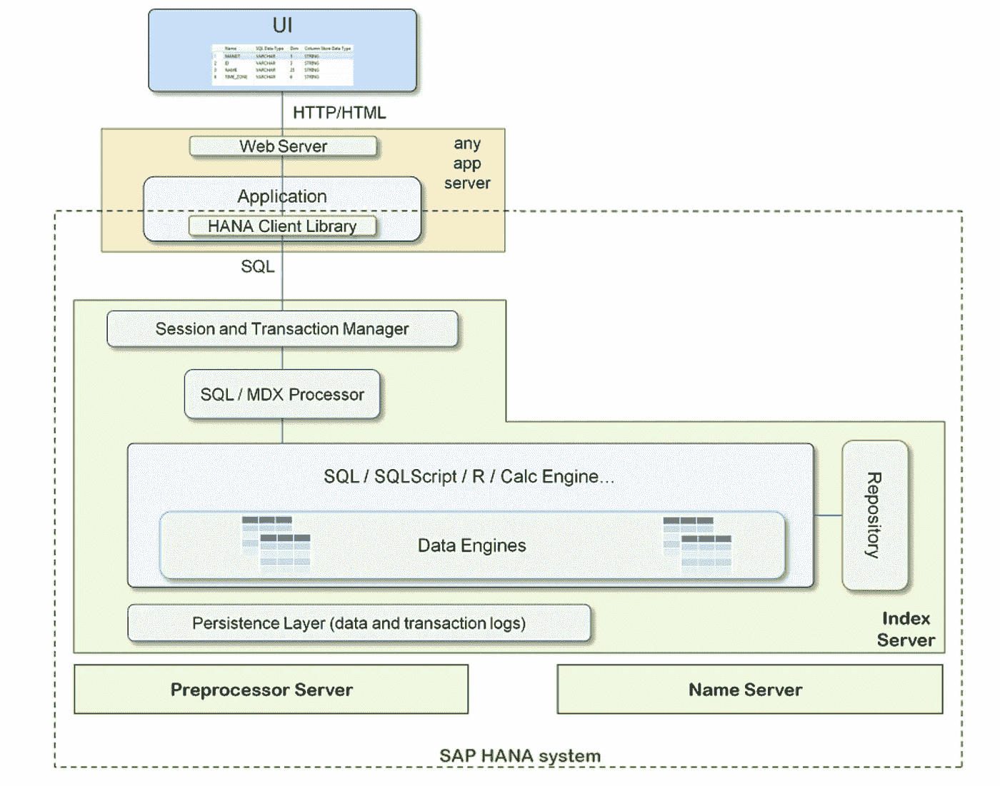
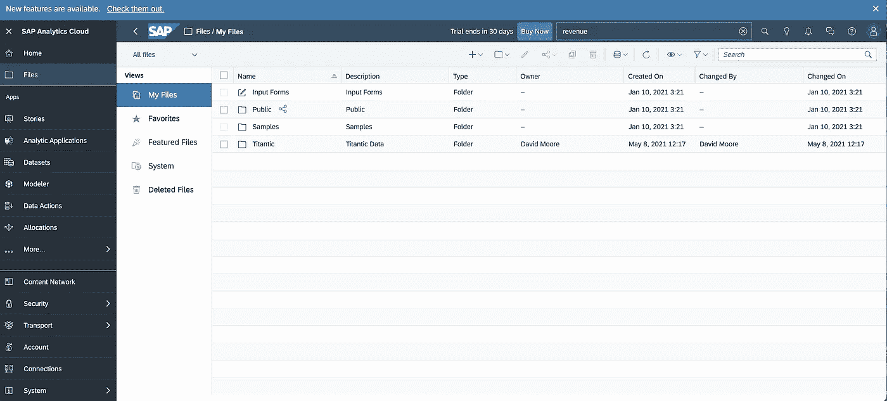
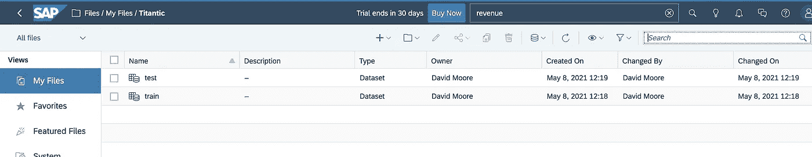
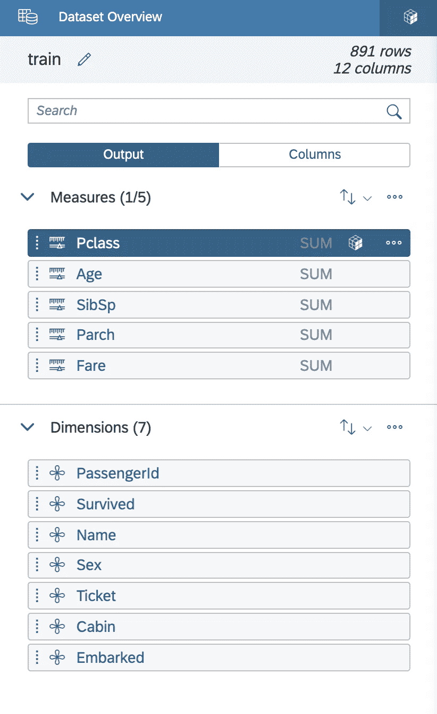
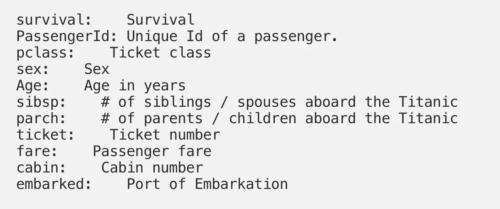
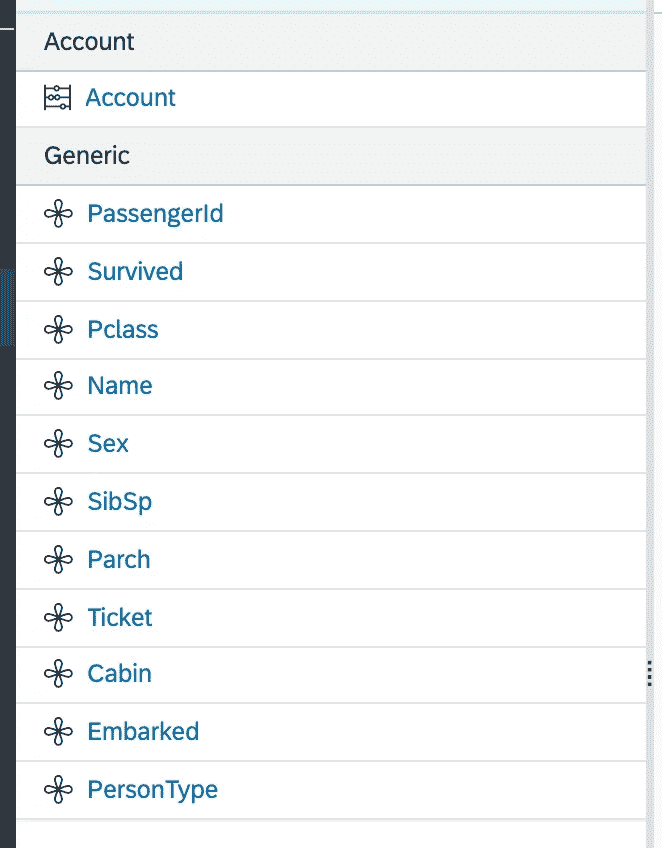
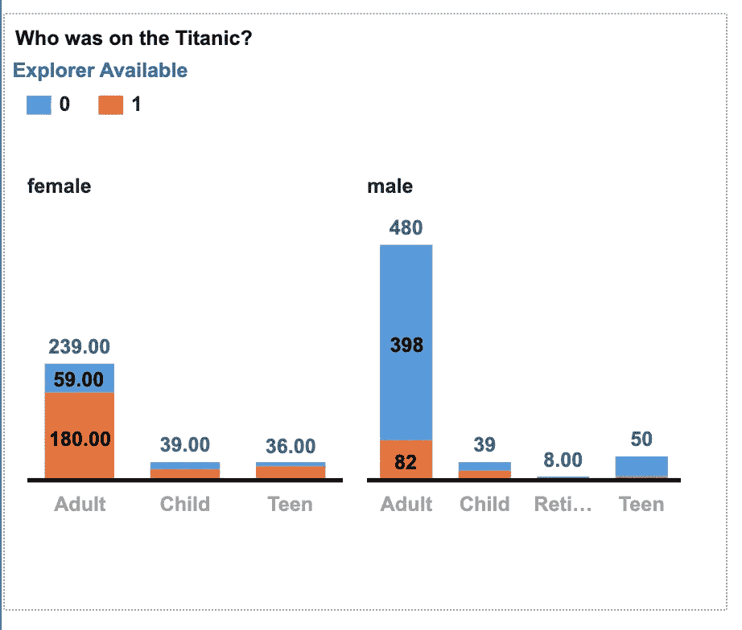
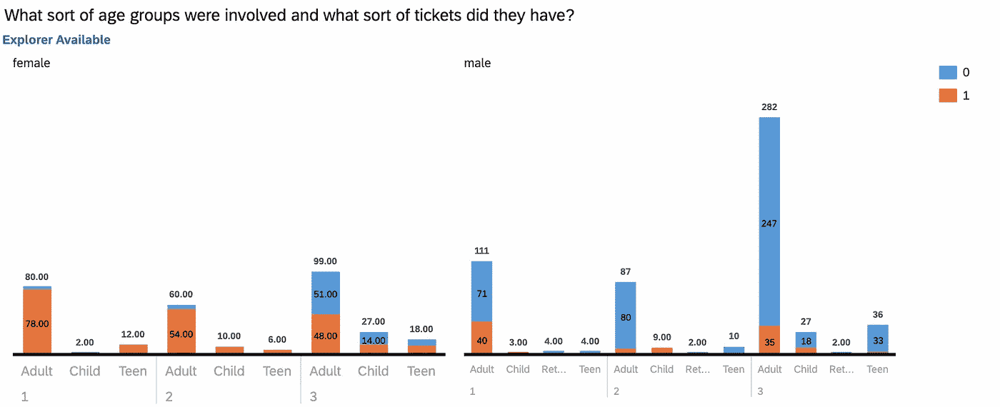
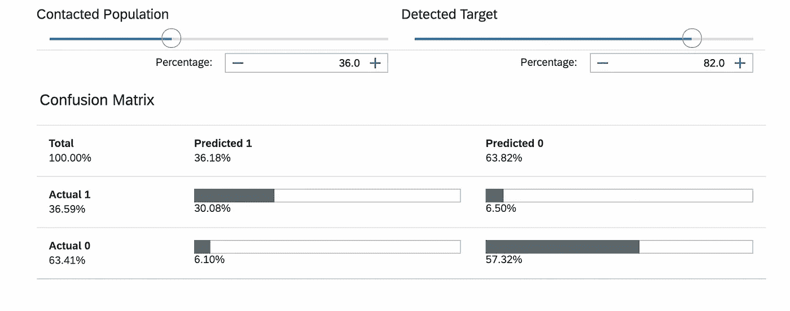
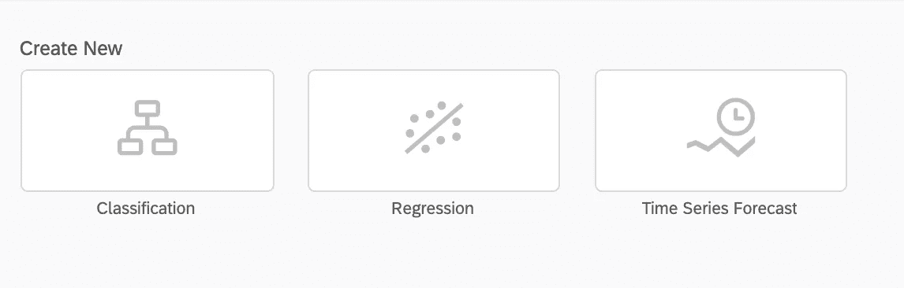

# 使用 SAP 分析云

> 原文：<https://towardsdatascience.com/using-sap-analytics-cloud-e2a408f8c54?source=collection_archive---------12----------------------->

## [从零开始逐个任务地进行数据科学](https://towardsdatascience.com/tagged/dofromscratch)

一个让我兴奋的工具

照片由 [MiRo Am](https://unsplash.com/@miroam?utm_source=medium&utm_medium=referral) 在 [Unsplash](https://unsplash.com?utm_source=medium&utm_medium=referral) 上拍摄

最近，在观看一场经典的 f1 比赛时，我惊喜地看到了 [SAP 分析云](https://www.sap.com/products/cloud-analytics.html)的概况，其中[米卡·哈基宁](https://en.wikipedia.org/wiki/Mika_H%C3%A4kkinen)非常出色。如果你是一个观看经典老歌的 F1 粉丝，你会知道一定有什么特别的东西吸引你的眼球。事实上，这是我对 SAP 分析云的看法。这是一个让我为 SAP 客户和用户感到兴奋的工具，他们希望将人工智能与机器学习驱动的预测相结合，它还可以进行财务规划和建模。如果你了解行业产品，你会知道通常你需要许多不同的工具来做这样的事情。SAP SAC 在一个地方为您提供这一切，并由 [HANA 数据设备](https://www.sap.com/uk/products/hana.html)提供支持。

那么，为什么在一场经典的情感 F1 比赛中，我会对一款产品感到兴奋呢？继续读下去，让我解释一下！如果你以前没有读过我的作品，你应该知道我喜欢从零开始构建东西，因此对数据库、软件开发和云托管有着更高的认识。数据科学人员可能不会使用 SAC，但我怀疑无代码爱好者会非常兴奋，如果不会被这个领域中的一系列可用产品所破坏的话。

## 什么是 SAP 分析云？

正如我前面提到的，SAP 分析云(SAC)是一个业务工具捆绑包。 [SAP](https://www.sap.com/products/cloud-analytics.html) 称之为“在一个解决方案中获得您需要的所有云分析功能，包括商业智能(B.I .)、增强分析、预测分析和企业规划。”。因此，SAC 是一个完整的分析环境，托管在使用 HANA 技术的 SAP 云中。

SAC 是基于云的，你可以[注册免费试用](https://www.sap.com/products/cloud-analytics/trial.html)并亲自动手。我就是这么做的！我用我的 Mac Mini M1(8g 内存)和谷歌 Chrome 浏览器进行了测试。

## 什么是 HANA，为什么它很重要？

HANA 是一个由 SAP 设计的内存数据库。SAP 将 HANA 定义为“加速实时数据驱动决策的数据库。”。传统的数据库产品是巨大的发明，但是也有障碍；这些产品包括

*   DB2——一系列[数据管理](https://en.wikipedia.org/wiki/Data_management)产品，包括[数据库服务器](https://en.wikipedia.org/wiki/Database_server)，由[IBM](https://en.wikipedia.org/wiki/IBM)开发。
*   MySQL——一个[开源](https://en.wikipedia.org/wiki/Open-source_software) [关系数据库管理系统](https://en.wikipedia.org/wiki/Relational_database_management_system) (RDBMS)
*   PostgreSQL——一个强大的开源对象关系数据库系统
*   Oracle —一种通常用于运行[在线事务处理](https://en.wikipedia.org/wiki/Online_transaction_processing) (OLTP)、[数据仓库](https://en.wikipedia.org/wiki/Data_warehouse) (D.W .)和混合(OLTP & D.W .)数据库工作负载的数据库。

通常，这些产品表现为带有大量物理存储磁盘和核心数据库软件的数据库服务器，所有这些都在孤岛中运行。数据仓库专家在这些系统上工作，他们会针对事务处理(在线事务处理 OLTP)或分析(在线分析处理 OLAP 或数据仓库数据仓库)进行[优化，但不会同时针对两者(混合 OLTP 和数据仓库工作负载)。用户体验(响应能力)受以下因素影响:-](https://www.stitchdata.com/resources/oltp-vs-olap/#:~:text=OLTP%20and%20OLAP%3A%20The%20two,historical%20data%20from%20OLTP%20systems.)

*   用作主机的裸机服务器的功率和性能以及内存、存储驱动器速度和 I/O 端口吞吐量都限制了用户性能。
*   服务器的位置和网络带宽的可用性
*   企业的工作负载水平，以及一般不好的用户查询！

因此，性能和用户查询响应时间可能会有所不同，并倾向于强制对工作负载进行批处理或离线处理。如果事情没有高度组织化，那么通过 TCP/IP 和 ODBC 或其他协议连接 Tableau、IBM Cognos、Power Bi、Looker 等产品可能是一种可怕的体验。为每个请求连接到数据服务器的 BI 服务器相当繁重，有大量的处理开销。

HANA 不一样。它是从零开始设计的，旨在消除所有这些问题，并使用存储在大量昂贵的 RAM 中的数据、索引和固态驱动器上的持久性的组合。 **HANA 速度极快**而**解决了传统 SQL 数据库的所有瓶颈和开销**。下面的图 1 是 SAP 架构视图。

图 SAP 公开文档中的 HANA 系统。作者[从本网站](https://help.sap.com/viewer/fc5ace7a367c434190a8047881f92ed8/2.0.03/en-US/d8d14ef53e244f6cabd10dd3f5e8c11e.html)捕捉的图片。

内存数据库技术的概念并不新鲜。我以前的工作总是包括一个 REDIS 数据库用于缓存。我总是发现，使用 REDIS 内存缓存支持 MongoDB 或 Postgres 长期持久性，web 应用程序的性能得到了惊人的提高。

事实上，我第一次使用内存/数据库加速器是在 Netezza 上。 [Netezza](https://en.wikipedia.org/wiki/Netezza) 是一款“高性能[数据仓库设备](https://en.wikipedia.org/wiki/Data_warehouse_appliance)和高级[分析](https://en.wikipedia.org/wiki/Analytics)应用，用于包括企业[数据仓库](https://en.wikipedia.org/wiki/Data_warehousing)、[商业智能](https://en.wikipedia.org/wiki/Business_intelligence)、[预测分析](https://en.wikipedia.org/wiki/Predictive_analytics)和[业务连续性规划](https://en.wikipedia.org/wiki/Business_continuity_planning)”——[维基百科](https://en.wikipedia.org/wiki/Netezza)。Netezza 改名为 [IBM 纯数据](https://www.ibm.com/ibm/puresystems/ie/en/puredata-system-for-analytics.html)，和 HANA 一样，速度很快。将 Tableau、PowerBI、Looker 和其他商业智能工具连接到纯数据提供了超越传统模型的巨大性能，是一个强大的数据仓库解决方案。自然，不利的一面是需要**E**extract**T**transform**L**oad(**ETL**)策略，导致了整个行业的 DW/ETL 专家。

## 分析云

讨论了 HANA 以及我们为什么关注 HANA 之后，分析云就是一个 SAP 托管环境，在集成环境中使用 HANA 技术和 SAP 的分析软件。当我们[为 SAC 注册](https://www.sap.com/products/cloud-analytics/trial.html)时，我们获得了预配置环境中的租用权，以获得开箱即用的最佳性能。

注册了账户后，我决定去试驾一下。由于我怀疑自己是否能参加一级方程式试驾，我不得不满足于 SAP 的极速体验。

## 试驾

我想，在我对 F1 经典的情绪状态下，我的思绪飘回到[泰坦尼克号](https://www.imdb.com/title/tt0120338/?ref_=ttfc_fc_tt)和那个现在著名的学习者数据集。图 2 是美国国家海洋和大气管理局拍摄的一张照片，照片中这位经典女士正在休息。"在命运多舛的豪华泰坦尼克号上，一名 17 岁的贵族爱上了一位善良但贫穷的艺术家。"— [来自 IMDB](https://www.imdb.com/title/tt0120338/?ref_=ttfc_fc_tt) 。那些萦绕心头的[主题曲](https://www.youtube.com/watch?v=3gK_2XdjOdY)的歌词呢？——我的心将继续……多么激动人心的过山车啊？

图 2:NOAA[在](https://unsplash.com/@noaa?utm_source=medium&utm_medium=referral) [Unsplash](https://unsplash.com?utm_source=medium&utm_medium=referral) 上拍摄的照片

[泰坦尼克号数据集](https://www.kaggle.com/c/titanic)在很多机器学习课程中使用；的确，我自己也经常用。登录到 SAP SAC 后，我创建了一个新的数据文件夹，如图 3 所示

图 SAC 文件夹“Titantic”作者的图片

接下来，我导入了一个从 [Kaggle](https://www.kaggle.com/c/titanic) 中获取的训练和测试文件。如图 4 所示。

图 4:导入的 Titanic 数据文件的作者截图。

单击 train.csv 文件，我们可以看到 SAC 是如何工作的。我们有度量和维度。“度量”是数字，而“维度”是类别和其他参考数据。我添加了图 5 来演示这个视图。你会注意到任何看起来像数字的东西都被认为是一种度量。因此，年龄，羊皮纸，SibSp 和其他可能必须更新为一个维度。

图 5 —我们的训练数据集中的字段。

正如我提到的，泰坦尼克号是一个非常好的使用和研究的数据集。在《走向数据科学》上，我找到了 Niklas Donges 的一篇文章。

 [## 预测泰坦尼克号乘客的生存

### 在这篇博文中，我将讲述在著名的泰坦尼克号上创建机器学习模型的整个过程…

towardsdatascience.com](/predicting-the-survival-of-titanic-passengers-30870ccc7e8) 

Niklas 为每个字段提供了方便的描述，如图 6 所示

图 6 —来自 [Niklas Donges 的数据科学表格截图](/predicting-the-survival-of-titanic-passengers-30870ccc7e8)

事实证明，从文件导入到创建故事(仪表板)有一些限制，这使我无法更新数据类型。为了控制数据类型，您需要建立一个模型。使用模型，我能够取得更好的进展。图 7 给出了该模型的视图。

图 7:来自 SAC 的显示模型尺寸的屏幕截图。作者图片

出于我的目的，我对默认值做了很少的修改，但是在实际的模型中，您需要检查每一列并确保它具有正确的数据类型。有了模型，我能够创造一些视觉效果。

## 画面

图 8 显示了具有网格函数的堆积条形图。我们可以看到一个图表，显示女性和男性，存活率(0 =假，1 =真)，按年龄组的分布，以及个体数量。数据显示，大部分妇女和儿童都下了车，只有少数男性乘客幸存。

图 8:作者绘制的谁在泰坦尼克号上的堆积条形图。

图 9 添加了 ticket 类来看看社会阶层是如何公平分配的。

图 9:添加票证类别的附加堆叠网格图。

我想现在大家都知道头等舱和二等舱的乘客做得更好。图 9 显示，一等舱和二等舱的女性乘客大部分都下了车，而三等舱的一些乘客下了车。三班的成年男性似乎比二班或一班的更多。

尽管进行了搜索，我还是无法找到并添加图例标签。标题应该是生存。缺失字段的插补使用基于公式的简单变化函数有点笨拙。我想你可以尝试做卑鄙的诽谤。分组或宁滨分类值似乎是在文件导入过程中由模型中的“公式”完成的。我不得不根据任意截止值手动将年龄维度分为成人、青少年、儿童和退休人员。

## 机器学习

SAP SAC 的机器学习环境有限。图 10 和 11 显示了分类模型的训练结果。

图 10:分类模型的训练结果。作者图片

图 11:显示分类准确性的混淆矩阵。6%的假阴性/阳性。

我能够应用该模型并获得新的输出。不清楚如何将 ML 模型部署到数据模型以获得连续的推断，但是我没有在这个特性上花太多时间。机器学习选项仅限于刚才金融分析中的选项，如图 12 所示。

图 12:当前可用的机器学习算法。

## 财务策划

SAP SAC 提供两种类型的数据模型。这些是:-

*   传统 BI 用例的分析模型
*   多维财务规划用例的规划模型，通常使用带有 Excel 插件的 TM1 等产品。

试用许可不允许我在规划模型功能上取得进展，但是基于我所做的概述，它是令人敬畏的。如果你想尝试一下，像我一样获得灵感，我在本文末尾的灵感部分留下了一些提示和链接。

## 试驾结束了

试驾结束了。该产品是闪亮的和新的，非常诱人。我想，对于大多数大宗购买来说，20 分钟的试驾不会说服你进行大笔金融投资。

扎卡里亚·扎亚恩在 [Unsplash](https://unsplash.com?utm_source=medium&utm_medium=referral) 上拍摄的照片

对于任何分析工具，您都需要坐下来规划一个数据模型，实施该模型，然后使用用户定义的用例对您的数据量进行真正的测试。继续进行概念验证，并向自己展示其价值。

[斯科特·格雷厄姆](https://unsplash.com/@homajob?utm_source=medium&utm_medium=referral)在 [Unsplash](https://unsplash.com?utm_source=medium&utm_medium=referral) 上拍照

# 灵感

如果您想了解更多关于 SAP 分析云的信息，您可以使用以下资源。

## **Udemy**

 [## 完整的 SAP 分析云课程 2021

### SAP 分析云顾问是科技界最热门的职业之一。你有没有想过什么是…的最佳路径

www.udemy.com](https://www.udemy.com/course/sap-analytics-cloud-sac/)  [## 完整的 SAP 分析云课程 2021

### SAP 分析云顾问是科技界最热门的职业之一。你有没有想过什么是…的最佳路径

www.udemy.com](https://www.udemy.com/course/sap-analytics-cloud-sac/) 

## SAP [培训](https://training.sap.com/)

[https://training . sap . com/course/sac 01h-introduction-to-sap-analytics-cloud-remote classroom-023-ie-en/](https://training.sap.com/course/sac01h-introduction-to-sap-analytics-cloud-remoteclassroom-023-ie-en/)？

[https://training . sap . com/course/sac 01-简介-到-sap-分析-云-教室-026-ie-en/](https://training.sap.com/course/sac01-introduction-to-sap-analytics-cloud-classroom-026-ie-en/) ？

[https://training . SAP . com/training path/Analytics-SAP+分析+云-SAP+分析+云](https://training.sap.com/trainingpath/Analytics-SAP+Analytics+Cloud-SAP+Analytics+Cloud)