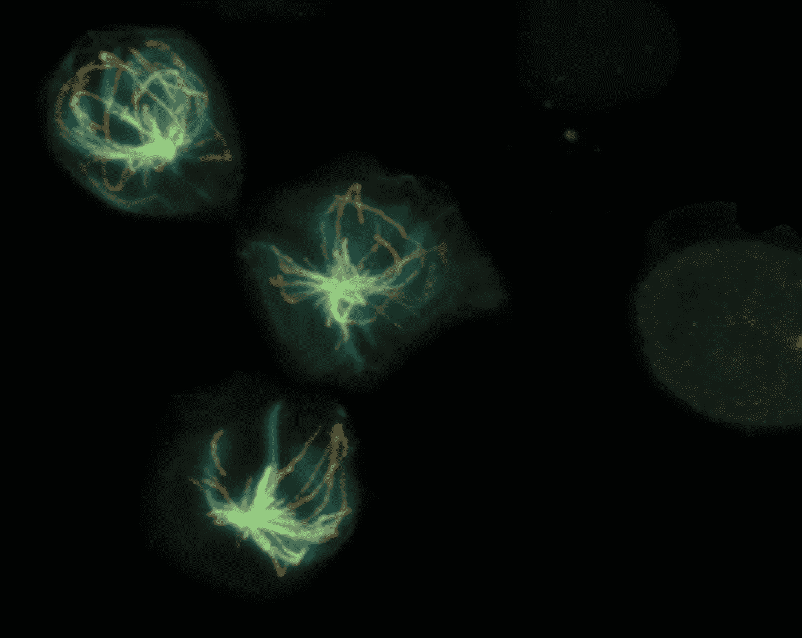
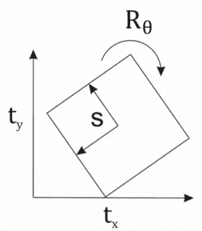
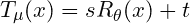
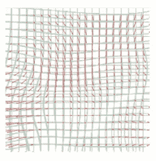
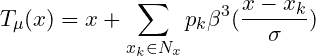
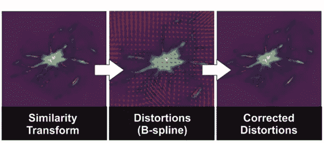

# 使用 SimpleElastix 比较膨胀前后的显微镜图像

> 原文：<https://towardsdatascience.com/using-simpleelastix-to-compare-pre-and-post-expansion-microscopy-images-660eaf992482?source=collection_archive---------31----------------------->

## [思想和理论](https://towardsdatascience.com/tagged/thoughts-and-theory)



**图 1:NK 细胞扩增前(青色)和扩增后(橙色)** **( *图片由作者提供)*** 的荧光信号。

根据所用光的波长，传统光学显微镜的分辨率限制在大约 200 纳米。较小的结构可以通过使用像 X 射线这样的高能光子来成像。然而，在广泛的生物应用领域中，有必要使用光学显微镜和荧光染料。尽管几种成像技术的发展超过了分辨率极限，如 [*d* STORM](https://onlinelibrary.wiley.com/doi/abs/10.1002/anie.200802376) ，但这种极限仍然对理解生物的基本过程构成了障碍。随着膨胀显微镜技术的发展，一种新的有前途的方法被开发出来，从不同的角度观察事物。不是增加空间分辨率，而是将样本扩展到合适的大小，[揭示进一步的结构细节和生物相互作用](https://pubmed.ncbi.nlm.nih.gov/33478695/)。然而，新方法往往会带来新问题:

# 扩展后成像的结构是否与原始结构相同？

**如果出现扭曲，扭曲的程度有多大？**

为了理解扩张过程中哪些调整是“自然”的，哪些必须算作扭曲，我们必须看一下自由度(自由度)。



**图 2:相似度变换(*图片作者)。***

由于样本被扩展，可以假设在 x 和 y 方向上的线性放大 *s* 被包括在该过程中。由于样品在显微镜下的定位，x 和 y 方向的偏移 *t* 以及角度 *θ* 的旋转也包括在内。这些参数共同构建了所谓的相似性变换 *T* ，捕捉完美线性扩展中出现的自由度(图 2)。



等式 1:相似变换。该等式描述了源点 x 的缩放 s、移动 t 和旋转 R，详细说明参见。

使用 elastix(一个用于图像配准的 C++库)优化这种转换，如果出现的失真是刚性的，则产生高相关指数。



**图 3: B 样条变换** **( *图片作者)*** 。

为了检测剩余的各向异性，我们尝试尽可能好地对齐我们的相似性变换的结果，并应用弹性 B 样条变换。B 样条变换引入了具有 *N_x* 控制点和每个控制点的 2 个自由度的规则网格。这为精确对准提供了高度的灵活性(图 3)。



等式 2: B 样条变换:该等式描述了当前位置 x 向立方插值 B 样条控制点 x_k 的移动。有关详细说明，请参见。

用优化的 B 样条变换来变换网格 X，Y 产生了局部矢量偏移，其指示了在与相似性变换对齐之后剩余的各向异性(图 4)。



**图 4:****NK 细胞上的排列过程。**

# 分步指南，用于对齐扩展前和扩展后的映像

对于以下步骤，必须对膨胀前后的相同结构进行成像。一个困难但(在复习过程中)通常是有益的过程。对齐扩展前和扩展后的图像并创建扭曲贴图只需点击几下鼠标并使用 python 环境。

首先，您需要获得一个与您的 python 发行版相匹配的 simpleelastix⁴(elastix 的 python 绑定)版本。一些预建版本可以在[这里](https://github.com/acecross/automated_elastix/tree/master/wheels)找到。如果您的版本不是预构建的，而您使用的是 Anaconda，那么最简单的步骤就是用合适的 python 版本创建一个新环境。例如:

```
conda create -n "myenv" python=3.6.0
```

将 SimpleElastix 安装到您的虚拟环境中，方法是切换到您刚刚下载并运行的文件夹:

```
python setup.py install 
```

如果一切顺利，你可以得到一个带有预设变量的工作脚本，并在这里实现绘图[。](https://github.com/acecross/automated_elastix)

对于这个脚本(除了 SimpleElastix)，你只需要 matplotlib(绘图)，numpy(数组操作)(可能都是预装的)和 skimage(图像加载和调整大小)。

```
conda install scikit-image
```

剩下唯一要做的就是在 main.py 中定义文件的路径

```
EXPECTED_EXPANSION = 3.5#replace with your expected expansion factor                      
root = r"PATH TO YOUR DATA"+"\\"#replace with your root directory                       
path1 = r"POST EXPANSION.tif"#replace with your post-expansion image       
path2 = r"PRE EXPANSION.tif" #replace with your pre-expansion image                    
save_dir = root + r"\results"+"\\"                       
save_name = path2.split(".")[0]
```

# 关键概念

现在一切都应该启动并运行(如果不是随时与我联系)。在下一节中，我将描述脚本中使用的一些代码概念，以便用 python 创建和绘制扭曲贴图:

## 为扭曲贴图创建 B 样条变换:

## 创建扭曲贴图:

## 结论

本文展示了如何在 python 中使用 SimpleElastix 对齐扩展前和扩展后的图像。

如果你在安装软件时还有问题或困难，请在评论中告诉我。

***参考文献:
1。***

**②*。*** [S. Klein，M. Staring，K. Murphy，M.A. Viergever，J.P.W .普鲁伊姆“elastix:基于强度的医学图像配准工具箱”IEEE 医学成像汇刊，第 29 卷，第 1 期，第 196 - 205 页，2010 年 1 月](https://elastix.lumc.nl/)

***3。*** [D.P. Shamonin，E.E. Bron，B.P.F. Lelieveldt，M. Smits，S. Klein 和 M. Staring《用于阿尔茨海默病诊断分类的 CPU 和 GPU 上的快速并行图像配准》，神经信息学前沿，第 7 卷，第 50 期，第 1-15 页，2014 年 1 月](https://pubmed.ncbi.nlm.nih.gov/24474917/)

***4。*** [Marstal，k .、Berendsen，f .、Staring，M. & Klein，s .【simple elastix:一个用于医学图像配准的用户友好的多语言库】 *2016 年 IEEE 计算机视觉和模式识别研讨会会议(CVPRW)* ，第 574–582 页，2016 年](https://ieeexplore.ieee.org/document/7789568)