# 使用 Sklearn 管道简化您的机器学习过程

> 原文：<https://towardsdatascience.com/using-sklearn-pipelines-to-streamline-your-machine-learning-process-a27721fdff1b?source=collection_archive---------16----------------------->

## 了解 Pipeline 类如何简化和自动化您的机器学习工作流


由[EJ·斯特拉特](https://unsplash.com/@xoforoct?utm_source=medium&utm_medium=referral)在 [Unsplash](https://unsplash.com?utm_source=medium&utm_medium=referral) 上拍摄

机器学习通常涉及多个步骤——加载数据、可视化数据、拆分数据、预处理数据，然后最终用训练数据训练模型。所有这些步骤都必须按顺序进行，我们通常在 Jupyter Notebook 中按顺序执行所有这些步骤。在你知道它之前，它是一个混乱的地狱，代码片段分散在不同的单元格中。然而，所有这些都可以使用 sklearn 的`Pipeline`类来简化，该类旨在提供一种自动化机器学习工作流的方法。

在这篇文章中，我将向你解释如何使用 sklearn `Pipeline`来定义和自动化你的机器学习工作流。

# 执行机器学习

在我们讨论如何使用 sklearn 的管道来简化机器学习过程之前，我们先来看看在数据集上执行机器学习的典型步骤。这样，您将更好地理解为什么使用管道进行机器学习是有用的。

## 加载数据

首先要做的是加载数据。对于本文，我们将使用流行的泰坦尼克号数据集，我们将从 ka ggle([https://www.kaggle.com/c/titanic/data?select=train.csv](https://www.kaggle.com/c/titanic/data?select=train.csv))下载该数据集:

```
import pandas as pd
import numpy as npdf = pd.read_csv('[train.csv'](https://raw.githubusercontent.com/dsindy/kaggle-titanic/master/data/train.csv'))display(df)
```

> **数据来源**:本文数据来源于[https://www.kaggle.com/c/titanic/data](https://www.kaggle.com/c/titanic/data)[。](https://www.kaggle.com/c/titanic/data)

正如您从输出(如下)中看到的，总共有 12 列，其中一些对于预测乘客是否会在灾难中幸存没有用:

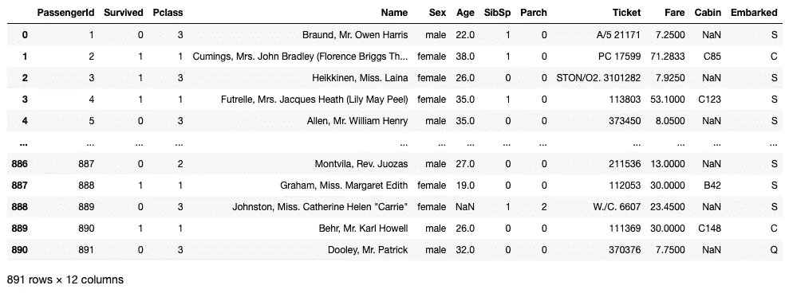

作者图片

让我们选择要用于机器学习模型的特定列:

```
# save only those columns that we want to use as features
df = df[['Survived','Pclass','Sex','Age','Fare','Embarked']]
df
```

> 为了简单起见，我将不深究为什么选择上面的列。如果您想了解关于特性选择的更多信息，请查看我以前的文章:
> 
> **Python 中的统计—使用 ANOVA 进行特征选择**—[https://towardsdatascience . com/Statistics-in-Python-Using-ANOVA-for-Feature-Selection-b4dc 876 ef4f 0](/statistics-in-python-using-anova-for-feature-selection-b4dc876ef4f0)
> 
> **Python 中的统计—使用卡方进行特征选择**—[https://towards data science . com/Statistics-in-Python-Using-Chi-Square-for-Feature-Selection-d44f 467 ca 745](/statistics-in-python-using-chi-square-for-feature-selection-d44f467ca745)
> 
> **Python 中的统计—共线性和多重共线性**—[https://towardsdatascience . com/Statistics-in-Python-共线性和多重共线性-4c 4 DCD 82 B3 f](/statistics-in-python-collinearity-and-multicollinearity-4cc4dcd82b3f)
> 
> **Python 中的统计—了解方差、协方差和相关性**—[https://towardsdatascience . com/Statistics-in-Python-Understanding-Variance-协方差-and-Correlation-4729 b 528 db 01](/statistics-in-python-understanding-variance-covariance-and-correlation-4729b528db01)

剩余的数据帧现在有六列:

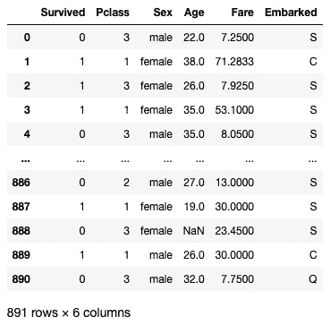

作者图片

让我们检查数据集中是否有 nan:

```
# check for NaNs
df.isna().sum()# Survived      0
# Pclass        0
# Sex           0
**# Age         177** # Fare          0
**# Embarked      2**
# dtype: int64
```

如上面以粗体突出显示的那样，**年龄**和**着手**列有 nan。

## 拆分数据

在我们进行任何特性预处理之前，让我们将数据分成训练集和测试集:

```
from sklearn.model_selection import train_test_split# get all columns except Survived
X = df.iloc[:,1:]# Survived
y = df.iloc[:,0]# perform the splitting now
X_train, X_test, y_train, y_test = train_test_split(X, y, 
                                                  test_size = 0.3, 
                                                  stratify = y, 
                                                  random_state = 0)# reset the indices for training and testing sets
X_train = X_train.reset_index(drop=True)
y_train = y_train.reset_index(drop=True)X_test = X_test.reset_index(drop=True)
y_test = y_test.reset_index(drop=True)
```

> 请注意，我们在进行任何数据预处理(如编码、替换 nan 等)之前分割了数据集。这里有两种观点——一种观点认为，在分割数据之前，我们应该首先进行数据预处理。另一个学派认为，我们应该在进行任何数据预处理之前拆分数据。一般来说，要防止“数据泄露”，最好先拆分数据，然后独立于测试数据对训练数据进行预处理。使用定型数据对模型进行定型后，您可以对测试数据进行预处理，并将其提供给模型进行评估。

在上面的代码片段中，数据帧被分成 70%的训练集和 30%的测试集。为了确保训练集和测试集具有相同比例的存活值，我们对`**y**`进行了分层，并为可重复性固定了一个`**random_state**`参数值。

## 特征预处理

下一步是预处理训练数据。这里我们需要预处理两种类型的列——数字列和分类列:

对于数字列，我们要做两件事:

*   用一些值替换数字列中的所有 nan
*   标准化数字列值

首先，我们用各列的中值替换**年龄**和**票价**列中缺失的值。为此，您可以使用 sklearn 中的`**SimpleImputer**`类:

```
from sklearn.impute import SimpleImputer# use the SimpleImputer to replace all NaNs in numeric columns 
# with the median
numeric_imputer = SimpleImputer(strategy='median', 
                                missing_values=np.nan)# apply the SimpleImputer on the Age and Fare columns
X_train[['Age','Fare']] = \
    numeric_imputer.fit_transform(X_train[['Age','Fare']])display(X_train)
```

> 参考我之前关于使用 SimpleImputer 类的文章:

[](/imputing-missing-values-using-the-simpleimputer-class-in-sklearn-99706afaff46) [## 使用 sklearn 中的 SimpleImputer 类输入缺失值

### 了解如何使用 SimpleImputer 类来替换 Pandas 数据帧中的 nan

towardsdatascience.com](/imputing-missing-values-using-the-simpleimputer-class-in-sklearn-99706afaff46) 

**年龄**和**费用**栏中缺失的值现在用各栏的中间值填充:

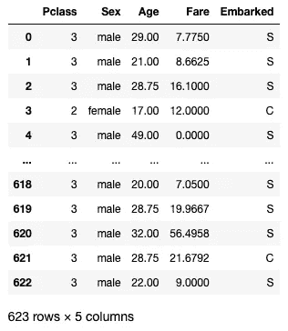

作者图片

下一步是使用`**StandardScaler**`类标准化这些值:

```
from sklearn.preprocessing import StandardScaler# Standardize the Age and Fare columns using the StandardScaler
scaler = StandardScaler()
X_train[['Age','Fare']] = \
    scaler.fit_transform(X_train[['Age','Fare']])display(X_train)
```

**年龄**和**票价**列的值现已标准化:

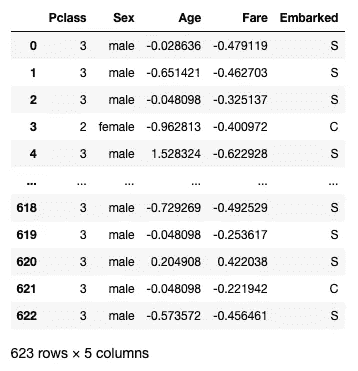

作者图片

对于分类列( **Pclass** 、 **Sex** 和**oaked**)，您希望用最频繁出现的值替换缺失值。同样，您可以使用`**SimpleImputer**`类:

```
# use the SimpleImputer to replace all NaNs in categorical columns 
# with the most frequent ones
categorical_imputer = SimpleImputer(strategy='most_frequent', 
                                    missing_values=np.nan)# apply the SimpleImputer on the Pclass, Sex, and Embarked columns
X_train[['Pclass','Sex','Embarked']] = \
    categorical_imputer.fit_transform(
        X_train[['Pclass','Sex','Embarked']])
X_train
```

您现在可以确认在`X_train`数据框中不再有任何 nan:

```
X_train.isna().sum()# Pclass      0
# Sex         0
# Age         0
# Fare        0
# Embarked    0
# dtype: int64
```

既然 dataframe 中没有 nan，那么对分类列要做的最后一件事就是执行编码。有两个选项可用:

*   **序号编码** —这适用于存在隐式排序的列。例如经济状况、等级、乘客级别等。
*   **One-hot encoding** —这对于值的排序不重要的列很有用。例如性别、发色、肤色等。

在我们的数据集的情况下，`**Sex**`和`**Embarked**`的值没有隐式排序，因此它们可以被一次性编码:

```
from sklearn.preprocessing import OneHotEncoder# one-hot-encode the categorical columns - Sex, and Embarked
enc = OneHotEncoder(handle_unknown='ignore')X_train[['Sex_female','Sex_male',
         'Embarked_C','Embarked_Q','Embarked_S']] = \    
    pd.DataFrame(enc.fit_transform(
        X_train[['Sex','Embarked']]).toarray()) display(X_train)
```

您现在应该已经将**性别**和**列的值进行了 one-hot 编码:**

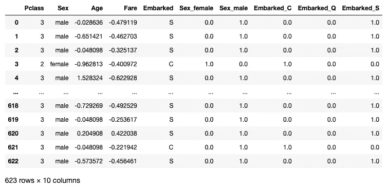

作者图片

现在，您可以继续删除**性别**和**装载的**列(接下来，您将使用它们的独热编码列):

```
# drop the Sex and Embarked and use their one-hot encoded columns
X_train.drop(columns=['Sex','Embarked'], inplace=True)display(X_train)
```

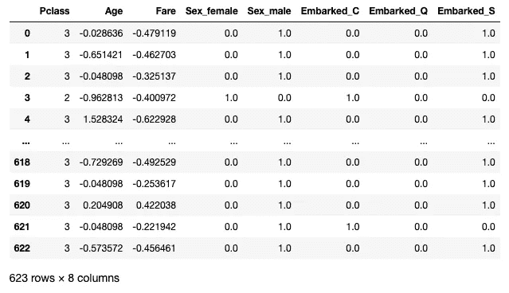

作者图片

最后，您现在可以使用分类器来训练模型。对于这个例子，我将使用`**LogisticRegression**`类:

```
from sklearn.linear_model import LogisticRegression# train using LogisticRegression
logregress = LogisticRegression()
logregress.fit(X_train,y_train)
```

## 准备用于评估模型的测试集

训练好模型后，您现在可以使用测试集来评估模型，以查看它的执行情况。还记得你在训练集上做的预处理吗？您现在需要对您的测试集做同样的事情:

```
**# replace all NaNs and standardize the numerical columns**
X_test[['Age','Fare']] = \
    numeric_imputer.transform(X_test[['Age','Fare']])**# standardize the Age and Fare columns**
X_test[['Age','Fare']] = scaler.transform(X_test[['Age','Fare']])**# replace all NaNs in the categorical columns**
X_test[['Pclass','Sex','Embarked']] = \
    categorical_imputer.transform(
        X_test[['Pclass','Sex','Embarked']])**# one-hot encode the Sex and Embarked columnns**
X_test[['Sex_female','Sex_male',
        'Embarked_C','Embarked_Q','Embarked_S']] = \    
    pd.DataFrame(enc.transform(
        X_test[['Sex','Embarked']]).toarray())**# drop the Sex and Embarked columns**
X_test.drop(columns=['Sex','Embarked'], inplace=True)display(X_test)
```

在对测试集执行预处理之后，它现在看起来像这样:

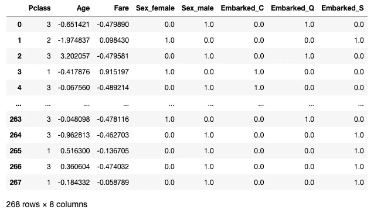

作者图片

> 预处理测试集以匹配定型集的列是很重要的。否则，您将无法使用它来评估您的模型。

您现在可以调用`**score()**`函数来评估模型:

```
**logregress.score(X_test,y_test)**
# 0.8097014925373134                  this is the accuracy score
```

# 使用流水线简化机器学习

因此，您刚刚使用上一节中的 Titanic 数据集构建并训练了一个模型。你注意到了什么？以下是值得注意的几点:

*   您必须分别预处理您的训练集和测试集，这涉及到相当多的重复性工作
*   这涉及到许多步骤，必须按照正确的顺序来执行

使用 sklearn `Pipeline`类，您现在可以为您的机器学习过程创建一个工作流，并强制执行各个步骤的执行顺序。

在接下来的章节中，你将看到如何使用 sklearn `Pipeline`类来简化之前的机器学习过程。

## 加载和拆分数据

第一步是加载数据并执行拆分:

```
import pandas as pd
import numpy as np
from sklearn.model_selection import train_test_splitdf = pd.read_csv('[https://raw.githubusercontent.com/dsindy/kaggle-titanic/master/data/train.csv'](https://raw.githubusercontent.com/dsindy/kaggle-titanic/master/data/train.csv')) df = df[['Survived','Pclass','Sex','Age','Fare','Embarked']]
X = df.iloc[:,1:]
y = df.iloc[:,0]X_train, X_test, y_train, y_test = train_test_split(X, y, 
                                                  test_size = 0.3, 
                                                  stratify = y, 
                                                  random_state = 0)
```

## 为预处理创建管道

让我们使用`**Pipeline**`类来指定将转换应用到数据的一系列步骤。下面的代码片段创建了三个`Pipeline`对象:

```
from sklearn.pipeline import Pipeline
from sklearn.impute import SimpleImputer
from sklearn.preprocessing import StandardScaler, OneHotEncoder# define the transformer for numeric columns
# for 'Age' and 'Fare'
**numeric_transformer = Pipeline(steps=[
    ('imputer', SimpleImputer(strategy='median')),
    ('scaler', StandardScaler())
])**# define the transformer for categorical columns
# for 'Sex' and 'Embarked'
**categorical_transformer1 = Pipeline(steps=[
    ('imputer', SimpleImputer(strategy='most_frequent')),
    ('onehot', OneHotEncoder(handle_unknown='ignore'))
])**# define the transformer for categorical columns
# for 'Pclass'
**categorical_transformer2 = Pipeline(steps=[
    ('imputer', SimpleImputer(strategy='most_frequent'))**
**])**
```

在上面的代码片段中，我:

*   创建了一个`Pipeline`对象(`**numeric_transformer**`)，首先用他们的中间值替换**年龄**和**费用**列中的 NaNs。然后，这两列的值被标准化:

```
numeric_transformer = Pipeline(steps=[
    ('imputer', SimpleImputer(strategy='median')),
    ('scaler', StandardScaler())
])
```

*   创建了另一个`Pipeline`对象(`**categorical_features1**`)来替换 **Sex** 和**abowed**列中的 NaNs，使其具有每列中最频繁出现的值。然后，对这两列的值进行一次性编码:

```
categorical_transformer1 = Pipeline(steps=[
    ('imputer', SimpleImputer(strategy='most_frequent')),
    ('onehot', OneHotEncoder(handle_unknown='ignore'))
])
```

*   创建另一个`Pipeline`对象(`**categorical_features2**`)来替换 **Pclass** 列中出现频率最高的值:

```
categorical_transformer2 = Pipeline(steps=[
    ('imputer', SimpleImputer(strategy='most_frequent'))
])
```

`**Pipeline**`类的**步骤**参数接受一个元组列表。每个元组包含:

*   转换的名称，以及
*   实现`fit`或`transform`方法的转换对象。例如，`SimpleImputer`、`StandardScaler`、`MinMaxScaler`等。最后一个变换对象可以作为估计器(实现`fit`方法)，例如`LogisticRegression`等。

`Pipeline`对象中的转换按照元组列表中指定的顺序执行:

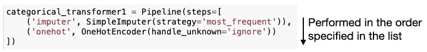

作者图片

接下来，您将使用`**ColumnTransformer**`类将在`Pipeline`对象中指定的转换应用到 dataframe 中的各个列:

```
from sklearn.compose import ColumnTransformerfeatures_preprocessor = ColumnTransformer(
    transformers=[
     ('numeric',      numeric_transformer,      ['Age','Fare']),
     ('categorical1', categorical_transformer1, ['Sex','Embarked']),
     ('categorical2', categorical_transformer2, ['Pclass'])
    ])
```

在上面的代码片段中，您应用了:

*   `**numeric_transformer**` `Pipeline`对象为**年龄**和**票价**列
*   `**categorical_transformer1**` `Pipeline`对象到**性别**和**列**
*   `**categorical_transformer2**` `Pipeline`对象到 **Pclass** 列

> 如果有不需要转换的列，您应该将`ColumnTransformer`类的`remainder`参数设置为`passthrough`以确保这些列被保留。否则，它们将被默认删除)

所有这些步骤都被传入`ColumnTransformer`类并作为`**features_preprocessor**`返回。现在你可以使用`**features_preprocessor**`和你想用来训练你的模型的分类器创建另一个`Pipeline`对象:

```
from sklearn.linear_model import LogisticRegressionpipe = Pipeline(steps=[
    ('preprocessor', features_preprocessor),  # preprocess features
    ('classifier', LogisticRegression())      # apply classifier
])
```

在上面的代码片段中，我使用了`**LogisticRegression**`类来训练模型。

> 回想一下，`**Pipeline**`类接受一个包含转换对象列表的元组列表，最后一个类可以实现`fit()`方法。

最后，您可以使用`Pipeline`对象训练模型:

```
# start the training
pipe.fit(X_train, y_train)
```

运行上述代码，您将看到以下输出:

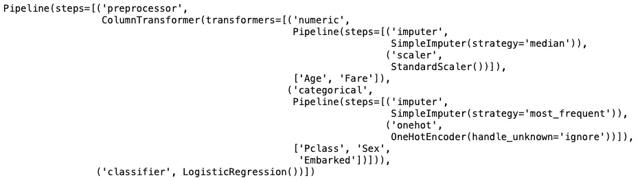

作者图片

## 对模型评分

要评估模式，请调用`Pipeline`对象上的`score()`方法:

```
pipe.score(X_test,y_test)
# 0.8097014925373134
```

输出与前面手动执行机器学习的部分相同。

概括一下，下面是使用`Pipeline`对象的整个代码块:

```
import pandas as pd
import numpy as npfrom sklearn.model_selection import train_test_split
from sklearn.pipeline import Pipeline
from sklearn.impute import SimpleImputer
from sklearn.preprocessing import StandardScaler, OneHotEncoder
from sklearn.compose import ColumnTransformer
from sklearn.linear_model import LogisticRegressiondf = pd.read_csv('[https://raw.githubusercontent.com/dsindy/kaggle-titanic/master/data/train.csv'](https://raw.githubusercontent.com/dsindy/kaggle-titanic/master/data/train.csv'))df = df[['Survived','Pclass','Sex','Age','Fare','Embarked']]
X = df.iloc[:,1:]
y = df.iloc[:,0]X_train, X_test, y_train, y_test = train_test_split(X, y, 
                                                  test_size = 0.3, 
                                                  stratify = y, 
                                                  random_state = 0)# define the transformer for numeric columns
# for 'Age' and 'Fare'
numeric_transformer = Pipeline(steps=[
    ('imputer', SimpleImputer(strategy='median')),
    ('scaler', StandardScaler())
])# define the transformer for categorical columns
# for 'Sex' and 'Embarked'
categorical_transformer1 = Pipeline(steps=[
    ('imputer', SimpleImputer(strategy='most_frequent')),
    ('onehot', OneHotEncoder(handle_unknown='ignore'))
])# define the transformer for categorical columns
# for 'Pclass'
categorical_transformer2 = Pipeline(steps=[
    ('imputer', SimpleImputer(strategy='most_frequent'))
])features_preprocessor = ColumnTransformer(
    transformers=[
     ('numeric',      numeric_transformer,      ['Age','Fare']),
     ('categorical1', categorical_transformer1, ['Sex','Embarked']),
     ('categorical2', categorical_transformer2, ['Pclass'])
    ])pipe = Pipeline(steps=[
    ('preprocessor', features_preprocessor),  # preprocess features
    ('classifier', LogisticRegression())      # apply classifier
])# start the training
pipe.fit(X_train, y_train)# evaluate the model
pipe.score(X_test,y_test)                     # 0.8097014925373134
```

如果您观察，会发现不需要对测试集执行预处理——`Pipeline`对象的`score()`方法会处理好它！此外，工作流现在定义得更加清晰，也更容易理解。

# 通过 GridSearchCV 使用管道

您还可以使用带有`GridSearchCV`类的`Pipeline`对象进行超参数调优。

[](/tuning-the-hyperparameters-of-your-machine-learning-model-using-gridsearchcv-7fc2bb76ff27) [## 使用 GridSearchCV 调整机器学习模型的超参数

### 了解如何使用 sklearn 中的 GridSearchCV 函数来优化您的机器学习模型

towardsdatascience.com](/tuning-the-hyperparameters-of-your-machine-learning-model-using-gridsearchcv-7fc2bb76ff27) 

下面的代码片段显示了如何将`Pipeline`对象传递给`GridSearchCV`类，以便您可以找到使用`LogisticRegression`类训练您的模型的最佳超参数:

```
from sklearn.model_selection import GridSearchCV
from sklearn.linear_model import LogisticRegression
import warningswarnings.filterwarnings('ignore')pipe = Pipeline(steps=[
    ('preprocessor', features_preprocessor),  # preprocess features
    ('classifier', LogisticRegression())      # apply classifier
])**# parameter grid
parameters = {
    'classifier__penalty' : ['l1','l2'],          
    'classifier__C'       : np.logspace(-3,3,7),
    'classifier__solver'  : ['newton-cg', 'lbfgs', 'liblinear'],
}****clf = GridSearchCV(pipe,                      # model
                   param_grid = parameters,   # hyperparameters
                   scoring='accuracy',        # metric for scoring
                   cv=10)                     # number of folds****clf.fit(X, y)     # GridSearchCV will automatically split the data
                  # into training and testing data**
```

> 当将`GridSearchCV`与`Pipeline`对象一起使用时，注意超参数的键必须以转换器的名称为前缀—“`**classifier__**`”(注意双下划线)。

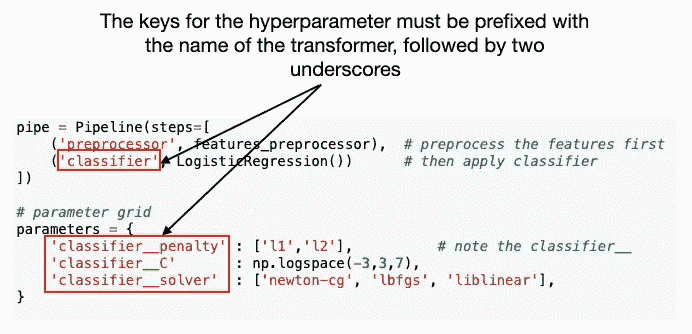

作者图片

模型定型后，您现在可以评估模型:

```
**clf.score(X_test, y_test)**
# 0.8134328358208955
```

现在模型的精度提高了(与之前的 0.8097014925373134 相比)。

您可以打印出最佳超参数和最佳估计值的平均交叉验证分数:

```
print("Tuned Hyperparameters :", clf.best_params_)
print("Accuracy :",clf.best_score_)   # Mean cross-validated score 
                                      # of the best_estimator
```

您应该会看到以下结果:

```
Tuned Hyperparameters : {'classifier__C': 0.1, 'classifier__penalty': 'l2', 'classifier__solver': 'liblinear'}
Accuracy : 0.7934956304619226
```

# 使用管道评估分类器

`Pipeline`对象的另一个好用途是用它来评估不同的算法来训练你的模型。对于我们的例子，让我们尝试不同的分类器，看看哪一个给出最高的准确性。

让我们导入以下模块:

```
from sklearn.neighbors import KNeighborsClassifier
from sklearn.svm import SVC 
from sklearn.tree import DecisionTreeClassifier
from sklearn.ensemble import RandomForestClassifier, \
    AdaBoostClassifier 
from sklearn.discriminant_analysis import \
    QuadraticDiscriminantAnalysis
from sklearn.gaussian_process import GaussianProcessClassifier
from sklearn.gaussian_process.kernels import RBF
from sklearn.neural_network import MLPClassifier
from sklearn.naive_bayes import GaussianNB
```

创建我们希望使用的分类器列表，并指定其特定参数:

```
classifiers = [    
    LogisticRegression(C=0.1, penalty='l2', solver='liblinear'),
    KNeighborsClassifier(3),
    KNeighborsClassifier(),
    KNeighborsClassifier(7),
    SVC(kernel="linear", C=0.025),
    SVC(gamma=2, C=1),
    GaussianProcessClassifier(1.0 * RBF(1.0)),
    DecisionTreeClassifier(max_depth=5),
    RandomForestClassifier(max_depth=5, n_estimators=10, 
                           max_features=1),
    MLPClassifier(alpha=1, max_iter=1000),
    AdaBoostClassifier(),
    GaussianNB(),
    QuadraticDiscriminantAnalysis(),
]
```

我们还将使用一个数据帧来存储每个分类器的精度:

```
# dataframe to store the accuracy of each classifier
df_results = pd.DataFrame(columns=
    ['Classifier', 'Accuracy'])
```

要试用各种分类器:

*   遍历列表中的每个分类器，并在每次迭代中创建一个`Pipeline`对象。
*   对于每个`Pipeline`对象，应用预处理器，然后应用分类器。
*   使用`Pipeline`对象训练一个模型，然后对其进行评估。

以下代码片段总结了上述步骤:

```
# train a model using each classifier
for classifier in classifiers: # create the pipeline to preprocess the features 
    # and apply the classifier
    pipe = Pipeline(steps=[
        ('preprocessor', features_preprocessor),
        ('classifier', classifier)]) # train the model
    pipe.fit(X_train, y_train)   

    # append the result to the dataframe
    df_results = df_results.append(pd.Series({
        'Classifier' : classifier, 
        'Accuracy' : pipe.score(X_test, y_test)
    }),ignore_index = True)
```

当使用并评估所有分类器时，您可以基于最高准确度对结果数据帧进行排序:

```
display(df_results.sort_values(by='Accuracy', ascending=False))
```

结果如下所示:

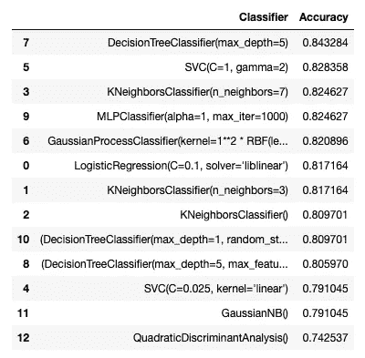

作者图片

# 摘要

在本文中，我已经讨论了 sklearn 中`Pipeline`类的使用。在 sklearn 中使用管道最大的好处就是让你的机器学习工作流程更清晰，更容易理解。此外，您可以使用它来快速评估数据集的各种机器学习算法。我希望您现在对 sklearn 中的管道是如何工作的有了更清楚的了解！

[](https://weimenglee.medium.com/membership) [## 加入媒介与我的介绍链接-李伟孟

### 作为一个媒体会员，你的会员费的一部分会给你阅读的作家，你可以完全接触到每一个故事…

weimenglee.medium.com](https://weimenglee.medium.com/membership)