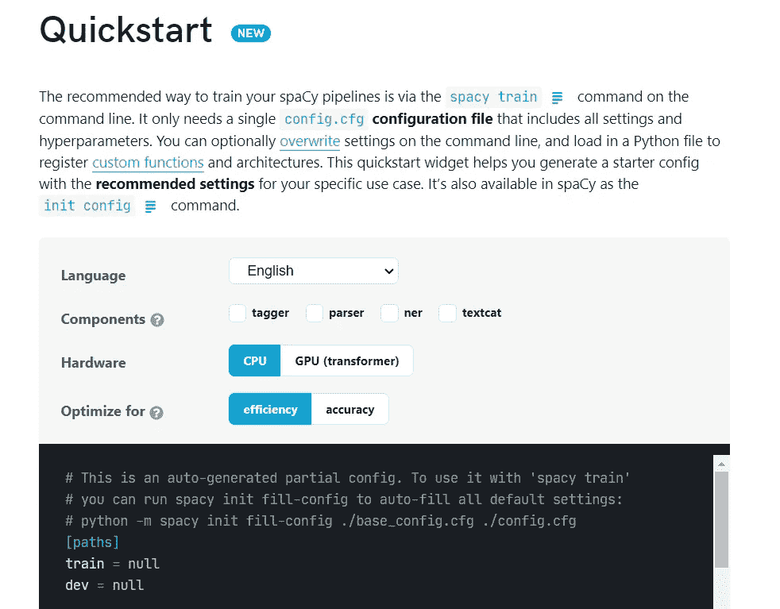
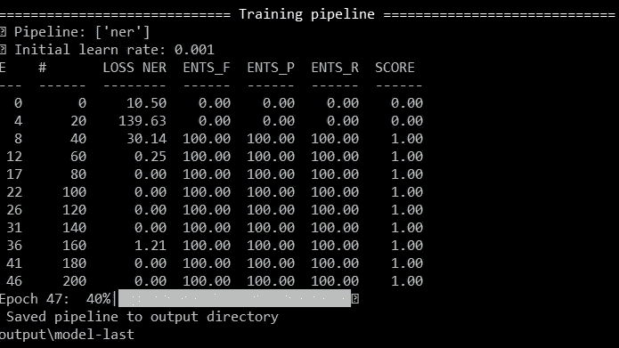
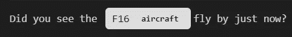

# 使用 spaCy 3.0 构建自定义 NER 模型

> 原文：<https://towardsdatascience.com/using-spacy-3-0-to-build-a-custom-ner-model-c9256bea098?source=collection_archive---------5----------------------->

[爆炸](https://explosion.ai)使 [spaCy](https://spacy.io) 成为 Python 中 NLP 的免费开源库。最近，他们发布了 3.1 版本的更新，这个更新改变了 v2 的很多东西，打破了以前在 Medium 上找到的许多教程。我在 Spacy v3 上唯一能找到的另一篇文章是[这篇文章](https://medium.com/analytics-vidhya/building-a-text-classifier-with-spacy-3-0-dd16e9979a)关于用 Spacy 3.0 构建文本分类器。

在该教程的基础上，本文将研究如何在 Spacy v3.1 中构建自定义 NER 模型，使用 Spacy 推荐的命令行界面(CLI)方法，而不是 Spacy v2 中常见的自定义训练循环。因为这篇文章是一篇更实用的文章，我们不会涉及 NER 是什么的基础知识等。你可以在这篇优秀的文章中找到更深入的信息[。引用它，NER 本质上是一个“信息提取任务”,我们试图识别实体(如位置、货币价值、组织、人员等)。从给定的文本中。](https://medium.com/swlh/build-a-custom-named-entity-recognition-model-ussing-spacy-950bd4c6449f)

# 概观

本质上，在 Spacy v3 中，有一个转变，即在命令行上使用`spacy train`命令来训练模型管道，而不是在 Python 中创建自己的训练循环。因此，旧的数据格式(json 等。)不再被接受，您必须将数据转换成新的`.spacy`格式。因此，我们将探讨两个主要问题:

1.  将您的数据从旧的 NER 格式更新为新的`.spacy`格式
2.  使用 CLI 训练您的数据并配置训练
3.  加载模型并预测

# 1.新的`.spacy`格式

过去，NER 的格式如下:

然而，Spacy v3.1 版不再采用这种格式，必须先在`doc`中转换，然后在`docbin`中转换，才能转换成它们的`.spacy`格式。这是使用下面的代码完成的，改编自他们的[示例项目](https://github.com/explosion/projects/tree/v3/tutorials):

这有助于将文件从旧的 Spacy v2 格式转换为全新的 Spacy v3 格式。

# 2.使用 CLI 训练您的模型

过去，模型的训练是在 Python 内部完成的。然而，Spacy 现在发布了一个用于 CLI 的`spacy train`命令。他们建议这样做，因为这样可能会更快，并且有助于评估/验证过程。此外，它内置了早期停止逻辑(而在 Spacy v2 中，必须编写一个包装器代码来实现早期停止)。

使用这个新命令的唯一问题是，老实说，它的文档还没有 100%准备好。然而，没有文档的问题是，我有时很难知道命令行上的输出到底意味着什么。然而，他们在他们的 Github 论坛上**非常**有帮助，我在那里一直得到很好的帮助。

使用 CLI 的第一步是获取配置文件。您可以在这里创建自己的配置文件[，Spacy 创建一个小部件，允许您在必要时设置您的配置。](https://spacy.io/usage/training#config)

spaCy 小工具的屏幕截图(按作者)

一旦完成配置(在本例中，选择“English”作为语言，选择“ner”作为组件)，我们就可以启动 CLI 了。

# 填写您的配置文件

配置文件没有完全填充。因此，您应该运行的第一个命令是:

这将使用默认值填充您从 Spacy 的小部件下载的 base_config 文件。你可以使用默认设置，并根据你的需要进行调整，但是现在让我们使用默认设置。

# 训练模型

一旦完成，你就可以训练你的模型了！此时，您手头应该有三个文件:(config.cfg 文件，(2)`.spacy`格式的训练数据和(3)评估数据集。在这种情况下，我没有创建另一个评估数据集，而是简单地使用我的训练数据作为评估数据集(这不是一个好主意，但只适用于本文！).确保这三个文件都在运行 CLI 的文件夹中。在这里，我还将`--gpu-id`设置为 0，以便选择我的 GPU。

这是您应该大致看到的输出(它将根据您的设置而变化)

列车输出截图(作者)

尽管没有官方文件，这里的讨论[和这里的](https://github.com/explosion/spaCy/discussions/7450)和[说明:](https://stackoverflow.com/questions/50644777/understanding-spacys-scorer-output)

1.  **E** 是历元的数量
2.  `#`是优化步骤的数量(=处理的批次)
3.  损失 NER 是模型损失
4.  ENTS_F、ENTS_P 和 ENTS_R 是 NER 任务的精度、召回率和 fscore

损失 NER 是基于测试集计算的，而 ENTS_F 等。是基于评估数据集计算的。训练完成后，Spacy 将根据您设置配置文件的方式(即配置文件中关于评分权重的部分)保存最佳模型，以及训练的最后一个模型。

# 3.用模型做预测

一旦通过 CLI 对模型进行了训练，就可以像在 Spacy 2 中一样加载和使用它。在我们的例子中，它看起来像这样:

预测截图(作者)

而且……它起作用了！

感谢阅读这篇文章！如果您有任何问题，并且希望讨论更多关于 Spacy v3 的内容，并了解其他人也在用它做什么，请告诉我。

*原载于*[*http://Zach lim 98 . github . io*](http://zachlim98.github.io/me)*。*