# 利用 Spark + R 分析巴西紧急财政援助数据

> 原文：<https://towardsdatascience.com/using-spark-r-to-analyze-emergency-financial-assistance-data-in-brazil-92957e0e25a7?source=collection_archive---------27----------------------->

## [理解大数据](https://towardsdatascience.com/tagged/making-sense-of-big-data)

## 下载、加载和分析超过 10 千兆字节的数据库

照片由[毛罗·利马](https://unsplash.com/@limamauro23)在 [Unsplash](https://unsplash.com/photos/HLWLa72zheQ) 上拍摄

# 什么是紧急经济援助？

紧急财政援助是 2020 年 4 月通过第 13.9821 号法律实施的临时财政支持。其目标受众包括 18 岁以上的个人、个体微型企业家、个体 INSS 纳税人、失业者、个体经营者和非正规工人，其月人均收入达到最低工资的一半(522.50 雷亚尔)或家庭月总收入达到三份最低工资(BRL 3.135)，这些人在 2018 年没有被 IRPF 征税。([弗雷塔斯等人，2020 年，第 8 页](https://www.gov.br/cidadania/pt-br/servicos/sagi/relatorios/De_olho_na_cidadania_VOL_2_PNADC.pdf))。

# **关于日期**

可以通过 [PNAD 新冠肺炎数据](https://www.ibge.gov.br/estatisticas/sociais/trabalho/27946-divulgacao-semanal-pnadcovid1.html?=&t=downloads)(2020 年 4 月至 11 月)对紧急财政援助进行多项分析，但是，由于其代表样本，PNAD 数据不包括各受益方的独特信息。为了获得每个月每个受益人的数据，必须使用透明度门户网站上每月提供的数据库:[http://www . Portal transparencia . gov . br/download-de-dados/auxilio-emergencial。](http://www.portaltransparencia.gov.br/download-de-dados/auxilio-emergencial.)通过门户，您可以选择想要下载数据的年份和月份。

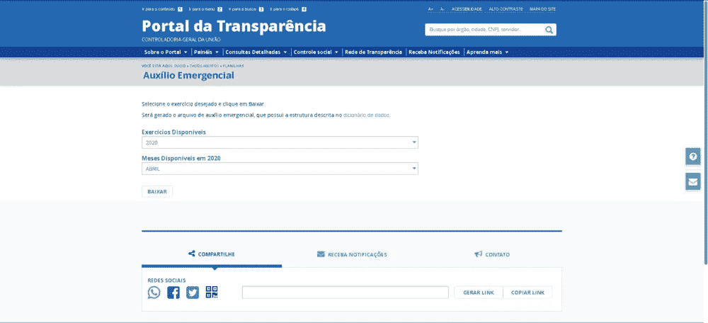

透明度门户网站([https://www.portaltransparencia.gov.br](https://www.portaltransparencia.gov.br))

一旦数据被下载并解压缩，就需要在 RStudio 中安装 sparklyr 包，csv 将通过它来加载。

作者图片

# **关于 sparklyr**

Sparklyr 是一个包，它提供了 R 和 Apache Spark 之间的接口(简言之，Apache Spark 是一个用于大规模数据处理的统一分析引擎)。换句话说，在 R/RStudio 内部使用 sparklyr 时，我们实际上是在后台运行 Spark 中的函数。使用 sparklyr，可以执行 dplyr 中的几个功能，从 *tidy* universe 中打包，例如:*过滤器*、*选择*、 *group_by* 等功能。

使用 sparklyr 比使用 data.table 等大型软件包的优势在于:

1.  它能够加载非常大的文件，而不需要集群或非常强大的机器来完成。分析可能性的前沿大大增加，现在可以加载和分析大于计算机 RAM 内存的文件。
2.  执行速度。加载大文件不会成为一个耗时的过程，并且一旦加载，利用前面提到的 dplyr 函数，数据操作也非常快速和有效。

图片来源:blog.rstudio.com(blog.rstudio.com)

除了 sparklyr 之外，将使用 Apache 基金会的另一个包:arrow。这个包在后台工作，这意味着你不需要专门从它调用任何函数。这里箭头的作用是通过 sparklyr 优化数据加载，通过下面的链接你可以了解更多关于箭头的用处:[https://spark.rstudio.com/guides/arrow/.](https://spark.rstudio.com/guides/arrow/.)

解释完了，我们现在开始工作吧。

# **安装包和加载数据**

以下代码执行必要软件包的安装和加载:

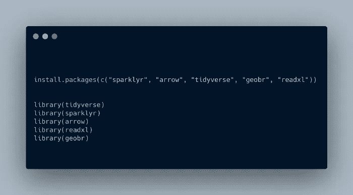

作者图片

一旦安装并加载了包，就该加载数据了，为此您首先需要启动一个与 Spark 的本地连接。

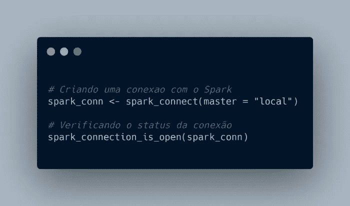

作者图片

当执行函数“*spark _ connection _ is _ open(spark _ conn)*时，预期结果为“ *TRUE* ”，因此我们知道连接成功。

现在是加载数据的时候了:

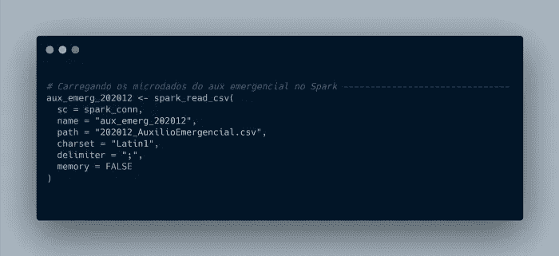

作者图片

加载时，您需要将一些参数传递给 *spark_read_csv* 函数，它们是:

1.  sc:是之前创建的连接( *spark_conn* )。
2.  name:将在 Spark 环境中创建的表的名称(我建议插入在该环境中使用的相同名称，在本例中称为“ *aux_emerg_202012* ”)。
3.  路径:要上传的文件的原始名称及其扩展名(。csv)。
4.  字符集:文件的编码。默认情况下，它是 UTF-8，但是葡萄牙语更适合“Latin1”类型。
5.  分隔符:csv 分隔符的类型(逗号、分号、…)。
6.  内存:该参数用于将表存储在缓存中。但是我们不希望这样，因为这个想法是为了优化加载速度，为此，它必须被通知" *FALSE* "。

好了，现在我们已经装载好底座并准备好进行各种分析。

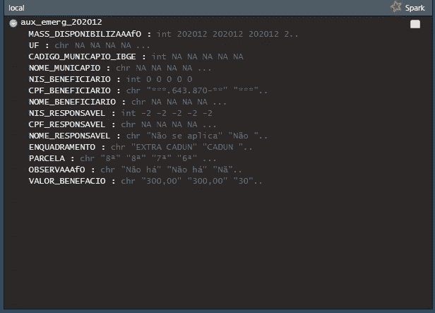

作者图片

# **分析数据**

在这第一点上，我们来看看巴西财政援助受益人的分布情况。

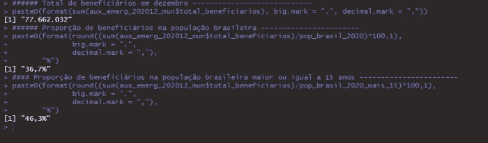

作者图片

你可以很快得到一些有趣的统计数据:12 月份有 77，662，032 人受益。这个数字相当于 2020 年巴西人口的 36.7%。当我们观察 15 岁或以上的人口并将其与用户总数进行比较时，这一百分比增加到 46.3%。

如果我们想知道受益人在城市人口中的分布情况，该怎么办？为此，首先需要过滤掉没有市政当局代码信息的行，然后，按市政当局对受益人进行分组和计数:

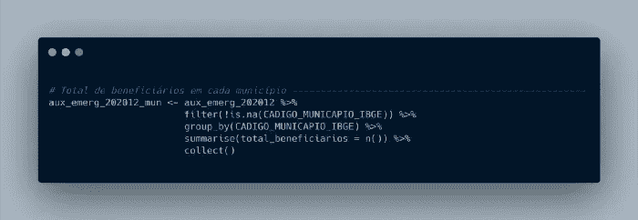

作者图片

这是上述代码的结果:一个包含所有市政当局及其总受益人的数据框架。

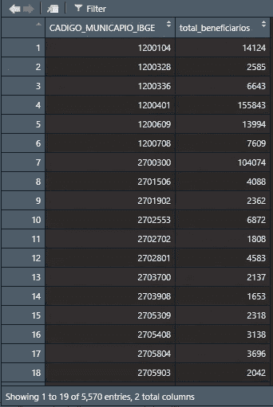

作者图片

为了获得人口中受益者的比例，我们需要 2020 年每个直辖市的人口估计数。我将使用由 UFRN 人口估计和预测实验室准备的人口预测。他们的作品可以在这里找到:【https://demografiaufrn.net/projecao-populacional/】T4。

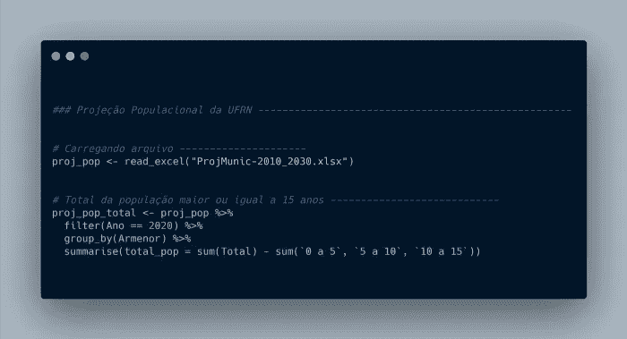

作者图片

请注意关于总体的重要一点:从样本中移除了 0 到 15 岁的个体。这是因为紧急财政援助是针对 18 岁和 18 岁以上的个人，因为预测是针对 5 年内 5 岁的年龄组，不可能排除所有 18 岁以下的个人。因此，决定去除 15 岁以下的人口。

有了关于受益人和 15 岁以上人口的数据，现在就有可能绘制一张易于可视化的地图。为此，将使用 geobr 软件包，这是一个由 IPEA 团队构建的巴西软件包。通过这个包，可以很快地从国土上获得几个形状文件。

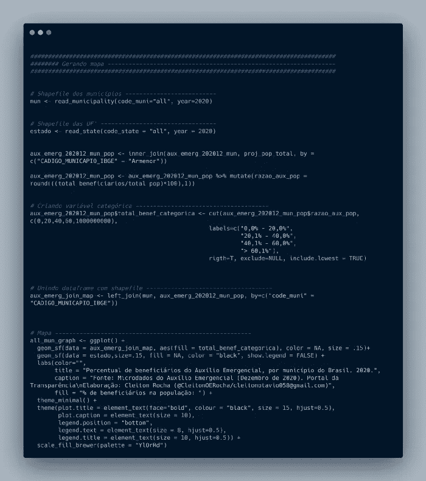

作者图片

这是上面代码的结果:

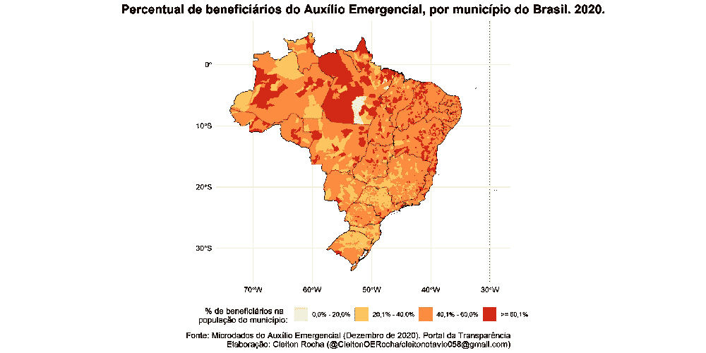

作者图片

该地图显示了北部/东北部地区有更多的城市，60%以上的人口受益于财政援助。另一方面，南部/东南部地区受益者占其城市人口的百分比最低。

下面的箱线图有助于进一步澄清这个问题:

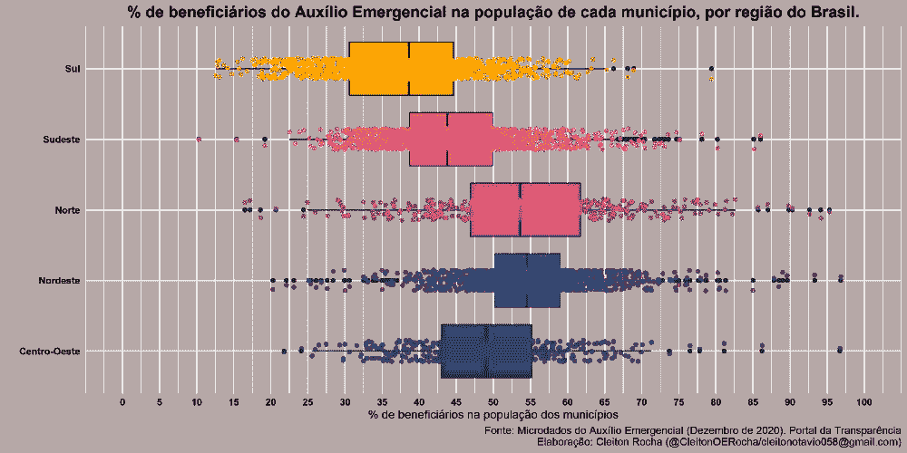

作者图片

如果我们想知道这在超滤水平上是如何表现的呢？

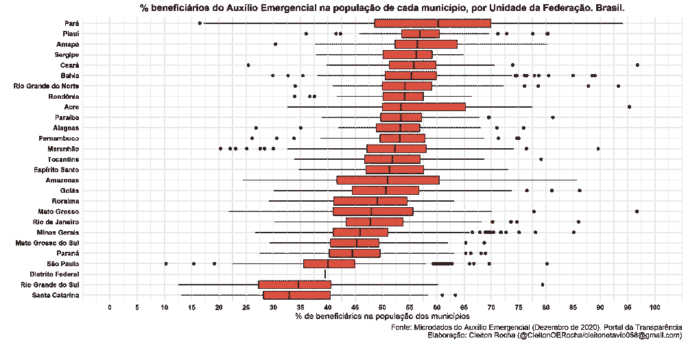

作者图片

最后，如何知道受益人是否在前几个月已经被考虑过了？这个怎么衡量？解决方法是知道经济资助分期付款的数目:

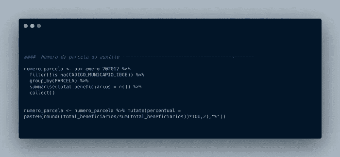

作者图片

这是结果:

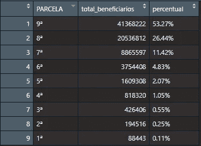

作者图片

12 月受益人中有 53.27%属于第九期财政援助，26.44%属于第八期，相当于该月所有受益人的 79.71%。简而言之，截至年底，该计划覆盖的绝大多数人口都已经在该计划中注册，因为该计划是为了帮助那些受疫情影响最严重的人而设立的。

# 代码和数据

我的 [Github](https://github.com/CleitonOERocha) 上有这些代码。你可以看看这些和其他公共数据分析。财政援助数据可在[透明门户网站](https://www.portaltransparencia.gov.br)上找到。

你也可以在 [LinkedIn](https://www.linkedin.com/in/cleitonoerocha/) 或 [Twitter](https://twitter.com/CleitonOERocha) 上找到我。