# 利用空间信息探测铅管

> 原文：<https://towardsdatascience.com/using-spatial-information-to-detect-lead-pipes-73a1e68d5643?source=collection_archive---------20----------------------->

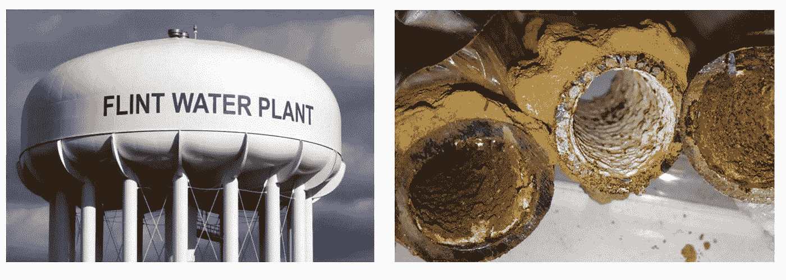

弗林特的水塔(左)和腐蚀的铅管(右)。图片来自 [BlueConduit](https://www.blueconduit.com/) 。

## 道路距离和图表如何帮助机器学习模型在弗林特和其他城市找到铅管

*[*blue conduit*](https://www.blueconduit.com/)*和* [*哈佛的数据科学项目*](https://www.capstone.iacs.seas.harvard.edu/) *的合作。* ***作者:*** [*贾薇拉*](https://www.linkedin.com/in/jastudillo/)*[*Max Cembalest*](https://www.linkedin.com/in/max-cembalest-79a121a8/)*[*凯文·黑尔*](https://www.linkedin.com/in/kevin-hare-b58933103/)*&*[*达希尔*](https://www.linkedin.com/in/dashiell-young-saver/) *。* ***项目顾问:*** *贾里德·韦伯，艾萨克·斯拉维特，&克里斯·坦纳。****

**几个世纪以来，美国的城市都使用一种廉价、有延展性且防漏的材料来建造他们的水管:铅。今天，铅管带来的健康风险是众所周知的。饮用被铅污染的水会阻碍儿童的发育，并导致成人的心脏和肾脏问题。美国环境保护署(EPA)于 1986 年禁止在新建筑中使用铅管。然而，今天，自来水管道(将水从城市管道输送到每个家庭的管道)在全国仍然很普遍。**

**众所周知，铅管很难识别和更换。识别铅管的唯一可靠方法是把它从地下挖出来。然而，挖掘是昂贵的，所以假阳性(错误地挖掘安全管道——如铜)是相当昂贵的。使问题更加复杂的是，管道材料的城市记录往往不准确和不完整。**

**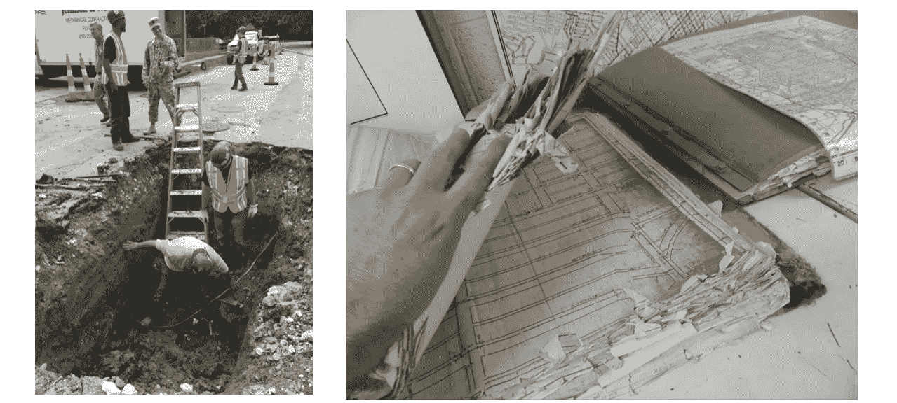**

**左图:管道挖掘人员在弗林特工作。右图:积水和不完整的弗林特市管道记录。图片来自蓝色管道[的贾里德·韦伯](https://www.blueconduit.com/)。**

**BlueConduit 的成立就是为了解决上述问题。该公司使用机器学习来预测家庭是否有基于其特征(建造年份、批量大小、消防栓类型等)的领先服务线。).该公司由密歇根大学的两位教授创办，他们在弗林特水危机期间构建了铅识别模型。当弗林特市开始使用教授的模型时，他们的铅管命中率(事实上，有铅服务管道的挖掘房屋的百分比)从 15%上升到 81%。**

**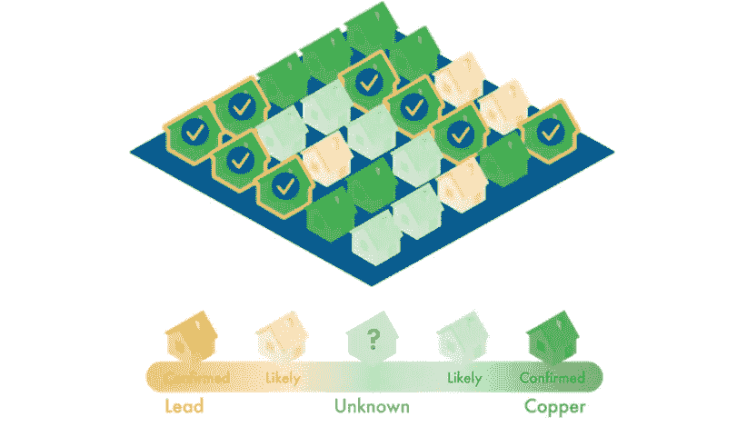**

**图片来自 [BlueConduit](https://www.blueconduit.com/) 。**

**随着 BlueConduit 将其工作扩展到美国更多的城市，他们正在积极研究进一步改进其模型的方法。为了帮助这项工作，我们探索了公司感兴趣的新领域:空间建模。目前，BlueConduit 的模型不使用空间信息(如房屋的纬度和经度)来进行预测。然而，由于城市是一条街一条街地建立起来的，BlueConduit 长期以来一直假设，在最近的邻居之间共享信息可以提高他们的铅管预测。我们的项目调查了这个假设。**

**为了测试纳入空间信息的有效性，我们建立了一个扩散模型，使用家庭位置来调整 BlueConduit 标准模型的预测。当在弗林特的家庭数据集上进行评估时，我们的模型显示出优于 BlueConduit 的标准模型(在命中率和城市节约方面)。在这篇博文中，我们详细介绍了我们的数据集和评估设置、建模过程和结果。然后，我们讨论对未来工作的影响。**

****

**这个项目是由 [*BlueConduit*](https://www.blueconduit.com/) *和* [*哈佛的数据科学项目*](https://www.capstone.iacs.seas.harvard.edu/) *合作完成的。***

# ****数据集&评估****

**我们使用 BlueConduit 关于弗林特铅管的数据集来构建和评估我们的模型。由于弗林特水危机后的大规模挖掘工作，该市现在拥有全国最完整的铅管数据集之一。该数据集包含 26，863 行，每行代表弗林特的一个地块(住宅或商业地产)。每个地块有 74 个描述的特征，例如市场价值、大小、位置(纬度/经度)、建造年份和投票选区。目标是一个二元指示器，指示宗地是否有主服务线。总的来说，该市 38%的家庭有铅服务线。**

**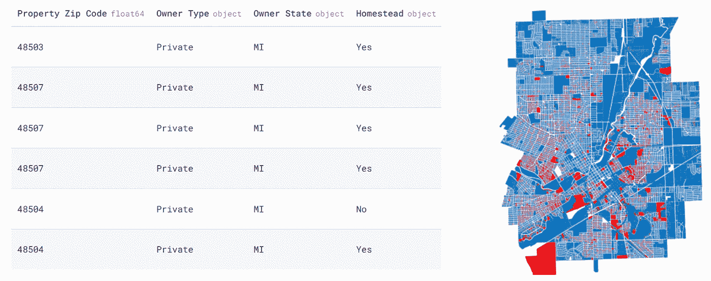**

**左:弗林特铅管数据集片段。右图:弗林特地图，包裹中的铅管被确认为红色。作者图片。**

**在弗林特，BlueConduit 使用了 XGBoost 模型，除了纬度和经度之外，它接受了所有家庭功能的训练。我们称之为“蓝色管道基线”模型。我们试图通过引入空间信息来提高 BlueConduit 基线测试集的性能。**

**为了评估我们相对于 BlueConduit 基线的绩效，我们使用了 BlueConduit 开发的两个指标:**

**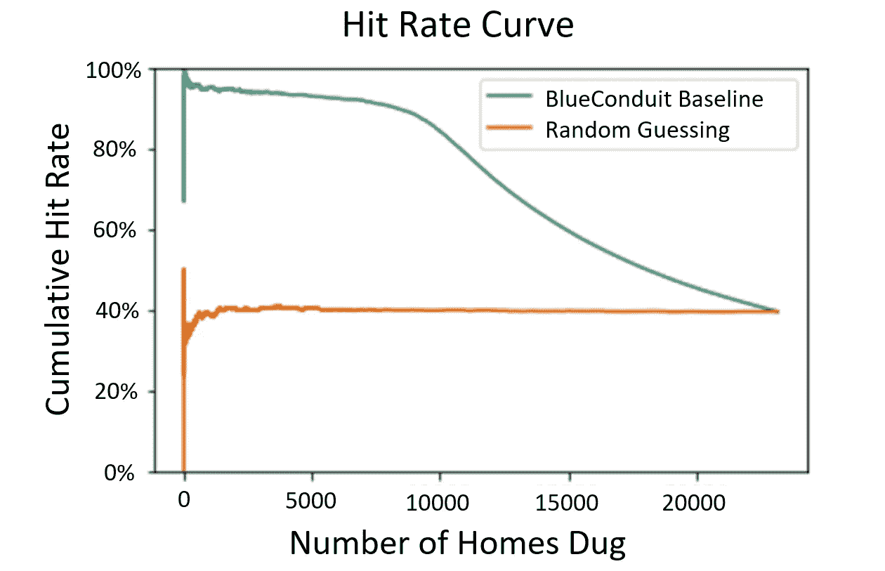**

**密歇根州弗林特市 BlueConduit 的基线模型与随机挖掘的命中率曲线的比较。图片作者。**

**1.命中率曲线:想象你挖了一堆房子，寻找铅管。命中率是指那些被挖掘的房屋中有铅管的百分比。高命中率意味着你很有效率:在你决定挖掘的房屋中，很大一部分含有铅。命中率度量可以扩展到命中率曲线。假设你管理一个挖掘队，任务是挖掘铅管。你会得到一份家庭住址的打印件，以及他们预测的有线索的概率。鉴于资源和时间有限，一种自然的方法是按照预测概率的顺序挖掘房屋——首先是概率较高的房屋，然后是概率较低的房屋。点击率曲线(如上图所示)以图表形式显示了按预测概率(x 轴)排序的挖掘过程中的累积点击率(y 轴)。理想的命中率曲线是尽可能长的时间尽可能高(高命中率)(超过许多被挖的家)，这表明你倾向于在非铅家之前挖铅家。上图显示了 BlueConduit 基线的命中率曲线相对于弗林特市随机挖掘的改善。很明显，BlueConduit 基线往往比随机挖掘产生更高的命中率，随机挖掘提供了一个以城市中铅的真实发生率为中心的命中率(38%的家庭)。一旦所有的房屋都被挖掘出来，这两个数字就会收敛到城市的真实含铅量。**

**2.平均更换成本:BlueConduit 估计挖掘一根(安全的)铜管的原始成本为 3000 美元。挖掘和更换铅管的费用估计为 5000 美元。⁴然而，前者的成本更令人担忧，因为它代表了“浪费”的城市资金(挖掘已经安全的管道)。为了衡量浪费的资金，我们计算平均更换成本:**

**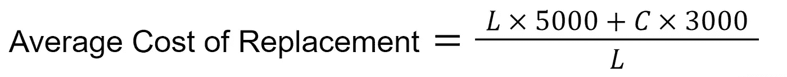**

**l 代表挖出的铅管数量，C 代表挖出的铜(或其他安全材料)管数量。假设该城市想要确定更换其第一批 100 根铅管的预期成本。如果一个挖掘算法导致城市在达到 100 根铅管(L = 100)之前挖掘了很多铜管(高 *C* 值)，那么它平均更换每根铅管的成本会相当高。实际上，这一指标总结了该市每一根铅管将需要花费 5000 多美元，这是由于铜屋的浪费性挖掘造成的。**

**如果我们可以证明我们的模型提高了命中率曲线并降低了平均替换成本，我们就可以证明空间信息可以用于改进 BlueConduit 基线。**

# ****我们的空间模型:扩散****

**在我们的实验中，我们探索的最有前途的空间建模策略是扩散。⁵:让我们通过一个例子来激励扩散，并展示我们如何使用它。**

**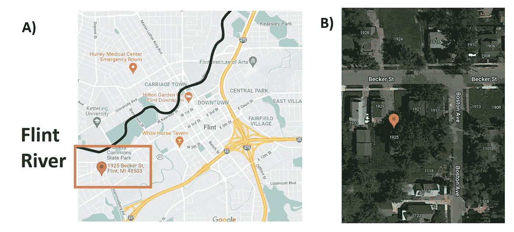**

**画面 A:弗林特地图，标出弗林特河和 1925 贝克尔街附近。画面 1925 年贝克尔(红色标记)和周围住宅的卫星图像。B 图中显示的每个家庭都有铅管。作者使用[谷歌地图](https://www.google.com/maps)创建的图片。**

**上图中的 A 部分是弗林特的地图。2014 年，该市将其水源转向弗林特河，用深蓝色突出显示。这一决定标志着弗林特水危机的开始，因为弗林特河水中含有化学物质，会腐蚀城市的铅管。靠近弗林特河的是城市西边的一个居民区，用橙色方框标出。这个社区有高密度的铅服务线。一栋特别的房子——贝克街 1925 号——就坐落在这个街区。**

**面板 B 放大 1925 Becker St .(用红色指示器标记)及其紧邻的区域。因为弗林特的水管都是在水危机后的几年里挖出来的，所以我们知道了地面真相:图中每家每户都有铅管(包括 1925 年的贝克尔)。因此，如果这个邻域在一个测试集中(即尚未挖掘)，一个理想的模型将给出通向每个家庭的高概率。下图显示了 BlueConduit 基线模型给予每个家庭的销售线索预测概率。**

**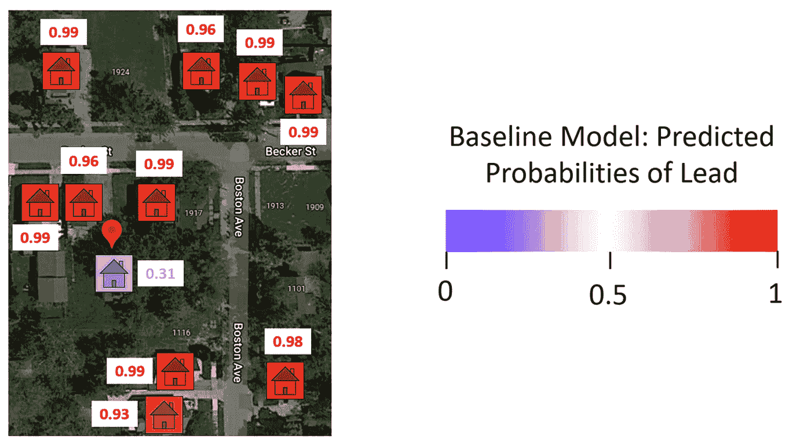**

**通过 BlueConduit 基线模型得出的 1925 年贝克尔(31%)和周围家庭(> 90%)的铅概率。回想一下:这张图片中的所有房屋都有铅管。图片作者。**

**BlueConduit 基线给出了每个家庭领先的高概率(> 90%)，除了一个:1925 Becker St (31%)。经过检查，似乎这个家有一个奇特的特征:它的城市记录表明，它有铜(安全)管道。弗林特的管道记录往往不可靠。然而，明确指出铜管的记录通常是准确的。BlueConduit 基线模型锁定了这个特性，并被“愚弄”了。这个模型给了 1925 年的贝克尔(事实上，它有铅管)一个较低的铅概率，将其放在要挖掘的房屋队列中的第 9136 位。如果挖掘资源有限，团队可能永远不会到达这个家。相反，他们可能会在实际上没有铅管的队列中挖掘更高的房屋。我们如何防止这种结果？**

**正如我们上面提到的，因为城市是一个街区一个街区建立起来的，我们认为近邻应该有相似的领先概率。因为 BlueConduit 基线不使用空间要素，所以它不能在最近的邻居之间直接共享信息。然而，这种类型的信息共享可以通过扩散来实现。**

**为了建立扩散，我们首先要建模并建立一个家与家之间距离的图表。下图展示了我们的图形构建过程。首先，我们使用开放的街道地图来查找住宅之间的街道距离(曼哈顿距离)。我们选择使用街道距离而不是哈弗森距离(“直线”距离)，因为街道编码了家庭之间的一些共享发展和基础设施。住房开发是一个街区一个街区地进行，而不是一个地区一个地区地进行。因此，两栋后院相邻(哈弗线距离较小)的房子可能是由不同的开发商建造的——特别是如果它们没有通过一条共用的道路相连的话。此外，管道通常建在道路下面。因此，街道距离也可以对共享水管进行编码。**

**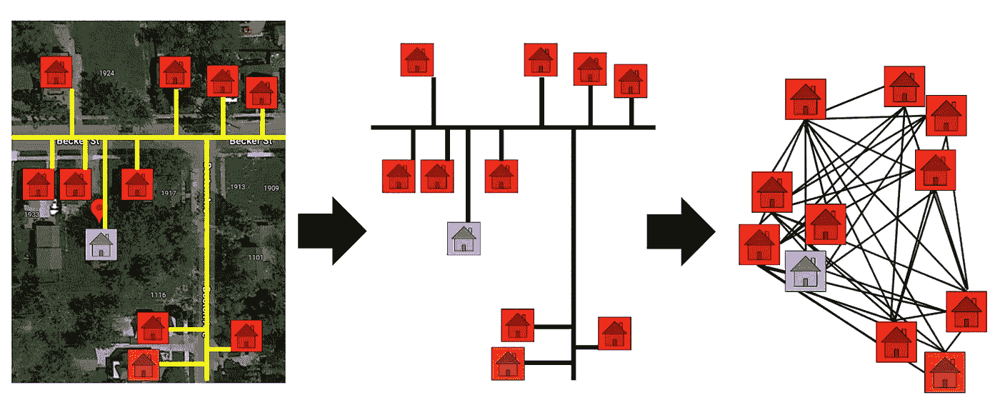**

**我们模拟了家庭之间的道路距离。然后，我们用这些距离来创建一个图表。上图显示了为 1925 年贝克尔街区创建图表的过程。图片作者。**

**获得道路距离后，我们创建了一个连接住宅的图表。在我们的图中，每个节点是一个家。每条边的长度/重量由它所连接的两个家庭之间的街道距离来定义。根据我们的信念，信息共享应该只发生在同一个紧邻的家庭之间，我们只连接彼此在 0.5 公里以内的家庭。**

**随着图形的完全构建，我们最终可以进行扩散。扩散过程如下图所示。在扩散中，图中的值在节点之间是平滑的。在我们的例子中，领先概率在连接的家庭之间是平滑的。例如，位于许多低量级概率住宅附近的高概率领先住宅会将其预测强度扩散到其邻居，其领先概率将降低。在 1925 Becker St .(如图所示)的案例中，我们看到一个低概率铅住宅位于许多高概率铅住宅附近。它从邻居那里借用预测力量，领先的概率上升。这样，扩散允许我们的模型“校正”邻居之间的差异。**

**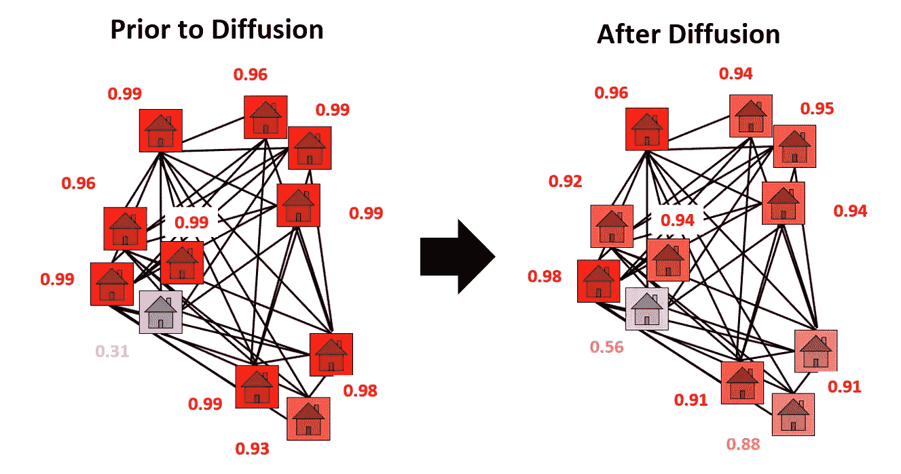**

**扩散前后 1925 年贝克尔附近铅的概率。领先的信心与 1925 Becker 共享(“扩散”)，将其领先的概率从 31%提高到 56%。图片作者。**

**由于使用了扩散，1925 年贝克尔街在挖掘队列中前进了 502 位。从这个角度来看，挖掘 500 个家庭至少要花费 150 万美元。一个预算有限的城市可能没有资金来挖掘额外的 500 套住房。因此，1925 年贝克尔街的挖掘顺序代表了更换和未能修复其危险管道的区别。**

**然而，贝克街 1925 号只是一个家。扩散给整个城市带来了什么结果？我们将在下一节回答这个问题。**

# ****火石的结果****

**在弗林特对所有 BlueConduit 基线预测进行扩散后，lead homes 在挖掘队列中攀升了 327 个位置(平均)。非领先住宅平均下跌 195 个位置。下图显示了铅和非铅家庭中挖掘顺序变化的全部分布。很明显，铅含量高的房屋倾向于按照挖掘顺序上升(正值)，含量低的房屋倾向于下降(负值)。**

**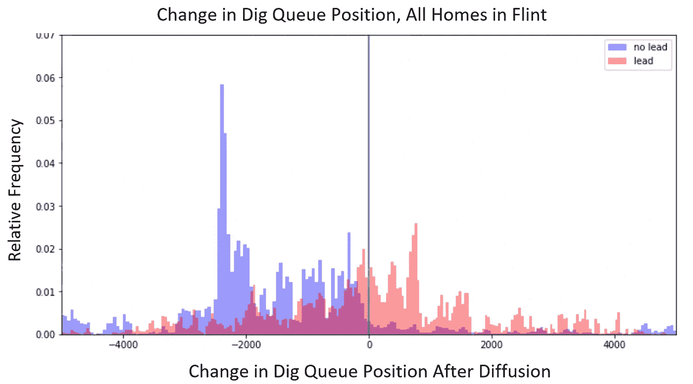**

**图片作者。**

**进一步探索，我们发现了家庭间有益信息共享的证据。下图显示了所有家庭中预测领先概率(扩散后)的变化。**

**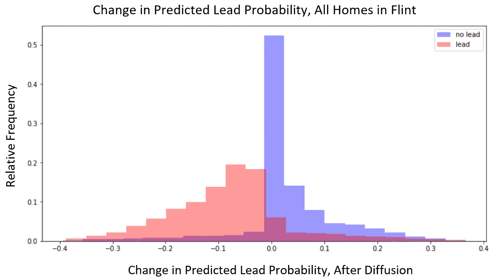**

**图片作者。**

**我们看到一个似乎适得其反的趋势:扩散倾向于提高非铅家庭的铅概率，降低铅家庭的铅概率。然而，值得注意的是，BlueConduit 基线模型为大多数家庭提供了高度确定和高度准确的铅预测。换句话说，大多数铅家的铅概率接近 1，大多数非铅家的铅概率接近 0。因此，我们期望扩散会稍微平滑这些概率，回归它们的极值更接近平均值。这意味着许多领先家庭(基线概率接近 1)的领先概率略微下移，许多非领先家庭(基线概率接近 0)的领先概率略微上移。**

**鉴于这种适得其反的趋势，怎么可能领先的房屋在挖掘队列中倾向于上升，而非领先的房屋倾向于下降呢？关键是关注最初不确定的房屋。在下图中，图 A 显示了铅概率的变化，但仅在 BlueConduit 基线给出中等铅概率值(30% — 70%)的家庭中。在这里，我们看到一个生产趋势:扩散增加了铅家园的概率，减少了非铅家园的概率。**

**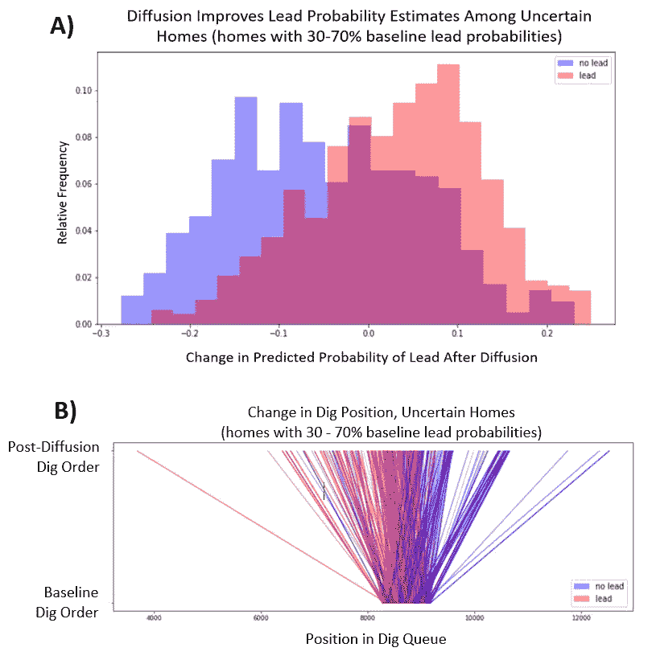**

**作者图片。**

**图 B 显示了这些相同房屋的随机样本中挖掘顺序的变化。图形的底部表示它们在 BlueConduit 基线挖掘队列中的位置。顶部代表它们在最终扩散挖掘队列中的位置。因为这些房屋最初被赋予了不确定的预测概率，所以它们位于 BlueConduit 基线挖掘顺序的中心。然而，我们看到扩散将领先的房屋拉得更高，而将非领先的房屋拉得更低。**

**这些结果表明，从某些家庭到不确定的家庭，信息是有效共享的。类似于 1925 年贝克尔街，我们看到证据表明，不确定的领先住宅(具有中等概率值的领先住宅)往往位于具有更高确定性的领先住宅(概率接近 1 的领先住宅)附近。扩散允许这些不确定的家庭从他们的邻居那里借用预测力量，导致更高的领先概率和在挖掘队列中的更高位置。另一方面，不确定的非铅住宅(具有中等概率值的非铅住宅)往往位于更确定的非铅住宅(概率接近于 0 的非铅住宅)附近。扩散允许这些家庭从他们的邻居那里借用预测力量，导致更低的领先概率和挖掘队列中更低的位置。**

**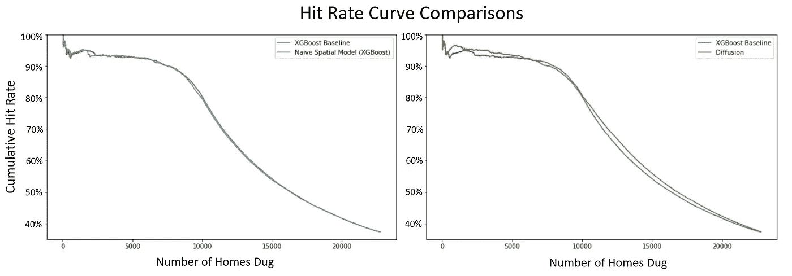**

**作者图片。**

**重要的是，对不确定房屋的积极影响超过了对更确定房屋的潜在不利影响(其极端概率值向平均值回归)。上图中，我们看到了两组命中率曲线。在左侧面板中，我们比较了 BlueConduit XGBoost 基线和 BlueConduit XGBoost 基线的命中率，并将纬度/经度作为预测因素(标记为:“朴素空间模型”)。我们看到，天真地将纬度和经度作为预测因子并没有显著提高命中率。在右边的面板中，我们比较了我们的扩散模型与相同的 BlueConduit XGBoost 基线模型的命中率。在这里，我们看到证据表明，扩散模型在挖掘队列的前半部分和后半部分都具有较高的命中率。**

**尽管点击率的原始差异看起来很小，但该市储蓄的估计差异相当大。下图显示了这些节约的估计值。**

**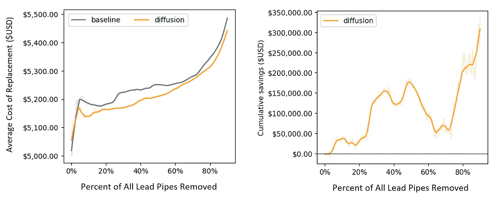**

**左图:在 BlueConduit 基线模型和扩散模型下，更换每根铅管的平均成本。右图:扩散节省的累积量(相对于 BlueConduit 基线)。这两个图的跨度从 0%到 90%的所有铅管被移除。作者图片。**

**因为扩散倾向于在挖掘顺序中向前推动铅管(并向下拉动非铅管)，所以在城市中找到并替换大多数铅管需要更少的总挖掘量。这转化为货币储蓄。如上所述，扩散明显降低了整个挖掘过程中的平均更换成本。到 90%的铅管被挖掘出来时，扩散总共为该市节省了 30 多万美元(相对于 BlueConduit 基线模型)。这些节约主要是由防止浪费挖掘非铅家。**

**最终，除了货币价值，最重要的改善是对居民而言。考虑到挖掘人员的时间限制，更高的命中率意味着当工人在城市中行进时，居民将经历更少的铅暴露(平均而言)。**

# ****讨论&未来的工作****

**通过允许具有高度领先不确定性的家庭从他们的邻居那里借用信息，扩散在挖掘队列中提供了更有效的家庭排序。在我们对弗林特数据集的实验中，这为城市节省了大量资金，并最终减少了城市居民接触铅的时间。**

**更广泛地说，我们的结果表明，一个家的位置可以传达关于它的建筑、发展和材料的信息。经度和纬度可能无法单独提供这些信息。但是，当使用城市基础设施(例如街道距离)进行编码时，位置可用作铅管的关键预测值。特别是，考虑周到的邻居模型可以允许邻居之间有效的信息共享。这可以导致机器学习模型的广泛改进。**

**值得注意的是，我们只处理了一个城市的数据:弗林特。因此，我们并不确切知道我们的结果是否会推广到其他城市。然而，我们的工作利用了一个趋势，这可能是许多城市共有的:彼此靠近的房屋往往有相似的管道。随着 BlueConduit 将其工作扩展到美国更多地区，我们希望空间信息将在未来的测试中继续提高模型性能。此外，我们希望 BlueConduit 将改进我们的扩散超参数，或者找到比扩散更好的空间模型，以进一步改进我们的结果。**

# ****参考文献&脚注****

1.  **环境保护署，“关于饮用水中铅的基本信息”[https://www . EPA . gov/ground-water-and-drinking-water/basic-information-about-lead-饮用水](https://www.epa.gov/ground-water-and-drinking-water/basic-information-about-lead-drinking-water)。2021 年 12 月 10 日接入。**
2.  **PBS/Nova，“人工智能正在帮助从燧石中取出铅管。”【https://youtu.be/anHwjIASyj4 **
3.  **从技术上讲，服务线有“公共”和“私人”两个部分，其中公共部分归城市或公用事业所有，私人部分归房主所有。因为两者都会污染水源，所以如果其中任何一个成分是铅，我们就认为这个家庭是危险的。详情请见:[https://www . nrdc . org/experts/Erik-d-Olson/how-can-I-find-out-if-I-have-lead-service-line](https://www.nrdc.org/experts/erik-d-olson/how-can-i-find-out-if-i-have-lead-service-line)。**
4.  **这些成本和替换指标的平均成本是按照 Webb 等人(2019)的方法计算的。参见 Jared Webb、Jacob Abernathy 和 Eric Schwartz，“走出去:弗林特的数据科学和供水服务线”，彭博数据交换，2019 年。可在:[https://storage . Google APIs . com/flint-storage-bucket/d4gx _ 2019% 20(2)获取。pdf](https://storage.googleapis.com/flint-storage-bucket/d4gx_2019%20(2).pdf)**
5.  **我们还尝试使用图形神经网络、高斯过程和堆叠模型。然而，这些策略并没有改善 BlueConduit 基线。我们对这些模型的结果和讨论可以在我们的技术报告中看到。**