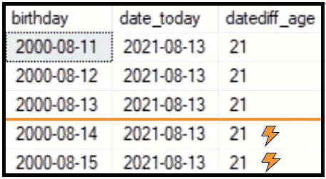
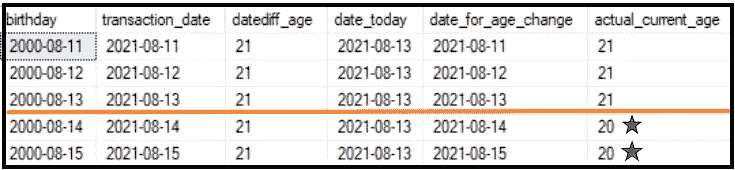

# 使用 SQL 的 DateDiff()表示年龄

> 原文：<https://towardsdatascience.com/using-sqls-datediff-for-age-dc0cb5b34190?source=collection_archive---------13----------------------->

## 潜在的 Bug 以及如何避免它

Kortnee Greenfield 通过 Unsplash 拍摄的照片

在某些时候，您可能会被要求提取客户数据，包括客户与公司交易/接触时的年龄。最有可能的情况是，交易时的年龄并不是数据中已经存在的一列，因为它取决于特定事件发生的时间。

简单的解决方案是使用内置函数 DATEDIFF()，在这个函数中，您可以找到两个日期之间的年份差异。让我们来看看使用这个函数的一些结果。在这些结果中，我们将看到今天的日期与个人的生日相比较。

作者照片

啊哦！你刚刚为未成年人提供了酒，现在闪电就要击中生意，把它夷为平地。很难受，我知道。

# 变通办法

因此，看起来在使用 DATEDIFF()时，数学运算实际上只计算年份值。一年中的月和日似乎没有被考虑在内。让我们把它考虑进去！

首先，我们将获取这个人的生日，并将使用 DATEADD()函数。在这种情况下，我们将根据 DATEDIFF()结果，添加我们期望此人在给定年份中的年数。

最后，我们将使用 CASE 语句。我们可以说，如果当前事件发生在该年个人生日之前或当天，那么使用 DATEDIFF()函数产生的年龄。如果这个人的生日在事件发生时还没有到来，那就从预期年龄中减去一年。这段代码使用了 T-SQL，为了显示生成的每个步骤，这段代码有点长:

# 结果是什么样的

作者照片

现在，我们看到快乐的绿色小星星会告诉我们年龄变化发生在哪里。我们没有算错年龄！

# 说到生日

你有没有想过祝同事生日快乐，但要用最难忘的方式？不要再看了。下面的代码，在你改变了这个人的名字值之后，实际上会返回一条很好的生日消息。你可以随时将代码通过电子邮件发送给那个人或任何为你工作的人。

# 最后的想法

抽查结果至关重要。我总是喜欢用[上一篇文章](https://medium.com/geekculture/in-data-theres-almost-never-a-magic-silver-bullet-6cf30a5c70b4?sk=3a221694f078282e755130d87ed2833b)中的问题，“什么会打破这个？”我仍然喜欢你把它变成一场观众欢呼的游戏的想法。

代码是强大的。它加快了我们处理数据的速度。花时间去理解结果和工具是如何工作的。一如既往，继续学习。