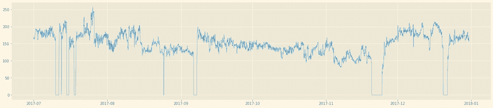
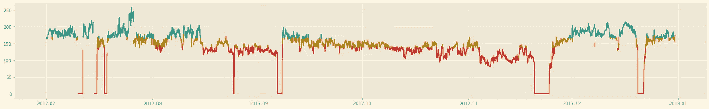
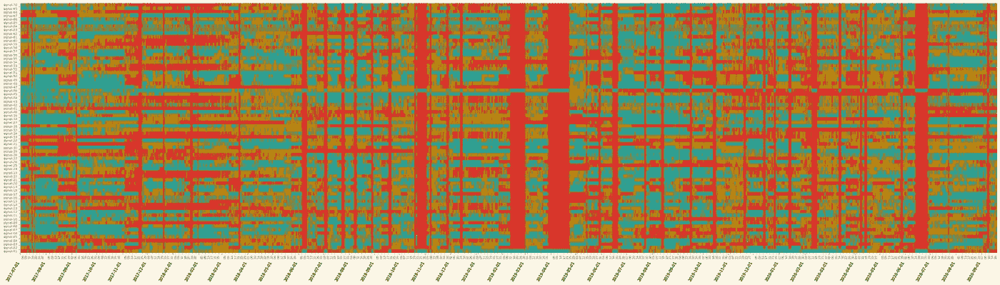

# 使用带状图一次可视化几十个时间序列

> 原文：<https://towardsdatascience.com/using-strip-charts-to-visualize-dozens-of-time-series-at-once-a983baabb54f?source=collection_archive---------27----------------------->

## 带状图对于在很长一段时间内从几十个(甚至几百个)时间序列中获得头部或尾部非常有用。

由 [Unsplash](https://unsplash.com?utm_source=medium&utm_medium=referral) 上的 [CHUTTERSNAP](https://unsplash.com/@chuttersnap?utm_source=medium&utm_medium=referral) 拍摄

随着工业 4.0 时代的到来，所有工业部门的工厂和工业资产运营商都希望利用他们多年来收集的大量数据:在许多情况下，这些数据中只有一小部分被使用，而且只是在被动的情况下使用。假设您经营一家婴儿配方奶粉生产厂，质量团队在进行目视检查时开始注意到半成品中的一些**黑斑:尽管您的产品可以安全食用(这些黑斑很可能是煮过头的颗粒，当液体干燥成粉末时，它们会溶解在温水或牛奶中)，但这可能会导致更高的客户索赔率，为了安全起见，您可能会扔掉整批产品。**

流程工程师可能会与您的常驻数据科学家合作，提取设备和流程数据。使用这些来执行**根本原因分析**将帮助你产生新的知识:例如，他们可能会提出新的设定点来操作你的制造操作，以防止这一事件在未来批次中发生。

然而，通常情况下，此类问题背后的原因远非简单，可能有**多个相互关联的原因**:此外，可能存在一些您无法像控制制造变量那样容易控制的依赖因素(天气、供应链变化、原材料质量……)。这意味着，当黑点重新出现在成品中时，您必须再次更新最佳工艺参数。您可能会从之前的根本原因分析中领先一步，并且您可能知道要查看哪些参数以及在哪个时间步骤:然后您可以扩展之前的分析，调整您的制造参数，并继续处理另一个问题…

> 有一天，你决定试着一劳永逸地解决这个黑点问题！多年来，您一直在收集大量数据并将其置于背景中，您知道深度学习方法可能有助于发现生产环境中的微弱信号…

如果你想建立一个高效的深度学习系统，你需要帮助它筛选成千上万的信号和事件的噪音。精确定位数字时间序列中有趣的模式对于向未来的人工智能模型提供高质量的数据集至关重要。在很长一段时间内对许多时间序列的这种有趣的时间模式的检测取决于时间尺度、起点和将所有数据纳入综合可视化的能力，这将指导您的早期探索。

在上一篇文章中，我描述了准备时间序列数据的过程，以便能够对这些信号进行交互式探索:

 [## 有数百个时间序列要探索，却不知道从哪里开始

### 在本文中，我将为致力于大规模时间序列探索的框架奠定基础。

towardsdatascience.com](/having-hundreds-of-time-series-to-explore-and-not-knowing-where-to-start-5e7873fd2028) 

然而，你首先要做的可能是绘制所有信号的整体地图。有几个原因可能会让你想拥有这样一个视角来开始你的探索:

*   揭示有趣的时态模式和反模式
*   检测感兴趣的横截面
*   确定是否有同时影响许多信号的重大事件

# 带状图介绍

## 什么是带状图，我为什么需要它？

如果只有少量的时间序列，通常可以通过单独或同时绘制标准时间图来可视化它们。

时间序列标准图(图片由作者提供)

然而，可视化超过几十个信号所必需的不动产是令人望而却步的。此外，前面的图只显示了 6 个月的数据:可视化更多的数据可能会导致重要的趋势被挤出。

将这样的信号转换成带状图会使信息更加紧凑:

之前信号的相应带状图(图片由作者提供)

在这张图上，我使用了三种颜色:绿色表示信号的低值，橙色表示信号的中值，红色表示信号的高值。这个简单的条形带非常便于显示何时出现低值或高值。

> 从时间序列中剥离这么多信息有什么意义？

主要原因是，我们不想只关注其中的一个，而是可能关注其中的多个，我们可能还想查看超过 6 个月的数据。让我们来看看这个过程，并以获得的全局可视化来结束…

## 给我看看！

构建信号的带状图非常简单，但需要您选择一些参数。第一步是离散化你的信号。在下面的代码片段中，我从`../data`文件夹中加载 70 个信号，并离散化第 51 个:

然后，我可以绘制我的信号，并具体化通过离散化过程获得的仓:

箱可视化(作者图片)

您可以选择想要将信号离散化到的仓的数量(上面代码中的`n_bins=3`)。这个数字是任意的，取决于您想要在高层次上可视化的内容。我发现三个层次对于可视化我的数据中的关键变化是有用的。如果您的数据发展缓慢，添加更多级别不会损害可视化。如果您有一些尖峰或非常嘈杂的数据，低数量的级别对于保持图有用是很重要的。在上面的例子中，我还使用了分位数:这意味着我的信号分成三类，数据点的数量大致相同。然后，我会将这些仓分配给信号的每个值:

将条柱映射到原始时间序列值(图片由作者提供)

然后，我可以使用这些相同的颜色，将这个信号转换成一个简洁的带状图:

之前信号的相应带状图(图片由作者提供)

在这里，我们在独立于其他信号来观察给定信号的同时进行离散化。不过，量化可能会在全局范围内发生:如果您在许多不同资产的相同位置获取温度值，则在全局考虑来自该特定标签的所有信号的同时，对所有温度值进行离散化是有意义的。绘制相邻的带状图将允许您看到不同的图案跃入您的肉眼，将您的调查导向您工厂中的特定设备。

现在，让我们将时间范围从 6 个月扩大到 3 年，并将所有 70 个信号绘制在一个屏幕上:

三年来 70 个信号的概述(图片由作者提供)

该图像在大约 3 秒内生成，信号的采样率为 1 小时。由于这种可视化，您可以轻松确定要调查的主要事件(2019 年 2 月和 4 月的大红色带)和不时发生的较短事件(例如 2018 年 3 月 22 日)。这是一个非常好的开始！

# 结论和未来工作

在本文中，我构建了以前的框架，并更新了我的`[tsia](https://github.com/michaelhoarau/tsia)`包来构建多元时间序列的带状图。在未来，我将通过添加一些概要特性来扩展这个特性，如 R 包`[mvtsplot](https://github.com/rdpeng/mvtsplot)`(由著名的 Roger Peng 构建！).然后，我将研究使其更有用的方法，通过提供对时间序列分组的自动洞察或基于多变量演变精确定位感兴趣的时间范围(例如，我们能否在上面的最终矩阵图上自动突出显示所有重要的红色范围？).

如果您喜欢这篇文章，我希望您也会对下面的文章感兴趣:

 [## 有数百个时间序列要探索，却不知道从哪里开始

### 在本文中，我将为致力于大规模时间序列探索的框架奠定基础。

towardsdatascience.com](/having-hundreds-of-time-series-to-explore-and-not-knowing-where-to-start-5e7873fd2028)  [## 所有多元时间序列并非生来平等

### 多元时间序列的不同家庭的介绍，以及这将如何影响你的探索和人工智能/ML…

towardsdatascience.com](/all-multivariate-time-series-are-not-born-equal-ba2d26e2528e)  [## 时间序列分析的高级可视化技术

### 使用马尔可夫转移场和网络图揭示时间序列行为。

towardsdatascience.com](/advanced-visualization-techniques-for-time-series-analysis-14eeb17ec4b0) 

## 参考

*   彭，R (2008): *一种多变量时间序列数据可视化方法* -统计软件学报。http://doi.org/10.18637/jss.v025.c01