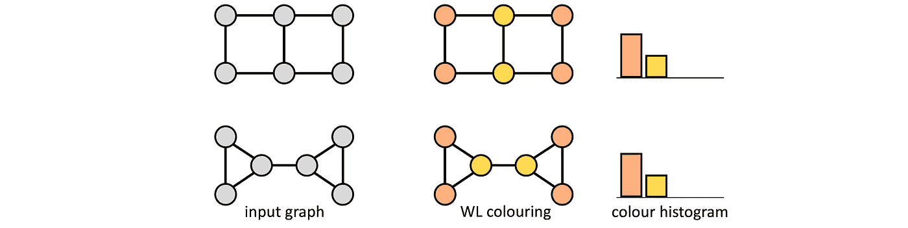
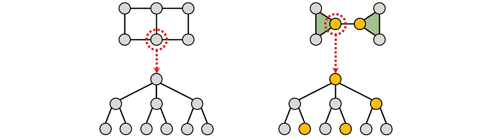
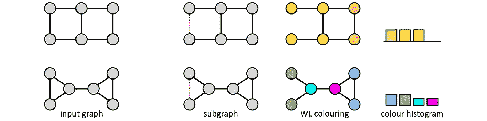
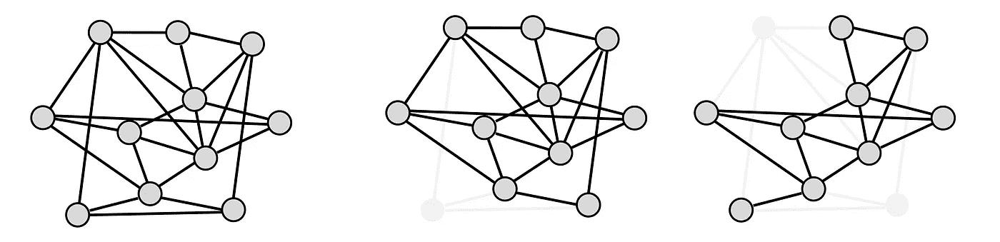
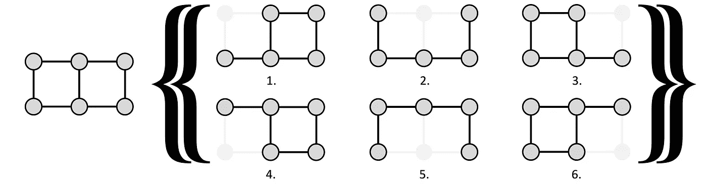
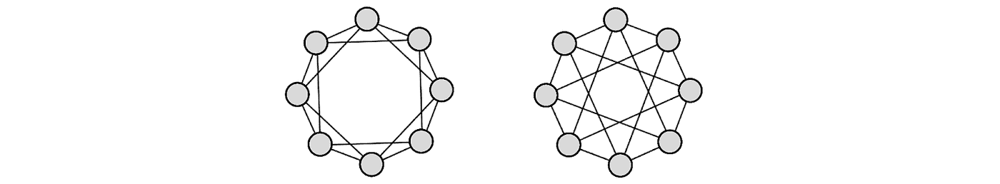
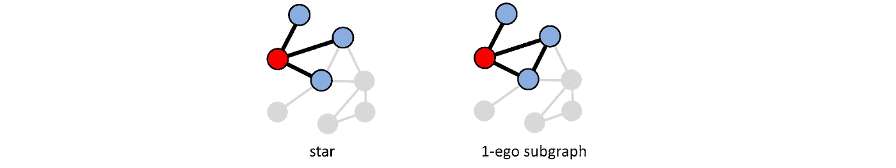
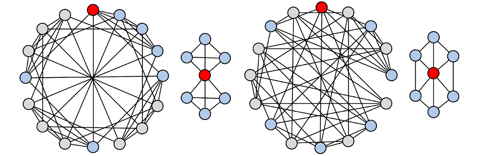
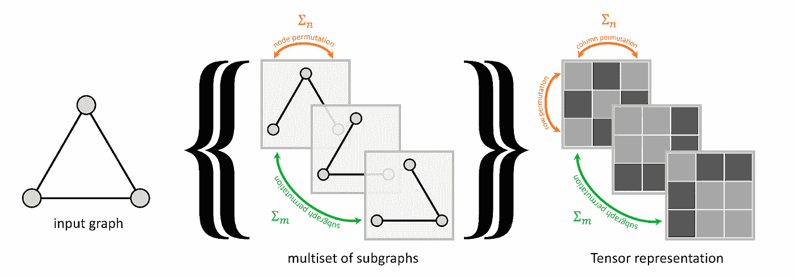
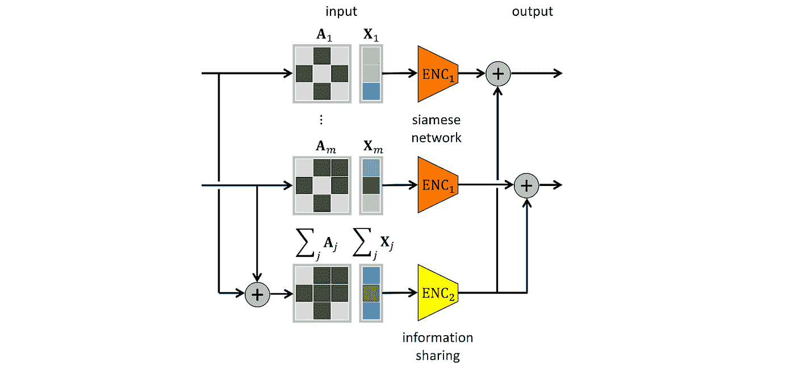

# 使用子图来表达更多的 gnn

> 原文：<https://towardsdatascience.com/using-subgraphs-for-more-expressive-gnns-8d06418d5ab?source=collection_archive---------7----------------------->

## 改进 GNNs

## 消息传递图神经网络的表达能力固有地受到限制，因为它们等价于 Weisfeiler-Lehman 图同构测试。几个并行的近期工作表明，这种限制可以通过对通过从输入图中移除节点或边而获得的子图集合应用 GNN 来克服。在本帖中，我们回顾了这些不同方法的共同主题和细微差别。

*本文由莱昂纳多·科塔、法布里齐奥·弗拉斯卡、哈盖·马龙、和·赵合著。另见*[*Weisfeiler-Lehman 试验简介*](/expressive-power-of-graph-neural-networks-and-the-weisefeiler-lehman-test-b883db3c7c49?sk=5c2a28ccd38db3a7b6f80f161e825a5a) *和* [*结构编码*](/beyond-weisfeiler-lehman-using-substructures-for-provably-expressive-graph-neural-networks-d476ad665fa3?sk=bc0d14c28a380b4d51debc4935345b73) *。*

M 消息传递图神经网络(mpnn)[1]由几个层组成，执行来自相邻节点的信息的逐节点聚合。这种架构的吸引人的特征是它们的*局部性*(即，每个计算只需要一个节点的直接邻居)和边数的*线性复杂度*[2]。然而，缺点是它们的表达能力有限:在[3–4]中显示，MPNNs 的表达能力最多与 [Weisfeiler-Lehman (WL)图同构测试](/expressive-power-of-graph-neural-networks-and-the-weisefeiler-lehman-test-b883db3c7c49?sk=5c2a28ccd38db3a7b6f80f161e825a5a) [5]一样，这是一种试图通过迭代颜色细化来确定两个图是否结构等价(“同构”)的经典方法[6]。

Weisfeiler-Lehman 测试是一个必要条件，但不是充分条件:事实上，一些同构的图可能是不可区分的。下图显示了一个这样的例子:

*weis feiler-Lehman 测试是一个迭代的局部颜色优化过程，试图确定两个图是否同构。它输出颜色直方图，提供同构的必要但非充分条件:如果颜色直方图不同，则图形不是同构的，但测试可能无法区分非同构的图形，如这里显示的图形，产生相同的直方图。*

在图论中，最初由 [Boris Weisfeiler](https://en.wikipedia.org/wiki/Boris_Weisfeiler) 和 Andrei Lehman 在 20 世纪 60 年代提出的图同构测试在 20 世纪 70 年代后期被扩展到一个层次结构，该层次结构具有越来越强大的更高维度的 *k* -WL 测试，这些测试对节点的 *k* 元组进行操作。这篇文章的作者克里斯多夫·莫利斯和哈盖·马龙——以及他们的合著者——展示了相当于 *k* -WL 测试[4，9–10]的高维 GNN 架构的不同设计；然而，这种模型失去了标准消息传递 GNN [11]的局部性和线性复杂性的优势。

增加 GNNs 表达能力的另一种方法是使用位置编码，它“预先着色”图的不同节点。位置编码是变压器[12]的一个关键架构特征，可以被视为一种“对称破坏”机制，允许变压器表达排列敏感函数。这是一个必要的属性，例如在语言建模中，这种架构特别成功。然而，对于图形结构的数据来说，这种特性不再是所希望的，而且对排列敏感的位置编码通常缺乏通用性[13]。

L 为了寻找一种排列不变的对称破缺机制，乔治·布瑞萨斯和法布里齐奥·弗拉斯卡(迈克尔的博士生)引入了[图子结构网络](/beyond-weisfeiler-lehman-using-substructures-for-provably-expressive-graph-neural-networks-d476ad665fa3?sk=bc0d14c28a380b4d51debc4935345b73) (GSN)，该网络基于小的预定义子结构(三角形、集团、循环等)的局部计数【14】。适当的结构选择使得这种“结构编码”比基本的魏斯费勒-雷曼测试或更高阶的 k -WL 测试更具表达性[15]。

*采用具有三角形计数的结构编码的 gsn 允许在上述示例中的图形之间消除歧义(属于一个三角形的节点用橙色标出；三角形以绿色显示)。*

GSN 模型的优点在于，它本质上是标准的 MPNN，增加了额外的节点或边特征(相应结构的计数)，因此受益于消息传递方案的局部性和线性复杂性。检测局部子图的较高复杂度是作为预处理阶段引起的，这在一些应用中通常是可以容忍的。虽然在一个有 n 个节点的图中寻找 k 个节点的子结构的最坏情况的代价是𝒪(nᵏ，但是实际的运行时间要乐观得多。

结构编码强调了本文讨论的一类方法背后的一个简单思想，即*使用输入图的子图可以增加图形神经网络*的表达能力。再次考虑我们反复出现的一对 WL 等价的非同构图的例子:可以扰动这些图(甚至最小程度地，例如，通过删除一条边，如下图所示)，使它们通过 WL 测试可区分。

*通过 Weisfeiler-Lehman 测试去除边缘(红色虚线)，上例中的两幅图变得可以区分。这一观察为几个处理子图集合的表达性 GNN 架构提供了理论基础。*

最近几个并行的工作使用这种方法来设计高效的表达图神经网络结构。这些模型，我们统称为“子图 gnn ”,主要区别在于它们的基本原理、产生子图的方式以及聚集来自不同子图的输出的方法。我们在本帖中回顾了其中的一些作品。

ETH Zurich [分布式计算小组](https://disco.ethz.ch/)引入的**Dropout GNNs**【16】**通过将*节点 dropout* 应用于图(独立于其他节点以概率 *p* 移除一个节点)然后运行标准的多层 GNN，从字面上理解这一思想。重复该过程多次，得到不同的子图嵌入；然后，它们以排列不变的方式聚合。这样，每个节点“看到”一个略有不同的邻居，往往解决了导致 Weisfeiler-Lehman 测试失败的歧义。这也可以解释为什么像 DropEdge [17]这样的图的丢失型正则化技术往往工作得很好。**

****

***图中节点丢失的例子(丢失的节点用红色标记，不参与消息传递)。与 WL 测试相比，每个节点在多次运行中看到其邻域的一组轻微扰动版本的事实导致了丢失 GNNs 的更大表达能力。***

****重构 GNNs**【18】是本帖作者莱昂纳多·科塔和克里斯多夫·莫利斯与布鲁诺·里贝罗的新作，提出了一种基于[图重构猜想](https://en.wikipedia.org/wiki/Reconstruction_conjecture)的新架构。重构猜想是图论中的一组结果，可追溯到 20 世纪 40 年代 [Paul Joseph Kelly](https://en.wikipedia.org/wiki/Paul_Kelly_%28mathematician%29) 和[stanis aw Ulam](https://en.wikipedia.org/wiki/Stanislaw_Ulam)**【19】的工作，假设从所有删除节点的子图的集合中恢复一个图的可能性【20】。虽然对于某些图族可以显示可重构性，但是一般结果仅通过对大小为 *n≤* 11 个节点的图进行穷举搜索来验证[21]，并且对于更大的 *n* 是否成立目前是一个公开的问题。****

********

*****一个图及其去节点子图的集合。子图 1，3，4，6 和 2，5 是同构的。*****

****在十年后发表的后续工作中，Kelly 考虑了从 k 大小的子图[22] *重建的更一般的设置。*不幸的是，对于固定大小 k 的重构，我们没有太多可说的。相反，关于 *k* 的典型结果——重构试图将最小必要子图大小 *k* 表示为其节点数量 *n* 的函数；*k*-对于某些图族，如树和多部图，显示了可重构性[23]。****

*******k*—【18】中提出的重构 GNNs** 将标准 MPNN 应用于大小为 *k* 的每个导出子图，并对所得嵌入求和(这是在深度集【24】中使用的置换不变函数)。由于可能有太多这样的子图[25]，必须使用采样(这发生在 Dropout GNNs 的相同程序中)。值得注意的是，1990 年 [Béla Bollobás](https://en.wikipedia.org/wiki/B%C3%A9la_Bollob%C3%A1s) 证明了几乎每个图都可以仅用三个(*n*-1)大小的子图来重构。这个结果提供了为什么随机子采样子图似乎不会损害 *k-* 重建 GNNs 经验结果【27】的见解。****

****用*k*=*n***-**1 重构的*k*-GNN 可以区分标准 GNNs 不能区分的同构图族，如下图所示的循环跳链图:****

********

*****循环跳过链接图是 WL 测试(以及标准消息传递 gnn)无法区分的非同构正则图的一个例子，但是可以通过 k-重构 gnn 来区分。*****

****同时，对于足够小的*k’*s[28]，存在可由 GNNs 区分而不能由*k*-重构 GNNs 区分的图。相反，一个(*n*-**-**2)-重构 GNN 可以区分强正则图，这是标准 MPNN(*n*-重构 GNNs)和(*n*-**-**1)-重构 GNN 都不能区分的。这是一个有点令人失望的结论:虽然通过类比 *k* -WL 测试，人们可能会期望在 GNNs、(*n***-**1)-重建 GNNs、(*n*-2)-重建 GNNs 等之间存在表达能力的等级，但并不存在这样的等级。****

******【29】中提出的**从星星到子图**是赵最近与人合作的另一个利用*有根子图*提高 GNNs 表达能力的作品。看待 WL 测试的一种方式是通过星形模式进行局部颜色细化(根据邻居的颜色和自己的颜色重新标记一个节点，这是有根星形的独特特征)。将星形模式扩展到一般的有根子图，如 egonets [30],产生了 Weisfeiler-Lehman 算法的一种新的基于子图的变体，称为“子图-1-WL”。由于有根子图的数量与图中节点的数量相同，对于常数 *k* ，该方法与图的大小成线性比例。******

********

*****以红色节点为根的星形(左)和 1-ego 子图(右)。*****

****子图-1-WL 严格来说比 WL 更强大，但不亚于 3-WL(在某种意义上，存在 3-WL 不能区分但子图-1-WL 可以区分的非同构图)。当使用过小的有根子图(*k*-尺寸 *k* ≤4)时，子图-1-WL 无法区分任意 m≥3 的一族 CFI( *m* )图[31]，这也是 *m* -WL 所知的无法区分。****

********

*****两个非同构强正则图的例子，不能用 3-WL 来区分，但可以用子图-1-WL* *来区分(两个允许进行这种区分的子图被突出显示)。*****

****子图 1-WL 算法的神经版本用标准 MPNN 编码每个根子图；然后，聚合得到的节点式表示。与 Dropout GNNs [16]和 Reconstruction GNNs [18]相比，一个重要的区别是使用了*交叉子图聚合*，它通过利用子图对齐将来自多个子图的相同节点的节点表示汇集在一起(当考虑一组子图的对称组的更精确定义时，我们将看到这种汇集机制可以从第一原理中导出)。此外，通过在训练期间随机丢弃一些子图，同时在测试期间保留所有子图，使用子图丢弃方法来在不牺牲性能的情况下降低可伸缩性开销。****

******等变子图聚合网络(ESAN)**【32】是一种与子图多重集的对称结构等变的架构，由法布里齐奥·弗拉斯卡、迈克尔·布朗斯坦、哈盖·马龙及其合著者在最近的一篇论文中提出。子图的多重集是高度结构化的对象，其对称性来源于每个组成子图的结构以及作为整体的多重集。等变原则要求改变多重集 *m* 子图的顺序(置换群σ*ₘ*)和子图中节点的顺序(置换群σ*ₙ*)产生一个等价的表示，或者换句话说，架构是 w.r.t .等变的*乘积群*σ=σ*ₘ*×σ*ₙ*。与[16，18]不同，这种对称群公式考虑了子图*对齐*的事实，使得相同的置换作用于所有子图的节点(与单独作用于每个子图的单个节点置换相反)。****

********

*****多重子图集的对称群是子图置换(绿色)和节点顺序(橙色)的乘积。*****

****ESAN 是“对称对象深层集合”(DSS)架构的一个实例[33]并且使用两个基本图编码器:第一个编码器是一个独立处理每个子图的暹罗网络；第二个通过处理子图的聚集充当*信息共享*模块。在几个这样的层之后，通过集合学习模块聚集所获得的子图表示，以形成在下游任务中使用的原始图的不变表示。****

********

*****ESAN 等变层由一个连体网络(编码器 1，橙色)和一个信息共享模块(编码器 2，黄色)构成。*****

****丢弃 GNNs [16]和重建 GNNs [18]可以被视为仅使用第一编码器的 ESAN 的特殊情况[34]。此外，第二个编码器是[29]中使用的交叉图聚合的一般化，它的添加有利于图分类任务的性能[35]。最后，ESAN 考虑了除了简单的节点删除或 egonets 之外的其他*子图选择策略*(函数𝜋( *G* )将输入图 *G* 映射到其子图集合的可能性。****

****这篇论文的很大一部分致力于分析 ESAN 的表达能力——这产生了一种新的 Weisfeiler-Lehman 测试变体，称为“DSS-WL”——具有不同的架构和子图选择政策。结论之一是 ESAN 体系结构可以仅使用 WL 图编码器(标准 MPNN)来区分 3-WL 等价图，并且它可以增强更强体系结构的表达能力。****

****以前有人认为，为了设计更强大的图形神经网络，超越 Weisfeiler-Lehman 测试的表达能力，人们必须放弃消息传递范式。最近出现的基于子图的 GNN 架构显示了这个问题的廉价解决方案，同时仍然保持在消息传递的职权范围内[36]。****

****除了表达能力的增加之外，在一些图 ML 任务(例如图分类)中，子图 gnn 与标准 gnn 相比，似乎具有更低的方差风险估计量。这些任务本质上对于(一些)节点删除是不变的[37]，本文中回顾的基于子图的技术可以理解为一种数据扩充的形式。****

****[1] J. Gilmer 等人，[量子化学的神经信息传递](https://arxiv.org/abs/1704.01212) (2017)。继续。ICML。****

****[2]gnns 上下文中的“线性复杂度”通常是指在*个节点*的数量上缩放为𝒪( *n* 的算法。虽然最坏情况下的边数可以是𝒪( *n* ，但是通常假设图是稀疏的，在这种情况下，边数是𝒪( *n* 。****

****[3] K. Xu 等，[图神经网络到底有多强大？](https://arxiv.org/abs/1810.00826) (2019) ICLR。****

****[4] C. Morris 等人， [Weisfeiler 和 Leman go neural:高阶图神经网络](https://aaai.org/ojs/index.php/AAAI/article/view/4384/4262) (2019) AAAI。****

****[5] B. Weisfeiler，A. Lehman，[将一个图简化为标准形式以及其中出现的代数](https://www.iti.zcu.cz/wl2018/pdf/wl_paper_translation.pdf)(1968)Nauchno-Technicheskaya informatisia 2(9):12–16。****

****[6]“颜色”在本文中被理解为节点式离散标签。****

****[7]其中每个顶点具有相同数量的邻居(即，相等的度数)的正则图是标准 WL 检验不可区分的族的一个例子。要使一个更高维度的 *k* -WL 失败，需要更多的正则性:这种情况下的一个典型例子是一族*k*-等正则图。****

****[8]拉斯洛·巴拜把 k 的发明归功于 Neil 与鲁道夫·马顿[和独立进行的](https://www.cs.toronto.edu/dcs/people-faculty-combin.html)[尼尔·伊莫曼](https://en.wikipedia.org/wiki/Neil_Immerman)和[埃里克·兰德](https://en.wikipedia.org/wiki/Eric_Lander)的自我测试(后者曾被训练成数学家，但更广为人知的是他在基因组学和生物学方面的工作，他也是拜登政府的现任科学顾问)。参见 L. Babai，[拟多项式时间中的图同构](https://arxiv.org/abs/1512.03547) (2015)，arXiv:1512.03547 第 27 页。****

****[9] H. Maron 等人，[不变和等变图网络](https://arxiv.org/abs/1812.09902) (2019) ICLR。****

****[10] H. Maron 等人，[可证明强大的图形神经网络](https://arxiv.org/abs/1905.11136) (2019) NeurIPS。参见作者的一篇[博文。](http://irregulardeep.org/How-expressive-are-Invariant-Graph-Networks-%282-2%29/)****

****[11]Morris 在[4]中介绍的 *k* -GNN 架构招致𝒪( *nᵏ* 存储器复杂度。在后续工作中，C. Morris 等人、 [Weisfeiler 和 Leman go sparse:Towards scalable higher-order](https://papers.nips.cc/paper/2020/hash/f81dee42585b3814de199b2e88757f5c-Abstract.html)(2020)neur IPS 2020 还设计了一个基于局部邻域聚合的局部版本的*k*-GNNs[32]，考虑到了基础图的稀疏性，并表明该局部版本至少具有与普通的 *k* -WL 相同的功效。Maron 在[9]中引入的不变图网络(IGN)基于 *k* 阶张量，并且是*k*WL 等价的。IGNs 是从 *k* -WL 的不同变体中派生出来的，与 *k* -GNNs 相比，在复杂性方面更有优势。特别是，3-WL 等效 IGN“仅”具有二次复杂度。****

****[12] A. Vaswani 等人，[注意力是你所需要的全部](https://papers.nips.cc/paper/2017/file/3f5ee243547dee91fbd053c1c4a845aa-Paper.pdf) (2017) NIPS。****

****[13]关于 GNNs 中位置编码的更详细分析，参见例如 A. Loukas，[什么图形神经网络不能学习:深度对宽度](https://static.aminer.cn/upload/pdf/program/5e5e18a093d709897ce21291_0.pdf)(2020)ICLR；ICLR'20，R. Sato 等，[随机特征强化图神经网络](https://arxiv.org/abs/2002.03155)(2021)SDM；r .阿鲍德等人，[具有随机节点初始化的图神经网络的惊人能力](https://www.ijcai.org/proceedings/2021/0291.pdf) (2020)，IJCAI。****

****[14] G. Bouritsas 等，[通过子图同构计数提高图神经网络表达能力](https://arxiv.org/abs/2006.09252)(2020)arXiv:2006.09252；参见随附的[帖子](/beyond-weisfeiler-lehman-using-substructures-for-provably-expressive-graph-neural-networks-d476ad665fa3?sk=bc0d14c28a380b4d51debc4935345b73)。****

****[15]图子结构网络[14]的表现性类不遵循标准的 *k* -WL 层次结构。论文中的分析表明，GSN 在 WL 时至少具有同样的表达能力(即，能区分 WL 能区分的所有图)，此外，它还能区分一些 WL 不能区分的非同构图。对于更高维度的 *k* -WL 测试，给出了不能被 *k* -WL 区分但可以被具有右子结构的 GSN 区分的图的例子，然而，GSN 可以区分的图的确切类别是未知的。如果重构猜想成立，那么 GSN 是最大表达的。****

****[16] P. A. Papp 等， [DropGNN:随机丢失增加了图神经网络的表达能力](https://arxiv.org/pdf/2111.06283.pdf) (2021) arXiv:2111.06283。****

****[17] Y. Rong 等人， [DropEdge:走向节点分类上的深度图卷积网络](https://openreview.net/pdf?id=Hkx1qkrKPr) (2020)是一个典型的图的丢弃方法，其动机主要是希望设计更深的 GNNs(另见关于[深度 GNNs](/do-we-need-deep-graph-neural-networks-be62d3ec5c59?sk=8daa06935676e78bdb229017d3c4bac9) 的帖子)。一般来说，随机子图选择提出了一个潜在的问题，因为网络的输出不是排列不变的。然而，在报告的实验结果中，这似乎不会导致任何显著的性能下降。****

****[18] L. Cotta 等人，[强大图形表示的重构](https://proceedings.neurips.cc/paper/2021/file/0d8080853a54f8985276b0130266a657-Paper.pdf) (2021) NeurIPS。****

****[19]重构猜想首先出现在 P. J. Kelly 的博士论文《论等距变换》( 1942 年)中，该论文是他在“热核弹之父”stanisaw Ulam 的指导下在威斯康星大学麦迪逊分校完成的。参见 J. A. Bondy,《组合学 166:221–252 中的图形重构者手册(1991)调查》,了解图形重构结果的全面综述。****

****[20]在重构猜想的上下文中，各个子图被称为“卡片”(每个卡片的大小为*n***-**1)，它们的集合是一副“卡片”。因为卡片组中的子图被交给同构类，所以卡片组是一个多重集(其中每个元素可以出现不止一次)。如果一个图 *H* 和 *G* 有相同的牌组(表示为 *H* ~ *G* )，则称它们是*G*的*重构*。 *G* 是*可重构的*，如果它的每一个重构都同构于 *G* 自身(即 *H* ~ *G* 蕴涵 *H* ≃ *G* )。重构猜想陈述了如果 *G* 和 *H* 是两个至少有三个顶点的有限无向简单图并且 *H* 是 *G* 的重构，那么 *H* ≃ *G* 。有趣的是，有向图、超图和无限图是不可重构的。****

****[21] B. D. McKay，[小图是可重构的](https://ajc.maths.uq.edu.au/pdf/15/ocr-ajc-v15-p123.pdf) (1997)澳大利亚组合学杂志 15:123–126。****

****[22] P. J .凯利，[树的一个同余定理](https://projecteuclid.org/download/pdf_1/euclid.pjm/1103043674) (1957)太平洋数学杂志。7:961–968 将重构结果扩展到大小为 *k* 的更小的子图。因此，原始重建结果是一个特例，其中*k*=*n***-**1。****

****[23]v . n dl，[从子图的图重构](https://citeseerx.ist.psu.edu/viewdoc/download?doi=10.1.1.109.7459&rep=rep1&type=pdf) (2001)离散数学 235(1–3):335–341。****

****[24] M. Zaheer 等人，[深套](https://papers.nips.cc/paper/2017/file/f22e4747da1aa27e363d86d40ff442fe-Paper.pdf) (2017)，NIPS。****

****【25】恰恰有 *n* ！/( *k* ！(*n*T62k)！)在大小为 *n* 的图中，大小为 *k* 的子图。****

****[26]b . bollo bas，几乎每个图都有重构数 3(1990)《图论杂志》14(1):1–4。****

****[27]参见[18]的补充。****

****[28]图中所示为[18]中的命题 2，针对的是 k ≤⌈ *n* /2⌉.****

****[29] L .赵等，[从星到子图:用局部结构意识提升任何一个 GNN](https://arxiv.org/pdf/2110.03753.pdf)(2021)arXiv:2110.03753。****

****[30]一个节点的 *k* -egonet 是其具有诱导连通性的 *k* -hop 邻域。****

****[31] CFI 图以 J.-Y. Cai、M. Fürer 和 N. Immerman、[的首字母命名，这是图识别变量数量的一个最佳下界](https://people.cs.umass.edu/~immerman/pub/opt.pdf)(1992)Combinatorica 12(4):389–410。****

****[32] B. Bevilacqua 等人，[等变子图聚合网络](https://arxiv.org/abs/2110.02910) (2021) arXiv:2110.02910。查看主要作者论文演示的[视频](https://www.youtube.com/watch?v=voMue3G-_vk)。****

****[33]“复合”对象的等变架构，如具有自身内部对称性的对象集(对称对象的深度集，或 DSS)，之前由 H. Maron 等人在学习对称元素集时考虑过(2020)ICML。****

****[34]辍学[16]和重建[18]中使用的暹罗网络可以从一个更大的对称群中导出，该对称群使用了一种不同的群积概念，称为[圈积](https://en.wikipedia.org/wiki/Wreath_product)，参见 R. Wang 等人，[分层结构的等变映射](https://arxiv.org/pdf/2006.03627.pdf) (2020) arXiv:2006.03627。****

****[35]在[32]中示出了信息共享模块的使用，以在 91%的情况下改善基本编码器的性能，相比之下，当仅使用暹罗网络时，改善基本编码器的性能为 75%。****

****[36]到目前为止，我们的综述并不详尽，其他几个同时进行的工作已经探索了类似的想法，参见例如 M. Zhang 和 P. Li，[嵌套图神经网络](https://arxiv.org/pdf/2110.13197.pdf)(2021)arXiv:2110 . 13197；D. Sandfelder 等人，E [go-GNNs:利用图神经网络中的自我结构](https://arxiv.org/pdf/2107.10957.pdf)(2021)arXiv:2107.10957；以及 E. H .蒂埃德等人 [Autobahn:基于自同构的图形神经网络](https://arxiv.org/pdf/2103.01710.pdf) (2021) NeurIPS。****

****[37]这在[18]中显示为*k*重建 GNNs，这是 ESAN 的一个特例。****

****我们非常感谢克里斯蒂安·博德纳尔和乔治·布瑞萨斯对这篇文章的校对和提供的深刻反馈。有关图形神经网络的其他阅读资料，请参见迈克尔在 [*上的博客，了解数据科学*](https://towardsdatascience.com/graph-deep-learning/home) *，* [*订阅*](https://michael-bronstein.medium.com/subscribe) *他的帖子和* [*YouTube 频道*](https://www.youtube.com/c/MichaelBronsteinGDL) *，获得* [*中等会员资格*](https://michael-bronstein.medium.com/membership)*并关注* [*迈克尔*](https://twitter.com/mmbronstein)****