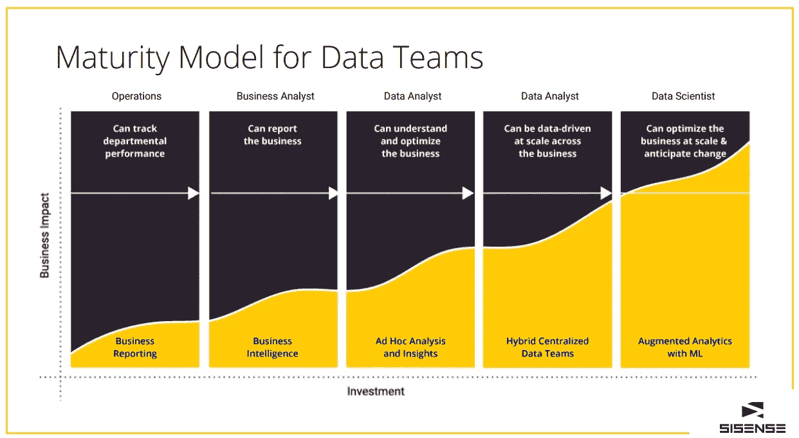

# 使用 5 阶段数据成熟度模型评估组织影响

> 原文：<https://towardsdatascience.com/using-the-5-stage-data-maturity-model-for-organizational-impact-d398ddd07c4c?source=collection_archive---------19----------------------->

## *无论您处于流程的哪个阶段，都可以构建和灵活运用您的业务战略*

从简单的商业报告到商业智能是一个巨大的飞跃，但是那些让*超越*传统商业智能的公司是那些扰乱市场的公司。他们投资于源自其业务运营的现代数据团队，以优化整个组织的洞察力，推动增长和投资回报。所以，如果你落后了，你能做什么？你怎么能在这个水平上竞争？从零开始对机器学习进行重大投资可能对你的公司是正确的，也可能不是正确的——然而，认真审视成熟度曲线是前进的最佳方式。

在这项工作中，有必要了解现代数据团队的定义。过去的数据团队可能只有三个传统参与者，即负责数据仓库功能和容量的数据库管理员、专注于数据建模的数据分析师以及负责构建仪表板和相关自助报告功能的 BI 架构师，而如今的团队成员则更多。通常是一个与企业合作但有自己专业技能的团队，这个团队做从概述业务规则到建模数据再到构建单一事实来源的所有事情。最重要的是，这些人提供专门的分析，这种评估是传统 BI 无法提供的。问一个商业问题，比如“我的收入模式应该是什么？”该小组将测试其假设，以展现出人意料的见解。他们可能会应用机器学习或一些统计和预测技术来确定您的组织没有理想数据的模式或差距。

关键的一点是，与仅提供数据模型的传统 BI 团队不同，今天的数据团队作为企业的核心职能运作，并推荐基于数据的战略。该小组在会议桌上占有一席之地，根据数据提供关于公司*应该*做什么的明智意见。

*并非每家公司都拥有或需要最先进的数据团队*

五阶段模型展示了数据团队成熟度和组织影响。许多组织都处于这种模式的早期或晚期阶段，这取决于数据对其业务和业务模式的重要性，以及可以在执行日益高级的分析所需的资源上投入多少。初始阶段包括简单的业务报告；其次是商业智能；第三是特别分析和意想不到的见解。第四阶段整合混合集中式数据团队，第五阶段用机器学习增强分析。

图片来源:Sisense

这些选项的影响与公司在数据和数据分析方面的投资直接相关，更高的性能需要更多的资源。考虑一家专注于业务报告的公司，它被大多数组织视为数据洞察的最低级别。最终，每个小组都使用孤立的数据进行操作，即使数据与公司内的其他团队不一致，也能洞察关键因素。问题伴随着不一致性出现，例如当来自一个域的数据与另一个域的数据冲突时。客服说流失率在上升，而销售团队说流失率在下降。公司各部门、团队或应用程序之间的数据要么不同，要么有不同的解释。可以跟踪部门绩效，但是不同且独立的事实来源代表了组织的真实挣扎。该公司需要进入第二阶段，这一阶段的重点是通过将数据集中到一个地方来实现商业智能，该数据允许以相同的方式从相同的信息中创建一致的报告。

几乎每个组织都有某种形式的 BI，它可以被描述为一个数据模型和一个可视化工具，基于跨多个来源连接的数据支持业务报告。在这种情况下，可以对数据提出问题，跨越各种数据源，以获得反映在包含整个业务的报告中的业务真相。哪些问题会导致负面的客户体验？营销计划和客户保持率之间有什么关系？这些都是从统一的数据分析方法中产生的有价值的业务见解。在这个成熟度级别，数据分析师是等式的一部分，对于在数据之间建立关联至关重要。这是一个远远超出后视洞察力的分析阶段，实现了有助于将数据应用于未来业务运营和战略的预测性报告。

第三个阶段，即席分析和见解，是关于数据专业人员检查组织数据，询问和回答意外问题，并积极寻求优化业务。“我们能否在销售线索出现时对其进行评分，以确定哪些是最重要的？这些应该如何进行优先排序？”这些都是可以随时提问和回答的问题，有助于提高销售和客户健康的评分策略。扩大这项工作的规模是公司进入第四阶段的关键，这一阶段的特点是混合集中式数据团队。

最终，通过单个数据团队路由每个数据请求并不是一个针对规模优化的策略。当集团支持营销、销售、产品、客户成功、财务和其他不同的公司部门时，可能会出现瓶颈。第四阶段引入了一个混合集中式模型，通过建立一个定义方法和实践的核心数据团队来满足需求，并由一个独立的营销、产品、销售等分析团队提供支持。由于每个团队都与集中的团队合作，整个企业可以作为一个数据驱动的实体进行扩展。

第五阶段利用增强分析和机器学习。数据科学家发挥着重要作用，他们发明或利用机器学习、统计技术和预测能力来预测商业行为。他们的新方法与集中式数据团队共享，应用于业务问题，并用于优化大规模运营。“我们的预测是在正轨上还是在变化？业务本身在变化吗？当顾客进入我们的销售漏斗时，我们如何预测他们的行为？什么样的新服务能让我们成为同类最佳？”这些更深入、更高级的问题依靠数据科学家和预测技术来提供价值。需要注意的是，在数据成熟度曲线的这一点上，实现价值的时间可能会更长。更先进的技术需要更大的投资和一些耐心；然而，回报通常比成熟早期要丰厚得多。

*大多数组织都处于四个成熟度级别之一*

问几个关键问题来决定你公司的定位。您是否使用不同的报告平台来报告不同的业务职能？您是否孤立于不同部门的记录系统中，或者您是否拥有跨各种业务工具的集成报告？第一阶段和第二阶段的区别在于，您的组织数据是否在单个数据仓库中共享，以及是否针对跨多个来源的业务查询进行了结构化。如果公司有集中的报告，并且 ETL 过程提供了良好的数据模型，那么您可能已经达到了第二个成熟阶段。

另一个需要考察的领域是数据广度。您的业务数据中有百分之多少被整合到一个真实的来源中？事实上，对于任何组织来说，将全部 100%的数据放在真实的中心来源中是不寻常的。这甚至可能是一个无法实现的目标，但是你朝着这个目标前进了多少呢？确定有多少业务数据实际上位于中央存储库中，为您的成熟度时间线提供了一个关键的标记。

由[米利安·耶西耶](https://unsplash.com/@mjessier?utm_source=medium&utm_medium=referral)在 [Unsplash](https://unsplash.com?utm_source=medium&utm_medium=referral) 上拍摄的照片

您的数据分析师可以将模型数据与来自多个来源的原始数据混合在一起吗？这是一个微妙但值得思考的问题。理想情况下，您的数据团队可以获取来自新系统的原始数据，并将其与现有的模型数据(如客户、机会或服务数据)相结合，以回答当前数据模型中可能没有预料到的问题。如果将来自多个来源的数据混合到一个仓库中，该过程发生在数据到达仓库之前还是之后？例如，一种更现代的方法是在入库后*混合数据。您的数据是否涵盖了客户旅程的所有相关阶段，或者您是否比销售人员更了解潜在客户？关于产品使用的数据很多，但关于它如何影响客户购买偏好的数据却很少？*

在确定数据成熟度的过程中，数据治理和访问也至关重要。您公司中担任不同角色的人员对数据的访问权限是否不同？规模较小的创业公司可能没有设立准入门槛，因为参与其中的每个人都是某种意义上的负责人。但是增长可能需要一些更快的行动。随着组织的成熟，剔除个人身份信息(PII)、工资数据或其他他人根本不需要看到的专有事实可能变得至关重要。一个受管理的、单一的真相来源对这些类型的实体也是至关重要的。通常，早期企业有数据游乐场，任何人都可以做任何事情，无意中造成幻灯片被共享但不一定有谨慎计算支持的情况。相比之下，由数据团队控制的治理源只发布批准的数据或明确标记为根据游戏规则开发的数据。

如果业务单位雇佣并嵌入他们自己的分析师来使用中央数据团队提供的工具，混合集中式模型就发挥作用了。当考虑先进的数据能力时，你的公司有模型管理和生产能力吗？您的产品或分析中是否部署和使用了机器学习系统？你的分析工作流程包括机器学习模型吗？这些不一定是内部构建的，通常可以通过现有的模型和行业工具更容易地利用，假设您的分析工作流有能力和培训将它们纳入分析。

*使用数据成熟度模型实现数据驱动的成功*

你可能会听到首席执行官拍着桌子说，“我们必须以数据为导向。我希望公司里有机器学习。我不太清楚那是什么，但我知道我想要它。”问题是，从基本报告直接进入增强分析意味着您可能会错过一些关键的基础功能，可能会阻止您从更高级的分析中实现预期的影响。缺少 BI 基础和健康的混合团队，组织可能能够开发先进的见解，但发现自己在整个业务中应用它们时有障碍。没有交流框架和基础设施来共享见解。这是一步步经历成熟度模型的最大原因之一。通过建立这些早期阶段，企业创建了开发新见解所必需的基础设施和经验，然后将它们有效而正确地传达给企业。遵循这条曲线的公司更有利于获得长期竞争优势，建立连接组织，让实体将洞察力转化为真正的商业价值。