# 在 Wolfram 语言中使用 Gurobi 优化器

> 原文：<https://towardsdatascience.com/using-the-gurobi-optimizer-in-the-wolfram-language-939ce585ec64?source=collection_archive---------26----------------------->

## [实践教程](https://towardsdatascience.com/tagged/hands-on-tutorials)

## 使用 Gurobi 增强您的优化问题解决能力

一个已解决的优化问题——在 [Unsplash](https://unsplash.com/s/photos/backpack?utm_source=unsplash&utm_medium=referral&utm_content=creditCopyText) 上由 [S & B Vonlanthen](https://unsplash.com/@blavon?utm_source=unsplash&utm_medium=referral&utm_content=creditCopyText) 拍摄

当你进行一次大型旅行时，无论是城市旅游还是背包探险，你都面临着这样一个问题:我的行李里应该放些什么？我是应该多带一件毛衣，因为天可能会冷，还是应该带一件雨衣，因为天气预报似乎要下雨。是应该多带袜子还是多带内衣？我应该带笔记本电脑还是平板电脑就可以了？

当你思考这些问题时，你在解决一个背包问题:给定有限的空间和重量，你在给物品赋值并对它们设置约束。例如，你可能想至少带两件 t 恤，但如果有足够的空间，你可能想带第三件或第四件 t 恤。与此同时，你可能更看重多带几双袜子或多一双鞋。

当你合上行李时，你已经解决了你的最优化问题，实际上就是在你的头脑中做了一大堆数学运算，决定带什么和带多少。

世界各地都出现了更复杂的这类和其他类型的优化问题:用最佳数量的包裹装满一辆卡车，为一辆公共汽车找到最佳路线，在最短的时间内运送最多的人，找出最佳的配料组合，以生产出完整的动物饲料，等等。

> 当你有不同值和约束的多个选项时，你必须解决一个优化问题。

[Wolfram 语言](https://www.wolfram.com/language/)提供了一大组解决优化问题的函数:它可以解决符号和数值优化问题，局部和全局问题，线性和非线性问题，凸和非凸优化问题。每种类型的优化问题都有自己的解决算法，而 [Wolfram 语言](https://www.wolfram.com/language/)通过精心设计的顶级界面和内置的自动算法选择，可以轻松使用所有算法。

但是快速解决优化问题是一个复杂的算法挑战:在这个领域没有“可证明最快”的算法。每年都会发现许多新的最先进的算法，将性能边界推得越来越远。为了让 Wolfram Language 访问这些前沿解算器，我们开发了一个通用优化框架，允许您利用任意数量的解算器。

为了使数值问题变得更加简单，Wolfram Research 为来自 [Gurobi](https://www.gurobi.com/) 的最先进的求解器提供了内置支持，该公司专注于提供世界上最快的优化求解器。他们的旗舰产品 [Gurobi Optimizer](https://www.gurobi.com/products/gurobi-optimizer/) 比其他求解器快得多，可以解决以下主要优化类型(包括实值和混合整数子类型):线性优化、二次优化、二阶锥优化和二次约束优化。

在这篇文章中，我将温和地介绍使用 [Gurobi Optimizer](https://www.gurobi.com/products/gurobi-optimizer/) 的可能性，以及如何使用 [Wolfram 语言](https://www.wolfram.com/language/)在一个非常高的层次上指定优化问题，它具有内置的排版功能、一流的符号预处理功能以及非常棒的可视化特性。

首先，让我们看看 [Gurobi](https://www.gurobi.com/) 支持的优化类型及其缩写如何映射到 [Wolfram 语言](https://www.wolfram.com/language/)函数中:

*   (混合整数)线性优化:[线性优化](https://reference.wolfram.com/language/ref/LinearOptimization.html)
*   (混合整数)二次优化:[二次优化](https://reference.wolfram.com/language/ref/QuadraticOptimization.html)
*   (混合整数)二阶锥优化:[SecondOrderConeOptimization](https://reference.wolfram.com/language/ref/SecondOrderConeOptimization.html)
*   (混合整数)二次约束优化:[凸优化](https://reference.wolfram.com/language/ref/ConvexOptimization.html)

除了这些 [Wolfram 语言](https://www.wolfram.com/language/)函数之外，还有更高级别的函数，如[n 最小化](https://reference.wolfram.com/language/ref/NMinimize.html)和[n 最大化](https://reference.wolfram.com/language/ref/NMaximize.html)，它们自动识别优化类型并选择合适的求解算法。在这篇文章中，我将坚持使用范围更小的 [Wolfram 语言](https://www.wolfram.com/language/)函数。

解决优化问题——Claudio Schwarz 在 [Unsplash](https://unsplash.com/s/photos/delivery-truck?utm_source=unsplash&utm_medium=referral&utm_content=creditCopyText) 上拍摄的照片

## 基础—线性优化

让我们从一个非常简单的线性优化问题开始，其中成本函数和约束都是具有任意数量决策变量的线性函数:

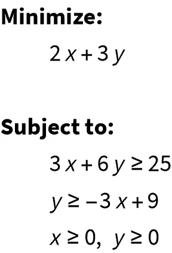

(图片由作者提供)

在这个有两个决策变量(x 和 y)的简单例子中，我们可以用[等高线图](https://reference.wolfram.com/language/ref/ContourPlot.html)来可视化可行区域。此处，橙蓝色阴影表示成本函数的值(无关的绘图细节和选项已通过 Wolfram 笔记本界面的图标化功能省略(…)):

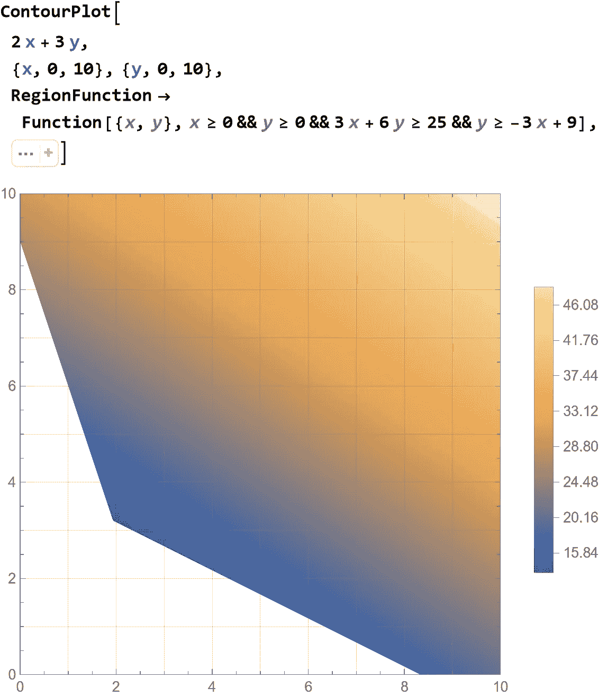

(图片由作者提供)

我们现在使用 [LinearOptimization](https://reference.wolfram.com/language/ref/LinearOptimization.html) 函数来获得答案，并指定我们感兴趣的结果类型(在本例中是原始最小值和原始极小值)。为了使用[古罗比优化器](https://www.gurobi.com/products/gurobi-optimizer/)，我们将方法选项设置为“古罗比”:

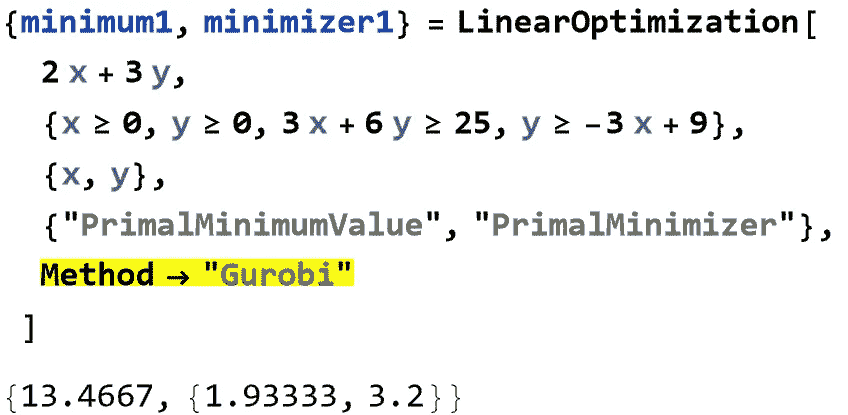

(图片由作者提供)

通过指定变量的类型，可以很容易地将这个问题转化为混合整数问题:

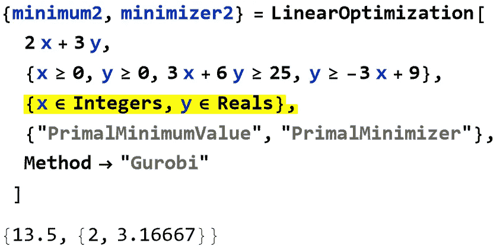

(图片由作者提供)

我们使用[等高线图](https://reference.wolfram.com/language/ref/ContourPlot.html)来放大两个解决方案的位置:

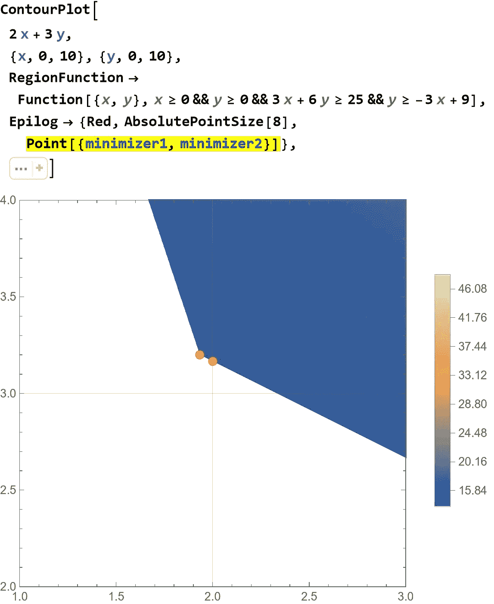

(图片由作者提供)

找到每个集装箱的最佳位置——照片由 [Unsplash](https://unsplash.com/s/photos/distribution?utm_source=unsplash&utm_medium=referral&utm_content=creditCopyText) 上的 [CHUTTERSNAP](https://unsplash.com/@chuttersnap?utm_source=unsplash&utm_medium=referral&utm_content=creditCopyText) 拍摄

## 对速度的需求…

对于简单的优化问题，内置解算器的性能与[古罗比优化器](https://www.gurobi.com/products/gurobi-optimizer/)差不多:你得到相同的结果，两个解算器眨眼之间就返回答案。但是大多数现实世界的优化问题都有大量的变量和约束。为了显示内置求解器(CLP)和 [Gurobi](https://www.gurobi.com/) 优化之间的性能差异，我们可以创建一个带有 [SparseArray](https://reference.wolfram.com/language/ref/SparseArray.html) 的示例。下面的 SolverTiming 函数接受一个大小参数(“n”)和一个求解方法(“Gurobi”或“CLP”):

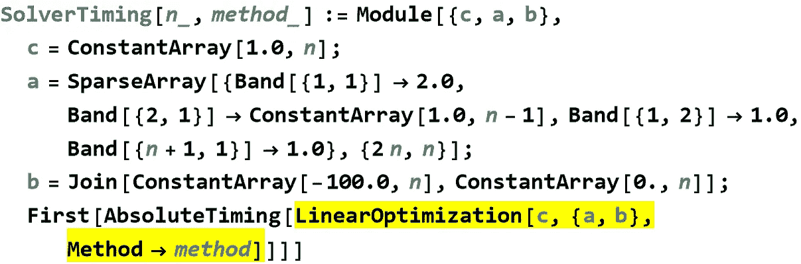

(图片由作者提供)

现在，我们可以使用 SolverTiming 函数来创建一个数据集表，以增加每个求解器的问题大小及其计时:

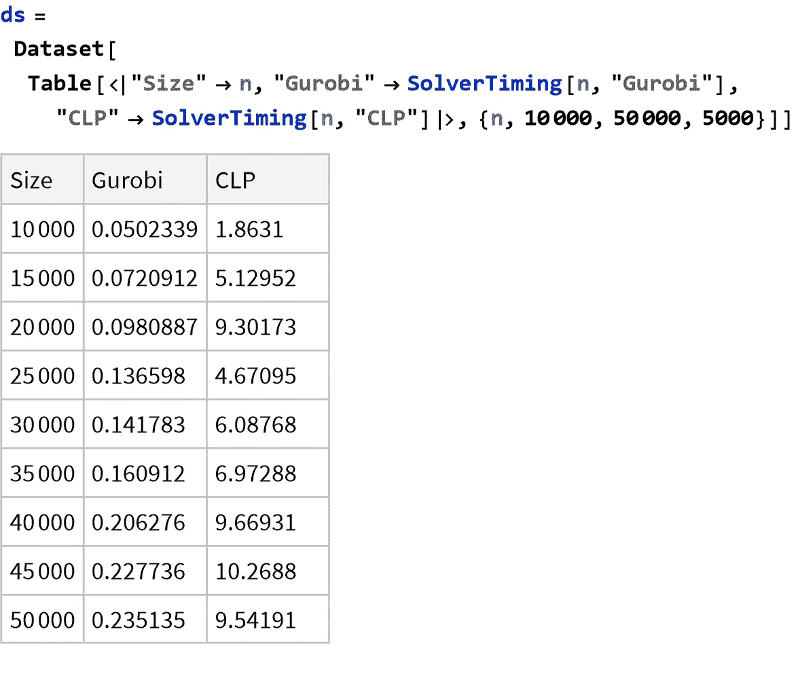

我们可以在[列表图](https://reference.wolfram.com/language/ref/ListLogPlot.html)中比较性能，显示 [Gurobi](https://www.gurobi.com/) 比 CLP 求解器快一个数量级以上:

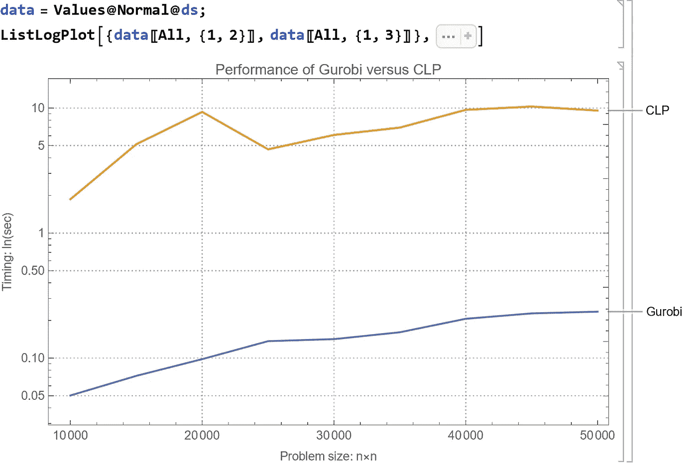

请注意，我在这里使用了一个非常简单的线性优化示例。 [Gurobi 优化器](https://www.gurobi.com/products/gurobi-optimizer/)在许多领域表现出色，尤其是在混合整数问题上。有关其性能的更多信息，请访问 [Gurobi](https://www.gurobi.com/) 的基准测试网页。

## 正在导入优化问题…

除了在一个 [Wolfram 语言](https://www.wolfram.com/language/)会话中创建优化问题之外，你还可以导入以 [MPS](https://reference.wolfram.com/language/ref/format/MPS.html) 格式存储的优化问题。例如，这导入了一个标准的线性优化问题，然后使用 [Gurobi 优化器](https://www.gurobi.com/products/gurobi-optimizer/)来解决它:

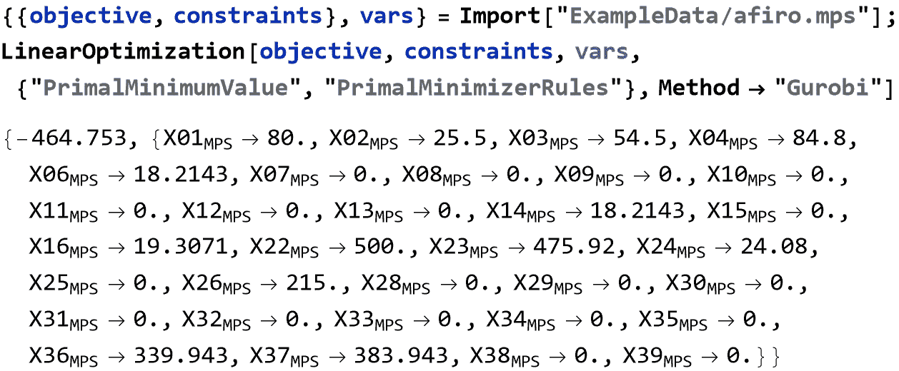

以最佳方式管理有限的资源——图片由[亚采克·迪拉格](https://unsplash.com/@dylu?utm_source=unsplash&utm_medium=referral&utm_content=creditCopyText)在 [Unsplash](https://unsplash.com/s/photos/lake-dam?utm_source=unsplash&utm_medium=referral&utm_content=creditCopyText) 上拍摄

## 二次优化

现在让我们来看看几个二次优化问题，你可以用[古罗比优化器](https://www.gurobi.com/products/gurobi-optimizer/)来解决。[二次优化](https://reference.wolfram.com/language/ref/QuadraticOptimization.html)函数可以解决实数和混合整数问题。

Wolfram 语言的一个很好的特性是你可以使用通用的紧凑矩阵和向量符号来描述你的问题。这里，我们随机生成问题参数，并使用向量不等式字符表示:

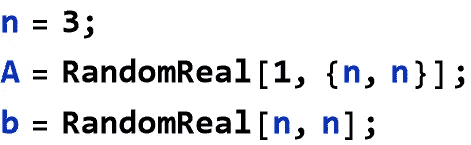

并使用 [Gurobi 优化器](https://www.gurobi.com/products/gurobi-optimizer/)获得解决方案:

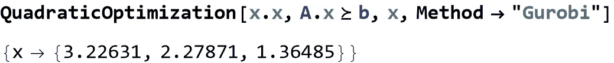

或者我们可以创建一个混合整数问题。这个例子有 3 个实数决策变量和 5 个整数决策变量:

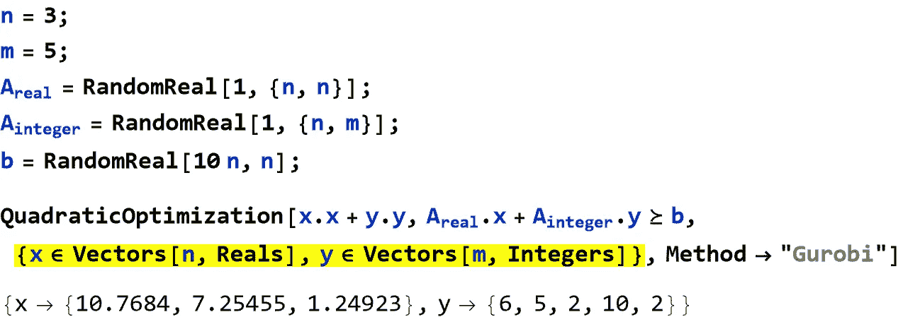

## 使用高级 Wolfram 语言函数…

[Wolfram Language](https://www.wolfram.com/language/) 的优化框架的另一个很好的特性是能够将更高级别的符号问题公式翻译成一种 [Gurobi 优化器](https://www.gurobi.com/products/gurobi-optimizer/)可以处理的形式。在这个例子中可以看到这样一个例子，我们使用 [Total](https://reference.wolfram.com/language/ref/Total.html) […]简洁地将向量 x 和 [Norm](https://reference.wolfram.com/language/ref/Norm.html) […]的元素之和表示为元素平方和的平方根。

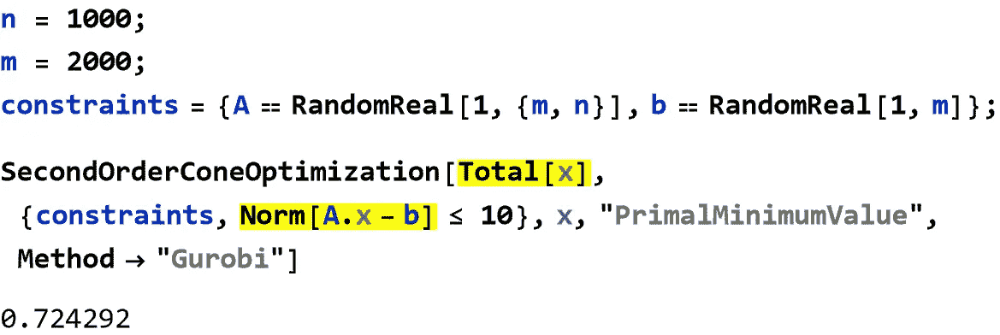

有许多更高级的 [Wolfram 语言](https://www.wolfram.com/language/)函数可以用于向量和矩阵，包括所有基本的算术函数和距离函数。

当原语表示适当的约束时，您还可以在像[SecondOrderConeOptimization](https://reference.wolfram.com/language/ref/SecondOrderConeOptimization.html)这样的函数中使用像 [Disk](https://reference.wolfram.com/language/ref/Disk.html) 这样的基于区域的原语。这里一个圆盘代表一个二阶锥约束 x +y < =1，因此它被转换成一种 [Gurobi 优化器](https://www.gurobi.com/products/gurobi-optimizer/)可以处理的形式:

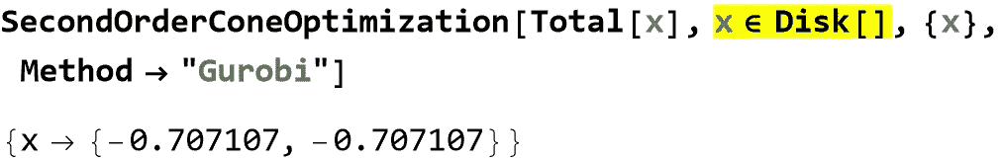

这相当于编写以下语句:

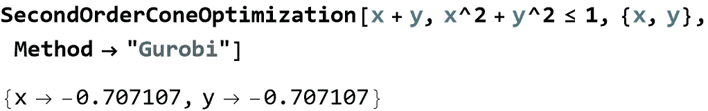

其他基于区域的图元包括多边形和多面体。

## 两全其美…

[LinearOptimization](https://reference.wolfram.com/language/ref/LinearOptimization.html) 、 [QuadraticOptimization](https://reference.wolfram.com/language/ref/QuadraticOptimization.html) 、[SecondOrderConeOptimization](https://reference.wolfram.com/language/ref/SecondOrderConeOptimization.html)和 [ConvexOptimization](https://reference.wolfram.com/language/ref/ConvexOptimization.html) 的文档页面包含数百个有趣的应用示例，让您可以非常轻松地开始使用 [Wolfram 语言](https://www.wolfram.com/language/)和 [Gurobi Optimizer](https://www.gurobi.com/products/gurobi-optimizer/) :从库存控制问题、制造问题和运输问题，到解决数独、旅行推销员问题和投资组合优化等数学难题。

对于高技术人员，尤其是那些精通 Wolfram 的人，我们最近也开源了我们的实现，展示了从 [Wolfram 语言](https://www.wolfram.com/language/)到 [Gurobi 优化器](https://www.gurobi.com/products/gurobi-optimizer/)的连接是如何“在幕后”工作的。它被命名为 GurobiLink，位于 [Wolfram Research Github](https://github.com/WolframResearch) 页面。

使用 [Wolfram 语言](https://www.wolfram.com/language/)中的 [Gurobi Optimizer](https://www.gurobi.com/products/gurobi-optimizer/) 为您带来两全其美:领先的优化问题求解器性能与世界上最好的科学和商业应用计算语言。哦，它还能帮你算出下次旅行要带多少衬衫！😉

要了解更多关于[古罗比](https://www.gurobi.com/)以及如何获得[古罗比优化器](https://www.gurobi.com/products/gurobi-optimizer/)的信息，请访问:[https://www.gurobi.com/](https://www.gurobi.com/)

要了解更多关于 [Wolfram 研究](https://www.wolfram.com/)和 [Wolfram 语言](https://www.wolfram.com/language/)，请访问:[https://www.wolfram.com/](https://www.wolfram.com/)